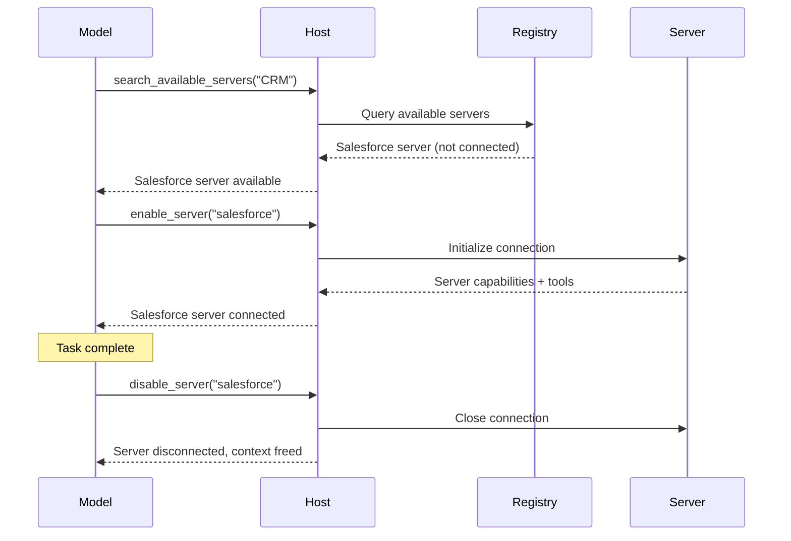
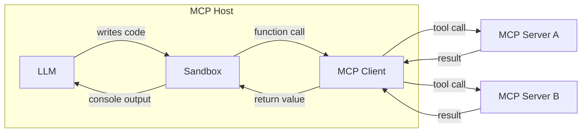

# MCP Documentation -- 02 Development

- Build an MCP client
- Build an MCP server
- Build with Agent Skills
- Client Best Practices
- Connect to local MCP servers
- Connect to remote MCP Servers

---

# Build an MCP client
Source: https://modelcontextprotocol.io/docs/develop/build-client

Get started building your own client that can integrate with all MCP servers.

In this tutorial, you'll learn how to build an LLM-powered chatbot client that connects to MCP servers.

Before you begin, it helps to have gone through our [Build an MCP Server](/docs/develop/build-server) tutorial so you can understand how clients and servers communicate.

  
    [You can find the complete code for this tutorial here.](https://github.com/modelcontextprotocol/quickstart-resources/tree/main/mcp-client-python)

    ## System Requirements

    Before starting, ensure your system meets these requirements:

    * Mac or Windows computer
    * Latest Python version installed
    * Latest version of `uv` installed

    ## Setting Up Your Environment

    First, create a new Python project with `uv`:

    
      ```bash macOS/Linux 
      # Create project directory
      uv init mcp-client
      cd mcp-client

      # Create virtual environment
      uv venv

      # Activate virtual environment
      source .venv/bin/activate

      # Install required packages
      uv add mcp anthropic python-dotenv

      # Remove boilerplate files
      rm main.py

      # Create our main file
      touch client.py
      ```

      ```powershell Windows 
      # Create project directory
      uv init mcp-client
      cd mcp-client

      # Create virtual environment
      uv venv

      # Activate virtual environment
      .venv\Scripts\activate

      # Install required packages
      uv add mcp anthropic python-dotenv

      # Remove boilerplate files
      del main.py

      # Create our main file
      new-item client.py
      ```
    

    ## Setting Up Your API Key

    You'll need an Anthropic API key from the [Anthropic Console](https://console.anthropic.com/settings/keys).

    Create a `.env` file to store it:

    ```bash 
    echo "ANTHROPIC_API_KEY=your-api-key-goes-here" > .env
    ```

    Add `.env` to your `.gitignore`:

    ```bash 
    echo ".env" >> .gitignore
    ```

    
      Make sure you keep your `ANTHROPIC_API_KEY` secure!
    

    ## Creating the Client

    ### Basic Client Structure

    First, let's set up our imports and create the basic client class:

    ```python 
    import asyncio
    from typing import Optional
    from contextlib import AsyncExitStack

    from mcp import ClientSession, StdioServerParameters
    from mcp.client.stdio import stdio_client

    from anthropic import Anthropic
    from dotenv import load_dotenv

    load_dotenv()  # load environment variables from .env

    class MCPClient:
        def __init__(self):
            # Initialize session and client objects
            self.session: Optional[ClientSession] = None
            self.exit_stack = AsyncExitStack()
            self.anthropic = Anthropic()
        # methods will go here
    ```

    ### Server Connection Management

    Next, we'll implement the method to connect to an MCP server:

    ```python 
    async def connect_to_server(self, server_script_path: str):
        """Connect to an MCP server

        Args:
            server_script_path: Path to the server script (.py or .js)
        """
        is_python = server_script_path.endswith('.py')
        is_js = server_script_path.endswith('.js')
        if not (is_python or is_js):
            raise ValueError("Server script must be a .py or .js file")

        command = "python" if is_python else "node"
        server_params = StdioServerParameters(
            command=command,
            args=[server_script_path],
            env=None
        )

        stdio_transport = await self.exit_stack.enter_async_context(stdio_client(server_params))
        self.stdio, self.write = stdio_transport
        self.session = await self.exit_stack.enter_async_context(ClientSession(self.stdio, self.write))

        await self.session.initialize()

        # List available tools
        response = await self.session.list_tools()
        tools = response.tools
        print("\nConnected to server with tools:", [tool.name for tool in tools])
    ```

    ### Query Processing Logic

    Now let's add the core functionality for processing queries and handling tool calls:

    ```python 
    async def process_query(self, query: str) -> str:
        """Process a query using Claude and available tools"""
        messages = [
            {
                "role": "user",
                "content": query
            }
        ]

        response = await self.session.list_tools()
        available_tools = [{
            "name": tool.name,
            "description": tool.description,
            "input_schema": tool.inputSchema
        } for tool in response.tools]

        # Initial Claude API call
        response = self.anthropic.messages.create(
            model="claude-sonnet-4-20250514",
            max_tokens=1000,
            messages=messages,
            tools=available_tools
        )

        # Process response and handle tool calls
        final_text = []

        assistant_message_content = []
        for content in response.content:
            if content.type == 'text':
                final_text.append(content.text)
                assistant_message_content.append(content)
            elif content.type == 'tool_use':
                tool_name = content.name
                tool_args = content.input

                # Execute tool call
                result = await self.session.call_tool(tool_name, tool_args)
                final_text.append(f"[Calling tool {tool_name} with args {tool_args}]")

                assistant_message_content.append(content)
                messages.append({
                    "role": "assistant",
                    "content": assistant_message_content
                })
                messages.append({
                    "role": "user",
                    "content": [
                        {
                            "type": "tool_result",
                            "tool_use_id": content.id,
                            "content": result.content
                        }
                    ]
                })

                # Get next response from Claude
                response = self.anthropic.messages.create(
                    model="claude-sonnet-4-20250514",
                    max_tokens=1000,
                    messages=messages,
                    tools=available_tools
                )

                final_text.append(response.content[0].text)

        return "\n".join(final_text)
    ```

    ### Interactive Chat Interface

    Now we'll add the chat loop and cleanup functionality:

    ```python 
    async def chat_loop(self):
        """Run an interactive chat loop"""
        print("\nMCP Client Started!")
        print("Type your queries or 'quit' to exit.")

        while True:
            try:
                query = input("\nQuery: ").strip()

                if query.lower() == 'quit':
                    break

                response = await self.process_query(query)
                print("\n" + response)

            except Exception as e:
                print(f"\nError: {str(e)}")

    async def cleanup(self):
        """Clean up resources"""
        await self.exit_stack.aclose()
    ```

    ### Main Entry Point

    Finally, we'll add the main execution logic:

    ```python 
    async def main():
        if len(sys.argv) < 2:
            print("Usage: python client.py <path_to_server_script>")
            sys.exit(1)

        client = MCPClient()
        try:
            await client.connect_to_server(sys.argv[1])
            await client.chat_loop()
        finally:
            await client.cleanup()

    if __name__ == "__main__":
        import sys
        asyncio.run(main())
    ```

    You can find the complete `client.py` file [here](https://github.com/modelcontextprotocol/quickstart-resources/blob/main/mcp-client-python/client.py).

    ## Key Components Explained

    ### 1. Client Initialization

    * The `MCPClient` class initializes with session management and API clients
    * Uses `AsyncExitStack` for proper resource management
    * Configures the Anthropic client for Claude interactions

    ### 2. Server Connection

    * Supports both Python and Node.js servers
    * Validates server script type
    * Sets up proper communication channels
    * Initializes the session and lists available tools

    ### 3. Query Processing

    * Maintains conversation context
    * Handles Claude's responses and tool calls
    * Manages the message flow between Claude and tools
    * Combines results into a coherent response

    ### 4. Interactive Interface

    * Provides a simple command-line interface
    * Handles user input and displays responses
    * Includes basic error handling
    * Allows graceful exit

    ### 5. Resource Management

    * Proper cleanup of resources
    * Error handling for connection issues
    * Graceful shutdown procedures

    ## Common Customization Points

    1. **Tool Handling**
       * Modify `process_query()` to handle specific tool types
       * Add custom error handling for tool calls
       * Implement tool-specific response formatting

    2. **Response Processing**
       * Customize how tool results are formatted
       * Add response filtering or transformation
       * Implement custom logging

    3. **User Interface**
       * Add a GUI or web interface
       * Implement rich console output
       * Add command history or auto-completion

    ## Running the Client

    To run your client with any MCP server:

    ```bash 
    uv run client.py path/to/server.py # python server
    uv run client.py path/to/build/index.js # node server
    ```

    
      If you're continuing [the weather tutorial from the server quickstart](https://github.com/modelcontextprotocol/quickstart-resources/tree/main/weather-server-python), your command might look something like this: `python client.py .../quickstart-resources/weather-server-python/weather.py`
    

    The client will:

    1. Connect to the specified server
    2. List available tools
    3. Start an interactive chat session where you can:
       * Enter queries
       * See tool executions
       * Get responses from Claude

    Here's an example of what it should look like if connected to the weather server from the server quickstart:

    
      
    

    ## How It Works

    When you submit a query:

    1. The client gets the list of available tools from the server
    2. Your query is sent to Claude along with tool descriptions
    3. Claude decides which tools (if any) to use
    4. The client executes any requested tool calls through the server
    5. Results are sent back to Claude
    6. Claude provides a natural language response
    7. The response is displayed to you

    ## Best practices

    1. **Error Handling**
       * Always wrap tool calls in try-catch blocks
       * Provide meaningful error messages
       * Gracefully handle connection issues

    2. **Resource Management**
       * Use `AsyncExitStack` for proper cleanup
       * Close connections when done
       * Handle server disconnections

    3. **Security**
       * Store API keys securely in `.env`
       * Validate server responses
       * Be cautious with tool permissions

    4. **Tool Names**
       * Tool names can be validated according to the format specified [here](/specification/draft/server/tools#tool-names)
       * If a tool name conforms to the specified format, it should not fail validation by an MCP client

    ## Troubleshooting

    ### Server Path Issues

    * Double-check the path to your server script is correct
    * Use the absolute path if the relative path isn't working
    * For Windows users, make sure to use forward slashes (/) or escaped backslashes (\\) in the path
    * Verify the server file has the correct extension (.py for Python or .js for Node.js)

    Example of correct path usage:

    ```bash 
    # Relative path
    uv run client.py ./server/weather.py

    # Absolute path
    uv run client.py /Users/username/projects/mcp-server/weather.py

    # Windows path (either format works)
    uv run client.py C:/projects/mcp-server/weather.py
    uv run client.py C:\\projects\\mcp-server\\weather.py
    ```

    ### Response Timing

    * The first response might take up to 30 seconds to return
    * This is normal and happens while:
      * The server initializes
      * Claude processes the query
      * Tools are being executed
    * Subsequent responses are typically faster
    * Don't interrupt the process during this initial waiting period

    ### Common Error Messages

    If you see:

    * `FileNotFoundError`: Check your server path
    * `Connection refused`: Ensure the server is running and the path is correct
    * `Tool execution failed`: Verify the tool's required environment variables are set
    * `Timeout error`: Consider increasing the timeout in your client configuration
  

  
    [You can find the complete code for this tutorial here.](https://github.com/modelcontextprotocol/quickstart-resources/tree/main/mcp-client-typescript)

    ## System Requirements

    Before starting, ensure your system meets these requirements:

    * Mac or Windows computer
    * Node.js 17 or higher installed
    * Latest version of `npm` installed
    * Anthropic API key (Claude)

    ## Setting Up Your Environment

    First, let's create and set up our project:

    
      ```bash macOS/Linux 
      # Create project directory
      mkdir mcp-client-typescript
      cd mcp-client-typescript

      # Initialize npm project
      npm init -y

      # Install dependencies
      npm install @anthropic-ai/sdk @modelcontextprotocol/sdk dotenv

      # Install dev dependencies
      npm install -D @types/node typescript

      # Create source file
      touch index.ts
      ```

      ```powershell Windows 
      # Create project directory
      md mcp-client-typescript
      cd mcp-client-typescript

      # Initialize npm project
      npm init -y

      # Install dependencies
      npm install @anthropic-ai/sdk @modelcontextprotocol/sdk dotenv

      # Install dev dependencies
      npm install -D @types/node typescript

      # Create source file
      new-item index.ts
      ```
    

    Update your `package.json` to set `type: "module"` and a build script:

    ```json package.json 
    {
      "type": "module",
      "scripts": {
        "build": "tsc && chmod 755 build/index.js"
      }
    }
    ```

    Create a `tsconfig.json` in the root of your project:

    ```json tsconfig.json 
    {
      "compilerOptions": {
        "target": "ES2022",
        "module": "Node16",
        "moduleResolution": "Node16",
        "outDir": "./build",
        "rootDir": "./",
        "strict": true,
        "esModuleInterop": true,
        "skipLibCheck": true,
        "forceConsistentCasingInFileNames": true
      },
      "include": ["index.ts"],
      "exclude": ["node_modules"]
    }
    ```

    ## Setting Up Your API Key

    You'll need an Anthropic API key from the [Anthropic Console](https://console.anthropic.com/settings/keys).

    Create a `.env` file to store it:

    ```bash 
    echo "ANTHROPIC_API_KEY=<your key here>" > .env
    ```

    Add `.env` to your `.gitignore`:

    ```bash 
    echo ".env" >> .gitignore
    ```

    
      Make sure you keep your `ANTHROPIC_API_KEY` secure!
    

    ## Creating the Client

    ### Basic Client Structure

    First, let's set up our imports and create the basic client class in `index.ts`:

    ```typescript 
    import { Anthropic } from "@anthropic-ai/sdk";
    import {
      MessageParam,
      Tool,
    } from "@anthropic-ai/sdk/resources/messages/messages.mjs";
    import { Client } from "@modelcontextprotocol/sdk/client/index.js";
    import { StdioClientTransport } from "@modelcontextprotocol/sdk/client/stdio.js";
    import readline from "readline/promises";
    import dotenv from "dotenv";

    dotenv.config();

    const ANTHROPIC_API_KEY = process.env.ANTHROPIC_API_KEY;
    if (!ANTHROPIC_API_KEY) {
      throw new Error("ANTHROPIC_API_KEY is not set");
    }

    class MCPClient {
      private mcp: Client;
      private anthropic: Anthropic;
      private transport: StdioClientTransport | null = null;
      private tools: Tool[] = [];

      constructor() {
        this.anthropic = new Anthropic({
          apiKey: ANTHROPIC_API_KEY,
        });
        this.mcp = new Client({ name: "mcp-client-cli", version: "1.0.0" });
      }
      // methods will go here
    }
    ```

    ### Server Connection Management

    Next, we'll implement the method to connect to an MCP server:

    ```typescript 
    async connectToServer(serverScriptPath: string) {
      try {
        const isJs = serverScriptPath.endsWith(".js");
        const isPy = serverScriptPath.endsWith(".py");
        if (!isJs && !isPy) {
          throw new Error("Server script must be a .js or .py file");
        }
        const command = isPy
          ? process.platform === "win32"
            ? "python"
            : "python3"
          : process.execPath;

        this.transport = new StdioClientTransport({
          command,
          args: [serverScriptPath],
        });
        await this.mcp.connect(this.transport);

        const toolsResult = await this.mcp.listTools();
        this.tools = toolsResult.tools.map((tool) => {
          return {
            name: tool.name,
            description: tool.description,
            input_schema: tool.inputSchema,
          };
        });
        console.log(
          "Connected to server with tools:",
          this.tools.map(({ name }) => name)
        );
      } catch (e) {
        console.log("Failed to connect to MCP server: ", e);
        throw e;
      }
    }
    ```

    ### Query Processing Logic

    Now let's add the core functionality for processing queries and handling tool calls:

    ```typescript 
    async processQuery(query: string) {
      const messages: MessageParam[] = [
        {
          role: "user",
          content: query,
        },
      ];

      const response = await this.anthropic.messages.create({
        model: "claude-sonnet-4-20250514",
        max_tokens: 1000,
        messages,
        tools: this.tools,
      });

      const finalText = [];

      for (const content of response.content) {
        if (content.type === "text") {
          finalText.push(content.text);
        } else if (content.type === "tool_use") {
          const toolName = content.name;
          const toolArgs = content.input as { [x: string]: unknown } | undefined;

          const result = await this.mcp.callTool({
            name: toolName,
            arguments: toolArgs,
          });
          finalText.push(
            `[Calling tool ${toolName} with args ${JSON.stringify(toolArgs)}]`
          );

          messages.push({
            role: "user",
            content: result.content as string,
          });

          const response = await this.anthropic.messages.create({
            model: "claude-sonnet-4-20250514",
            max_tokens: 1000,
            messages,
          });

          finalText.push(
            response.content[0].type === "text" ? response.content[0].text : ""
          );
        }
      }

      return finalText.join("\n");
    }
    ```

    ### Interactive Chat Interface

    Now we'll add the chat loop and cleanup functionality:

    ```typescript 
    async chatLoop() {
      const rl = readline.createInterface({
        input: process.stdin,
        output: process.stdout,
      });

      try {
        console.log("\nMCP Client Started!");
        console.log("Type your queries or 'quit' to exit.");

        while (true) {
          const message = await rl.question("\nQuery: ");
          if (message.toLowerCase() === "quit") {
            break;
          }
          const response = await this.processQuery(message);
          console.log("\n" + response);
        }
      } finally {
        rl.close();
      }
    }

    async cleanup() {
      await this.mcp.close();
    }
    ```

    ### Main Entry Point

    Finally, we'll add the main execution logic:

    ```typescript 
    async function main() {
      if (process.argv.length < 3) {
        console.log("Usage: node index.ts <path_to_server_script>");
        return;
      }
      const mcpClient = new MCPClient();
      try {
        await mcpClient.connectToServer(process.argv[2]);
        await mcpClient.chatLoop();
      } catch (e) {
        console.error("Error:", e);
        await mcpClient.cleanup();
        process.exit(1);
      } finally {
        await mcpClient.cleanup();
        process.exit(0);
      }
    }

    main();
    ```

    ## Running the Client

    To run your client with any MCP server:

    ```bash 
    # Build TypeScript
    npm run build

    # Run the client
    node build/index.js path/to/server.py # python server
    node build/index.js path/to/build/index.js # node server
    ```

    
      If you're continuing [the weather tutorial from the server quickstart](https://github.com/modelcontextprotocol/quickstart-resources/tree/main/weather-server-typescript), your command might look something like this: `node build/index.js .../quickstart-resources/weather-server-typescript/build/index.js`
    

    **The client will:**

    1. Connect to the specified server
    2. List available tools
    3. Start an interactive chat session where you can:
       * Enter queries
       * See tool executions
       * Get responses from Claude

    ## How It Works

    When you submit a query:

    1. The client gets the list of available tools from the server
    2. Your query is sent to Claude along with tool descriptions
    3. Claude decides which tools (if any) to use
    4. The client executes any requested tool calls through the server
    5. Results are sent back to Claude
    6. Claude provides a natural language response
    7. The response is displayed to you

    ## Best practices

    1. **Error Handling**
       * Use TypeScript's type system for better error detection
       * Wrap tool calls in try-catch blocks
       * Provide meaningful error messages
       * Gracefully handle connection issues

    2. **Security**
       * Store API keys securely in `.env`
       * Validate server responses
       * Be cautious with tool permissions

    ## Troubleshooting

    ### Server Path Issues

    * Double-check the path to your server script is correct
    * Use the absolute path if the relative path isn't working
    * For Windows users, make sure to use forward slashes (/) or escaped backslashes (\\) in the path
    * Verify the server file has the correct extension (.js for Node.js or .py for Python)

    Example of correct path usage:

    ```bash 
    # Relative path
    node build/index.js ./server/build/index.js

    # Absolute path
    node build/index.js /Users/username/projects/mcp-server/build/index.js

    # Windows path (either format works)
    node build/index.js C:/projects/mcp-server/build/index.js
    node build/index.js C:\\projects\\mcp-server\\build\\index.js
    ```

    ### Response Timing

    * The first response might take up to 30 seconds to return
    * This is normal and happens while:
      * The server initializes
      * Claude processes the query
      * Tools are being executed
    * Subsequent responses are typically faster
    * Don't interrupt the process during this initial waiting period

    ### Common Error Messages

    If you see:

    * `Error: Cannot find module`: Check your build folder and ensure TypeScript compilation succeeded
    * `Connection refused`: Ensure the server is running and the path is correct
    * `Tool execution failed`: Verify the tool's required environment variables are set
    * `ANTHROPIC_API_KEY is not set`: Check your .env file and environment variables
    * `TypeError`: Ensure you're using the correct types for tool arguments
    * `BadRequestError`: Ensure you have enough credits to access the Anthropic API
  

  
    
      This is a quickstart demo based on Spring AI MCP auto-configuration and boot starters.
      To learn how to create sync and async MCP Clients manually, consult the [Java SDK Client](https://java.sdk.modelcontextprotocol.io/) documentation
    

    This example demonstrates how to build an interactive chatbot that combines Spring AI's Model Context Protocol (MCP) with the [Brave Search MCP Server](https://github.com/modelcontextprotocol/servers-archived/tree/main/src/brave-search). The application creates a conversational interface powered by Anthropic's Claude AI model that can perform internet searches through Brave Search, enabling natural language interactions with real-time web data.
    [You can find the complete code for this tutorial here.](https://github.com/spring-projects/spring-ai-examples/tree/main/model-context-protocol/web-search/brave-chatbot)

    ## System Requirements

    Before starting, ensure your system meets these requirements:

    * Java 17 or higher
    * Maven 3.6+
    * npx package manager
    * Anthropic API key (Claude)
    * Brave Search API key

    ## Setting Up Your Environment

    1. Install npx (Node Package eXecute):
       First, make sure to install [npm](https://docs.npmjs.com/downloading-and-installing-node-js-and-npm)
       and then run:

       ```bash 
       npm install -g npx
       ```

    2. Clone the repository:

       ```bash 
       git clone https://github.com/spring-projects/spring-ai-examples.git
       cd model-context-protocol/web-search/brave-chatbot
       ```

    3. Set up your API keys:

       ```bash 
       export ANTHROPIC_API_KEY='your-anthropic-api-key-here'
       export BRAVE_API_KEY='your-brave-api-key-here'
       ```

    4. Build the application:

       ```bash 
       ./mvnw clean install
       ```

    5. Run the application using Maven:
       ```bash 
       ./mvnw spring-boot:run
       ```

    
      Make sure you keep your `ANTHROPIC_API_KEY` and `BRAVE_API_KEY` keys secure!
    

    ## How it Works

    The application integrates Spring AI with the Brave Search MCP server through several components:

    ### MCP Client Configuration

    1. Required dependencies in pom.xml:

    ```xml 
    <dependency>
        <groupId>org.springframework.ai</groupId>
        <artifactId>spring-ai-starter-mcp-client</artifactId>
    </dependency>
    <dependency>
        <groupId>org.springframework.ai</groupId>
        <artifactId>spring-ai-starter-model-anthropic</artifactId>
    </dependency>
    ```

    2. Application properties (application.yml):

    ```yml 
    spring:
      ai:
        mcp:
          client:
            enabled: true
            name: brave-search-client
            version: 1.0.0
            type: SYNC
            request-timeout: 20s
            stdio:
              root-change-notification: true
              servers-configuration: classpath:/mcp-servers-config.json
            toolcallback:
              enabled: true
        anthropic:
          api-key: ${ANTHROPIC_API_KEY}
    ```

    This activates the `spring-ai-starter-mcp-client` to create one or more `McpClient`s based on the provided server configuration.
    The `spring.ai.mcp.client.toolcallback.enabled=true` property enables the tool callback mechanism, that automatically registers all MCP tool as spring ai tools.
    It is disabled by default.

    3. MCP Server Configuration (`mcp-servers-config.json`):

    ```json 
    {
      "mcpServers": {
        "brave-search": {
          "command": "npx",
          "args": ["-y", "@modelcontextprotocol/server-brave-search"],
          "env": {
            "BRAVE_API_KEY": "<PUT YOUR BRAVE API KEY>"
          }
        }
      }
    }
    ```

    ### Chat Implementation

    The chatbot is implemented using Spring AI's ChatClient with MCP tool integration:

    ```java 
    var chatClient = chatClientBuilder
        .defaultSystem("You are useful assistant, expert in AI and Java.")
        .defaultToolCallbacks((Object[]) mcpToolAdapter.toolCallbacks())
        .defaultAdvisors(new MessageChatMemoryAdvisor(new InMemoryChatMemory()))
        .build();
    ```

    Key features:

    * Uses Claude AI model for natural language understanding
    * Integrates Brave Search through MCP for real-time web search capabilities
    * Maintains conversation memory using InMemoryChatMemory
    * Runs as an interactive command-line application

    ### Build and run

    ```bash 
    ./mvnw clean install
    java -jar ./target/ai-mcp-brave-chatbot-0.0.1-SNAPSHOT.jar
    ```

    or

    ```bash 
    ./mvnw spring-boot:run
    ```

    The application will start an interactive chat session where you can ask questions. The chatbot will use Brave Search when it needs to find information from the internet to answer your queries.

    The chatbot can:

    * Answer questions using its built-in knowledge
    * Perform web searches when needed using Brave Search
    * Remember context from previous messages in the conversation
    * Combine information from multiple sources to provide comprehensive answers

    ### Advanced Configuration

    The MCP client supports additional configuration options:

    * Client customization through `McpSyncClientCustomizer` or `McpAsyncClientCustomizer`
    * Multiple clients with multiple transport types: `STDIO` and `SSE` (Server-Sent Events)
    * Integration with Spring AI's tool execution framework
    * Automatic client initialization and lifecycle management

    For WebFlux-based applications, you can use the WebFlux starter instead:

    ```xml 
    <dependency>
        <groupId>org.springframework.ai</groupId>
        <artifactId>spring-ai-mcp-client-webflux-spring-boot-starter</artifactId>
    </dependency>
    ```

    This provides similar functionality but uses a WebFlux-based SSE transport implementation, recommended for production deployments.
  

  
    [You can find the complete code for this tutorial here.](https://github.com/modelcontextprotocol/kotlin-sdk/tree/main/samples/kotlin-mcp-client)

    ## System Requirements

    Before starting, ensure your system meets these requirements:

    * JDK 11 or higher
    * Anthropic API key (Claude)

    ## Setting up your environment

    First, let's install `java` and `gradle` if you haven't already.
    You can download `java` from [official Oracle JDK website](https://www.oracle.com/java/technologies/downloads/).
    Verify your `java` installation:

    ```bash 
    java --version
    ```

    Now, let's create and set up your project:

    
      ```bash macOS/Linux 
      # Create a new directory for our project
      mkdir kotlin-mcp-client
      cd kotlin-mcp-client

      # Initialize a new kotlin project
      gradle init
      ```

      ```powershell Windows 
      # Create a new directory for our project
      md kotlin-mcp-client
      cd kotlin-mcp-client
      # Initialize a new kotlin project
      gradle init
      ```
    

    After running `gradle init`, select **Application** as the project type, **Kotlin** as the programming language.

    Alternatively, you can create a Kotlin application using the [IntelliJ IDEA project wizard](https://kotlinlang.org/docs/jvm-get-started.html).

    After creating the project, replace the contents of your `build.gradle.kts` with:

    ```kotlin build.gradle.kts 
    // Check latest versions at https://github.com/modelcontextprotocol/kotlin-sdk/releases
    val mcpVersion = "0.9.0"
    val ktorVersion = "3.2.3"
    val anthropicVersion = "2.15.0"
    val slf4jVersion = "2.0.17"

    plugins {
        kotlin("jvm") version "2.3.20"
        id("com.gradleup.shadow") version "8.3.9"
        application
    }

    application {
        mainClass.set("MainKt")
    }

    dependencies {
        implementation("io.modelcontextprotocol:kotlin-sdk:$mcpVersion")
        implementation("io.ktor:ktor-client-cio:$ktorVersion")
        implementation("com.anthropic:anthropic-java:$anthropicVersion")
        implementation("org.slf4j:slf4j-simple:$slf4jVersion")
    }
    ```

    Verify that everything is set up correctly:

    ```bash 
    ./gradlew build
    ```

    ## Setting up your API key

    You'll need an Anthropic API key from the [Anthropic Console](https://console.anthropic.com/settings/keys).

    Set up your API key:

    ```bash 
    export ANTHROPIC_API_KEY='your-anthropic-api-key-here'
    ```

    
      Make sure you keep your `ANTHROPIC_API_KEY` secure!
    

    ## Creating the Client

    ### Basic Client Structure

    First, let's create the basic client class:

    ```kotlin 
    class MCPClient(apiKey: String) : AutoCloseable {
        private val anthropic = AnthropicOkHttpClient.builder()
            .apiKey(apiKey)
            .build()

      private val mcp: Client = Client(
            clientInfo = Implementation(name = "mcp-client-cli", version = "1.0.0")
      )
        private var serverProcess: Process? = null
        private lateinit var tools: List<ToolUnion>

        // methods will go here

        override fun close() {
            runBlocking {
                mcp.close()
            }
            serverProcess?.destroy()
            anthropic.close()
        }
    }
    ```

    ### Server connection management

    Next, we'll implement the method to connect to an MCP server:

    ```kotlin 
    suspend fun connectToServer(serverScriptPath: String) {
        val command = buildList {
            when (serverScriptPath.substringAfterLast(".")) {
                "js" -> add("node")
                "py" -> add(if (System.getProperty("os.name").lowercase().contains("win")) "python" else "python3")
                "jar" -> addAll(listOf("java", "-jar"))
                else -> throw IllegalArgumentException("Server script must be a .js, .py or .jar file")
            }
            add(serverScriptPath)
        }

        val process = ProcessBuilder(command).start()
        serverProcess = process

        val transport = StdioClientTransport(
            input = process.inputStream.asSource().buffered(),
            output = process.outputStream.asSink().buffered(),
        )

        mcp.connect(transport)

        val toolsResult = mcp.listTools()
        tools = toolsResult.tools.map { tool ->
            ToolUnion.ofTool(
                Tool.builder()
                    .name(tool.name)
                    .description(tool.description ?: "")
                    .inputSchema(
                        Tool.InputSchema.builder()
                            .type(JsonValue.from(tool.inputSchema.type))
                            .properties(tool.inputSchema.properties?.toJsonValue() ?: EmptyJsonObject.toJsonValue())
                            .putAdditionalProperty("required", JsonValue.from(tool.inputSchema.required))
                            .build(),
                    )
                    .build(),
            )
        }
        println("Connected to server with tools: ${tools.joinToString(", ") { it.tool().get().name() }}")
    }
    ```

    
      This helper converts a kotlinx.serialization `JsonObject` to an Anthropic SDK `JsonValue` using Jackson:

      ```kotlin 
      private fun JsonObject.toJsonValue(): JsonValue {
          val mapper = ObjectMapper()
          val node = mapper.readTree(this.toString())
          return JsonValue.fromJsonNode(node)
      }
      ```
    

    ### Query processing logic

    Now let's add the core functionality for processing queries and handling tool calls:

    ```kotlin 
    suspend fun processQuery(query: String): String {
        val messages = mutableListOf(
            MessageParam.builder()
                .role(MessageParam.Role.USER)
                .content(query)
                .build(),
        )

        val response = anthropic.messages().create(
            MessageCreateParams.builder()
                .model("claude-sonnet-4-20250514")
                .maxTokens(1024)
                .messages(messages)
                .tools(tools)
                .build(),
        )

        val finalText = mutableListOf<String>()
        response.content().forEach { content ->
            when {
                content.isText() -> finalText.add(content.text().get().text())

                content.isToolUse() -> {
                    val toolName = content.toolUse().get().name()
                    val toolArgs =
                        content.toolUse().get()._input().convert(object : TypeReference<Map<String, JsonValue>>() {})

                    val result = mcp.callTool(
                        name = toolName,
                        arguments = toolArgs ?: emptyMap(),
                    )
                    finalText.add("[Calling tool $toolName with args $toolArgs]")

                    messages.add(
                        MessageParam.builder()
                            .role(MessageParam.Role.USER)
                            .content(
                                result.content
                                    .filterIsInstance<TextContent>()
                                    .joinToString("\n") { it.text }
                            )
                            .build(),
                    )

                    val aiResponse = anthropic.messages().create(
                        MessageCreateParams.builder()
                            .model("claude-sonnet-4-20250514")
                            .maxTokens(1024)
                            .messages(messages)
                            .build(),
                    )

                    finalText.add(aiResponse.content().first().text().get().text())
                }
            }
        }

        return finalText.joinToString("\n")
    }
    ```

    ### Interactive chat

    We'll add the chat loop:

    ```kotlin 
    suspend fun chatLoop() {
        println("\nMCP Client Started!")
        println("Type your queries or 'quit' to exit.")

        while (true) {
            print("\nQuery: ")
            val message = readlnOrNull() ?: break
            if (message.trim().lowercase() == "quit") break

            try {
                val response = processQuery(message)
                println("\n$response")
            } catch (e: Exception) {
                println("\nError: ${e.message}")
            }
        }
    }
    ```

    ### Main entry point

    Finally, we'll add the main execution function:

    ```kotlin 
    fun main(args: Array<String>) = runBlocking {
        require(args.isNotEmpty()) { "Usage: java -jar <path> <path_to_server_script>" }

        val apiKey = System.getenv("ANTHROPIC_API_KEY")
        require(!apiKey.isNullOrBlank()) { "ANTHROPIC_API_KEY environment variable is not set" }

        val client = MCPClient(apiKey)
        client.use {
            client.connectToServer(args.first())
            client.chatLoop()
        }
    }
    ```

    ## Running the client

    To run your client with any MCP server:

    ```bash 
    ./gradlew build

    # Run the client
    java -jar build/libs/kotlin-mcp-client-0.1.0-all.jar path/to/server.jar # JVM server
    java -jar build/libs/kotlin-mcp-client-0.1.0-all.jar path/to/server.py  # Python server
    java -jar build/libs/kotlin-mcp-client-0.1.0-all.jar path/to/build/index.js # Node server
    ```

    Alternatively, you can run directly with Gradle:

    ```bash 
    ./gradlew run --args="path/to/server.jar"
    ```

    
      If you're continuing the weather tutorial from the server quickstart, your command might look something like this: `java -jar build/libs/kotlin-mcp-client-0.1.0-all.jar .../samples/weather-stdio-server/build/libs/weather-stdio-server-0.1.0-all.jar`
    

    **The client will:**

    1. Connect to the specified server
    2. List available tools
    3. Start an interactive chat session where you can:
       * Enter queries
       * See tool executions
       * Get responses from Claude

    ## How it works

    Here's a high-level workflow schema:

    ```mermaid 
    ---
    config:
        theme: neutral
    ---
    sequenceDiagram
        actor User
        participant Client
        participant Claude
        participant MCP_Server as MCP Server
        participant Tools

        User->>Client: Send query
        Client<<->>MCP_Server: Get available tools
        Client->>Claude: Send query with tool descriptions
        Claude-->>Client: Decide tool execution
        Client->>MCP_Server: Request tool execution
        MCP_Server->>Tools: Execute chosen tools
        Tools-->>MCP_Server: Return results
        MCP_Server-->>Client: Send results
        Client->>Claude: Send tool results
        Claude-->>Client: Provide final response
        Client-->>User: Display response
    ```

    When you submit a query:

    1. The client gets the list of available tools from the server
    2. Your query is sent to Claude along with tool descriptions
    3. Claude decides which tools (if any) to use
    4. The client executes any requested tool calls through the server
    5. Results are sent back to Claude
    6. Claude provides a natural language response
    7. The response is displayed to you

    ## Best practices

    1. **Error Handling**
       * Leverage Kotlin's type system to model errors explicitly
       * Wrap external tool and API calls in `try-catch` blocks when exceptions are possible
       * Provide clear and meaningful error messages
       * Handle network timeouts and connection issues gracefully

    2. **Security**
       * Store API keys and secrets securely in `local.properties`, environment variables, or secret managers
       * Validate all external responses to avoid unexpected or unsafe data usage
       * Be cautious with permissions and trust boundaries when using tools

    3. **Environment**
       * Set `ANTHROPIC_API_KEY` through environment variables rather than hardcoding
       * Use `.env` files with appropriate `.gitignore` rules for local development

    ## Troubleshooting

    ### Server Path Issues

    * Double-check the path to your server script is correct
    * Use the absolute path if the relative path isn't working
    * For Windows users, make sure to use forward slashes (/) or escaped backslashes (\\) in the path
    * Make sure that the required runtime is installed (java for Java, npm for Node.js, or uv for Python)
    * Verify the server file has the correct extension (.jar for Java, .js for Node.js or .py for Python)

    Example of correct path usage:

    ```bash 
    # Relative path
    java -jar build/libs/client.jar ./server/build/libs/server.jar

    # Absolute path
    java -jar build/libs/client.jar /Users/username/projects/mcp-server/build/libs/server.jar

    # Windows path (either format works)
    java -jar build/libs/client.jar C:/projects/mcp-server/build/libs/server.jar
    java -jar build/libs/client.jar C:\\projects\\mcp-server\\build\\libs\\server.jar
    ```

    ### Build Issues

    * Use `./gradlew build` or `./gradlew shadowJar` (not `./gradlew jar`) to create the shadow JAR with all dependencies
    * If you get JDK version errors, ensure your installed JDK version matches or exceeds the `jvmToolchain` setting in `build.gradle.kts`

    ### Response Timing

    * The first response might take up to 30 seconds to return
    * This is normal and happens while:
      * The server initializes
      * Claude processes the query
      * Tools are being executed
    * Subsequent responses are typically faster
    * Don't interrupt the process during this initial waiting period

    ### Common Error Messages

    If you see:

    * `Connection refused`: Ensure the server is running and the path is correct
    * `Tool execution failed`: Verify the tool's required environment variables are set
    * `ANTHROPIC_API_KEY is not set`: Check your environment variables
  

  
    [You can find the complete code for this tutorial here.](https://github.com/modelcontextprotocol/csharp-sdk/tree/main/samples/QuickstartClient)

    ## System Requirements

    Before starting, ensure your system meets these requirements:

    * .NET 8.0 or higher
    * Anthropic API key (Claude)
    * Windows, Linux, or macOS

    ## Setting up your environment

    First, create a new .NET project:

    ```bash 
    dotnet new console -n QuickstartClient
    cd QuickstartClient
    ```

    Then, add the required dependencies to your project:

    ```bash 
    dotnet add package ModelContextProtocol --prerelease
    dotnet add package Anthropic.SDK
    dotnet add package Microsoft.Extensions.Hosting
    dotnet add package Microsoft.Extensions.AI
    ```

    ## Setting up your API key

    You'll need an Anthropic API key from the [Anthropic Console](https://console.anthropic.com/settings/keys).

    ```bash 
    dotnet user-secrets init
    dotnet user-secrets set "ANTHROPIC_API_KEY" "<your key here>"
    ```

    ## Creating the Client

    ### Basic Client Structure

    First, let's setup the basic client class in the file `Program.cs`:

    ```csharp 
    using Anthropic.SDK;
    using Microsoft.Extensions.AI;
    using Microsoft.Extensions.Configuration;
    using Microsoft.Extensions.Hosting;
    using ModelContextProtocol.Client;
    using ModelContextProtocol.Protocol.Transport;

    var builder = Host.CreateApplicationBuilder(args);

    builder.Configuration
        .AddEnvironmentVariables()
        .AddUserSecrets<Program>();
    ```

    This creates the beginnings of a .NET console application that can read the API key from user secrets.

    Next, we'll setup the MCP Client:

    ```csharp 
    var (command, arguments) = GetCommandAndArguments(args);

    var clientTransport = new StdioClientTransport(new()
    {
        Name = "Demo Server",
        Command = command,
        Arguments = arguments,
    });

    await using var mcpClient = await McpClient.CreateAsync(clientTransport);

    var tools = await mcpClient.ListToolsAsync();
    foreach (var tool in tools)
    {
        Console.WriteLine($"Connected to server with tools: {tool.Name}");
    }
    ```

    Add this function at the end of the `Program.cs` file:

    ```csharp 
    static (string command, string[] arguments) GetCommandAndArguments(string[] args)
    {
        return args switch
        {
            [var script] when script.EndsWith(".py") => ("python", args),
            [var script] when script.EndsWith(".js") => ("node", args),
            [var script] when Directory.Exists(script) || (File.Exists(script) && script.EndsWith(".csproj")) => ("dotnet", ["run", "--project", script, "--no-build"]),
            _ => throw new NotSupportedException("An unsupported server script was provided. Supported scripts are .py, .js, or .csproj")
        };
    }
    ```

    This creates an MCP client that will connect to a server that is provided as a command line argument. It then lists the available tools from the connected server.

    ### Query processing logic

    Now let's add the core functionality for processing queries and handling tool calls:

    ```csharp 
    using var anthropicClient = new AnthropicClient(new APIAuthentication(builder.Configuration["ANTHROPIC_API_KEY"]))
        .Messages
        .AsBuilder()
        .UseFunctionInvocation()
        .Build();

    var options = new ChatOptions
    {
        MaxOutputTokens = 1000,
        ModelId = "claude-sonnet-4-20250514",
        Tools = [.. tools]
    };

    Console.ForegroundColor = ConsoleColor.Green;
    Console.WriteLine("MCP Client Started!");
    Console.ResetColor();

    PromptForInput();
    while(Console.ReadLine() is string query && !"exit".Equals(query, StringComparison.OrdinalIgnoreCase))
    {
        if (string.IsNullOrWhiteSpace(query))
        {
            PromptForInput();
            continue;
        }

        await foreach (var message in anthropicClient.GetStreamingResponseAsync(query, options))
        {
            Console.Write(message);
        }
        Console.WriteLine();

        PromptForInput();
    }

    static void PromptForInput()
    {
        Console.WriteLine("Enter a command (or 'exit' to quit):");
        Console.ForegroundColor = ConsoleColor.Cyan;
        Console.Write("> ");
        Console.ResetColor();
    }
    ```

    ## Key Components Explained

    ### 1. Client Initialization

    * The client is initialized using `McpClient.CreateAsync()`, which sets up the transport type and command to run the server.

    ### 2. Server Connection

    * Supports Python, Node.js, and .NET servers.
    * The server is started using the command specified in the arguments.
    * Configures to use stdio for communication with the server.
    * Initializes the session and available tools.

    ### 3. Query Processing

    * Leverages [Microsoft.Extensions.AI](https://learn.microsoft.com/dotnet/ai/ai-extensions) for the chat client.
    * Configures the `IChatClient` to use automatic tool (function) invocation.
    * The client reads user input and sends it to the server.
    * The server processes the query and returns a response.
    * The response is displayed to the user.

    ## Running the Client

    To run your client with any MCP server:

    ```bash 
    dotnet run -- path/to/server.csproj # dotnet server
    dotnet run -- path/to/server.py # python server
    dotnet run -- path/to/server.js # node server
    ```

    
      If you're continuing the weather tutorial from the server quickstart, your command might look something like this: `dotnet run -- path/to/QuickstartWeatherServer`.
    

    The client will:

    1. Connect to the specified server
    2. List available tools
    3. Start an interactive chat session where you can:
       * Enter queries
       * See tool executions
       * Get responses from Claude
    4. Exit the session when done

    Here's an example of what it should look like if connected to the weather server quickstart:

    
      
    
  

  
    [You can find the complete code for this tutorial here.](https://github.com/modelcontextprotocol/quickstart-resources/tree/main/mcp-client-ruby)

    ## System Requirements

    Before starting, ensure your system meets these requirements:

    * Mac or Windows computer
    * Ruby 3.2.0 or higher installed (required by the [Anthropic SDK](https://github.com/anthropics/anthropic-sdk-ruby))
    * Anthropic API key (Claude)

    ## Setting Up Your Environment

    First, create a new Ruby project:

    
      ```bash macOS/Linux 
      # Create project directory
      mkdir mcp-client
      cd mcp-client

      # Create a Gemfile
      bundle init

      # Add required dependencies
      bundle add anthropic base64 dotenv mcp

      # Create our main file
      touch client.rb
      ```

      ```powershell Windows 
      # Create project directory
      mkdir mcp-client
      cd mcp-client

      # Create a Gemfile
      bundle init

      # Add required dependencies
      bundle add anthropic base64 dotenv mcp

      # Create our main file
      new-item client.rb
      ```
    

    ## Setting Up Your API Key

    You'll need an Anthropic API key from the [Anthropic Console](https://console.anthropic.com/settings/keys).

    Create a `.env` file to store it:

    ```bash 
    echo "ANTHROPIC_API_KEY=your-api-key-goes-here" > .env
    ```

    Add `.env` to your `.gitignore`:

    ```bash 
    echo ".env" >> .gitignore
    ```

    
      Make sure you keep your `ANTHROPIC_API_KEY` secure!
    

    ## Creating the Client

    ### Basic Client Structure

    First, let's set up our requires and create the basic client class:

    ```ruby 
    require "anthropic"
    require "dotenv/load"
    require "json"
    require "mcp"

    class MCPClient
      ANTHROPIC_MODEL = "claude-sonnet-4-20250514"

      def initialize
        @mcp_client = nil
        @transport = nil
        @anthropic_client = nil
      end

      # methods will go here
    end
    ```

    ### Server Connection Management

    Next, we'll implement the method to connect to an MCP server:

    ```ruby 
    def connect_to_server(server_script_path)
      command = case File.extname(server_script_path)
      when ".rb"
        "ruby"
      when ".py"
        "python3"
      when ".js"
        "node"
      else
        raise ArgumentError, "Server script must be a .rb, .py, or .js file."
      end

      @transport = MCP::Client::Stdio.new(command: command, args: [server_script_path])
      @mcp_client = MCP::Client.new(transport: @transport)
      @mcp_client.connect

      tool_names = @mcp_client.tools.map(&:name)
      puts "\nConnected to server with tools: #{tool_names}"
    end
    ```

    ### Query Processing Logic

    Now let's add the core functionality for processing queries and handling tool calls:

    ```ruby 
    private

    def process_query(query)
      messages = [{ role: "user", content: query }]

      available_tools = @mcp_client.tools.map do |tool|
        { name: tool.name, description: tool.description, input_schema: tool.input_schema }
      end

      # Initial Claude API call.
      response = chat(messages, tools: available_tools)

      # Process response and handle tool calls.
      if response.content.any?(Anthropic::Models::ToolUseBlock)
        assistant_content = response.content.filter_map do |content_block|
          case content_block
          when Anthropic::Models::TextBlock
            { type: "text", text: content_block.text }
          when Anthropic::Models::ToolUseBlock
            { type: "tool_use", id: content_block.id, name: content_block.name, input: content_block.input }
          end
        end
        messages << { role: "assistant", content: assistant_content }
      end

      response.content.each_with_object([]) do |content, response_parts|
        case content
        when Anthropic::Models::TextBlock
          response_parts << content.text
        when Anthropic::Models::ToolUseBlock
          # Execute tool call via MCP.
          result = @mcp_client.call_tool(name: content.name, arguments: content.input)
          response_parts << "[Calling tool #{content.name} with args #{content.input.to_json}]"

          tool_result_content = result.dig("result", "content")
          result_text = if tool_result_content.is_a?(Array)
            tool_result_content.filter_map { |content_item| content_item["text"] }.join("\n")
          else
            tool_result_content.to_s
          end

          messages << {
            role: "user",
            content: [{
              type: "tool_result",
              tool_use_id: content.id,
              content: result_text
            }]
          }

          # Get next response from Claude.
          response = chat(messages)

          response.content.each do |content_block|
            response_parts << content_block.text if content_block.is_a?(Anthropic::Models::TextBlock)
          end
        end
      end.join("\n")
    end

    def chat(messages, tools: nil)
      params = { model: ANTHROPIC_MODEL, max_tokens: 1000, messages: messages }
      params[:tools] = tools if tools

      anthropic_client.messages.create(**params)
    end

    def anthropic_client
      @anthropic_client ||= Anthropic::Client.new(api_key: ENV["ANTHROPIC_API_KEY"])
    end
    ```

    ### Interactive Chat Interface

    Now we'll add the chat loop and cleanup functionality:

    ```ruby 
    def chat_loop
      puts <<~MESSAGE
        MCP Client Started!
        Type your queries or 'quit' to exit.
      MESSAGE

      loop do
        print "\nQuery: "
        line = $stdin.gets
        break if line.nil?

        query = line.chomp.strip
        break if query.downcase == "quit"
        next if query.empty?

        begin
          response = process_query(query)
          puts "\n#{response}"
        rescue => e
          puts "\nError: #{e.message}"
        end
      end
    end

    def cleanup
      @transport&.close
    end
    ```

    ### Main Entry Point

    Finally, we'll add the main execution logic:

    ```ruby 
    if ARGV.empty?
      puts "Usage: ruby client.rb <path_to_server_script>"
      exit 1
    end

    client = MCPClient.new

    begin
      client.connect_to_server(ARGV[0])

      api_key = ENV["ANTHROPIC_API_KEY"]
      if api_key.nil? || api_key.empty?
        puts <<~MESSAGE
          No ANTHROPIC_API_KEY found. To query these tools with Claude, set your API key:
            export ANTHROPIC_API_KEY=your-api-key-here
        MESSAGE
        exit
      end

      client.chat_loop
    rescue => e
      puts "Error: #{e.message}"
      exit 1
    ensure
      client.cleanup
    end
    ```

    You can find the complete `client.rb` file [here](https://github.com/modelcontextprotocol/quickstart-resources/blob/main/mcp-client-ruby/client.rb).

    ## Key Components Explained

    ### 1. Client Initialization

    * The `MCPClient` class initializes with nil references for lazy setup
    * The Anthropic client is lazily initialized via the `anthropic_client` method
    * Uses `dotenv` to load environment variables from `.env`

    ### 2. Server Connection

    * Supports Ruby, Python, and Node.js servers
    * Uses `File.extname` to determine the server script type
    * Uses `MCP::Client::Stdio` for stdio transport
    * Initializes the MCP client and lists available tools

    ### 3. Query Processing

    * Maps MCP tools to Anthropic tool format (`name`, `description`, `input_schema`)
    * Uses `Anthropic::Models::TextBlock` and `Anthropic::Models::ToolUseBlock` for pattern matching
    * Builds assistant content once before iterating tool calls
    * Executes tool calls via `@mcp_client.call_tool`
    * Uses `chat` helper method to wrap Anthropic API calls
    * Extracts tool result content with `result.dig("result", "content")`
    * Passes tool results back to Claude for a final response

    ### 4. Interactive Interface

    * Provides a simple command-line interface
    * Handles user input and displays responses
    * Skips empty queries
    * Includes basic error handling

    ### 5. Resource Management

    * Proper cleanup of the transport via `begin`...`ensure`
    * Top-level `rescue` for error handling
    * API key validation after server connection

    ## Running the Client

    To run your client with any MCP server:

    ```bash 
    bundle exec ruby client.rb path/to/server.rb # ruby server
    bundle exec ruby client.rb path/to/server.py # python server
    bundle exec ruby client.rb path/to/build/index.js # node server
    ```

    
      If you're continuing [the weather tutorial from the server quickstart](https://github.com/modelcontextprotocol/quickstart-resources/tree/main/weather-server-ruby), your command might look something like this: `bundle exec ruby client.rb /path/to/weather-server-ruby/weather.rb`
    

    The client will:

    1. Connect to the specified server
    2. List available tools
    3. Start an interactive chat session where you can:
       * Enter queries
       * See tool executions
       * Get responses from Claude

    ## How It Works

    When you submit a query:

    1. The client gets the list of available tools from the server
    2. Your query is sent to Claude along with tool descriptions
    3. Claude decides which tools (if any) to use
    4. The client executes any requested tool calls through the server
    5. Results are sent back to Claude
    6. Claude provides a natural language response
    7. The response is displayed to you

    ## Best practices

    1. **Error Handling**
       * Wrap tool calls in `begin`...`rescue` blocks
       * Provide meaningful error messages
       * Gracefully handle connection issues

    2. **Resource Management**
       * Always close the transport when done
       * Use `begin`...`ensure` for proper cleanup
       * Handle server disconnections

    3. **Security**
       * Store API keys securely in `.env`
       * Validate server responses
       * Be cautious with tool permissions

    4. **Tool Names**
       * Tool names can be validated according to the format specified [here](/specification/draft/server/tools#tool-names)
       * If a tool name conforms to the specified format, it should not fail validation by an MCP client

    ## Troubleshooting

    ### Server Path Issues

    * Double-check the path to your server script is correct
    * Use the absolute path if the relative path isn't working
    * For Windows users, make sure to use forward slashes (/) or escaped backslashes (\\) in the path
    * Verify the server file has the correct extension (.py for Python, .js for Node.js, or .rb for Ruby)

    Example of correct path usage:

    ```bash 
    # Relative path
    bundle exec ruby client.rb ./server/weather.rb

    # Absolute path
    bundle exec ruby client.rb /Users/username/projects/mcp-server/weather.rb

    # Windows path (either format works)
    bundle exec ruby client.rb C:/projects/mcp-server/weather.rb
    bundle exec ruby client.rb C:\\projects\\mcp-server\\weather.rb
    ```

    ### Response Timing

    * The first response might take up to 30 seconds to return
    * This is normal and happens while:
      * The server initializes
      * Claude processes the query
      * Tools are being executed
    * Subsequent responses are typically faster
    * Don't interrupt the process during this initial waiting period

    ### Common Error Messages

    If you see:

    * `Errno::ENOENT`: Check your server path and ensure the command (`ruby`, `python3`, `node`) is available
    * `Connection refused`: Ensure the server is running and the path is correct
    * `Tool execution failed`: Verify the tool's required environment variables are set
    * `Anthropic::Errors::AuthenticationError`: Check your `.env` file has a valid `ANTHROPIC_API_KEY`
  

## Next steps

  
    Check out our gallery of official MCP servers and implementations
  

  
    View the list of clients that support MCP integrations
  

# Build an MCP server
Source: https://modelcontextprotocol.io/docs/develop/build-server

Get started building your own server to use in Claude for Desktop and other clients.

In this tutorial, we'll build a simple MCP weather server and connect it to a host, Claude for Desktop.

### What we'll be building

We'll build a server that exposes two tools: `get_alerts` and `get_forecast`. Then we'll connect the server to an MCP host (in this case, Claude for Desktop):

  

  Servers can connect to any client. We've chosen Claude for Desktop here for simplicity, but we also have guides on [building your own client](/docs/develop/build-client) as well as a [list of other clients here](/clients).

### Core MCP Concepts

MCP servers can provide three main types of capabilities:

1. **[Resources](/docs/learn/server-concepts#resources)**: File-like data that can be read by clients (like API responses or file contents)
2. **[Tools](/docs/learn/server-concepts#tools)**: Functions that can be called by the LLM (with user approval)
3. **[Prompts](/docs/learn/server-concepts#prompts)**: Pre-written templates that help users accomplish specific tasks

This tutorial will primarily focus on tools.

  
    Let's get started with building our weather server! [You can find the complete code for what we'll be building here.](https://github.com/modelcontextprotocol/quickstart-resources/tree/main/weather-server-python)

    ### Prerequisite knowledge

    This quickstart assumes you have familiarity with:

    * Python
    * LLMs like Claude

    ### Logging in MCP Servers

    When implementing MCP servers, be careful about how you handle logging:

    **For STDIO-based servers:** Never write to stdout. Writing to stdout will corrupt the JSON-RPC messages and break your server. The `print()` function writes to stdout by default, but can be used safely with `file=sys.stderr`.

    **For HTTP-based servers:** Standard output logging is fine since it doesn't interfere with HTTP responses.

    ### Best Practices

    * Use a logging library that writes to stderr or files.

    ### Quick Examples

    ```python 
    import sys
    import logging

    # ❌ Bad (STDIO)
    print("Processing request")

    # ✅ Good (STDIO)
    print("Processing request", file=sys.stderr)

    # ✅ Good (STDIO)
    logging.info("Processing request")
    ```

    ### System requirements

    * Python 3.10 or higher installed.
    * You must use the Python MCP SDK 1.2.0 or higher.

    ### Set up your environment

    First, let's install `uv` and set up our Python project and environment:

    
      ```bash macOS/Linux 
      curl -LsSf https://astral.sh/uv/install.sh | sh
      ```

      ```powershell Windows 
      powershell -ExecutionPolicy ByPass -c "irm https://astral.sh/uv/install.ps1 | iex"
      ```
    

    Make sure to restart your terminal afterwards to ensure that the `uv` command gets picked up.

    Now, let's create and set up our project:

    
      ```bash macOS/Linux 
      # Create a new directory for our project
      uv init weather
      cd weather

      # Create virtual environment and activate it
      uv venv
      source .venv/bin/activate

      # Install dependencies
      uv add "mcp[cli]" httpx

      # Create our server file
      touch weather.py
      ```

      ```powershell Windows 
      # Create a new directory for our project
      uv init weather
      cd weather

      # Create virtual environment and activate it
      uv venv
      .venv\Scripts\activate

      # Install dependencies
      uv add mcp[cli] httpx

      # Create our server file
      new-item weather.py
      ```
    

    Now let's dive into building your server.

    ## Building your server

    ### Importing packages and setting up the instance

    Add these to the top of your `weather.py`:

    ```python 
    from typing import Any

    import httpx
    from mcp.server.fastmcp import FastMCP

    # Initialize FastMCP server
    mcp = FastMCP("weather")

    # Constants
    NWS_API_BASE = "https://api.weather.gov"
    USER_AGENT = "weather-app/1.0"
    ```

    The FastMCP class uses Python type hints and docstrings to automatically generate tool definitions, making it easy to create and maintain MCP tools.

    ### Helper functions

    Next, let's add our helper functions for querying and formatting the data from the National Weather Service API:

    ```python 
    async def make_nws_request(url: str) -> dict[str, Any] | None:
        """Make a request to the NWS API with proper error handling."""
        headers = {"User-Agent": USER_AGENT, "Accept": "application/geo+json"}
        async with httpx.AsyncClient() as client:
            try:
                response = await client.get(url, headers=headers, timeout=30.0)
                response.raise_for_status()
                return response.json()
            except Exception:
                return None

    def format_alert(feature: dict) -> str:
        """Format an alert feature into a readable string."""
        props = feature["properties"]
        return f"""
    Event: {props.get("event", "Unknown")}
    Area: {props.get("areaDesc", "Unknown")}
    Severity: {props.get("severity", "Unknown")}
    Description: {props.get("description", "No description available")}
    Instructions: {props.get("instruction", "No specific instructions provided")}
    """
    ```

    ### Implementing tool execution

    The tool execution handler is responsible for actually executing the logic of each tool. Let's add it:

    ```python 
    @mcp.tool()
    async def get_alerts(state: str) -> str:
        """Get weather alerts for a US state.

        Args:
            state: Two-letter US state code (e.g. CA, NY)
        """
        url = f"{NWS_API_BASE}/alerts/active/area/{state}"
        data = await make_nws_request(url)

        if not data or "features" not in data:
            return "Unable to fetch alerts or no alerts found."

        if not data["features"]:
            return "No active alerts for this state."

        alerts = [format_alert(feature) for feature in data["features"]]
        return "\n---\n".join(alerts)

    @mcp.tool()
    async def get_forecast(latitude: float, longitude: float) -> str:
        """Get weather forecast for a location.

        Args:
            latitude: Latitude of the location
            longitude: Longitude of the location
        """
        # First get the forecast grid endpoint
        points_url = f"{NWS_API_BASE}/points/{latitude},{longitude}"
        points_data = await make_nws_request(points_url)

        if not points_data:
            return "Unable to fetch forecast data for this location."

        # Get the forecast URL from the points response
        forecast_url = points_data["properties"]["forecast"]
        forecast_data = await make_nws_request(forecast_url)

        if not forecast_data:
            return "Unable to fetch detailed forecast."

        # Format the periods into a readable forecast
        periods = forecast_data["properties"]["periods"]
        forecasts = []
        for period in periods[:5]:  # Only show next 5 periods
            forecast = f"""
    {period["name"]}:
    Temperature: {period["temperature"]}°{period["temperatureUnit"]}
    Wind: {period["windSpeed"]} {period["windDirection"]}
    Forecast: {period["detailedForecast"]}
    """
            forecasts.append(forecast)

        return "\n---\n".join(forecasts)
    ```

    ### Running the server

    Finally, let's initialize and run the server:

    ```python 
    def main():
        # Initialize and run the server
        mcp.run(transport="stdio")

    if __name__ == "__main__":
        main()
    ```

    Your server is complete! Run `uv run weather.py` to start the MCP server, which will listen for messages from MCP hosts.

    Let's now test your server from an existing MCP host, Claude for Desktop.

    ## Testing your server with Claude for Desktop

    
      Claude for Desktop is not yet available on Linux. Linux users can proceed to the [Building a client](/docs/develop/build-client) tutorial to build an MCP client that connects to the server we just built.
    

    First, make sure you have Claude for Desktop installed. [You can install the latest version
    here.](https://claude.ai/download) If you already have Claude for Desktop, **make sure it's updated to the latest version.**

    We'll need to configure Claude for Desktop for whichever MCP servers you want to use. To do this, open your Claude for Desktop App configuration at `~/Library/Application Support/Claude/claude_desktop_config.json` in a text editor. Make sure to create the file if it doesn't exist.

    For example, if you have [VS Code](https://code.visualstudio.com/) installed:

    
      ```bash macOS/Linux 
      code ~/Library/Application\ Support/Claude/claude_desktop_config.json
      ```

      ```powershell Windows 
      code $env:AppData\Claude\claude_desktop_config.json
      ```
    

    You'll then add your servers in the `mcpServers` key. The MCP UI elements will only show up in Claude for Desktop if at least one server is properly configured.

    In this case, we'll add our single weather server like so:

    
      ```json macOS/Linux 
      {
        "mcpServers": {
          "weather": {
            "command": "uv",
            "args": [
              "--directory",
              "/ABSOLUTE/PATH/TO/PARENT/FOLDER/weather",
              "run",
              "weather.py"
            ]
          }
        }
      }
      ```

      ```json Windows 
      {
        "mcpServers": {
          "weather": {
            "command": "uv",
            "args": [
              "--directory",
              "C:\\ABSOLUTE\\PATH\\TO\\PARENT\\FOLDER\\weather",
              "run",
              "weather.py"
            ]
          }
        }
      }
      ```
    

    
      You may need to put the full path to the `uv` executable in the `command` field. You can get this by running `which uv` on macOS/Linux or `where uv` on Windows.
    

    
      Make sure you pass in the absolute path to your server. You can get this by running `pwd` on macOS/Linux or `cd` on Windows Command Prompt. On Windows, remember to use double backslashes (`\\`) or forward slashes (`/`) in the JSON path.
    

    This tells Claude for Desktop:

    1. There's an MCP server named "weather"
    2. To launch it by running `uv --directory /ABSOLUTE/PATH/TO/PARENT/FOLDER/weather run weather.py`

    Save the file, and restart **Claude for Desktop**.
  

  
    Let's get started with building our weather server! [You can find the complete code for what we'll be building here.](https://github.com/modelcontextprotocol/quickstart-resources/tree/main/weather-server-typescript)

    ### Prerequisite knowledge

    This quickstart assumes you have familiarity with:

    * TypeScript
    * LLMs like Claude

    ### Logging in MCP Servers

    When implementing MCP servers, be careful about how you handle logging:

    **For STDIO-based servers:** Never use `console.log()`, as it writes to standard output (stdout) by default. Writing to stdout will corrupt the JSON-RPC messages and break your server.

    **For HTTP-based servers:** Standard output logging is fine since it doesn't interfere with HTTP responses.

    ### Best Practices

    * Use `console.error()` which writes to stderr, or use a logging library that writes to stderr or files.

    ### Quick Examples

    ```javascript 
    // ❌ Bad (STDIO)
    console.log("Server started");

    // ✅ Good (STDIO)
    console.error("Server started"); // stderr is safe
    ```

    ### System requirements

    For TypeScript, make sure you have the latest version of Node installed.

    ### Set up your environment

    First, let's install Node.js and npm if you haven't already. You can download them from [nodejs.org](https://nodejs.org/).
    Verify your Node.js installation:

    ```bash 
    node --version
    npm --version
    ```

    For this tutorial, you'll need Node.js version 16 or higher.

    Now, let's create and set up our project:

    
      ```bash macOS/Linux 
      # Create a new directory for our project
      mkdir weather
      cd weather

      # Initialize a new npm project
      npm init -y

      # Install dependencies
      npm install @modelcontextprotocol/sdk zod@3
      npm install -D @types/node typescript

      # Create our files
      mkdir src
      touch src/index.ts
      ```

      ```powershell Windows 
      # Create a new directory for our project
      md weather
      cd weather

      # Initialize a new npm project
      npm init -y

      # Install dependencies
      npm install @modelcontextprotocol/sdk zod@3
      npm install -D @types/node typescript

      # Create our files
      md src
      new-item src\index.ts
      ```
    

    Update your package.json to add type: "module" and a build script:

    ```json package.json 
    {
      "type": "module",
      "bin": {
        "weather": "./build/index.js"
      },
      "scripts": {
        "build": "tsc && chmod 755 build/index.js"
      },
      "files": ["build"]
    }
    ```

    Create a `tsconfig.json` in the root of your project:

    ```json tsconfig.json 
    {
      "compilerOptions": {
        "target": "ES2022",
        "module": "Node16",
        "moduleResolution": "Node16",
        "outDir": "./build",
        "rootDir": "./src",
        "strict": true,
        "esModuleInterop": true,
        "skipLibCheck": true,
        "forceConsistentCasingInFileNames": true
      },
      "include": ["src/**/*"],
      "exclude": ["node_modules"]
    }
    ```

    Now let's dive into building your server.

    ## Building your server

    ### Importing packages and setting up the instance

    Add these to the top of your `src/index.ts`:

    ```typescript 
    import { McpServer } from "@modelcontextprotocol/sdk/server/mcp.js";
    import { StdioServerTransport } from "@modelcontextprotocol/sdk/server/stdio.js";
    import { z } from "zod";

    const NWS_API_BASE = "https://api.weather.gov";
    const USER_AGENT = "weather-app/1.0";

    // Create server instance
    const server = new McpServer({
      name: "weather",
      version: "1.0.0",
    });
    ```

    ### Helper functions

    Next, let's add our helper functions for querying and formatting the data from the National Weather Service API:

    ```typescript 
    // Helper function for making NWS API requests
    async function makeNWSRequest<T>(url: string): Promise<T | null> {
      const headers = {
        "User-Agent": USER_AGENT,
        Accept: "application/geo+json",
      };

      try {
        const response = await fetch(url, { headers });
        if (!response.ok) {
          throw new Error(`HTTP error! status: ${response.status}`);
        }
        return (await response.json()) as T;
      } catch (error) {
        console.error("Error making NWS request:", error);
        return null;
      }
    }

    interface AlertFeature {
      properties: {
        event?: string;
        areaDesc?: string;
        severity?: string;
        status?: string;
        headline?: string;
      };
    }

    // Format alert data
    function formatAlert(feature: AlertFeature): string {
      const props = feature.properties;
      return [
        `Event: ${props.event || "Unknown"}`,
        `Area: ${props.areaDesc || "Unknown"}`,
        `Severity: ${props.severity || "Unknown"}`,
        `Status: ${props.status || "Unknown"}`,
        `Headline: ${props.headline || "No headline"}`,
        "---",
      ].join("\n");
    }

    interface ForecastPeriod {
      name?: string;
      temperature?: number;
      temperatureUnit?: string;
      windSpeed?: string;
      windDirection?: string;
      shortForecast?: string;
    }

    interface AlertsResponse {
      features: AlertFeature[];
    }

    interface PointsResponse {
      properties: {
        forecast?: string;
      };
    }

    interface ForecastResponse {
      properties: {
        periods: ForecastPeriod[];
      };
    }
    ```

    ### Implementing tool execution

    The tool execution handler is responsible for actually executing the logic of each tool. Let's add it:

    ```typescript 
    // Register weather tools

    server.registerTool(
      "get_alerts",
      {
        description: "Get weather alerts for a state",
        inputSchema: {
          state: z
            .string()
            .length(2)
            .describe("Two-letter state code (e.g. CA, NY)"),
        },
      },
      async ({ state }) => {
        const stateCode = state.toUpperCase();
        const alertsUrl = `${NWS_API_BASE}/alerts?area=${stateCode}`;
        const alertsData = await makeNWSRequest(alertsUrl);

        if (!alertsData) {
          return {
            content: [
              {
                type: "text",
                text: "Failed to retrieve alerts data",
              },
            ],
          };
        }

        const features = alertsData.features || [];
        if (!features.length) {
          return {
            content: [
              {
                type: "text",
                text: `No active alerts for ${stateCode}`,
              },
            ],
          };
        }

        const formattedAlerts = features.map(formatAlert);
        const alertsText = `Active alerts for ${stateCode}:\n\n${formattedAlerts.join("\n")}`;

        return {
          content: [
            {
              type: "text",
              text: alertsText,
            },
          ],
        };
      },
    );

    server.registerTool(
      "get_forecast",
      {
        description: "Get weather forecast for a location",
        inputSchema: {
          latitude: z
            .number()
            .min(-90)
            .max(90)
            .describe("Latitude of the location"),
          longitude: z
            .number()
            .min(-180)
            .max(180)
            .describe("Longitude of the location"),
        },
      },
      async ({ latitude, longitude }) => {
        // Get grid point data
        const pointsUrl = `${NWS_API_BASE}/points/${latitude.toFixed(4)},${longitude.toFixed(4)}`;
        const pointsData = await makeNWSRequest(pointsUrl);

        if (!pointsData) {
          return {
            content: [
              {
                type: "text",
                text: `Failed to retrieve grid point data for coordinates: ${latitude}, ${longitude}. This location may not be supported by the NWS API (only US locations are supported).`,
              },
            ],
          };
        }

        const forecastUrl = pointsData.properties?.forecast;
        if (!forecastUrl) {
          return {
            content: [
              {
                type: "text",
                text: "Failed to get forecast URL from grid point data",
              },
            ],
          };
        }

        // Get forecast data
        const forecastData = await makeNWSRequest(forecastUrl);
        if (!forecastData) {
          return {
            content: [
              {
                type: "text",
                text: "Failed to retrieve forecast data",
              },
            ],
          };
        }

        const periods = forecastData.properties?.periods || [];
        if (periods.length === 0) {
          return {
            content: [
              {
                type: "text",
                text: "No forecast periods available",
              },
            ],
          };
        }

        // Format forecast periods
        const formattedForecast = periods.map((period: ForecastPeriod) =>
          [
            `${period.name || "Unknown"}:`,
            `Temperature: ${period.temperature || "Unknown"}°${period.temperatureUnit || "F"}`,
            `Wind: ${period.windSpeed || "Unknown"} ${period.windDirection || ""}`,
            `${period.shortForecast || "No forecast available"}`,
            "---",
          ].join("\n"),
        );

        const forecastText = `Forecast for ${latitude}, ${longitude}:\n\n${formattedForecast.join("\n")}`;

        return {
          content: [
            {
              type: "text",
              text: forecastText,
            },
          ],
        };
      },
    );
    ```

    ### Running the server

    Finally, implement the main function to run the server:

    ```typescript 
    async function main() {
      const transport = new StdioServerTransport();
      await server.connect(transport);
      console.error("Weather MCP Server running on stdio");
    }

    main().catch((error) => {
      console.error("Fatal error in main():", error);
      process.exit(1);
    });
    ```

    Make sure to run `npm run build` to build your server! This is a very important step in getting your server to connect.

    Let's now test your server from an existing MCP host, Claude for Desktop.

    ## Testing your server with Claude for Desktop

    
      Claude for Desktop is not yet available on Linux. Linux users can proceed to the [Building a client](/docs/develop/build-client) tutorial to build an MCP client that connects to the server we just built.
    

    First, make sure you have Claude for Desktop installed. [You can install the latest version
    here.](https://claude.ai/download) If you already have Claude for Desktop, **make sure it's updated to the latest version.**

    We'll need to configure Claude for Desktop for whichever MCP servers you want to use. To do this, open your Claude for Desktop App configuration at `~/Library/Application Support/Claude/claude_desktop_config.json` in a text editor. Make sure to create the file if it doesn't exist.

    For example, if you have [VS Code](https://code.visualstudio.com/) installed:

    
      ```bash macOS/Linux 
      code ~/Library/Application\ Support/Claude/claude_desktop_config.json
      ```

      ```powershell Windows 
      code $env:AppData\Claude\claude_desktop_config.json
      ```
    

    You'll then add your servers in the `mcpServers` key. The MCP UI elements will only show up in Claude for Desktop if at least one server is properly configured.

    In this case, we'll add our single weather server like so:

    
      ```json macOS/Linux 
      {
        "mcpServers": {
          "weather": {
            "command": "node",
            "args": ["/ABSOLUTE/PATH/TO/PARENT/FOLDER/weather/build/index.js"]
          }
        }
      }
      ```

      ```json Windows 
      {
        "mcpServers": {
          "weather": {
            "command": "node",
            "args": ["C:\\PATH\\TO\\PARENT\\FOLDER\\weather\\build\\index.js"]
          }
        }
      }
      ```
    

    This tells Claude for Desktop:

    1. There's an MCP server named "weather"
    2. Launch it by running `node /ABSOLUTE/PATH/TO/PARENT/FOLDER/weather/build/index.js`

    Save the file, and restart **Claude for Desktop**.
  

  
    
      This is a quickstart demo based on Spring AI MCP auto-configuration and boot starters.
      To learn how to create sync and async MCP Servers, manually, consult the [Java SDK Server](https://java.sdk.modelcontextprotocol.io/) documentation.
    

    Let's get started with building our weather server!
    [You can find the complete code for what we'll be building here.](https://github.com/spring-projects/spring-ai-examples/tree/main/model-context-protocol/weather/starter-stdio-server)

    For more information, see the [MCP Server Boot Starter](https://docs.spring.io/spring-ai/reference/api/mcp/mcp-server-boot-starter-docs.html) reference documentation.
    For manual MCP Server implementation, refer to the [MCP Server Java SDK documentation](https://java.sdk.modelcontextprotocol.io/).

    ### Logging in MCP Servers

    When implementing MCP servers, be careful about how you handle logging:

    **For STDIO-based servers:** Never use `System.out.println()` or `System.out.print()`, as they write to standard output (stdout). Writing to stdout will corrupt the JSON-RPC messages and break your server.

    **For HTTP-based servers:** Standard output logging is fine since it doesn't interfere with HTTP responses.

    ### Best Practices

    * Use a logging library that writes to stderr or files.
    * Ensure any configured logging library will not write to stdout.

    ### System requirements

    * Java 17 or higher installed.
    * [Spring Boot 3.3.x](https://docs.spring.io/spring-boot/installing.html) or higher

    ### Set up your environment

    Use the [Spring Initializer](https://start.spring.io/) to bootstrap the project.

    You will need to add the following dependencies:

    
      ```xml Maven 
      <dependencies>
            <dependency>
                <groupId>org.springframework.ai</groupId>
                <artifactId>spring-ai-starter-mcp-server</artifactId>
            </dependency>

            <dependency>
                <groupId>org.springframework</groupId>
                <artifactId>spring-web</artifactId>
            </dependency>
      </dependencies>
      ```

      ```groovy Gradle 
      dependencies {
        implementation platform("org.springframework.ai:spring-ai-starter-mcp-server")
        implementation platform("org.springframework:spring-web")
      }
      ```
    

    Then configure your application by setting the application properties:

    
      ```bash application.properties 
      spring.main.bannerMode=off
      logging.pattern.console=
      ```

      ```yaml application.yml 
      logging:
        pattern:
          console:
      spring:
        main:
          banner-mode: off
      ```
    

    The [Server Configuration Properties](https://docs.spring.io/spring-ai/reference/api/mcp/mcp-server-boot-starter-docs.html#_configuration_properties) documents all available properties.

    Now let's dive into building your server.

    ## Building your server

    ### Weather Service

    Let's implement a [WeatherService.java](https://github.com/spring-projects/spring-ai-examples/blob/main/model-context-protocol/weather/starter-stdio-server/src/main/java/org/springframework/ai/mcp/sample/server/WeatherService.java) that uses a REST client to query the data from the National Weather Service API:

    ```java 
    @Service
    public class WeatherService {

    	private final RestClient restClient;

    	public WeatherService() {
    		this.restClient = RestClient.builder()
    			.baseUrl("https://api.weather.gov")
    			.defaultHeader("Accept", "application/geo+json")
    			.defaultHeader("User-Agent", "WeatherApiClient/1.0 (your@email.com)")
    			.build();
    	}

      @Tool(description = "Get weather forecast for a specific latitude/longitude")
      public String getWeatherForecastByLocation(
          double latitude,   // Latitude coordinate
          double longitude   // Longitude coordinate
      ) {
          // Returns detailed forecast including:
          // - Temperature and unit
          // - Wind speed and direction
          // - Detailed forecast description
      }

      @Tool(description = "Get weather alerts for a US state")
      public String getAlerts(
          @ToolParam(description = "Two-letter US state code (e.g. CA, NY)") String state
      ) {
          // Returns active alerts including:
          // - Event type
          // - Affected area
          // - Severity
          // - Description
          // - Safety instructions
      }

      // ......
    }
    ```

    The `@Service` annotation will auto-register the service in your application context.
    The Spring AI `@Tool` annotation makes it easy to create and maintain MCP tools.

    The auto-configuration will automatically register these tools with the MCP server.

    ### Create your Boot Application

    ```java 
    @SpringBootApplication
    public class McpServerApplication {

    	public static void main(String[] args) {
    		SpringApplication.run(McpServerApplication.class, args);
    	}

    	@Bean
    	public ToolCallbackProvider weatherTools(WeatherService weatherService) {
    		return  MethodToolCallbackProvider.builder().toolObjects(weatherService).build();
    	}
    }
    ```

    Uses the `MethodToolCallbackProvider` utils to convert the `@Tools` into actionable callbacks used by the MCP server.

    ### Running the server

    Finally, let's build the server:

    ```bash 
    ./mvnw clean install
    ```

    This will generate an `mcp-weather-stdio-server-0.0.1-SNAPSHOT.jar` file within the `target` folder.

    Let's now test your server from an existing MCP host, Claude for Desktop.

    ## Testing your server with Claude for Desktop

    
      Claude for Desktop is not yet available on Linux.
    

    First, make sure you have Claude for Desktop installed.
    [You can install the latest version here.](https://claude.ai/download) If you already have Claude for Desktop, **make sure it's updated to the latest version.**

    We'll need to configure Claude for Desktop for whichever MCP servers you want to use.
    To do this, open your Claude for Desktop App configuration at `~/Library/Application Support/Claude/claude_desktop_config.json` in a text editor.
    Make sure to create the file if it doesn't exist.

    For example, if you have [VS Code](https://code.visualstudio.com/) installed:

    
      ```bash macOS/Linux 
      code ~/Library/Application\ Support/Claude/claude_desktop_config.json
      ```

      ```powershell Windows 
      code $env:AppData\Claude\claude_desktop_config.json
      ```
    

    You'll then add your servers in the `mcpServers` key.
    The MCP UI elements will only show up in Claude for Desktop if at least one server is properly configured.

    In this case, we'll add our single weather server like so:

    
      ```json macOS/Linux 
      {
        "mcpServers": {
          "spring-ai-mcp-weather": {
            "command": "java",
            "args": [
              "-Dspring.ai.mcp.server.stdio=true",
              "-jar",
              "/ABSOLUTE/PATH/TO/PARENT/FOLDER/mcp-weather-stdio-server-0.0.1-SNAPSHOT.jar"
            ]
          }
        }
      }
      ```

      ```json Windows 
      {
        "mcpServers": {
          "spring-ai-mcp-weather": {
            "command": "java",
            "args": [
              "-Dspring.ai.mcp.server.transport=STDIO",
              "-jar",
              "C:\\ABSOLUTE\\PATH\\TO\\PARENT\\FOLDER\\weather\\mcp-weather-stdio-server-0.0.1-SNAPSHOT.jar"
            ]
          }
        }
      }
      ```
    

    
      Make sure you pass in the absolute path to your server.
    

    This tells Claude for Desktop:

    1. There's an MCP server named "my-weather-server"
    2. To launch it by running `java -jar /ABSOLUTE/PATH/TO/PARENT/FOLDER/mcp-weather-stdio-server-0.0.1-SNAPSHOT.jar`

    Save the file, and restart **Claude for Desktop**.

    ## Testing your server with Java client

    ### Create an MCP Client manually

    Use the `McpClient` to connect to the server:

    ```java 
    var stdioParams = ServerParameters.builder("java")
      .args("-jar", "/ABSOLUTE/PATH/TO/PARENT/FOLDER/mcp-weather-stdio-server-0.0.1-SNAPSHOT.jar")
      .build();

    var stdioTransport = new StdioClientTransport(stdioParams);

    var mcpClient = McpClient.sync(stdioTransport).build();

    mcpClient.initialize();

    ListToolsResult toolsList = mcpClient.listTools();

    CallToolResult weather = mcpClient.callTool(
      new CallToolRequest("getWeatherForecastByLocation",
          Map.of("latitude", "47.6062", "longitude", "-122.3321")));

    CallToolResult alert = mcpClient.callTool(
      new CallToolRequest("getAlerts", Map.of("state", "NY")));

    mcpClient.closeGracefully();
    ```

    ### Use MCP Client Boot Starter

    Create a new boot starter application using the `spring-ai-starter-mcp-client` dependency:

    ```xml 
    <dependency>
        <groupId>org.springframework.ai</groupId>
        <artifactId>spring-ai-starter-mcp-client</artifactId>
    </dependency>
    ```

    and set the `spring.ai.mcp.client.stdio.servers-configuration` property to point to your `claude_desktop_config.json`.
    You can reuse the existing Anthropic Desktop configuration:

    ```properties 
    spring.ai.mcp.client.stdio.servers-configuration=file:PATH/TO/claude_desktop_config.json
    ```

    When you start your client application, the auto-configuration will automatically create MCP clients from the claude\_desktop\_config.json.

    For more information, see the [MCP Client Boot Starters](https://docs.spring.io/spring-ai/reference/api/mcp/mcp-server-boot-client-docs.html) reference documentation.

    ## More Java MCP Server examples

    The [starter-webflux-server](https://github.com/spring-projects/spring-ai-examples/tree/main/model-context-protocol/weather/starter-webflux-server) demonstrates how to create an MCP server using SSE transport.
    It showcases how to define and register MCP Tools, Resources, and Prompts, using the Spring Boot's auto-configuration capabilities.
  

  
    Let's get started with building our weather server! [You can find the complete code for what we'll be building here.](https://github.com/modelcontextprotocol/kotlin-sdk/tree/main/samples/weather-stdio-server)

    ### Prerequisite knowledge

    This quickstart assumes you have familiarity with:

    * Kotlin
    * LLMs like Claude

    ### Logging in MCP Servers

    When implementing MCP servers, be careful about how you handle logging:

    **For STDIO-based servers:** Never use `println()`, as it writes to standard output (stdout) by default. Writing to stdout will corrupt the JSON-RPC messages and break your server.

    **For HTTP-based servers:** Standard output logging is fine since it doesn't interfere with HTTP responses.

    ### Best Practices

    * Use a logging library that writes to stderr or files.

    ### System requirements

    * JDK 11 or higher installed.

    ### Set up your environment

    First, let's install `java` and `gradle` if you haven't already.
    You can download `java` from [official Oracle JDK website](https://www.oracle.com/java/technologies/downloads/).
    Verify your `java` installation:

    ```bash 
    java --version
    ```

    Now, let's create and set up your project:

    
      ```bash macOS/Linux 
      # Create a new directory for our project
      mkdir weather
      cd weather

      # Initialize a new kotlin project
      gradle init
      ```

      ```powershell Windows 
      # Create a new directory for our project
      md weather
      cd weather

      # Initialize a new kotlin project
      gradle init
      ```
    

    After running `gradle init`, select **Application** as the project type, **Kotlin** as the programming language.

    Alternatively, you can create a Kotlin application using the [IntelliJ IDEA project wizard](https://kotlinlang.org/docs/jvm-get-started.html).

    After creating the project, replace the contents of your `build.gradle.kts` with:

    ```kotlin build.gradle.kts 
    // Check latest versions at https://github.com/modelcontextprotocol/kotlin-sdk/releases
    val mcpVersion = "0.9.0"
    val ktorVersion = "3.2.3"
    val slf4jVersion = "2.0.17"

    plugins {
        kotlin("jvm") version "2.3.20"
        kotlin("plugin.serialization") version "2.3.20"
        id("com.gradleup.shadow") version "8.3.9"
        application
    }

    application {
        mainClass.set("MainKt")
    }

    dependencies {
        implementation("io.modelcontextprotocol:kotlin-sdk:$mcpVersion")
        implementation("io.ktor:ktor-client-content-negotiation:$ktorVersion")
        implementation("io.ktor:ktor-serialization-kotlinx-json:$ktorVersion")
        implementation("io.ktor:ktor-client-cio:$ktorVersion")
        implementation("org.slf4j:slf4j-simple:$slf4jVersion")
    }
    ```

    Verify that everything is set up correctly:

    ```bash 
    ./gradlew build
    ```

    Now let's dive into building your server.

    ## Building your server

    ### Setting up the instance

    Add a server initialization function:

    ```kotlin 
    fun runMcpServer() {
        val server = Server(
            Implementation(
                name = "weather",
                version = "1.0.0",
            ),
            ServerOptions(
                capabilities = ServerCapabilities(tools = ServerCapabilities.Tools(listChanged = true)),
            ),
        )

        // register tools on server here

        val transport = StdioServerTransport(
            System.`in`.asInput(),
            System.out.asSink().buffered(),
        )

        runBlocking {
            val session = server.createSession(transport)
            val done = Job()
            session.onClose {
                done.complete()
            }
            done.join()
        }
    }
    ```

    ### Weather API helper functions

    Next, let's add functions and data classes for querying and converting responses from the National Weather Service API:

    ```kotlin 
    val httpClient = HttpClient(CIO) {
        defaultRequest {
            url("https://api.weather.gov")
            headers {
                append("Accept", "application/geo+json")
                append("User-Agent", "WeatherApiClient/1.0")
            }
            contentType(ContentType.Application.Json)
        }
        install(ContentNegotiation) {
            json(Json { ignoreUnknownKeys = true })
        }
    }

    // Extension function to fetch weather alerts for a given state
    suspend fun HttpClient.getAlerts(state: String): List<String> {
        val alerts = this.get("/alerts/active/area/$state").body()
        return alerts.features.map { feature ->
            """
                Event: ${feature.properties.event}
                Area: ${feature.properties.areaDesc}
                Severity: ${feature.properties.severity}
                Status: ${feature.properties.status}
                Headline: ${feature.properties.headline}
            """.trimIndent()
        }
    }

    // Extension function to fetch forecast information for given latitude and longitude
    suspend fun HttpClient.getForecast(latitude: Double, longitude: Double): List<String> {
        val points = this.get("/points/$latitude,$longitude").body()
        val forecastUrl = points.properties.forecast ?: error("No forecast URL available")
        val forecast = this.get(forecastUrl).body()
        return forecast.properties.periods.map { period ->
            """
                ${period.name}:
                Temperature: ${period.temperature}°${period.temperatureUnit}
                Wind: ${period.windSpeed} ${period.windDirection}
                ${period.shortForecast}
            """.trimIndent()
        }
    }

    @Serializable
    data class PointsResponse(val properties: PointsProperties)

    @Serializable
    data class PointsProperties(val forecast: String? = null)

    @Serializable
    data class ForecastResponse(val properties: ForecastProperties)

    @Serializable
    data class ForecastProperties(val periods: List<ForecastPeriod> = emptyList())

    @Serializable
    data class ForecastPeriod(
        val name: String? = null,
        val temperature: Int? = null,
        val temperatureUnit: String? = null,
        val windSpeed: String? = null,
        val windDirection: String? = null,
        val shortForecast: String? = null,
    )

    @Serializable
    data class AlertsResponse(val features: List<AlertFeature> = emptyList())

    @Serializable
    data class AlertFeature(val properties: AlertProperties)

    @Serializable
    data class AlertProperties(
        val event: String? = null,
        val areaDesc: String? = null,
        val severity: String? = null,
        val status: String? = null,
        val headline: String? = null,
    )
    ```

    ### Implementing tool execution

    The tool execution handler is responsible for actually executing the logic of each tool. Let's add it:

    ```kotlin 
    // Register weather tools

    server.addTool(
        name = "get_alerts",
        description = "Get weather alerts for a US state. Input is a two-letter US state code (e.g. CA, NY)",
        inputSchema = ToolSchema(
            properties = buildJsonObject {
                putJsonObject("state") {
                    put("type", "string")
                    put("description", "Two-letter US state code (e.g. CA, NY)")
                }
            },
            required = listOf("state"),
        ),
    ) { request ->
        val state = request.arguments?.get("state")?.jsonPrimitive?.content
            ?: return@addTool CallToolResult(
                content = listOf(TextContent("The 'state' parameter is required.")),
            )

        val alerts = httpClient.getAlerts(state)
        CallToolResult(content = alerts.map { TextContent(it) })
    }

    server.addTool(
        name = "get_forecast",
        description = "Get weather forecast for a location. Note: only US locations are supported by the NWS API.",
        inputSchema = ToolSchema(
            properties = buildJsonObject {
                putJsonObject("latitude") {
                    put("type", "number")
                    put("description", "Latitude of the location")
                }
                putJsonObject("longitude") {
                    put("type", "number")
                    put("description", "Longitude of the location")
                }
            },
            required = listOf("latitude", "longitude"),
        ),
    ) { request ->
        val latitude = request.arguments?.get("latitude")?.jsonPrimitive?.doubleOrNull
        val longitude = request.arguments?.get("longitude")?.jsonPrimitive?.doubleOrNull
        if (latitude == null || longitude == null) {
            return@addTool CallToolResult(
                content = listOf(TextContent("The 'latitude' and 'longitude' parameters are required.")),
            )
        }

        val forecast = httpClient.getForecast(latitude, longitude)
        CallToolResult(content = forecast.map { TextContent(it) })
    }
    ```

    ### Running the server

    Finally, implement the main function to run the server:

    ```kotlin 
    fun main() = runMcpServer()
    ```

    You can run the server directly during development:

    ```bash 
    ./gradlew run
    ```

    For production use, build the shadow JAR:

    ```bash 
    ./gradlew build
    java -jar build/libs/weather-0.1.0-all.jar
    ```

    Let's now test your server from an existing MCP host, Claude for Desktop.

    ## Testing your server with Claude for Desktop

    
      Claude for Desktop is not yet available on Linux. Linux users can proceed to the [Building a client](/docs/develop/build-client) tutorial to build an MCP client that connects to the server we just built.
    

    First, make sure you have Claude for Desktop installed. [You can install the latest version
    here.](https://claude.ai/download) If you already have Claude for Desktop, **make sure it's updated to the latest version.**

    We'll need to configure Claude for Desktop for whichever MCP servers you want to use.
    To do this, open your Claude for Desktop App configuration at `~/Library/Application Support/Claude/claude_desktop_config.json` in a text editor.
    Make sure to create the file if it doesn't exist.

    For example, if you have [VS Code](https://code.visualstudio.com/) installed:

    
      ```bash macOS/Linux 
      code ~/Library/Application\ Support/Claude/claude_desktop_config.json
      ```

      ```powershell Windows 
      code $env:AppData\Claude\claude_desktop_config.json
      ```
    

    You'll then add your servers in the `mcpServers` key.
    The MCP UI elements will only show up in Claude for Desktop if at least one server is properly configured.

    In this case, we'll add our single weather server like so:

    
      ```json macOS/Linux 
      {
        "mcpServers": {
          "weather": {
            "command": "java",
            "args": [
              "-jar",
              "/ABSOLUTE/PATH/TO/PARENT/FOLDER/weather/build/libs/weather-0.1.0-all.jar"
            ]
          }
        }
      }
      ```

      ```json Windows 
      {
        "mcpServers": {
          "weather": {
            "command": "java",
            "args": [
              "-jar",
              "C:\\PATH\\TO\\PARENT\\FOLDER\\weather\\build\\libs\\weather-0.1.0-all.jar"
            ]
          }
        }
      }
      ```
    

    This tells Claude for Desktop:

    1. There's an MCP server named "weather"
    2. Launch it by running `java -jar /ABSOLUTE/PATH/TO/PARENT/FOLDER/weather/build/libs/weather-0.1.0-all.jar`

    Save the file, and restart **Claude for Desktop**.
  

  
    Let's get started with building our weather server! [You can find the complete code for what we'll be building here.](https://github.com/modelcontextprotocol/csharp-sdk/tree/main/samples/QuickstartWeatherServer)

    ### Prerequisite knowledge

    This quickstart assumes you have familiarity with:

    * C#
    * LLMs like Claude
    * .NET 8 or higher

    ### Logging in MCP Servers

    When implementing MCP servers, be careful about how you handle logging:

    **For STDIO-based servers:** Never use `Console.WriteLine()` or `Console.Write()`, as they write to standard output (stdout). Writing to stdout will corrupt the JSON-RPC messages and break your server.

    **For HTTP-based servers:** Standard output logging is fine since it doesn't interfere with HTTP responses.

    ### Best Practices

    * Use a logging library that writes to stderr or files.

    ### System requirements

    * [.NET 8 SDK](https://dotnet.microsoft.com/download/dotnet/8.0) or higher installed.

    ### Set up your environment

    First, let's install `dotnet` if you haven't already. You can download `dotnet` from [official Microsoft .NET website](https://dotnet.microsoft.com/download/). Verify your `dotnet` installation:

    ```bash 
    dotnet --version
    ```

    Now, let's create and set up your project:

    
      ```bash macOS/Linux 
      # Create a new directory for our project
      mkdir weather
      cd weather
      # Initialize a new C# project
      dotnet new console
      ```

      ```powershell Windows 
      # Create a new directory for our project
      mkdir weather
      cd weather
      # Initialize a new C# project
      dotnet new console
      ```
    

    After running `dotnet new console`, you will be presented with a new C# project.
    You can open the project in your favorite IDE, such as [Visual Studio](https://visualstudio.microsoft.com/) or [Rider](https://www.jetbrains.com/rider/).
    Alternatively, you can create a C# application using the [Visual Studio project wizard](https://learn.microsoft.com/en-us/visualstudio/get-started/csharp/tutorial-console?view=vs-2022).
    After creating the project, add NuGet package for the Model Context Protocol SDK and hosting:

    ```bash 
    # Add the Model Context Protocol SDK NuGet package
    dotnet add package ModelContextProtocol --prerelease
    # Add the .NET Hosting NuGet package
    dotnet add package Microsoft.Extensions.Hosting
    ```

    Now let’s dive into building your server.

    ## Building your server

    Open the `Program.cs` file in your project and replace its contents with the following code:

    ```csharp 
    using Microsoft.Extensions.DependencyInjection;
    using Microsoft.Extensions.Hosting;
    using ModelContextProtocol;
    using System.Net.Http.Headers;

    var builder = Host.CreateEmptyApplicationBuilder(settings: null);

    builder.Services.AddMcpServer()
        .WithStdioServerTransport()
        .WithToolsFromAssembly();

    builder.Services.AddSingleton(_ =>
    {
        var client = new HttpClient() { BaseAddress = new Uri("https://api.weather.gov") };
        client.DefaultRequestHeaders.UserAgent.Add(new ProductInfoHeaderValue("weather-tool", "1.0"));
        return client;
    });

    var app = builder.Build();

    await app.RunAsync();
    ```

    
      When creating the `ApplicationHostBuilder`, ensure you use `CreateEmptyApplicationBuilder` instead of `CreateDefaultBuilder`. This ensures that the server does not write any additional messages to the console. This is only necessary for servers using STDIO transport.
    

    This code sets up a basic console application that uses the Model Context Protocol SDK to create an MCP server with standard I/O transport.

    ### Weather API helper functions

    Create an extension class for `HttpClient` which helps simplify JSON request handling:

    ```csharp 
    using System.Text.Json;

    internal static class HttpClientExt
    {
        public static async Task<JsonDocument> ReadJsonDocumentAsync(this HttpClient client, string requestUri)
        {
            using var response = await client.GetAsync(requestUri);
            response.EnsureSuccessStatusCode();
            return await JsonDocument.ParseAsync(await response.Content.ReadAsStreamAsync());
        }
    }
    ```

    Next, define a class with the tool execution handlers for querying and converting responses from the National Weather Service API:

    ```csharp 
    using ModelContextProtocol.Server;
    using System.ComponentModel;
    using System.Globalization;
    using System.Text.Json;

    namespace QuickstartWeatherServer.Tools;

    [McpServerToolType]
    public static class WeatherTools
    {
        [McpServerTool, Description("Get weather alerts for a US state code.")]
        public static async Task<string> GetAlerts(
            HttpClient client,
            [Description("The US state code to get alerts for.")] string state)
        {
            using var jsonDocument = await client.ReadJsonDocumentAsync($"/alerts/active/area/{state}");
            var jsonElement = jsonDocument.RootElement;
            var alerts = jsonElement.GetProperty("features").EnumerateArray();

            if (!alerts.Any())
            {
                return "No active alerts for this state.";
            }

            return string.Join("\n--\n", alerts.Select(alert =>
            {
                JsonElement properties = alert.GetProperty("properties");
                return $"""
                        Event: {properties.GetProperty("event").GetString()}
                        Area: {properties.GetProperty("areaDesc").GetString()}
                        Severity: {properties.GetProperty("severity").GetString()}
                        Description: {properties.GetProperty("description").GetString()}
                        Instruction: {properties.GetProperty("instruction").GetString()}
                        """;
            }));
        }

        [McpServerTool, Description("Get weather forecast for a location.")]
        public static async Task<string> GetForecast(
            HttpClient client,
            [Description("Latitude of the location.")] double latitude,
            [Description("Longitude of the location.")] double longitude)
        {
            var pointUrl = string.Create(CultureInfo.InvariantCulture, $"/points/{latitude},{longitude}");
            using var jsonDocument = await client.ReadJsonDocumentAsync(pointUrl);
            var forecastUrl = jsonDocument.RootElement.GetProperty("properties").GetProperty("forecast").GetString()
                ?? throw new Exception($"No forecast URL provided by {client.BaseAddress}points/{latitude},{longitude}");

            using var forecastDocument = await client.ReadJsonDocumentAsync(forecastUrl);
            var periods = forecastDocument.RootElement.GetProperty("properties").GetProperty("periods").EnumerateArray();

            return string.Join("\n---\n", periods.Select(period => $"""
                    {period.GetProperty("name").GetString()}
                    Temperature: {period.GetProperty("temperature").GetInt32()}°F
                    Wind: {period.GetProperty("windSpeed").GetString()} {period.GetProperty("windDirection").GetString()}
                    Forecast: {period.GetProperty("detailedForecast").GetString()}
                    """));
        }
    }
    ```

    ### Running the server

    Finally, run the server using the following command:

    ```bash 
    dotnet run
    ```

    This will start the server and listen for incoming requests on standard input/output.

    ## Testing your server with Claude for Desktop

    
      Claude for Desktop is not yet available on Linux. Linux users can proceed to the [Building a client](/docs/develop/build-client) tutorial to build an MCP client that connects to the server we just built.
    

    First, make sure you have Claude for Desktop installed. [You can install the latest version
    here.](https://claude.ai/download) If you already have Claude for Desktop, **make sure it's updated to the latest version.**
    We'll need to configure Claude for Desktop for whichever MCP servers you want to use. To do this, open your Claude for Desktop App configuration at `~/Library/Application Support/Claude/claude_desktop_config.json` in a text editor. Make sure to create the file if it doesn't exist.
    For example, if you have [VS Code](https://code.visualstudio.com/) installed:

    
      ```bash macOS/Linux 
      code ~/Library/Application\ Support/Claude/claude_desktop_config.json
      ```

      ```powershell Windows 
      code $env:AppData\Claude\claude_desktop_config.json
      ```
    

    You'll then add your servers in the `mcpServers` key. The MCP UI elements will only show up in Claude for Desktop if at least one server is properly configured.
    In this case, we'll add our single weather server like so:

    
      ```json macOS/Linux 
      {
        "mcpServers": {
          "weather": {
            "command": "dotnet",
            "args": ["run", "--project", "/ABSOLUTE/PATH/TO/PROJECT", "--no-build"]
          }
        }
      }
      ```

      ```json Windows 
      {
        "mcpServers": {
          "weather": {
            "command": "dotnet",
            "args": [
              "run",
              "--project",
              "C:\\ABSOLUTE\\PATH\\TO\\PROJECT",
              "--no-build"
            ]
          }
        }
      }
      ```
    

    This tells Claude for Desktop:

    1. There's an MCP server named "weather"
    2. Launch it by running `dotnet run /ABSOLUTE/PATH/TO/PROJECT`
       Save the file, and restart **Claude for Desktop**.
  

  
    Let's get started with building our weather server! [You can find the complete code for what we'll be building here.](https://github.com/modelcontextprotocol/quickstart-resources/tree/main/weather-server-ruby)

    ### Prerequisite knowledge

    This quickstart assumes you have familiarity with:

    * Ruby
    * LLMs like Claude

    ### Logging in MCP Servers

    When implementing MCP servers, be careful about how you handle logging:

    **For STDIO-based servers:** Never use `puts` or `print`, as they write to standard output (stdout) by default. Writing to stdout will corrupt the JSON-RPC messages and break your server.

    **For HTTP-based servers:** Standard output logging is fine since it doesn't interfere with HTTP responses.

    ### Best Practices

    * Use a logging library that writes to stderr or files.

    ### Quick Examples

    ```ruby 
    # ❌ Bad (STDIO)
    puts "Processing request"

    # ✅ Good (STDIO)
    require "logger"
    logger = Logger.new($stderr)
    logger.info("Processing request")
    ```

    ### System requirements

    * Ruby 2.7 or higher installed.

    ### Set up your environment

    First, let's make sure you have Ruby installed. You can check by running:

    ```bash 
    ruby --version
    ```

    Now, let's create and set up our project:

    
      ```bash macOS/Linux 
      # Create a new directory for our project
      mkdir weather
      cd weather

      # Create a Gemfile
      bundle init

      # Add the MCP SDK dependency
      bundle add mcp

      # Create our server file
      touch weather.rb
      ```

      ```powershell Windows 
      # Create a new directory for our project
      mkdir weather
      cd weather

      # Create a Gemfile
      bundle init

      # Add the MCP SDK dependency
      bundle add mcp

      # Create our server file
      new-item weather.rb
      ```
    

    Now let's dive into building your server.

    ## Building your server

    ### Importing packages and setting up constants

    Open `weather.rb` and add these requires and constants at the top:

    ```ruby 
    require "json"
    require "mcp"
    require "net/http"
    require "uri"

    NWS_API_BASE = "https://api.weather.gov"
    USER_AGENT = "weather-app/1.0"
    ```

    The `mcp` gem provides the Model Context Protocol SDK for Ruby, with classes for server implementation and stdio transport.

    ### Helper methods

    Next, let's add helper methods for querying and formatting data from the National Weather Service API:

    ```ruby 
    module HelperMethods
      def make_nws_request(url)
        uri = URI(url)
        request = Net::HTTP::Get.new(uri)
        request["User-Agent"] = USER_AGENT
        request["Accept"] = "application/geo+json"

        response = Net::HTTP.start(uri.hostname, uri.port, use_ssl: true) do |http|
          http.request(request)
        end

        raise "HTTP #{response.code}: #{response.message}" unless response.is_a?(Net::HTTPSuccess)

        JSON.parse(response.body)
      end

      def format_alert(feature)
        properties = feature["properties"]

        <<~ALERT
          Event: #{properties["event"] || "Unknown"}
          Area: #{properties["areaDesc"] || "Unknown"}
          Severity: #{properties["severity"] || "Unknown"}
          Description: #{properties["description"] || "No description available"}
          Instructions: #{properties["instruction"] || "No specific instructions provided"}
        ALERT
      end
    end
    ```

    ### Implementing tool execution

    Now let's define our tool classes. Each tool subclasses `MCP::Tool` and implements the tool logic:

    ```ruby 
    class GetAlerts < MCP::Tool
      extend HelperMethods

      tool_name "get_alerts"
      description "Get weather alerts for a US state"
      input_schema(
        properties: {
          state: {
            type: "string",
            description: "Two-letter US state code (e.g. CA, NY)"
          }
        },
        required: ["state"]
      )

      def self.call(state:)
        url = "#{NWS_API_BASE}/alerts/active/area/#{state.upcase}"
        data = make_nws_request(url)

        if data["features"].empty?
          return MCP::Tool::Response.new([{
            type: "text",
            text: "No active alerts for this state."
          }])
        end

        alerts = data["features"].map { |feature| format_alert(feature) }
        MCP::Tool::Response.new([{
          type: "text",
          text: alerts.join("\n---\n")
        }])
      end
    end

    class GetForecast < MCP::Tool
      extend HelperMethods

      tool_name "get_forecast"
      description "Get weather forecast for a location"
      input_schema(
        properties: {
          latitude: {
            type: "number",
            description: "Latitude of the location"
          },
          longitude: {
            type: "number",
            description: "Longitude of the location"
          }
        },
        required: ["latitude", "longitude"]
      )

      def self.call(latitude:, longitude:)
        # First get the forecast grid endpoint.
        points_url = "#{NWS_API_BASE}/points/#{latitude},#{longitude}"
        points_data = make_nws_request(points_url)

        # Get the forecast URL from the points response.
        forecast_url = points_data["properties"]["forecast"]
        forecast_data = make_nws_request(forecast_url)

        # Format the periods into a readable forecast.
        periods = forecast_data["properties"]["periods"]
        forecasts = periods.first(5).map do |period|
          <<~FORECAST
            #{period["name"]}:
            Temperature: #{period["temperature"]}°#{period["temperatureUnit"]}
            Wind: #{period["windSpeed"]} #{period["windDirection"]}
            Forecast: #{period["detailedForecast"]}
          FORECAST
        end

        MCP::Tool::Response.new([{
          type: "text",
          text: forecasts.join("\n---\n")
        }])
      end
    end
    ```

    ### Running the server

    Finally, initialize and run the server:

    ```ruby 
    server = MCP::Server.new(
      name: "weather",
      version: "1.0.0",
      tools: [GetAlerts, GetForecast]
    )

    transport = MCP::Server::Transports::StdioTransport.new(server)
    transport.open
    ```

    Your server is complete! Run `bundle exec ruby weather.rb` to start the MCP server, which will listen for messages from MCP hosts.

    Let's now test your server from an existing MCP host, Claude for Desktop.

    ## Testing your server with Claude for Desktop

    
      Claude for Desktop is not yet available on Linux. Linux users can proceed to the [Building a client](/docs/develop/build-client) tutorial to build an MCP client that connects to the server we just built.
    

    First, make sure you have Claude for Desktop installed. [You can install the latest version here.](https://claude.ai/download) If you already have Claude for Desktop, **make sure it's updated to the latest version.**

    We'll need to configure Claude for Desktop for whichever MCP servers you want to use. To do this, open your Claude for Desktop App configuration at `~/Library/Application Support/Claude/claude_desktop_config.json` in a text editor. Make sure to create the file if it doesn't exist.

    For example, if you have [VS Code](https://code.visualstudio.com/) installed:

    
      ```bash macOS/Linux 
      code ~/Library/Application\ Support/Claude/claude_desktop_config.json
      ```

      ```powershell Windows 
      code $env:AppData\Claude\claude_desktop_config.json
      ```
    

    You'll then add your servers in the `mcpServers` key. The MCP UI elements will only show up in Claude for Desktop if at least one server is properly configured.

    In this case, we'll add our single weather server like so:

    
      ```json macOS/Linux 
      {
        "mcpServers": {
          "weather": {
            "command": "bundle",
            "args": ["exec", "ruby", "weather.rb"],
            "cwd": "/ABSOLUTE/PATH/TO/PARENT/FOLDER/weather"
          }
        }
      }
      ```

      ```json Windows 
      {
        "mcpServers": {
          "weather": {
            "command": "bundle",
            "args": ["exec", "ruby", "weather.rb"],
            "cwd": "C:\\ABSOLUTE\\PATH\\TO\\PARENT\\FOLDER\\weather"
          }
        }
      }
      ```
    

    
      Make sure you pass in the absolute path to your project directory in the `cwd` field. You can get this by running `pwd` on macOS/Linux or `cd` on Windows Command Prompt from your project directory. On Windows, remember to use double backslashes (`\\`) or forward slashes (`/`) in the JSON path.
    

    This tells Claude for Desktop:

    1. There's an MCP server named "weather"
    2. Launch it by running `bundle exec ruby weather.rb` in the specified directory

    Save the file, and restart **Claude for Desktop**.
  

  
    Let's get started with building our weather server! [You can find the complete code for what we'll be building here.](https://github.com/modelcontextprotocol/quickstart-resources/tree/main/weather-server-rust)

    ### Prerequisite knowledge

    This quickstart assumes you have familiarity with:

    * Rust programming language
    * Async/await in Rust
    * LLMs like Claude

    ### Logging in MCP Servers

    When implementing MCP servers, be careful about how you handle logging:

    **For STDIO-based servers:** Never use `println!()` or `print!()`, as they write to standard output (stdout). Writing to stdout will corrupt the JSON-RPC messages and break your server.

    **For HTTP-based servers:** Standard output logging is fine since it doesn't interfere with HTTP responses.

    ### Best Practices

    * Use a logging library that writes to stderr or files, such as `tracing` or `log` in Rust.
    * Configure your logging framework to avoid stdout output.

    ### Quick Examples

    ```rust 
    // ❌ Bad (STDIO)
    println!("Processing request");

    // ✅ Good (STDIO)
    eprintln!("Processing request"); // writes to stderr
    ```

    ### System requirements

    * Rust 1.70 or higher installed.
    * Cargo (comes with Rust installation).

    ### Set up your environment

    First, let's install Rust if you haven't already. You can install Rust from [rust-lang.org](https://www.rust-lang.org/tools/install):

    
      ```bash macOS/Linux 
      curl --proto '=https' --tlsv1.2 -sSf https://sh.rustup.rs | sh
      ```

      ```powershell Windows 
      # Download and run rustup-init.exe from https://rustup.rs/
      ```
    

    Verify your Rust installation:

    ```bash 
    rustc --version
    cargo --version
    ```

    Now, let's create and set up our project:

    
      ```bash macOS/Linux 
      # Create a new Rust project
      cargo new weather
      cd weather
      ```

      ```powershell Windows 
      # Create a new Rust project
      cargo new weather
      cd weather
      ```
    

    Update your `Cargo.toml` to add the required dependencies:

    ```toml Cargo.toml 
    [package]
    name = "weather"
    version = "0.1.0"
    edition = "2024"

    [dependencies]
    rmcp = { version = "0.3", features = ["server", "macros", "transport-io"] }
    tokio = { version = "1.46", features = ["full"] }
    reqwest = { version = "0.12", features = ["json"] }
    serde = { version = "1.0", features = ["derive"] }
    serde_json = "1.0"
    anyhow = "1.0"
    tracing = "0.1"
    tracing-subscriber = { version = "0.3", features = ["env-filter", "std", "fmt"] }
    ```

    Now let's dive into building your server.

    ## Building your server

    ### Importing packages and constants

    Open `src/main.rs` and add these imports and constants at the top:

    ```rust 
    use anyhow::Result;
    use rmcp::{
        ServerHandler, ServiceExt,
        handler::server::{router::tool::ToolRouter, tool::Parameters},
        model::*,
        schemars, tool, tool_handler, tool_router,
    };
    use serde::Deserialize;
    use serde::de::DeserializeOwned;

    const NWS_API_BASE: &str = "https://api.weather.gov";
    const USER_AGENT: &str = "weather-app/1.0";
    ```

    The `rmcp` crate provides the Model Context Protocol SDK for Rust, with features for server implementation, procedural macros, and stdio transport.

    ### Data structures

    Next, let's define the data structures for deserializing responses from the National Weather Service API:

    ```rust 
    #[derive(Debug, Deserialize)]
    struct AlertsResponse {
        features: Vec<AlertFeature>,
    }

    #[derive(Debug, Deserialize)]
    struct AlertFeature {
        properties: AlertProperties,
    }

    #[derive(Debug, Deserialize)]
    struct AlertProperties {
        event: Option<String>,
        #[serde(rename = "areaDesc")]
        area_desc: Option<String>,
        severity: Option<String>,
        description: Option<String>,
        instruction: Option<String>,
    }

    #[derive(Debug, Deserialize)]
    struct PointsResponse {
        properties: PointsProperties,
    }

    #[derive(Debug, Deserialize)]
    struct PointsProperties {
        forecast: String,
    }

    #[derive(Debug, Deserialize)]
    struct ForecastResponse {
        properties: ForecastProperties,
    }

    #[derive(Debug, Deserialize)]
    struct ForecastProperties {
        periods: Vec<ForecastPeriod>,
    }

    #[derive(Debug, Deserialize)]
    struct ForecastPeriod {
        name: String,
        temperature: i32,
        #[serde(rename = "temperatureUnit")]
        temperature_unit: String,
        #[serde(rename = "windSpeed")]
        wind_speed: String,
        #[serde(rename = "windDirection")]
        wind_direction: String,
        #[serde(rename = "detailedForecast")]
        detailed_forecast: String,
    }
    ```

    Now define the request types that MCP clients will send:

    ```rust 
    #[derive(serde::Deserialize, schemars::JsonSchema)]
    pub struct MCPForecastRequest {
        latitude: f32,
        longitude: f32,
    }

    #[derive(serde::Deserialize, schemars::JsonSchema)]
    pub struct MCPAlertRequest {
        state: String,
    }
    ```

    ### Helper functions

    Add helper functions for making API requests and formatting responses:

    ```rust 
    async fn make_nws_request<T: DeserializeOwned>(url: &str) -> Result<T> {
        let client = reqwest::Client::new();
        let rsp = client
            .get(url)
            .header(reqwest::header::USER_AGENT, USER_AGENT)
            .header(reqwest::header::ACCEPT, "application/geo+json")
            .send()
            .await?
            .error_for_status()?;
        Ok(rsp.json::<T>().await?)
    }

    fn format_alert(feature: &AlertFeature) -> String {
        let props = &feature.properties;
        format!(
            "Event: {}\nArea: {}\nSeverity: {}\nDescription: {}\nInstructions: {}",
            props.event.as_deref().unwrap_or("Unknown"),
            props.area_desc.as_deref().unwrap_or("Unknown"),
            props.severity.as_deref().unwrap_or("Unknown"),
            props
                .description
                .as_deref()
                .unwrap_or("No description available"),
            props
                .instruction
                .as_deref()
                .unwrap_or("No specific instructions provided")
        )
    }

    fn format_period(period: &ForecastPeriod) -> String {
        format!(
            "{}:\nTemperature: {}°{}\nWind: {} {}\nForecast: {}",
            period.name,
            period.temperature,
            period.temperature_unit,
            period.wind_speed,
            period.wind_direction,
            period.detailed_forecast
        )
    }
    ```

    ### Implementing the Weather server and tools

    Now let's implement the main Weather server struct with the tool handlers:

    ```rust 
    pub struct Weather {
        tool_router: ToolRouter<Weather>,
    }

    #[tool_router]
    impl Weather {
        fn new() -> Self {
            Self {
                tool_router: Self::tool_router(),
            }
        }

        #[tool(description = "Get weather alerts for a US state.")]
        async fn get_alerts(
            &self,
            Parameters(MCPAlertRequest { state }): Parameters<MCPAlertRequest>,
        ) -> String {
            let url = format!(
                "{}/alerts/active/area/{}",
                NWS_API_BASE,
                state.to_uppercase()
            );

            match make_nws_request::(&url).await {
                Ok(data) => {
                    if data.features.is_empty() {
                        "No active alerts for this state.".to_string()
                    } else {
                        data.features
                            .iter()
                            .map(format_alert)
                            .collect::<Vec<_>>()
                            .join("\n---\n")
                    }
                }
                Err(_) => "Unable to fetch alerts or no alerts found.".to_string(),
            }
        }

        #[tool(description = "Get weather forecast for a location.")]
        async fn get_forecast(
            &self,
            Parameters(MCPForecastRequest {
                latitude,
                longitude,
            }): Parameters<MCPForecastRequest>,
        ) -> String {
            let points_url = format!("{NWS_API_BASE}/points/{latitude},{longitude}");
            let Ok(points_data) = make_nws_request::(&points_url).await else {
                return "Unable to fetch forecast data for this location.".to_string();
            };

            let forecast_url = points_data.properties.forecast;

            let Ok(forecast_data) = make_nws_request::(&forecast_url).await else {
                return "Unable to fetch forecast data for this location.".to_string();
            };

            let periods = &forecast_data.properties.periods;
            let forecast_summary: String = periods
                .iter()
                .take(5) // Next 5 periods only
                .map(format_period)
                .collect::<Vec<String>>()
                .join("\n---\n");
            forecast_summary
        }
    }
    ```

    The `#[tool_router]` macro automatically generates the routing logic, and the `#[tool]` attribute marks methods as MCP tools.

    ### Implementing the ServerHandler

    Implement the `ServerHandler` trait to define server capabilities:

    ```rust 
    #[tool_handler]
    impl ServerHandler for Weather {
        fn get_info(&self) -> ServerInfo {
            ServerInfo {
                capabilities: ServerCapabilities::builder().enable_tools().build(),
                ..Default::default()
            }
        }
    }
    ```

    ### Running the server

    Finally, implement the main function to run the server with stdio transport:

    ```rust 
    #[tokio::main]
    async fn main() -> Result<()> {
        let transport = (tokio::io::stdin(), tokio::io::stdout());
        let service = Weather::new().serve(transport).await?;
        service.waiting().await?;
        Ok(())
    }
    ```

    Build your server with:

    ```bash 
    cargo build --release
    ```

    The compiled binary will be in `target/release/weather`.

    Let's now test your server from an existing MCP host, Claude for Desktop.

    ## Testing your server with Claude for Desktop

    
      Claude for Desktop is not yet available on Linux. Linux users can proceed to the [Building a client](/docs/develop/build-client) tutorial to build an MCP client that connects to the server we just built.
    

    First, make sure you have Claude for Desktop installed. [You can install the latest version here.](https://claude.ai/download) If you already have Claude for Desktop, **make sure it's updated to the latest version.**

    We'll need to configure Claude for Desktop for whichever MCP servers you want to use. To do this, open your Claude for Desktop App configuration at `~/Library/Application Support/Claude/claude_desktop_config.json` in a text editor. Make sure to create the file if it doesn't exist.

    For example, if you have [VS Code](https://code.visualstudio.com/) installed:

    
      ```bash macOS/Linux 
      code ~/Library/Application\ Support/Claude/claude_desktop_config.json
      ```

      ```powershell Windows 
      code $env:AppData\Claude\claude_desktop_config.json
      ```
    

    You'll then add your servers in the `mcpServers` key. The MCP UI elements will only show up in Claude for Desktop if at least one server is properly configured.

    In this case, we'll add our single weather server like so:

    
      ```json macOS/Linux 
      {
        "mcpServers": {
          "weather": {
            "command": "/ABSOLUTE/PATH/TO/PARENT/FOLDER/weather/target/release/weather"
          }
        }
      }
      ```

      ```json Windows 
      {
        "mcpServers": {
          "weather": {
            "command": "C:\\ABSOLUTE\\PATH\\TO\\PARENT\\FOLDER\\weather\\target\\release\\weather.exe"
          }
        }
      }
      ```
    

    
      Make sure you pass in the absolute path to your compiled binary. You can get this by running `pwd` on macOS/Linux or `cd` on Windows Command Prompt from your project directory. On Windows, remember to use double backslashes (`\\`) or forward slashes (`/`) in the JSON path, and add the `.exe` extension.
    

    This tells Claude for Desktop:

    1. There's an MCP server named "weather"
    2. Launch it by running the compiled binary at the specified path

    Save the file, and restart **Claude for Desktop**.
  

  
    Let's get started with building our weather server! [You can find the complete code for what we'll be building here.](https://github.com/modelcontextprotocol/quickstart-resources/tree/main/weather-server-go)

    ### Prerequisite knowledge

    This quickstart assumes you have familiarity with:

    * Go
    * LLMs like Claude

    ### Logging in MCP Servers

    When implementing MCP servers, be careful about how you handle logging:

    **For STDIO-based servers:** Never use `fmt.Println()` or `fmt.Printf()`, as they write to standard output (stdout). Writing to stdout will corrupt the JSON-RPC messages and break your server.

    **For HTTP-based servers:** Standard output logging is fine since it doesn't interfere with HTTP responses.

    ### Best Practices

    * Use `log.Println()` (which defaults to stderr) or a logging library that writes to stderr or files.
    * Use `fmt.Fprintf(os.Stderr, ...)` to write to stderr explicitly.

    ### Quick Examples

    ```go 
    // ❌ Bad (STDIO)
    fmt.Println("Processing request")

    // ✅ Good (STDIO)
    log.Println("Processing request") // defaults to stderr

    // ✅ Good (STDIO)
    fmt.Fprintln(os.Stderr, "Processing request")
    ```

    ### System requirements

    * Go 1.24 or higher installed.

    ### Set up your environment

    First, let's install Go if you haven't already. You can download and install Go from [go.dev](https://go.dev/dl/).

    Verify your Go installation:

    ```bash 
    go version
    ```

    Now, let's create and set up our project:

    
      ```bash macOS/Linux 
      # Create a new directory for our project
      mkdir weather
      cd weather

      # Initialize Go module
      go mod init weather

      # Install dependencies
      go get github.com/modelcontextprotocol/go-sdk/mcp

      # Create our server file
      touch main.go
      ```

      ```powershell Windows 
      # Create a new directory for our project
      md weather
      cd weather

      # Initialize Go module
      go mod init weather

      # Install dependencies
      go get github.com/modelcontextprotocol/go-sdk/mcp

      # Create our server file
      new-item main.go
      ```
    

    Now let's dive into building your server.

    ## Building your server

    ### Importing packages and constants

    Add these to the top of your `main.go`:

    ```go 
    package main

    import (
    	"cmp"
    	"context"
    	"encoding/json"
    	"fmt"
    	"io"
    	"log"
    	"net/http"
    	"strings"

    	"github.com/modelcontextprotocol/go-sdk/mcp"
    )

    const (
    	NWSAPIBase = "https://api.weather.gov"
    	UserAgent  = "weather-app/1.0"
    )
    ```

    ### Data structures

    Next, let's define the data structures used by our tools:

    ```go 
    type PointsResponse struct {
    	Properties struct {
    		Forecast string `json:"forecast"`
    	} `json:"properties"`
    }

    type ForecastResponse struct {
    	Properties struct {
    		Periods []ForecastPeriod `json:"periods"`
    	} `json:"properties"`
    }

    type ForecastPeriod struct {
    	Name             string `json:"name"`
    	Temperature      int    `json:"temperature"`
    	TemperatureUnit  string `json:"temperatureUnit"`
    	WindSpeed        string `json:"windSpeed"`
    	WindDirection    string `json:"windDirection"`
    	DetailedForecast string `json:"detailedForecast"`
    }

    type AlertsResponse struct {
    	Features []AlertFeature `json:"features"`
    }

    type AlertFeature struct {
    	Properties AlertProperties `json:"properties"`
    }

    type AlertProperties struct {
    	Event       string `json:"event"`
    	AreaDesc    string `json:"areaDesc"`
    	Severity    string `json:"severity"`
    	Description string `json:"description"`
    	Instruction string `json:"instruction"`
    }

    type ForecastInput struct {
    	Latitude  float64 `json:"latitude" jsonschema:"Latitude of the location"`
    	Longitude float64 `json:"longitude" jsonschema:"Longitude of the location"`
    }

    type AlertsInput struct {
    	State string `json:"state" jsonschema:"Two-letter US state code (e.g. CA, NY)"`
    }
    ```

    ### Helper functions

    Next, let's add our helper functions for querying and formatting the data from the National Weather Service API:

    ```go 
    func makeNWSRequest[T any](ctx context.Context, url string) (*T, error) {
    	req, err := http.NewRequestWithContext(ctx, http.MethodGet, url, nil)
    	if err != nil {
    		return nil, fmt.Errorf("failed to create request: %w", err)
    	}

    	req.Header.Set("User-Agent", UserAgent)
    	req.Header.Set("Accept", "application/geo+json")

    	client := http.DefaultClient
    	resp, err := client.Do(req)
    	if err != nil {
    		return nil, fmt.Errorf("failed to make request to %s: %w", url, err)
    	}
    	defer resp.Body.Close()

    	if resp.StatusCode != http.StatusOK {
    		body, _ := io.ReadAll(resp.Body)
    		return nil, fmt.Errorf("HTTP error %d: %s", resp.StatusCode, string(body))
    	}

    	var result T
    	if err := json.NewDecoder(resp.Body).Decode(&result); err != nil {
    		return nil, fmt.Errorf("failed to decode response: %w", err)
    	}

    	return &result, nil
    }

    func formatAlert(alert AlertFeature) string {
    	props := alert.Properties
    	event := cmp.Or(props.Event, "Unknown")
    	areaDesc := cmp.Or(props.AreaDesc, "Unknown")
    	severity := cmp.Or(props.Severity, "Unknown")
    	description := cmp.Or(props.Description, "No description available")
    	instruction := cmp.Or(props.Instruction, "No specific instructions provided")

    	return fmt.Sprintf(`
    Event: %s
    Area: %s
    Severity: %s
    Description: %s
    Instructions: %s
    `, event, areaDesc, severity, description, instruction)
    }

    func formatPeriod(period ForecastPeriod) string {
    	return fmt.Sprintf(`
    %s:
    Temperature: %d°%s
    Wind: %s %s
    Forecast: %s
    `, period.Name, period.Temperature, period.TemperatureUnit,
    		period.WindSpeed, period.WindDirection, period.DetailedForecast)
    }
    ```

    ### Implementing tool execution

    The tool execution handler is responsible for actually executing the logic of each tool. Let's add it:

    ```go 
    func getForecast(ctx context.Context, req *mcp.CallToolRequest, input ForecastInput) (
    	*mcp.CallToolResult, any, error,
    ) {
    	// Get points data
    	pointsURL := fmt.Sprintf("%s/points/%f,%f", NWSAPIBase, input.Latitude, input.Longitude)
    	pointsData, err := makeNWSRequest[PointsResponse](ctx, pointsURL)
    	if err != nil {
    		return &mcp.CallToolResult{
    			Content: []mcp.Content{
    				&mcp.TextContent{Text: "Unable to fetch forecast data for this location."},
    			},
    		}, nil, nil
    	}

    	// Get forecast data
    	forecastURL := pointsData.Properties.Forecast
    	if forecastURL == "" {
    		return &mcp.CallToolResult{
    			Content: []mcp.Content{
    				&mcp.TextContent{Text: "Unable to fetch forecast URL."},
    			},
    		}, nil, nil
    	}

    	forecastData, err := makeNWSRequest[ForecastResponse](ctx, forecastURL)
    	if err != nil {
    		return &mcp.CallToolResult{
    			Content: []mcp.Content{
    				&mcp.TextContent{Text: "Unable to fetch detailed forecast."},
    			},
    		}, nil, nil
    	}

    	// Format the periods
    	periods := forecastData.Properties.Periods
    	if len(periods) == 0 {
    		return &mcp.CallToolResult{
    			Content: []mcp.Content{
    				&mcp.TextContent{Text: "No forecast periods available."},
    			},
    		}, nil, nil
    	}

    	// Show next 5 periods
    	var forecasts []string
    	for i := range min(5, len(periods)) {
    		forecasts = append(forecasts, formatPeriod(periods[i]))
    	}

    	result := strings.Join(forecasts, "\n---\n")

    	return &mcp.CallToolResult{
    		Content: []mcp.Content{
    			&mcp.TextContent{Text: result},
    		},
    	}, nil, nil
    }

    func getAlerts(ctx context.Context, req *mcp.CallToolRequest, input AlertsInput) (
    	*mcp.CallToolResult, any, error,
    ) {
    	// Build alerts URL
    	stateCode := strings.ToUpper(input.State)
    	alertsURL := fmt.Sprintf("%s/alerts/active/area/%s", NWSAPIBase, stateCode)

    	alertsData, err := makeNWSRequest[AlertsResponse](ctx, alertsURL)
    	if err != nil {
    		return &mcp.CallToolResult{
    			Content: []mcp.Content{
    				&mcp.TextContent{Text: "Unable to fetch alerts or no alerts found."},
    			},
    		}, nil, nil
    	}

    	// Check if there are any alerts
    	if len(alertsData.Features) == 0 {
    		return &mcp.CallToolResult{
    			Content: []mcp.Content{
    				&mcp.TextContent{Text: "No active alerts for this state."},
    			},
    		}, nil, nil
    	}

    	// Format alerts
    	var alerts []string
    	for _, feature := range alertsData.Features {
    		alerts = append(alerts, formatAlert(feature))
    	}

    	result := strings.Join(alerts, "\n---\n")

    	return &mcp.CallToolResult{
    		Content: []mcp.Content{
    			&mcp.TextContent{Text: result},
    		},
    	}, nil, nil
    }
    ```

    ### Running the server

    Finally, implement the main function to run the server:

    ```go 
    func main() {
    	// Create MCP server
    	server := mcp.NewServer(&mcp.Implementation{
    		Name:    "weather",
    		Version: "1.0.0",
    	}, nil)

    	// Add get_forecast tool
    	mcp.AddTool(server, &mcp.Tool{
    		Name:        "get_forecast",
    		Description: "Get weather forecast for a location",
    	}, getForecast)

    	// Add get_alerts tool
    	mcp.AddTool(server, &mcp.Tool{
    		Name:        "get_alerts",
    		Description: "Get weather alerts for a US state",
    	}, getAlerts)

    	// Run server on stdio transport
    	if err := server.Run(context.Background(), &mcp.StdioTransport{}); err != nil {
    		log.Fatal(err)
    	}
    }
    ```

    Build your server with:

    ```bash 
    go build -o weather .
    ```

    The compiled binary will be in `./weather`.

    Let's now test your server from an existing MCP host, Claude for Desktop.

    ## Testing your server with Claude for Desktop

    
      Claude for Desktop is not yet available on Linux. Linux users can proceed to the [Building a client](/docs/develop/build-client) tutorial to build an MCP client that connects to the server we just built.
    

    First, make sure you have Claude for Desktop installed. [You can install the latest version here.](https://claude.ai/download) If you already have Claude for Desktop, **make sure it's updated to the latest version.**

    We'll need to configure Claude for Desktop for whichever MCP servers you want to use. To do this, open your Claude for Desktop App configuration at `~/Library/Application Support/Claude/claude_desktop_config.json` in a text editor. Make sure to create the file if it doesn't exist.

    For example, if you have [VS Code](https://code.visualstudio.com/) installed:

    
      ```bash macOS/Linux 
      code ~/Library/Application\ Support/Claude/claude_desktop_config.json
      ```

      ```powershell Windows 
      code $env:AppData\Claude\claude_desktop_config.json
      ```
    

    You'll then add your servers in the `mcpServers` key. The MCP UI elements will only show up in Claude for Desktop if at least one server is properly configured.

    In this case, we'll add our single weather server like so:

    
      ```json macOS/Linux 
      {
        "mcpServers": {
          "weather": {
            "command": "/ABSOLUTE/PATH/TO/PARENT/FOLDER/weather/weather"
          }
        }
      }
      ```

      ```json Windows 
      {
        "mcpServers": {
          "weather": {
            "command": "C:\\ABSOLUTE\\PATH\\TO\\PARENT\\FOLDER\\weather\\weather.exe"
          }
        }
      }
      ```
    

    
      Make sure you pass in the absolute path to your compiled binary. You can get this by running `pwd` on macOS/Linux or `cd` on Windows Command Prompt from your project directory. On Windows, remember to use double backslashes (`\\`) or forward slashes (`/`) in the JSON path, and add the `.exe` extension.
    

    This tells Claude for Desktop:

    1. There's an MCP server named "weather"
    2. Launch it by running the compiled binary at the specified path

    Save the file, and restart **Claude for Desktop**.
  

### Test with commands

Let's make sure Claude for Desktop is picking up the two tools we've exposed in our `weather` server. You can do this by looking for the "Add files, connectors, and more /"  icon:

  

After clicking on the plus icon, hover over the "Connectors" menu. You should see the `weather` servers listed:

  

If your server isn't being picked up by Claude for Desktop, proceed to the [Troubleshooting](#troubleshooting) section for debugging tips.

If the server has shown up in the "Connectors" menu, you can now test your server by running the following commands in Claude for Desktop:

* What's the weather in Sacramento?
* What are the active weather alerts in Texas?

  

  

  Since this is the US National Weather service, the queries will only work for US locations.

## What's happening under the hood

When you ask a question:

1. The client sends your question to Claude
2. Claude analyzes the available tools and decides which one(s) to use
3. The client executes the chosen tool(s) through the MCP server
4. The results are sent back to Claude
5. Claude formulates a natural language response
6. The response is displayed to you!

## Troubleshooting

  
    **Getting logs from Claude for Desktop**

    Claude.app logging related to MCP is written to log files in `~/Library/Logs/Claude`:

    * `mcp.log` will contain general logging about MCP connections and connection failures.
    * Files named `mcp-server-SERVERNAME.log` will contain error (stderr) logging from the named server.

    You can run the following command to list recent logs and follow along with any new ones:

    ```bash 
    # Check Claude's logs for errors
    tail -n 20 -f ~/Library/Logs/Claude/mcp*.log
    ```

    **Server not showing up in Claude**

    1. Check your `claude_desktop_config.json` file syntax
    2. Make sure the path to your project is absolute and not relative
    3. Restart Claude for Desktop completely

    
      To properly restart Claude for Desktop, you must fully quit the application:

      * **Windows**: Right-click the Claude icon in the system tray (which may be hidden in the "hidden icons" menu) and select "Quit" or "Exit".
      * **macOS**: Use Cmd+Q or select "Quit Claude" from the menu bar.

      Simply closing the window does not fully quit the application, and your MCP server configuration changes will not take effect.
    

    **Tool calls failing silently**

    If Claude attempts to use the tools but they fail:

    1. Check Claude's logs for errors
    2. Verify your server builds and runs without errors
    3. Try restarting Claude for Desktop

    **None of this is working. What do I do?**

    Please refer to our [debugging guide](/docs/tools/debugging) for better debugging tools and more detailed guidance.
  

  
    **Error: Failed to retrieve grid point data**

    This usually means either:

    1. The coordinates are outside the US
    2. The NWS API is having issues
    3. You're being rate limited

    Fix:

    * Verify you're using US coordinates
    * Add a small delay between requests
    * Check the NWS API status page

    **Error: No active alerts for \[STATE]**

    This isn't an error - it just means there are no current weather alerts for that state. Try a different state or check during severe weather.
  
</AccordionGroup>

  For more advanced troubleshooting, check out our guide on [Debugging MCP](/docs/tools/debugging)

## Next steps

  
    Learn how to build your own MCP client that can connect to your server
  

  
    Check out our gallery of official MCP servers and implementations
  

  
    Learn how to effectively debug MCP servers and integrations
  

  
    Use agent skills to guide AI coding assistants through server design
  

# Build with Agent Skills
Source: https://modelcontextprotocol.io/docs/develop/build-with-agent-skills

Use agent skills to guide AI coding assistants through MCP server design and implementation

[Agent skills](https://agentskills.io/home) are portable instruction sets that
give AI coding assistants domain knowledge for a task. For MCP development,
they encode the design decisions (deployment model, tool patterns, auth) so
your agent can interrogate your use case and scaffold a server that fits.

## Available skills

A reference set of MCP development skills is available as the
[`mcp-server-dev` plugin](https://github.com/anthropics/claude-plugins-official/tree/main/plugins/mcp-server-dev).
It provides three composing skills:

| Skill              | Purpose                                                                                                                 |
| ------------------ | ----------------------------------------------------------------------------------------------------------------------- |
| `build-mcp-server` | Entry point. Interrogates the use case, picks a deployment model and tool-design pattern, routes to specialized skills. |
| `build-mcp-app`    | Adds interactive UI widgets (forms, pickers, dashboards) rendered inline in chat.                                       |
| `build-mcpb`       | Packages a local stdio server with its runtime so users can install it without Node or Python.                          |

Each skill ships a `SKILL.md` file plus a `references/` folder of supporting
material (auth flows, tool-design patterns, widget templates, manifest schemas)
that the agent reads on demand. The files follow the open format and work with
any agent that implements the standard. For example, to install them in Claude
Code:

```bash 
/plugin marketplace add anthropics/claude-plugins-official
/plugin install mcp-server-dev
```

For other agents, check your skills or extensions catalog, or clone the
[skill directories](https://github.com/anthropics/claude-plugins-official/tree/main/plugins/mcp-server-dev/skills)
(`SKILL.md` plus `references/`) into your agent's skills location.

## Start a build

With the skills installed, ask your agent to help you build an MCP server. The
entry skill triggers on natural-language requests, or you can invoke it
directly using your agent's skill-invocation syntax.

The skill runs a short discovery phase before writing any code. Expect
questions about:

* **What it connects to** — a cloud API, a local process, the filesystem, hardware
* **Who will use it** — just you, your team, or anyone who installs it
* **Action surface size** — a handful of operations versus wrapping a large API
* **User interaction needs** — plain text results, structured input via
  [elicitation](/specification/draft/client/elicitation), or rich UI widgets
* **Upstream auth** — API keys, OAuth 2.0, or none

If your opening message already covers these, the agent skips ahead to the
recommendation.

## Deployment paths

Based on discovery, the skill recommends one of four paths and scaffolds
accordingly:

**Remote [Streamable HTTP](/specification/draft/basic/transports#streamable-http)**
is the default for anything wrapping a cloud API. Zero install friction, one
deployment serves all users, and OAuth flows work properly because the server
can handle redirects and token storage. The reference skill includes scaffolds
for Cloudflare Workers and portable Express/FastMCP setups.

**[MCP apps](/extensions/apps/overview)** extend a server with interactive
widgets rendered in chat, such as searchable pickers, charts, and live
dashboards. The skill hands off to `build-mcp-app` when
[elicitation's](/specification/draft/client/elicitation) flat-form constraints
don't fit.

**[MCP Bundles (MCPB)](https://github.com/modelcontextprotocol/mcpb)** package a
local server together with its runtime as a single `.mcpb` archive, so users
can install it without setting up Node or Python. Use this path when the server
must touch the user's machine: reading local files, driving desktop apps, or
talking to localhost services. The skill hands off to `build-mcpb`.

**Local [stdio](/specification/draft/basic/transports#stdio)** remains available
for prototyping, with a noted upgrade path to MCPB when you're ready to
distribute.

## Next steps

Once your agent scaffolds the server, iterate on tool descriptions and error
handling, then test and ship:

  
    Test your server's tools, resources, and prompts interactively
  

  
    Wire your server into an MCP client via local or remote configuration
  

  
    Make your server discoverable in the MCP Registry
  

# Client Best Practices
Source: https://modelcontextprotocol.io/docs/develop/clients/client-best-practices

Patterns for scaling MCP host applications across many servers and tools.

As MCP host applications, such as agents, connect to more MCP servers and accumulate access to hundreds or thousands of tools, naive approaches to tool management break down. Loading every tool definition into the model's context window upfront wastes tokens, increases latency, and degrades model performance. Passing large intermediate results through the model between sequential tool calls compounds the problem.

Two patterns address these challenges: **progressive discovery**, which controls *when* tool definitions enter context, and **programmatic tool calling**, which controls *how* tools are invoked.

## Progressive Tool Discovery

Naive MCP host implementations pass the tool definitions of every connected server directly to the model at the start of each conversation. For a handful of tools, this is perfectly reasonable. But when a host has access to dozens of servers exposing hundreds of tools, those definitions alone can consume the majority of the context window before the model has even read the user's message.

[Image: Comparison of loading all tools upfront versus discovering tools on demand. The upfront approach consumes ~150,000 tokens on definitions alone, while progressive discovery uses ~2,000 tokens by loading only what the task requires.]

Progressive discovery avoids this:

* The host fetches tool definitions via `tools/list` as normal, but defers injecting them into the model's context.
* The host provides a lightweight `search_tools` meta-tool to the model.
* The host loads full definitions into context only as needed.

### When to Use Progressive Discovery

Progressive discovery is best used when tool definitions take large parts of the context window. For a small
set of tools with tool definitions taking up a small part of the context window, loading all tools is fine.
Once the tool definitions take up a significant part of the available context window, clients should switch to progressive discovery. We recommend that clients implement thresholds to determine when to switch:

* Implement a threshold as a percentage of the context window. For example, 1%-5%.
* Load tool definitions. Once the threshold is reached, switch to progressive discovery.

### Choosing a Discovery Strategy

Once the model invokes the `search_tools` tool, we need to choose a search strategy:

* **Keyword-based**: Keyword matching (BM25, regex). Simple and effective, particularly for descriptive tool names and descriptions.
* **Embedding-based**: Vector-similarity retrieval over tool descriptions. Handles synonyms and semantic matching better.
* **Subagent-based**: A secondary model, often a small and fast model such as Claude Haiku or Gemini Flash, selects tools for the task. This usually works very well but can be more costly than embedding-based or keyword-based solutions.
* **Hybrid**: Combine approaches. For example, by scoring across keyword and embedding rankings, or choosing
  different strategies depending on use-case or query.

Some model providers already offer built-in tool search. For example, [OpenAI](https://developers.openai.com/api/docs/guides/tools-tool-search) and [Anthropic](https://platform.claude.com/docs/en/agents-and-tools/tool-use/tool-search-tool) support this natively; check your provider's documentation for an equivalent. When available, you may prefer the platform's tool search over a custom implementation. Build your own when the provider doesn't offer one or when you need specialized retrieval logic (e.g., domain-specific ranking or access-control filtering).

The three-layer pattern below illustrates a custom search-based approach in detail, but the layered principle (catalog, inspect, execute) applies regardless of retrieval mechanism.

### Using Progressive Discovery

One common implementation for progressive discovery uses a search-based three-layer approach:

**Layer 1: Catalog.** The host exposes a small set of meta-tools for searching available capabilities. A `search_tools` tool accepts a natural-language query and returns matching tool names with brief descriptions.

```typescript 
// The model calls a lightweight search tool
search_tools({ query: "update salesforce record" })

// Returns concise matches: names and one-line descriptions only
→ [
    { name: "salesforce_updateRecord", description: "Update fields on a Salesforce object" },
    { name: "salesforce_upsertRecord", description: "Insert or update based on external ID" }
  ]
```

**Layer 2: Inspect.** Once the model identifies a candidate, it fetches the full definition (input schema, output schema, documentation) for that tool only.

```typescript 
// The model inspects only the tool it needs
get_tool_details({ name: "salesforce_updateRecord" });
```

This returns the complete schema for a single tool:

```json 
{
  "name": "salesforce_updateRecord",
  "description": "Updates a record in Salesforce",
  "inputSchema": {
    "type": "object",
    "properties": {
      "objectType": {
        "type": "string",
        "description": "Salesforce object type"
      },
      "recordId": { "type": "string", "description": "Record ID to update" },
      "data": { "type": "object", "description": "Fields to update" }
    },
    "required": ["objectType", "recordId", "data"]
  }
}
```

**Layer 3: Execute.** The model calls the tool with full knowledge of its interface, having loaded only the definitions it needed.

This pattern reduces token usage dramatically and can improve tool selection accuracy: the model focuses on a few relevant tools rather than scanning hundreds of irrelevant ones. Other discovery strategies (embeddings, subagents, etc.) follow the same layered principle but substitute different retrieval mechanisms in the catalog layer.

### Dynamic Server Management

Progressive discovery extends beyond individual tools to entire servers. Rather than connecting to every configured server at startup, a host can:

1. Maintain a registry of available servers and their high-level descriptions.
2. Connect to a server only when the model determines it needs that server's capabilities.
3. Disconnect servers that are no longer relevant to the current task, freeing context.



This works especially well for general-purpose agents, where the user's intent isn't known upfront. The agent starts with a minimal set of always-on servers and connects others as needed. Combined with [agent skills](/docs/develop/build-with-agent-skills), a skill file can declare which MCP servers it needs, and the host connects them only when that skill is invoked.

### Implementation Guidelines

When implementing progressive discovery:

| Guideline                        | Rationale                                                                                                                                                                                          |
| -------------------------------- | -------------------------------------------------------------------------------------------------------------------------------------------------------------------------------------------------- |
| **Offer multiple detail levels** | Let the model choose between name-only, name-and-description, or full-schema responses.                                                                                                            |
| **Cache tool definitions**       | Once fetched from a server, memoize the definition host-side so re-injecting it later doesn't need another `tools/list` round trip. This is separate from what's currently in the model's context. |
| **Refresh on `list_changed`**    | Re-index the search catalog when a server sends `notifications/tools/list_changed`.                                                                                                                |
| **Group tools by server**        | Present tools organized by their source server so the model can reason about related capabilities.                                                                                                 |

### Interaction with Prompt Caching

Most providers cache the prompt prefix, including the `tools` array. Adding or removing tool
definitions mid-conversation invalidates that cache, and the resulting miss can cost more tokens
than the definitions you removed. To preserve caching:

* Append newly discovered definitions after the cache breakpoint rather than re-sorting the
  `tools` array, or route every call through a single stable `call_tool({name, args})` meta-tool
  so the array never changes.
* Treat server disconnection as a conversation-boundary operation rather than a per-turn one.
* Consult your provider's caching documentation alongside the tool-search links above.

## Programmatic Tool Calling / Code Mode

With direct tool calling, every tool invocation is a round trip: the model generates a tool call, the client executes it, and the full result flows back into the model's context. When a task requires chaining multiple tools (read a document, transform it, write it somewhere else), each intermediate result passes through the model, consuming tokens and adding latency even when it has nothing to do with them.

Programmatic tool calling (sometimes called "code mode") provides a way for clients to **compose tool calls** effectively. Instead of calling tools directly, the model writes code that calls tools. The code executes in a sandboxed environment, and only the final result returns to the model.

Programmatic tool calling is powerful and allows for more efficient use of MCP tools and resources, but requires
clients to implement a sandbox environment.

[Image: Comparison of direct tool calling versus programmatic tool calling. Direct calling passes every intermediate result through the model (~100K+ tokens). Programmatic calling sends a ~200-token script to a sandbox, which executes the tool calls and returns a ~15-token summary.]

### How It Works

The host converts MCP tool schemas into a typed API available inside a sandbox. When the model needs tools, it writes a script and executes it.

**Step 1: Generate a programmatic API from MCP schemas.** The host reads each server's tool definitions and produces typed functions based on each tool's arguments and `outputSchema`:

```typescript 
// Auto-generated from the Logging MCP server's tool schema
interface LogEntry {
  timestamp: string;
  message: string;
  level: string;
}

function logging_getLogs(input: {
  level: "error" | "warn" | "info";
  since: number;
}): Promise<{ entries: LogEntry[] }> {
  return mcp.callTool<{ entries: LogEntry[] }>("logging_getLogs", input);
}

// Auto-generated from the Ticketing MCP server's tool schema
function ticketing_createIssue(input: {
  title: string;
  body?: string;
  priority: "low" | "medium" | "high";
}): Promise<{ issueId: string }> {
  return mcp.callTool<{ issueId: string }>("ticketing_createIssue", input);
}
```

MCP Servers can provide an optional [`outputSchema`](/specification/draft/server/tools#output-schema) for each tool. When an output schema is present, the host can produce precise return types (like `LogEntry` above).

When an output schema is absent, prefer the simple path:

* **Use a generic type and move on.** Accept `any` or `string` and handle the unstructured output downstream. The real fix is for server authors to provide `outputSchema`.
* **Extract a typed result using a fast model**, for single-shot calls outside loops. Expose a host-brokered `extract(value, ExpectedType)` helper through the same stub-interception path as MCP tool calls so the sandbox itself never opens a network connection. The helper routes to a small model (for example, Claude Haiku or Gemini Flash) to coerce the value into `ExpectedType`. This adds per-call latency and can hallucinate or drop fields, so validate the result against `ExpectedType` before use.

**Step 2: The model writes code against these APIs.** Rather than making separate tool calls with full results flowing through context between them, the model writes a single script. Consider a task like "find all error logs from the past hour and file a ticket for each unique error." With direct tool calling, thousands of log entries would flow through the model's context. With code, the model filters in the sandbox:

```typescript 
// Model-generated code, executes in sandbox
const logs = await logging_getLogs({
  level: "error",
  since: Date.now() - 3600000,
});

// Filter and deduplicate inside the sandbox, not in the model's context
const uniqueErrors = new Map<string, LogEntry>();
for (const log of logs.entries) {
  if (!uniqueErrors.has(log.message)) {
    uniqueErrors.set(log.message, log);
  }
}

for (const [message, log] of uniqueErrors) {
  await ticketing_createIssue({
    title: `Error: ${message}`,
    body: `First seen: ${log.timestamp}\nOccurrences: ${
      logs.entries.filter((l) => l.message === message).length
    }`,
    priority: "high",
  });
}

console.log(
  `Filed ${uniqueErrors.size} tickets from ${logs.entries.length} error logs`,
);
```

**Step 3: The sandbox executes the code.** Function calls inside the sandbox are intercepted and routed back to the appropriate MCP server through the host broker. The log data and ticket creation flow directly between servers without ever entering the model's context. Only the `console.log` output, a single summary line, returns to the model.

### Choosing a Sandbox

The right sandbox depends on the language you want the model to write, your host application's language, and how much isolation you need. The table lists example runtimes rather than endorsements; evaluate maturity for your use case:

| Sandboxed language | Runtime / Library                                             | Host language     | Approach                                                                                        |
| ------------------ | ------------------------------------------------------------- | ----------------- | ----------------------------------------------------------------------------------------------- |
| **JavaScript**     | [Deno](https://github.com/denoland/deno), `isolated-vm`       | Rust / Node / CLI | V8-based runtimes with fine-grained permissions. Can disable all permissions for full lockdown. |
| **Python**         | [Monty](https://github.com/pydantic/monty) *(experimental)*   | Rust              | Minimal Python interpreter built for AI use cases. No I/O by default.                           |
| **TypeScript**     | [pctx](https://github.com/portofcontext/pctx) *(early-stage)* | Python / Rust     | Incorporates code mode concepts as a library, with low-level Rust support.                      |
| **Any (via Wasm)** | [Wasmtime](https://github.com/bytecodealliance/wasmtime)      | Rust / C / Go     | Compile any language to Wasm and run it with capability-based security.                         |

Regardless of sandbox, the integration pattern is the same: the host injects function stubs, intercepts calls over an in-process or stdio channel (so network permissions can stay fully denied), and dispatches them as `tools/call` requests to MCP servers.

### Execution Architecture

The implementation has three components:



**The sandbox** runs model-generated code in an isolated environment with no direct network access. Its only interface to the outside world is through the generated function stubs, which route calls back to the host.

**The host** acts as a broker. It receives function calls from the sandbox, maps them to the correct MCP server, executes the tool call, and returns the result to the sandbox. Authorization tokens and credentials are held by the host and never exposed to the generated code.

**The model** sees only what the sandbox returns, typically the output of `console.log` statements or a final return value. This gives the model (and the client developer) precise control over what enters the context window.

### Security Considerations

Programmatic tool calling introduces a code execution surface that requires careful sandboxing:

* **Per-call authorization**: The broker is still the MCP host for spec purposes. Apply the same human-in-the-loop confirmation policy to sandbox-originated calls that you apply to direct calls (see [Tools: Security](/specification/draft/server/tools#security-considerations)). Approving the script does not grant blanket approval for every tool call it makes at runtime; hosts may grant categorical approval (for example, "allow `ticketing_createIssue` for this script run") rather than prompting per iteration, but the broker must still evaluate each call against that grant.
* **Cross-server data flow**: Tool results from one server are untrusted input to another. The broker should apply the same input-review policy to brokered calls as to direct ones; output truncation alone does not prevent exfiltration.
* **Network isolation**: The sandbox should have no direct network access. All external communication flows through the host broker, which enforces authorization and access control.
* **No credential exposure**: API keys and tokens are held by the host. The generated code calls typed functions; the host adds authentication when forwarding to servers.
* **Resource limits**: Set timeouts and memory limits on sandbox execution to prevent runaway scripts.
* **Output filtering**: Validate and truncate sandbox console output before feeding it back to the model.

### Error Handling

MCP tool errors arrive as a successful response with
[`isError: true`](/specification/draft/server/tools#error-handling) rather than a transport
failure. Generated wrappers should convert this into a thrown exception so model-authored code
can use `try`/`catch`. If an uncaught error terminates the script, surface it as the script's
result so the model can self-correct; the model is responsible for reporting any partial side
effects already committed.

## Combining Both Patterns

Progressive discovery and programmatic tool calling work well together. The model uses discovery tools to identify which tools it needs, loads their schemas, and then writes a single script that calls multiple tools in one execution pass. This combination minimizes both the token cost of tool definitions *and* the token cost of tool results, keeping the model's context focused on reasoning rather than passing data through it.

# Connect to local MCP servers
Source: https://modelcontextprotocol.io/docs/develop/connect-local-servers

Learn how to extend Claude Desktop with local MCP servers to enable file system access and other powerful integrations

Model Context Protocol (MCP) servers extend AI applications' capabilities by providing secure, controlled access to local resources and tools. Many clients support MCP, enabling diverse integration possibilities across different platforms and applications.

This guide demonstrates how to connect to local MCP servers using Claude Desktop as an example, one of the [many clients that support MCP](/clients). While we focus on Claude Desktop's implementation, the concepts apply broadly to other MCP-compatible clients. By the end of this tutorial, Claude will be able to interact with files on your computer, create new documents, organize folders, and search through your file system—all with your explicit permission for each action.

  
[Image: Claude Desktop with filesystem integration showing file management capabilities]

## Prerequisites

Before starting this tutorial, ensure you have the following installed on your system:

### Claude Desktop

Download and install [Claude Desktop](https://claude.ai/download) for your operating system. Claude Desktop is available for macOS and Windows.

If you already have Claude Desktop installed, verify you're running the latest version by clicking the Claude menu and selecting "Check for Updates..."

### Node.js

The Filesystem Server and many other MCP servers require Node.js to run. Verify your Node.js installation by opening a terminal or command prompt and running:

```bash 
node --version
```

If Node.js is not installed, download it from [nodejs.org](https://nodejs.org/). We recommend the LTS (Long Term Support) version for stability.

## Understanding MCP Servers

MCP servers are programs that run on your computer and provide specific capabilities to Claude Desktop through a standardized protocol. Each server exposes tools that Claude can use to perform actions, with your approval. The Filesystem Server we'll install provides tools for:

* Reading file contents and directory structures
* Creating new files and directories
* Moving and renaming files
* Searching for files by name or content

All actions require your explicit approval before execution, ensuring you maintain full control over what Claude can access and modify.

## Installing the Filesystem Server

The process involves configuring Claude Desktop to automatically start the Filesystem Server whenever you launch the application. This configuration is done through a JSON file that tells Claude Desktop which servers to run and how to connect to them.

  
    Start by accessing the Claude Desktop settings. Click on the Claude menu in your system's menu bar (not the settings within the Claude window itself) and select "Settings..."

    On macOS, this appears in the top menu bar:

    
      
[Image: Claude Desktop menu showing Settings option]

    

    This opens the Claude Desktop configuration window, which is separate from your Claude account settings.
  

  
    In the Settings window, navigate to the "Developer" tab in the left sidebar. This section contains options for configuring MCP servers and other developer features.

    Click the "Edit Config" button to open the configuration file:

    
      
[Image: Developer settings showing Edit Config button]

    

    This action creates a new configuration file if one doesn't exist, or opens your existing configuration. The file is located at:

    * **macOS**: `~/Library/Application Support/Claude/claude_desktop_config.json`
    * **Windows**: `%APPDATA%\Claude\claude_desktop_config.json`
  

  
    Replace the contents of the configuration file with the following JSON structure. This configuration tells Claude Desktop to start the Filesystem Server with access to specific directories:

    
      ```json macOS 
      {
        "mcpServers": {
          "filesystem": {
            "command": "npx",
            "args": [
              "-y",
              "@modelcontextprotocol/server-filesystem",
              "/Users/username/Desktop",
              "/Users/username/Downloads"
            ]
          }
        }
      }
      ```

      ```json Windows 
      {
        "mcpServers": {
          "filesystem": {
            "command": "npx",
            "args": [
              "-y",
              "@modelcontextprotocol/server-filesystem",
              "C:\\Users\\username\\Desktop",
              "C:\\Users\\username\\Downloads"
            ]
          }
        }
      }
      ```
    

    Replace `username` with your actual computer username. The paths listed in the `args` array specify which directories the Filesystem Server can access. You can modify these paths or add additional directories as needed.

    
      **Understanding the Configuration**

      * `"filesystem"`: A friendly name for the server that appears in Claude Desktop
      * `"command": "npx"`: Uses Node.js's npx tool to run the server
      * `"-y"`: Automatically confirms the installation of the server package
      * `"@modelcontextprotocol/server-filesystem"`: The package name of the Filesystem Server
      * The remaining arguments: Directories the server is allowed to access
    

    
      **Security Consideration**

      Only grant access to directories you're comfortable with Claude reading and modifying. The server runs with your user account permissions, so it can perform any file operations you can perform manually.
    
  

  
    After saving the configuration file, completely quit Claude Desktop and restart it. The application needs to restart to load the new configuration and start the MCP server.

    Upon successful restart, you'll see an MCP server indicator  in the bottom-right corner of the conversation input box:

    
      
[Image: Claude Desktop interface showing MCP server indicator]

    

    Click on this indicator to view the available tools provided by the Filesystem Server:

    
      
[Image: Available filesystem tools in Claude Desktop]

    

    If the server indicator doesn't appear, refer to the [Troubleshooting](#troubleshooting) section for debugging steps.
  

## Using the Filesystem Server

With the Filesystem Server connected, Claude can now interact with your file system. Try these example requests to explore the capabilities:

### File Management Examples

* **"Can you write a poem and save it to my desktop?"** - Claude will compose a poem and create a new text file on your desktop
* **"What work-related files are in my downloads folder?"** - Claude will scan your downloads and identify work-related documents
* **"Please organize all images on my desktop into a new folder called 'Images'"** - Claude will create a folder and move image files into it

### How Approval Works

Before executing any file system operation, Claude will request your approval. This ensures you maintain control over all actions:

  
[Image: Claude requesting approval to perform a file operation]

Review each request carefully before approving. You can always deny a request if you're not comfortable with the proposed action.

## Troubleshooting

If you encounter issues setting up or using the Filesystem Server, these solutions address common problems:

  
    1. Restart Claude Desktop completely
    2. Check your `claude_desktop_config.json` file syntax
    3. Make sure the file paths included in `claude_desktop_config.json` are valid and that they are absolute and not relative
    4. Look at [logs](#getting-logs-from-claude-for-desktop) to see why the server is not connecting
    5. In your command line, try manually running the server (replacing `username` as you did in `claude_desktop_config.json`) to see if you get any errors:

    
      ```bash macOS/Linux 
      npx -y @modelcontextprotocol/server-filesystem /Users/username/Desktop /Users/username/Downloads
      ```

      ```powershell Windows 
      npx -y @modelcontextprotocol/server-filesystem C:\Users\username\Desktop C:\Users\username\Downloads
      ```
    
  

  
    Claude.app logging related to MCP is written to log files in:

    * macOS: `~/Library/Logs/Claude`

    * Windows: `%APPDATA%\Claude\logs`

    * `mcp.log` will contain general logging about MCP connections and connection failures.

    * Files named `mcp-server-SERVERNAME.log` will contain error (stderr) logging from the named server.

    You can run the following command to list recent logs and follow along with any new ones (on Windows, it will only show recent logs):

    
      ```bash macOS/Linux 
      tail -n 20 -f ~/Library/Logs/Claude/mcp*.log
      ```

      ```powershell Windows 
      type "%APPDATA%\Claude\logs\mcp*.log"
      ```
    
  

  
    If Claude attempts to use the tools but they fail:

    1. Check Claude's logs for errors
    2. Verify your server builds and runs without errors
    3. Try restarting Claude Desktop
  

  
    Please refer to our [debugging guide](/docs/tools/debugging) for better debugging tools and more detailed guidance.
  

  
    If your configured server fails to load, and you see within its logs an error referring to `${APPDATA}` within a path, you may need to add the expanded value of `%APPDATA%` to your `env` key in `claude_desktop_config.json`:

    ```json 
    {
      "brave-search": {
        "command": "npx",
        "args": ["-y", "@modelcontextprotocol/server-brave-search"],
        "env": {
          "APPDATA": "C:\\Users\\user\\AppData\\Roaming\\",
          "BRAVE_API_KEY": "..."
        }
      }
    }
    ```

    With this change in place, launch Claude Desktop once again.

    
      **npm should be installed globally**

      The `npx` command may continue to fail if you have not installed npm globally. If npm is already installed globally, you will find `%APPDATA%\npm` exists on your system. If not, you can install npm globally by running the following command:

      ```bash 
      npm install -g npm
      ```
    
  
</AccordionGroup>

## Next Steps

Now that you've successfully connected Claude Desktop to a local MCP server, explore these options to expand your setup:

  
    Browse our collection of official and community-created MCP servers for
    additional capabilities
  

  
    Create custom MCP servers tailored to your specific workflows and
    integrations
  

  
    Learn how to connect Claude to remote MCP servers for cloud-based tools and
    services
  

  
    Dive deeper into how MCP works and its architecture
  

# Connect to remote MCP Servers
Source: https://modelcontextprotocol.io/docs/develop/connect-remote-servers

Learn how to connect Claude to remote MCP servers and extend its capabilities with internet-hosted tools and data sources

Remote MCP servers extend AI applications' capabilities beyond your local environment, providing access to internet-hosted tools, services, and data sources. By connecting to remote MCP servers, you transform AI assistants from helpful tools into informed teammates capable of handling complex, multi-step projects with real-time access to external resources.

Many clients now support remote MCP servers, enabling a wide range of integration possibilities. This guide demonstrates how to connect to remote MCP servers using [Claude](https://claude.ai/) as an example, one of the [many clients that support MCP](/clients). While we focus on Claude's implementation through Custom Connectors, the concepts apply broadly to other MCP-compatible clients.

## Understanding Remote MCP Servers

Remote MCP servers function similarly to local MCP servers but are hosted on the internet rather than your local machine. They expose tools, prompts, and resources that Claude can use to perform tasks on your behalf. These servers can integrate with various services such as project management tools, documentation systems, code repositories, and any other API-enabled service.

The key advantage of remote MCP servers is their accessibility. Unlike local servers that require installation and configuration on each device, remote servers are available from any MCP client with an internet connection. This makes them ideal for web-based AI applications, integrations that emphasize ease of use, and services that require server-side processing or authentication.

## What are Custom Connectors?

Custom Connectors serve as the bridge between Claude and remote MCP servers. They allow you to connect Claude directly to the tools and data sources that matter most to your workflows, enabling Claude to operate within your favorite software and draw insights from the complete context of your external tools.

With Custom Connectors, you can:

* [Connect Claude to existing remote MCP servers](https://support.anthropic.com/en/articles/11175166-getting-started-with-custom-connectors-using-remote-mcp) provided by third-party developers
* [Build your own remote MCP servers to connect with any tool](https://support.anthropic.com/en/articles/11503834-building-custom-connectors-via-remote-mcp-servers)

## Connecting to a Remote MCP Server

The process of connecting Claude to a remote MCP server involves adding a Custom Connector through the [Claude interface](https://claude.ai/). This establishes a secure connection between Claude and your chosen remote server.

  
    Open Claude in your browser and navigate to the settings page. You can access this by clicking on your profile icon and selecting "Settings" from the dropdown menu. Once in settings, locate and click on the "Connectors" section in the sidebar.

    This will display your currently configured connectors and provide options to add new ones.
  

  
    In the Connectors section, scroll to the bottom where you'll find the "Add custom connector" button. Click this button to begin the connection process.

    
      
[Image: Add custom connector button in Claude settings]

    

    A dialog will appear prompting you to enter the remote MCP server URL. This URL should be provided by the server developer or administrator. Enter the complete URL, ensuring it includes the proper protocol (https\://) and any necessary path components.

    
      
[Image: Dialog for entering remote MCP server URL]

    

    After entering the URL, click "Add" to proceed with the connection.
  

  
    Most remote MCP servers require authentication to ensure secure access to their resources. The authentication process varies depending on the server implementation but commonly involves OAuth, API keys, or username/password combinations.

    
      
[Image: Authentication screen for remote MCP server]

    

    Follow the authentication prompts provided by the server. This may redirect you to a third-party authentication provider or display a form within Claude. Once authentication is complete, Claude will establish a secure connection to the remote server.
  

  
    After successful connection, the remote server's resources and prompts become available in your Claude conversations. You can access these by clicking the paperclip icon in the message input area, which opens the attachment menu.

    
      
[Image: Attachment menu showing available resources]

    

    The menu displays all available resources and prompts from your connected servers. Select the items you want to include in your conversation. These resources provide Claude with context and information from your external tools.

    
      
[Image: Selecting specific resources and prompts from the menu]

    
  

  
    Remote MCP servers often expose multiple tools with varying capabilities. You can control which tools Claude is allowed to use by configuring permissions in the connector settings. This ensures Claude only performs actions you've explicitly authorized.

    
      
[Image: Tool permission configuration interface]

    

    Navigate back to the Connectors settings and click on your connected server. Here you can enable or disable specific tools, set usage limits, and configure other security parameters according to your needs.
  

## Best Practices for Using Remote MCP Servers

When working with remote MCP servers, consider these recommendations to ensure a secure and efficient experience:

**Security considerations**: Always verify the authenticity of remote MCP servers before connecting. Only connect to servers from trusted sources, and review the permissions requested during authentication. Be cautious about granting access to sensitive data or systems.

**Managing multiple connectors**: You can connect to multiple remote MCP servers simultaneously. Organize your connectors by purpose or project to maintain clarity. Regularly review and remove connectors you no longer use to keep your workspace organized and secure.

## Next Steps

Now that you've connected Claude to a remote MCP server, you can explore its capabilities in your conversations. Try using the connected tools to automate tasks, access external data, or integrate with your existing workflows.

  
    Create custom remote MCP servers to integrate with proprietary tools and
    services
  

  
    Browse our collection of official and community-created MCP servers
  

  
    Learn how to connect Claude Desktop to local MCP servers for direct system
    access
  

  
    Dive deeper into how MCP works and its architecture
  

Remote MCP servers unlock powerful possibilities for extending Claude's capabilities. As you become familiar with these integrations, you'll discover new ways to streamline your workflows and accomplish complex tasks more efficiently.
