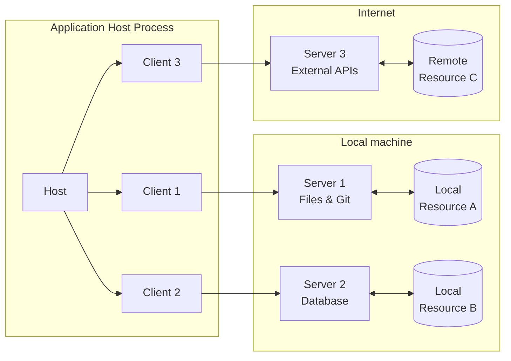
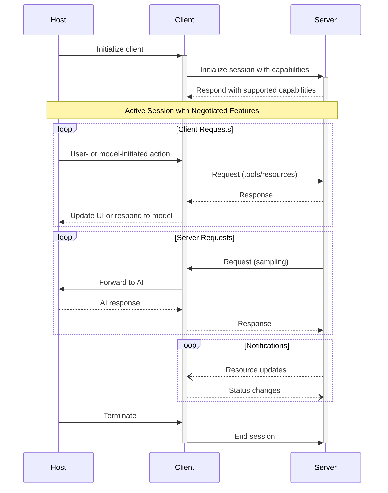
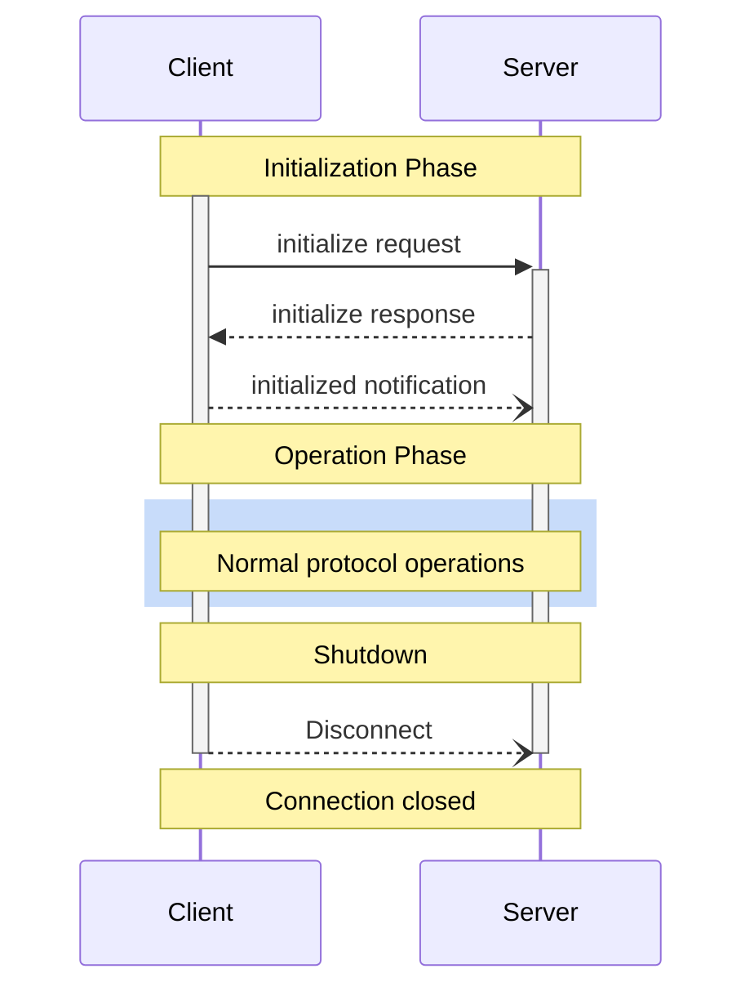
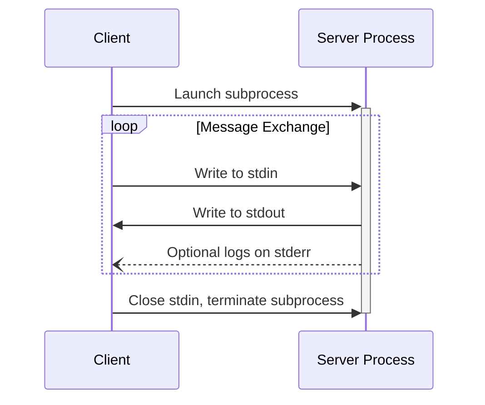
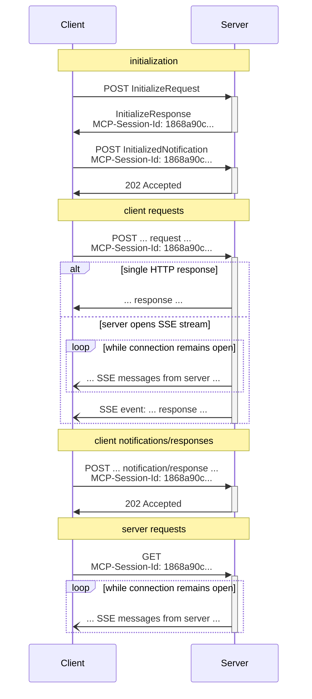
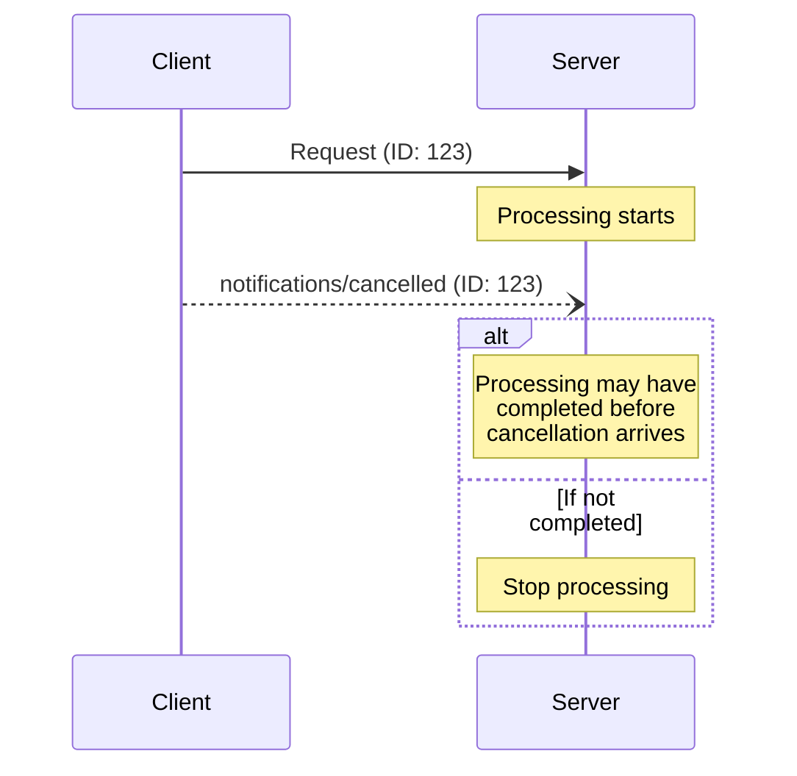
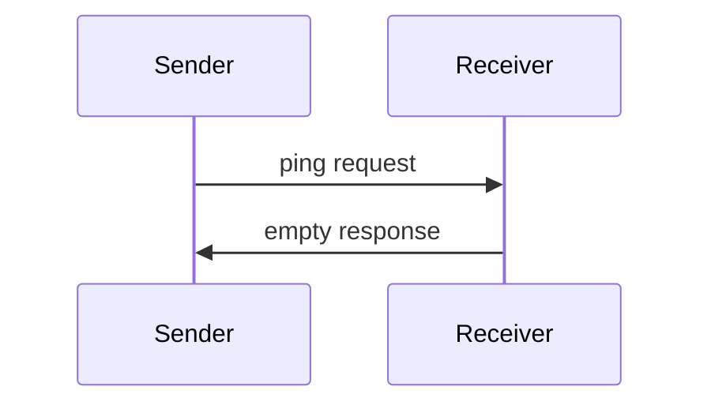
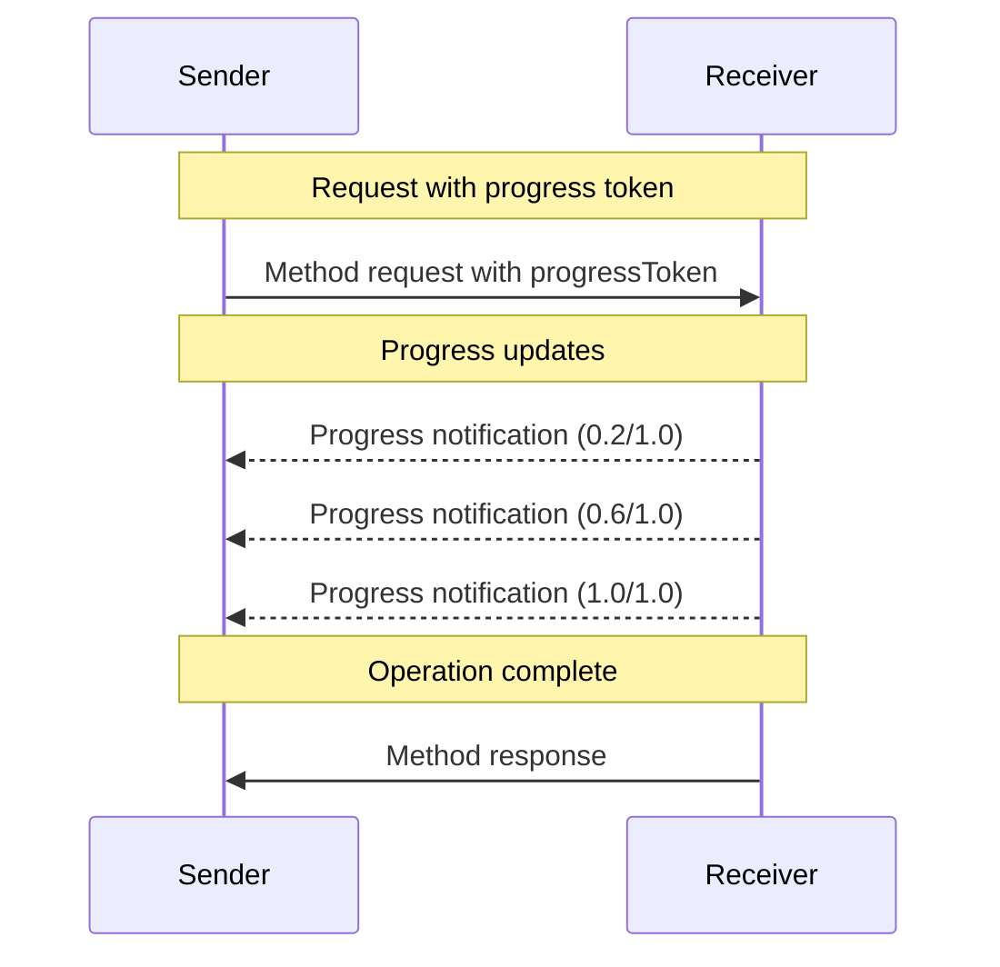

# MCP Documentation -- 04 Spec Core

- Architecture
- Overview
- Lifecycle
- Transports
- Cancellation
- Ping
- Progress
- Key Changes
- Overview

---

# Architecture
Source: https://modelcontextprotocol.io/specification/2025-11-25/architecture/index

The Model Context Protocol (MCP) follows a client-host-server architecture where each
host can run multiple client instances. This architecture enables users to integrate AI
capabilities across applications while maintaining clear security boundaries and
isolating concerns. Built on JSON-RPC, MCP provides a stateful session protocol focused
on context exchange and sampling coordination between clients and servers.

## Core Components



### Host

The host process acts as the container and coordinator:

* Creates and manages multiple client instances
* Controls client connection permissions and lifecycle
* Enforces security policies and consent requirements
* Handles user authorization decisions
* Coordinates AI/LLM integration and sampling
* Manages context aggregation across clients

### Clients

Each client is created by the host and maintains an isolated server connection:

* Establishes one stateful session per server
* Handles protocol negotiation and capability exchange
* Routes protocol messages bidirectionally
* Manages subscriptions and notifications
* Maintains security boundaries between servers

A host application creates and manages multiple clients, with each client having a 1:1
relationship with a particular server.

### Servers

Servers provide specialized context and capabilities:

* Expose resources, tools and prompts via MCP primitives
* Operate independently with focused responsibilities
* Request sampling through client interfaces
* Must respect security constraints
* Can be local processes or remote services

## Design Principles

MCP is built on several key design principles that inform its architecture and
implementation:

1. **Servers should be extremely easy to build**
   * Host applications handle complex orchestration responsibilities
   * Servers focus on specific, well-defined capabilities
   * Simple interfaces minimize implementation overhead
   * Clear separation enables maintainable code

2. **Servers should be highly composable**
   * Each server provides focused functionality in isolation
   * Multiple servers can be combined seamlessly
   * Shared protocol enables interoperability
   * Modular design supports extensibility

3. **Servers should not be able to read the whole conversation, nor "see into" other
   servers**
   * Servers receive only necessary contextual information
   * Full conversation history stays with the host
   * Each server connection maintains isolation
   * Cross-server interactions are controlled by the host
   * Host process enforces security boundaries

4. **Features can be added to servers and clients progressively**
   * Core protocol provides minimal required functionality
   * Additional capabilities can be negotiated as needed
   * Servers and clients evolve independently
   * Protocol designed for future extensibility
   * Backwards compatibility is maintained

## Capability Negotiation

The Model Context Protocol uses a capability-based negotiation system where clients and
servers explicitly declare their supported features during initialization. Capabilities
determine which protocol features and primitives are available during a session.

* Servers declare capabilities like resource subscriptions, tool support, and prompt
  templates
* Clients declare capabilities like sampling support and notification handling
* Both parties must respect declared capabilities throughout the session
* Additional capabilities can be negotiated through extensions to the protocol



Each capability unlocks specific protocol features for use during the session. For
example:

* Implemented [server features](/specification/2025-11-25/server) must be advertised in the
  server's capabilities
* Emitting resource subscription notifications requires the server to declare
  subscription support
* Tool invocation requires the server to declare tool capabilities
* [Sampling](/specification/2025-11-25/client) requires the client to declare support in its
  capabilities

This capability negotiation ensures clients and servers have a clear understanding of
supported functionality while maintaining protocol extensibility.

# Overview
Source: https://modelcontextprotocol.io/specification/2025-11-25/basic/index

The Model Context Protocol consists of several key components that work together:

* **Base Protocol**: Core JSON-RPC message types
* **Lifecycle Management**: Connection initialization, capability negotiation, and
  session control
* **Authorization**: Authentication and authorization framework for HTTP-based transports
* **Server Features**: Resources, prompts, and tools exposed by servers
* **Client Features**: Sampling and root directory lists provided by clients
* **Utilities**: Cross-cutting concerns like logging and argument completion

All implementations **MUST** support the base protocol and lifecycle management
components. Other components **MAY** be implemented based on the specific needs of the
application.

These protocol layers establish clear separation of concerns while enabling rich
interactions between clients and servers. The modular design allows implementations to
support exactly the features they need.

## Messages

All messages between MCP clients and servers **MUST** follow the
[JSON-RPC 2.0](https://www.jsonrpc.org/specification) specification. The protocol defines
these types of messages:

### Requests

[Requests](/specification/2025-11-25/schema#jsonrpcrequest) are sent from the client to the server or vice versa, to initiate an operation.

```typescript 
{
  jsonrpc: "2.0";
  id: string | number;
  method: string;
  params?: {
    [key: string]: unknown;
  };
}
```

* Requests **MUST** include a string or integer ID.
* Unlike base JSON-RPC, the ID **MUST NOT** be `null`.
* The request ID **MUST NOT** have been previously used by the requestor within the same
  session.

### Responses

Responses are sent in reply to requests, containing either the result or error of the operation.

#### Result Responses

[Result responses](/specification/2025-11-25/schema#jsonrpcresultresponse) are sent when the operation completes successfully.

```typescript 
{
  jsonrpc: "2.0";
  id: string | number;
  result: {
    [key: string]: unknown;
  }
}
```

* Result responses **MUST** include the same ID as the request they correspond to.
* Result responses **MUST** include a `result` field.
* The `result` **MAY** follow any JSON object structure.

#### Error Responses

[Error responses](/specification/2025-11-25/schema#jsonrpcerrorresponse) are sent when the operation fails or encounters an error.

```typescript 
{
  jsonrpc: "2.0";
  id?: string | number;
  error: {
    code: number;
    message: string;
    data?: unknown;
  }
}
```

* Error responses **MUST** include the same ID as the request they correspond to (except in error cases where the ID could not be read due a malformed request).
* Error responses **MUST** include an `error` field with a `code` and `message`.
* Error codes **MUST** be integers.

### Notifications

[Notifications](/specification/2025-11-25/schema#jsonrpcnotification) are sent from the client to the server or vice versa, as a one-way message.
The receiver **MUST NOT** send a response.

```typescript 
{
  jsonrpc: "2.0";
  method: string;
  params?: {
    [key: string]: unknown;
  };
}
```

* Notifications **MUST NOT** include an ID.

## Auth

MCP provides an [Authorization](/specification/2025-11-25/basic/authorization) framework for use with HTTP.
Implementations using an HTTP-based transport **SHOULD** conform to this specification,
whereas implementations using STDIO transport **SHOULD NOT** follow this specification,
and instead retrieve credentials from the environment.

Additionally, clients and servers **MAY** negotiate their own custom authentication and
authorization strategies.

For further discussions and contributions to the evolution of MCP's auth mechanisms, join
us in
[GitHub Discussions](https://github.com/modelcontextprotocol/specification/discussions)
to help shape the future of the protocol!

## Schema

The full specification of the protocol is defined as a
[TypeScript schema](https://github.com/modelcontextprotocol/specification/blob/main/schema/2025-11-25/schema.ts).
This is the source of truth for all protocol messages and structures.

There is also a
[JSON Schema](https://github.com/modelcontextprotocol/specification/blob/main/schema/2025-11-25/schema.json),
which is automatically generated from the TypeScript source of truth, for use with
various automated tooling.

## JSON Schema Usage

The Model Context Protocol uses JSON Schema for validation throughout the protocol. This section clarifies how JSON Schema should be used within MCP messages.

### Schema Dialect

MCP supports JSON Schema with the following rules:

1. **Default dialect**: When a schema does not include a `$schema` field, it defaults to [JSON Schema 2020-12](https://json-schema.org/draft/2020-12/schema)
2. **Explicit dialect**: Schemas MAY include a `$schema` field to specify a different dialect
3. **Supported dialects**: Implementations MUST support at least 2020-12 and SHOULD document which additional dialects they support
4. **Recommendation**: Implementors are RECOMMENDED to use JSON Schema 2020-12.

### Example Usage

#### Default dialect (2020-12):

```json 
{
  "type": "object",
  "properties": {
    "name": { "type": "string" },
    "age": { "type": "integer", "minimum": 0 }
  },
  "required": ["name"]
}
```

#### Explicit dialect (draft-07):

```json 
{
  "$schema": "http://json-schema.org/draft-07/schema#",
  "type": "object",
  "properties": {
    "name": { "type": "string" },
    "age": { "type": "integer", "minimum": 0 }
  },
  "required": ["name"]
}
```

### Implementation Requirements

* Clients and servers **MUST** support JSON Schema 2020-12 for schemas without an explicit `$schema` field
* Clients and servers **MUST** validate schemas according to their declared or default dialect. They **MUST** handle unsupported dialects gracefully by returning an appropriate error indicating the dialect is not supported.
* Clients and servers **SHOULD** document which schema dialects they support

### Schema Validation

* Schemas **MUST** be valid according to their declared or default dialect

## General fields

### `_meta`

The `_meta` property/parameter is reserved by MCP to allow clients and servers
to attach additional metadata to their interactions.

Certain key names are reserved by MCP for protocol-level metadata, as specified below;
implementations MUST NOT make assumptions about values at these keys.

Additionally, definitions in the [schema](https://github.com/modelcontextprotocol/specification/blob/main/schema/2025-11-25/schema.ts)
may reserve particular names for purpose-specific metadata, as declared in those definitions.

**Key name format:** valid `_meta` key names have two segments: an optional **prefix**, and a **name**.

**Prefix:**

* If specified, MUST be a series of labels separated by dots (`.`), followed by a slash (`/`).
  * Labels MUST start with a letter and end with a letter or digit; interior characters can be letters, digits, or hyphens (`-`).
  * Implementations SHOULD use reverse DNS notation (e.g., `com.example/` rather than `example.com/`).
* Any prefix where the second label is `modelcontextprotocol` or `mcp` is **reserved** for MCP use.
  * For example: `io.modelcontextprotocol/`, `dev.mcp/`, `org.modelcontextprotocol.api/`, and `com.mcp.tools/` are all reserved.
  * However, `com.example.mcp/` is NOT reserved, as the second label is `example`.

**Name:**

* Unless empty, MUST begin and end with an alphanumeric character (`[a-z0-9A-Z]`).
* MAY contain hyphens (`-`), underscores (`_`), dots (`.`), and alphanumerics in between.

### `icons`

The `icons` property provides a standardized way for servers to expose visual identifiers for their resources, tools, prompts, and implementations. Icons enhance user interfaces by providing visual context and improving the discoverability of available functionality.

Icons are represented as an array of `Icon` objects, where each icon includes:

* `src`: A URI pointing to the icon resource (required). This can be:
  * An HTTP/HTTPS URL pointing to an image file
  * A data URI with base64-encoded image data
* `mimeType`: Optional MIME type if the server's type is missing or generic
* `sizes`: Optional array of size specifications (e.g., `["48x48"]`, `["any"]` for scalable formats like SVG, or `["48x48", "96x96"]` for multiple sizes)
* `theme`: Optional theme preference (`light` or `dark`) for the icon background

**Required MIME type support:**

Clients that support rendering icons **MUST** support at least the following MIME types:

* `image/png` - PNG images (safe, universal compatibility)
* `image/jpeg` (and `image/jpg`) - JPEG images (safe, universal compatibility)

Clients that support rendering icons **SHOULD** also support:

* `image/svg+xml` - SVG images (scalable but requires security precautions as noted below)
* `image/webp` - WebP images (modern, efficient format)

**Security considerations:**

Consumers of icon metadata **MUST** take appropriate security precautions when handling icons to prevent compromise:

* Treat icon metadata and icon bytes as untrusted inputs and defend against network, privacy, and parsing risks.
* Ensure that the icon URI is either a HTTPS or `data:` URI. Clients **MUST** reject icon URIs that use unsafe schemes and redirects, such as `javascript:`, `file:`, `ftp:`, `ws:`, or local app URI schemes.
  * Disallow scheme changes and redirects to hosts on different origins.
* Be resilient against resource exhaustion attacks stemming from oversized images, large dimensions, or excessive frames (e.g., in GIFs).
  * Consumers **MAY** set limits for image and content size.
* Fetch icons without credentials. Do not send cookies, `Authorization` headers, or client credentials.
* Verify that icon URIs are from the same origin as the server. This minimizes the risk of exposing data or tracking information to third-parties.
* Exercise caution when fetching and rendering icons as the payload **MAY** contain executable content (e.g., SVG with [embedded JavaScript](https://www.w3.org/TR/SVG11/script.html) or [extended capabilities](https://www.w3.org/TR/SVG11/extend.html)).
  * Consumers **MAY** choose to disallow specific file types or otherwise sanitize icon files before rendering.
* Validate MIME types and file contents before rendering. Treat the MIME type information as advisory. Detect content type via magic bytes; reject on mismatch or unknown types.
  * Maintain a strict allowlist of image types.

**Usage:**

Icons can be attached to:

* `Implementation`: Visual identifier for the MCP server/client implementation
* `Tool`: Visual representation of the tool's functionality
* `Prompt`: Icon to display alongside prompt templates
* `Resource`: Visual indicator for different resource types

Multiple icons can be provided to support different display contexts and resolutions. Clients should select the most appropriate icon based on their UI requirements.

# Lifecycle
Source: https://modelcontextprotocol.io/specification/2025-11-25/basic/lifecycle

The Model Context Protocol (MCP) defines a rigorous lifecycle for client-server
connections that ensures proper capability negotiation and state management.

1. **Initialization**: Capability negotiation and protocol version agreement
2. **Operation**: Normal protocol communication
3. **Shutdown**: Graceful termination of the connection



## Lifecycle Phases

### Initialization

The initialization phase **MUST** be the first interaction between client and server.
During this phase, the client and server:

* Establish protocol version compatibility
* Exchange and negotiate capabilities
* Share implementation details

The client **MUST** initiate this phase by sending an `initialize` request containing:

* Protocol version supported
* Client capabilities
* Client implementation information

```json 
{
  "jsonrpc": "2.0",
  "id": 1,
  "method": "initialize",
  "params": {
    "protocolVersion": "2025-11-25",
    "capabilities": {
      "roots": {
        "listChanged": true
      },
      "sampling": {},
      "elicitation": {
        "form": {},
        "url": {}
      },
      "tasks": {
        "requests": {
          "elicitation": {
            "create": {}
          },
          "sampling": {
            "createMessage": {}
          }
        }
      }
    },
    "clientInfo": {
      "name": "ExampleClient",
      "title": "Example Client Display Name",
      "version": "1.0.0",
      "description": "An example MCP client application",
      "icons": [
        {
          "src": "https://example.com/icon.png",
          "mimeType": "image/png",
          "sizes": ["48x48"]
        }
      ],
      "websiteUrl": "https://example.com"
    }
  }
}
```

The server **MUST** respond with its own capabilities and information:

```json 
{
  "jsonrpc": "2.0",
  "id": 1,
  "result": {
    "protocolVersion": "2025-11-25",
    "capabilities": {
      "logging": {},
      "prompts": {
        "listChanged": true
      },
      "resources": {
        "subscribe": true,
        "listChanged": true
      },
      "tools": {
        "listChanged": true
      },
      "tasks": {
        "list": {},
        "cancel": {},
        "requests": {
          "tools": {
            "call": {}
          }
        }
      }
    },
    "serverInfo": {
      "name": "ExampleServer",
      "title": "Example Server Display Name",
      "version": "1.0.0",
      "description": "An example MCP server providing tools and resources",
      "icons": [
        {
          "src": "https://example.com/server-icon.svg",
          "mimeType": "image/svg+xml",
          "sizes": ["any"]
        }
      ],
      "websiteUrl": "https://example.com/server"
    },
    "instructions": "Optional instructions for the client"
  }
}
```

After successful initialization, the client **MUST** send an `initialized` notification
to indicate it is ready to begin normal operations:

```json 
{
  "jsonrpc": "2.0",
  "method": "notifications/initialized"
}
```

* The client **SHOULD NOT** send requests other than
  [pings](/specification/2025-11-25/basic/utilities/ping) before the server has responded to the
  `initialize` request.
* The server **SHOULD NOT** send requests other than
  [pings](/specification/2025-11-25/basic/utilities/ping) and
  [logging](/specification/2025-11-25/server/utilities/logging) before receiving the `initialized`
  notification.

#### Version Negotiation

In the `initialize` request, the client **MUST** send a protocol version it supports.
This **SHOULD** be the *latest* version supported by the client.

If the server supports the requested protocol version, it **MUST** respond with the same
version. Otherwise, the server **MUST** respond with another protocol version it
supports. This **SHOULD** be the *latest* version supported by the server.

If the client does not support the version in the server's response, it **SHOULD**
disconnect.

  If using HTTP, the client **MUST** include the `MCP-Protocol-Version: <protocol-version>` HTTP header on all subsequent requests to the MCP
  server.
  For details, see [the Protocol Version Header section in Transports](/specification/2025-11-25/basic/transports#protocol-version-header).

#### Capability Negotiation

Client and server capabilities establish which optional protocol features will be
available during the session.

Key capabilities include:

| Category | Capability     | Description                                                                                   |
| -------- | -------------- | --------------------------------------------------------------------------------------------- |
| Client   | `roots`        | Ability to provide filesystem [roots](/specification/2025-11-25/client/roots)                 |
| Client   | `sampling`     | Support for LLM [sampling](/specification/2025-11-25/client/sampling) requests                |
| Client   | `elicitation`  | Support for server [elicitation](/specification/2025-11-25/client/elicitation) requests       |
| Client   | `tasks`        | Support for [task-augmented](/specification/2025-11-25/basic/utilities/tasks) client requests |
| Client   | `experimental` | Describes support for non-standard experimental features                                      |
| Server   | `prompts`      | Offers [prompt templates](/specification/2025-11-25/server/prompts)                           |
| Server   | `resources`    | Provides readable [resources](/specification/2025-11-25/server/resources)                     |
| Server   | `tools`        | Exposes callable [tools](/specification/2025-11-25/server/tools)                              |
| Server   | `logging`      | Emits structured [log messages](/specification/2025-11-25/server/utilities/logging)           |
| Server   | `completions`  | Supports argument [autocompletion](/specification/2025-11-25/server/utilities/completion)     |
| Server   | `tasks`        | Support for [task-augmented](/specification/2025-11-25/basic/utilities/tasks) server requests |
| Server   | `experimental` | Describes support for non-standard experimental features                                      |

Capability objects can describe sub-capabilities like:

* `listChanged`: Support for list change notifications (for prompts, resources, and
  tools)
* `subscribe`: Support for subscribing to individual items' changes (resources only)

### Operation

During the operation phase, the client and server exchange messages according to the
negotiated capabilities.

Both parties **MUST**:

* Respect the negotiated protocol version
* Only use capabilities that were successfully negotiated

### Shutdown

During the shutdown phase, one side (usually the client) cleanly terminates the protocol
connection. No specific shutdown messages are defined—instead, the underlying transport
mechanism should be used to signal connection termination:

#### stdio

For the stdio [transport](/specification/2025-11-25/basic/transports), the client **SHOULD** initiate
shutdown by:

1. First, closing the input stream to the child process (the server)
2. Waiting for the server to exit, or sending `SIGTERM` if the server does not exit
   within a reasonable time
3. Sending `SIGKILL` if the server does not exit within a reasonable time after `SIGTERM`

The server **MAY** initiate shutdown by closing its output stream to the client and
exiting.

#### HTTP

For HTTP [transports](/specification/2025-11-25/basic/transports), shutdown is indicated by closing the
associated HTTP connection(s).

## Timeouts

Implementations **SHOULD** establish timeouts for all sent requests, to prevent hung
connections and resource exhaustion. When the request has not received a success or error
response within the timeout period, the sender **SHOULD** issue a [cancellation
notification](/specification/2025-11-25/basic/utilities/cancellation) for that request and stop waiting for
a response.

SDKs and other middleware **SHOULD** allow these timeouts to be configured on a
per-request basis.

Implementations **MAY** choose to reset the timeout clock when receiving a [progress
notification](/specification/2025-11-25/basic/utilities/progress) corresponding to the request, as this
implies that work is actually happening. However, implementations **SHOULD** always
enforce a maximum timeout, regardless of progress notifications, to limit the impact of a
misbehaving client or server.

## Error Handling

Implementations **SHOULD** be prepared to handle these error cases:

* Protocol version mismatch
* Failure to negotiate required capabilities
* Request [timeouts](#timeouts)

Example initialization error:

```json 
{
  "jsonrpc": "2.0",
  "id": 1,
  "error": {
    "code": -32602,
    "message": "Unsupported protocol version",
    "data": {
      "supported": ["2024-11-05"],
      "requested": "1.0.0"
    }
  }
}
```

# Transports
Source: https://modelcontextprotocol.io/specification/2025-11-25/basic/transports

MCP uses JSON-RPC to encode messages. JSON-RPC messages **MUST** be UTF-8 encoded.

The protocol currently defines two standard transport mechanisms for client-server
communication:

1. [stdio](#stdio), communication over standard in and standard out
2. [Streamable HTTP](#streamable-http)

Clients **SHOULD** support stdio whenever possible.

It is also possible for clients and servers to implement
[custom transports](#custom-transports) in a pluggable fashion.

## stdio

In the **stdio** transport:

* The client launches the MCP server as a subprocess.
* The server reads JSON-RPC messages from its standard input (`stdin`) and sends messages
  to its standard output (`stdout`).
* Messages are individual JSON-RPC requests, notifications, or responses.
* Messages are delimited by newlines, and **MUST NOT** contain embedded newlines.
* The server **MAY** write UTF-8 strings to its standard error (`stderr`) for any
  logging purposes including informational, debug, and error messages.
* The client **MAY** capture, forward, or ignore the server's `stderr` output
  and **SHOULD NOT** assume `stderr` output indicates error conditions.
* The server **MUST NOT** write anything to its `stdout` that is not a valid MCP message.
* The client **MUST NOT** write anything to the server's `stdin` that is not a valid MCP
  message.



## Streamable HTTP

  This replaces the [HTTP+SSE
  transport](/specification/2024-11-05/basic/transports#http-with-sse) from
  protocol version 2024-11-05. See the [backwards compatibility](#backwards-compatibility)
  guide below.

In the **Streamable HTTP** transport, the server operates as an independent process that
can handle multiple client connections. This transport uses HTTP POST and GET requests.
Server can optionally make use of
[Server-Sent Events](https://en.wikipedia.org/wiki/Server-sent_events) (SSE) to stream
multiple server messages. This permits basic MCP servers, as well as more feature-rich
servers supporting streaming and server-to-client notifications and requests.

The server **MUST** provide a single HTTP endpoint path (hereafter referred to as the
**MCP endpoint**) that supports both POST and GET methods. For example, this could be a
URL like `https://example.com/mcp`.

#### Security Warning

When implementing Streamable HTTP transport:

1. Servers **MUST** validate the `Origin` header on all incoming connections to prevent DNS rebinding attacks
   * If the `Origin` header is present and invalid, servers **MUST** respond with HTTP 403 Forbidden. The HTTP response
     body **MAY** comprise a JSON-RPC *error response* that has no `id`
2. When running locally, servers **SHOULD** bind only to localhost (127.0.0.1) rather than all network interfaces (0.0.0.0)
3. Servers **SHOULD** implement proper authentication for all connections

Without these protections, attackers could use DNS rebinding to interact with local MCP servers from remote websites.

### Sending Messages to the Server

Every JSON-RPC message sent from the client **MUST** be a new HTTP POST request to the
MCP endpoint.

1. The client **MUST** use HTTP POST to send JSON-RPC messages to the MCP endpoint.
2. The client **MUST** include an `Accept` header, listing both `application/json` and
   `text/event-stream` as supported content types.
3. The body of the POST request **MUST** be a single JSON-RPC *request*, *notification*, or *response*.
4. If the input is a JSON-RPC *response* or *notification*:
   * If the server accepts the input, the server **MUST** return HTTP status code 202
     Accepted with no body.
   * If the server cannot accept the input, it **MUST** return an HTTP error status code
     (e.g., 400 Bad Request). The HTTP response body **MAY** comprise a JSON-RPC *error
     response* that has no `id`.
5. If the input is a JSON-RPC *request*, the server **MUST** either
   return `Content-Type: text/event-stream`, to initiate an SSE stream, or
   `Content-Type: application/json`, to return one JSON object. The client **MUST**
   support both these cases.
6. If the server initiates an SSE stream:
   * The server **SHOULD** immediately send an SSE event consisting of an event
     ID and an empty `data` field in order to prime the client to reconnect
     (using that event ID as `Last-Event-ID`).
   * After the server has sent an SSE event with an event ID to the client, the
     server **MAY** close the *connection* (without terminating the *SSE stream*)
     at any time in order to avoid holding a long-lived connection. The client
     **SHOULD** then "poll" the SSE stream by attempting to reconnect.
   * If the server does close the *connection* prior to terminating the *SSE stream*,
     it **SHOULD** send an SSE event with a standard [`retry`](https://html.spec.whatwg.org/multipage/server-sent-events.html#:~:text=field%20name%20is%20%22retry%22) field before
     closing the connection. The client **MUST** respect the `retry` field,
     waiting the given number of milliseconds before attempting to reconnect.
   * The SSE stream **SHOULD** eventually include a JSON-RPC *response* for the
     JSON-RPC *request* sent in the POST body.
   * The server **MAY** send JSON-RPC *requests* and *notifications* before sending the
     JSON-RPC *response*. These messages **SHOULD** relate to the originating client
     *request*.
   * The server **MAY** terminate the SSE stream if the [session](#session-management)
     expires.
   * After the JSON-RPC *response* has been sent, the server **SHOULD** terminate the
     SSE stream.
   * Disconnection **MAY** occur at any time (e.g., due to network conditions).
     Therefore:
     * Disconnection **SHOULD NOT** be interpreted as the client cancelling its request.
     * To cancel, the client **SHOULD** explicitly send an MCP `CancelledNotification`.
     * To avoid message loss due to disconnection, the server **MAY** make the stream
       [resumable](#resumability-and-redelivery).

### Listening for Messages from the Server

1. The client **MAY** issue an HTTP GET to the MCP endpoint. This can be used to open an
   SSE stream, allowing the server to communicate to the client, without the client first
   sending data via HTTP POST.
2. The client **MUST** include an `Accept` header, listing `text/event-stream` as a
   supported content type.
3. The server **MUST** either return `Content-Type: text/event-stream` in response to
   this HTTP GET, or else return HTTP 405 Method Not Allowed, indicating that the server
   does not offer an SSE stream at this endpoint.
4. If the server initiates an SSE stream:
   * The server **MAY** send JSON-RPC *requests* and *notifications* on the stream.
   * These messages **SHOULD** be unrelated to any concurrently-running JSON-RPC
     *request* from the client.
   * The server **MUST NOT** send a JSON-RPC *response* on the stream **unless**
     [resuming](#resumability-and-redelivery) a stream associated with a previous client
     request.
   * The server **MAY** close the SSE stream at any time.
   * If the server closes the *connection* without terminating the *stream*, it
     **SHOULD** follow the same polling behavior as described for POST requests:
     sending a `retry` field and allowing the client to reconnect.
   * The client **MAY** close the SSE stream at any time.

### Multiple Connections

1. The client **MAY** remain connected to multiple SSE streams simultaneously.
2. The server **MUST** send each of its JSON-RPC messages on only one of the connected
   streams; that is, it **MUST NOT** broadcast the same message across multiple streams.
   * The risk of message loss **MAY** be mitigated by making the stream
     [resumable](#resumability-and-redelivery).

### Resumability and Redelivery

To support resuming broken connections, and redelivering messages that might otherwise be
lost:

1. Servers **MAY** attach an `id` field to their SSE events, as described in the
   [SSE standard](https://html.spec.whatwg.org/multipage/server-sent-events.html#event-stream-interpretation).
   * If present, the ID **MUST** be globally unique across all streams within that
     [session](#session-management)—or all streams with that specific client, if session
     management is not in use.
   * Event IDs **SHOULD** encode sufficient information to identify the originating
     stream, enabling the server to correlate a `Last-Event-ID` to the correct stream.
2. If the client wishes to resume after a disconnection (whether due to network failure
   or server-initiated closure), it **SHOULD** issue an HTTP GET to the MCP endpoint,
   and include the
   [`Last-Event-ID`](https://html.spec.whatwg.org/multipage/server-sent-events.html#the-last-event-id-header)
   header to indicate the last event ID it received.
   * The server **MAY** use this header to replay messages that would have been sent
     after the last event ID, *on the stream that was disconnected*, and to resume the
     stream from that point.
   * The server **MUST NOT** replay messages that would have been delivered on a
     different stream.
   * This mechanism applies regardless of how the original stream was initiated (via
     POST or GET). Resumption is always via HTTP GET with `Last-Event-ID`.

In other words, these event IDs should be assigned by servers on a *per-stream* basis, to
act as a cursor within that particular stream.

### Session Management

An MCP "session" consists of logically related interactions between a client and a
server, beginning with the [initialization phase](/specification/2025-11-25/basic/lifecycle). To support
servers which want to establish stateful sessions:

1. A server using the Streamable HTTP transport **MAY** assign a session ID at
   initialization time, by including it in an `MCP-Session-Id` header on the HTTP
   response containing the `InitializeResult`.
   * The session ID **SHOULD** be globally unique and cryptographically secure (e.g., a
     securely generated UUID, a JWT, or a cryptographic hash).
   * The session ID **MUST** only contain visible ASCII characters (ranging from 0x21 to
     0x7E).
   * The client **MUST** handle the session ID in a secure manner, see [Session Hijacking mitigations](/specification/2025-11-25/basic/security_best_practices#session-hijacking) for more details.
2. If an `MCP-Session-Id` is returned by the server during initialization, clients using
   the Streamable HTTP transport **MUST** include it in the `MCP-Session-Id` header on
   all of their subsequent HTTP requests.
   * Servers that require a session ID **SHOULD** respond to requests without an
     `MCP-Session-Id` header (other than initialization) with HTTP 400 Bad Request.
3. The server **MAY** terminate the session at any time, after which it **MUST** respond
   to requests containing that session ID with HTTP 404 Not Found.
4. When a client receives HTTP 404 in response to a request containing an
   `MCP-Session-Id`, it **MUST** start a new session by sending a new `InitializeRequest`
   without a session ID attached.
5. Clients that no longer need a particular session (e.g., because the user is leaving
   the client application) **SHOULD** send an HTTP DELETE to the MCP endpoint with the
   `MCP-Session-Id` header, to explicitly terminate the session.
   * The server **MAY** respond to this request with HTTP 405 Method Not Allowed,
     indicating that the server does not allow clients to terminate sessions.

### Sequence Diagram



### Protocol Version Header

If using HTTP, the client **MUST** include the `MCP-Protocol-Version: <protocol-version>` HTTP header on all subsequent requests to the MCP
server, allowing the MCP server to respond based on the MCP protocol version.

For example: `MCP-Protocol-Version: 2025-11-25`

The protocol version sent by the client **SHOULD** be the one [negotiated during
initialization](/specification/2025-11-25/basic/lifecycle#version-negotiation).

For backwards compatibility, if the server does *not* receive an `MCP-Protocol-Version`
header, and has no other way to identify the version - for example, by relying on the
protocol version negotiated during initialization - the server **SHOULD** assume protocol
version `2025-03-26`.

If the server receives a request with an invalid or unsupported
`MCP-Protocol-Version`, it **MUST** respond with `400 Bad Request`.

### Backwards Compatibility

Clients and servers can maintain backwards compatibility with the deprecated [HTTP+SSE
transport](/specification/2024-11-05/basic/transports#http-with-sse) (from
protocol version 2024-11-05) as follows:

**Servers** wanting to support older clients should:

* Continue to host both the SSE and POST endpoints of the old transport, alongside the
  new "MCP endpoint" defined for the Streamable HTTP transport.
  * It is also possible to combine the old POST endpoint and the new MCP endpoint, but
    this may introduce unneeded complexity.

**Clients** wanting to support older servers should:

1. Accept an MCP server URL from the user, which may point to either a server using the
   old transport or the new transport.
2. Attempt to POST an `InitializeRequest` to the server URL, with an `Accept` header as
   defined above:
   * If it succeeds, the client can assume this is a server supporting the new Streamable
     HTTP transport.
   * If it fails with the following HTTP status codes "400 Bad Request", "404 Not
     Found" or "405 Method Not Allowed":
     * Issue a GET request to the server URL, expecting that this will open an SSE stream
       and return an `endpoint` event as the first event.
     * When the `endpoint` event arrives, the client can assume this is a server running
       the old HTTP+SSE transport, and should use that transport for all subsequent
       communication.

## Custom Transports

Clients and servers **MAY** implement additional custom transport mechanisms to suit
their specific needs. The protocol is transport-agnostic and can be implemented over any
communication channel that supports bidirectional message exchange.

Implementers who choose to support custom transports **MUST** ensure they preserve the
JSON-RPC message format and lifecycle requirements defined by MCP. Custom transports
**SHOULD** document their specific connection establishment and message exchange patterns
to aid interoperability.

# Cancellation
Source: https://modelcontextprotocol.io/specification/2025-11-25/basic/utilities/cancellation

The Model Context Protocol (MCP) supports optional cancellation of in-progress requests
through notification messages. Either side can send a cancellation notification to
indicate that a previously-issued request should be terminated.

## Cancellation Flow

When a party wants to cancel an in-progress request, it sends a `notifications/cancelled`
notification containing:

* The ID of the request to cancel
* An optional reason string that can be logged or displayed

```json 
{
  "jsonrpc": "2.0",
  "method": "notifications/cancelled",
  "params": {
    "requestId": "123",
    "reason": "User requested cancellation"
  }
}
```

## Behavior Requirements

1. Cancellation notifications **MUST** only reference requests that:
   * Were previously issued in the same direction
   * Are believed to still be in-progress
2. The `initialize` request **MUST NOT** be cancelled by clients
3. For [task-augmented requests](./tasks), the `tasks/cancel` request **MUST** be used instead of the `notifications/cancelled` notification. Tasks have their own dedicated cancellation mechanism that returns the final task state.
4. Receivers of cancellation notifications **SHOULD**:
   * Stop processing the cancelled request
   * Free associated resources
   * Not send a response for the cancelled request
5. Receivers **MAY** ignore cancellation notifications if:
   * The referenced request is unknown
   * Processing has already completed
   * The request cannot be cancelled
6. The sender of the cancellation notification **SHOULD** ignore any response to the
   request that arrives afterward

## Timing Considerations

Due to network latency, cancellation notifications may arrive after request processing
has completed, and potentially after a response has already been sent.

Both parties **MUST** handle these race conditions gracefully:



## Implementation Notes

* Both parties **SHOULD** log cancellation reasons for debugging
* Application UIs **SHOULD** indicate when cancellation is requested

## Error Handling

Invalid cancellation notifications **SHOULD** be ignored:

* Unknown request IDs
* Already completed requests
* Malformed notifications

This maintains the "fire and forget" nature of notifications while allowing for race
conditions in asynchronous communication.

# Ping
Source: https://modelcontextprotocol.io/specification/2025-11-25/basic/utilities/ping

The Model Context Protocol includes an optional ping mechanism that allows either party
to verify that their counterpart is still responsive and the connection is alive.

## Overview

The ping functionality is implemented through a simple request/response pattern. Either
the client or server can initiate a ping by sending a `ping` request.

## Message Format

A ping request is a standard JSON-RPC request with no parameters:

```json 
{
  "jsonrpc": "2.0",
  "id": "123",
  "method": "ping"
}
```

## Behavior Requirements

1. The receiver **MUST** respond promptly with an empty response:

```json 
{
  "jsonrpc": "2.0",
  "id": "123",
  "result": {}
}
```

2. If no response is received within a reasonable timeout period, the sender **MAY**:
   * Consider the connection stale
   * Terminate the connection
   * Attempt reconnection procedures

## Usage Patterns



## Implementation Considerations

* Implementations **SHOULD** periodically issue pings to detect connection health
* The frequency of pings **SHOULD** be configurable
* Timeouts **SHOULD** be appropriate for the network environment
* Excessive pinging **SHOULD** be avoided to reduce network overhead

## Error Handling

* Timeouts **SHOULD** be treated as connection failures
* Multiple failed pings **MAY** trigger connection reset
* Implementations **SHOULD** log ping failures for diagnostics

# Progress
Source: https://modelcontextprotocol.io/specification/2025-11-25/basic/utilities/progress

The Model Context Protocol (MCP) supports optional progress tracking for long-running
operations through notification messages. Either side can send progress notifications to
provide updates about operation status.

## Progress Flow

When a party wants to *receive* progress updates for a request, it includes a
`progressToken` in the request metadata.

* Progress tokens **MUST** be a string or integer value
* Progress tokens can be chosen by the sender using any means, but **MUST** be unique
  across all active requests.

```json 
{
  "jsonrpc": "2.0",
  "id": 1,
  "method": "some_method",
  "params": {
    "_meta": {
      "progressToken": "abc123"
    }
  }
}
```

The receiver **MAY** then send progress notifications containing:

* The original progress token
* The current progress value so far
* An optional "total" value
* An optional "message" value

```json 
{
  "jsonrpc": "2.0",
  "method": "notifications/progress",
  "params": {
    "progressToken": "abc123",
    "progress": 50,
    "total": 100,
    "message": "Reticulating splines..."
  }
}
```

* The `progress` value **MUST** increase with each notification, even if the total is
  unknown.
* The `progress` and the `total` values **MAY** be floating point.
* The `message` field **SHOULD** provide relevant human readable progress information.

## Behavior Requirements

1. Progress notifications **MUST** only reference tokens that:
   * Were provided in an active request
   * Are associated with an in-progress operation

2. Receivers of progress requests **MAY**:
   * Choose not to send any progress notifications
   * Send notifications at whatever frequency they deem appropriate
   * Omit the total value if unknown

3. For [task-augmented requests](./tasks), the `progressToken` provided in the original request **MUST** continue to be used for progress notifications throughout the task's lifetime, even after the `CreateTaskResult` has been returned. The progress token remains valid and associated with the task until the task reaches a terminal status.
   * Progress notifications for tasks **MUST** use the same `progressToken` that was provided in the initial task-augmented request
   * Progress notifications for tasks **MUST** stop after the task reaches a terminal status (`completed`, `failed`, or `cancelled`)



## Implementation Notes

* Senders and receivers **SHOULD** track active progress tokens
* Both parties **SHOULD** implement rate limiting to prevent flooding
* Progress notifications **MUST** stop after completion

# Key Changes
Source: https://modelcontextprotocol.io/specification/2025-11-25/changelog

This document lists changes made to the Model Context Protocol (MCP) specification since
the previous revision, [2025-06-18](/specification/2025-06-18).

## Major changes

1. Enhance authorization server discovery with support for [OpenID Connect Discovery 1.0](https://openid.net/specs/openid-connect-discovery-1_0.html). (PR [#797](https://github.com/modelcontextprotocol/modelcontextprotocol/pull/797))
2. Allow servers to expose icons as additional metadata for tools, resources, resource templates, and prompts ([SEP-973](https://github.com/modelcontextprotocol/modelcontextprotocol/issues/973)).
3. Enhance authorization flows with incremental scope consent via `WWW-Authenticate` ([SEP-835](https://github.com/modelcontextprotocol/modelcontextprotocol/pull/835))
4. Provide guidance on tool names ([SEP-986](https://github.com/modelcontextprotocol/modelcontextprotocol/pull/1603))
5. Update `ElicitResult` and `EnumSchema` to use a more standards-based approach and support titled, untitled, single-select, and multi-select enums ([SEP-1330](https://github.com/modelcontextprotocol/modelcontextprotocol/issues/1330)).
6. Added support for [URL mode elicitation](/specification/2025-11-25/client/elicitation#url-elicitation-requests) ([SEP-1036](https://github.com/modelcontextprotocol/modelcontextprotocol/pull/887))
7. Add tool calling support to sampling via `tools` and `toolChoice` parameters ([SEP-1577](https://github.com/modelcontextprotocol/modelcontextprotocol/issues/1577))
8. Add support for OAuth Client ID Metadata Documents as a recommended client registration mechanism ([SEP-991](https://github.com/modelcontextprotocol/modelcontextprotocol/issues/991), PR [#1296](https://github.com/modelcontextprotocol/modelcontextprotocol/pull/1296))
9. Add experimental support for [tasks](/specification/2025-11-25/basic/utilities/tasks) to enable tracking durable requests with polling and deferred result retrieval ([SEP-1686](https://github.com/modelcontextprotocol/modelcontextprotocol/issues/1686)).

## Minor changes

1. Clarify that servers using stdio transport may use stderr for all types of logging, not just error messages (PR [#670](https://github.com/modelcontextprotocol/modelcontextprotocol/pull/670)).
2. Add optional `description` field to `Implementation` interface to align with MCP registry server.json format and provide human-readable context during initialization.
3. Clarify that servers must respond with HTTP 403 Forbidden for invalid Origin headers in Streamable HTTP transport. (PR [#1439](https://github.com/modelcontextprotocol/modelcontextprotocol/pull/1439))
4. Updated the [Security Best Practices guidance](https://modelcontextprotocol.io/specification/draft/basic/security_best_practices).
5. Clarify that input validation errors should be returned as Tool Execution Errors rather than Protocol Errors to enable model self-correction ([SEP-1303](https://github.com/modelcontextprotocol/modelcontextprotocol/issues/1303)).
6. Support polling SSE streams by allowing servers to disconnect at will ([SEP-1699](https://github.com/modelcontextprotocol/modelcontextprotocol/issues/1699)).
7. Clarify SEP-1699: GET streams support polling, resumption always via GET regardless of stream origin, event IDs should encode stream identity, disconnection includes server-initiated closure (Issue [#1847](https://github.com/modelcontextprotocol/modelcontextprotocol/issues/1847)).
8. Align OAuth 2.0 Protected Resource Metadata discovery with RFC 9728, making `WWW-Authenticate` header optional with fallback to `.well-known` endpoint ([SEP-985](https://github.com/modelcontextprotocol/modelcontextprotocol/issues/985)).
9. Add support for default values in all primitive types (string, number, enum) for elicitation schemas ([SEP-1034](https://github.com/modelcontextprotocol/modelcontextprotocol/issues/1034)).
10. Establish JSON Schema 2020-12 as the default dialect for MCP schema definitions ([SEP-1613](https://github.com/modelcontextprotocol/modelcontextprotocol/issues/1613)).

## Other schema changes

1. Decouple request payloads from RPC method definitions into standalone parameter schemas. ([SEP-1319](https://github.com/modelcontextprotocol/specification/issues/1319), PR [#1284](https://github.com/modelcontextprotocol/specification/pull/1284))

## Governance and process updates

1. Formalize Model Context Protocol governance structure ([SEP-932](https://github.com/modelcontextprotocol/modelcontextprotocol/issues/932)).
2. Establish shared communication practices and guidelines for the MCP community ([SEP-994](https://github.com/modelcontextprotocol/modelcontextprotocol/issues/994)).
3. Formalize Working Groups and Interest Groups in MCP governance ([SEP-1302](https://github.com/modelcontextprotocol/modelcontextprotocol/issues/1302)).
4. Establish SDK tiering system with clear requirements for feature support and maintenance commitments ([SEP-1730](https://github.com/modelcontextprotocol/modelcontextprotocol/issues/1730)).

## Full changelog

For a complete list of all changes that have been made since the last protocol revision,
[see GitHub](https://github.com/modelcontextprotocol/specification/compare/2025-06-18...2025-11-25).

# Overview
Source: https://modelcontextprotocol.io/specification/2025-11-25/server/index

Servers provide the fundamental building blocks for adding context to language models via
MCP. These primitives enable rich interactions between clients, servers, and language
models:

* **Prompts**: Pre-defined templates or instructions that guide language model
  interactions
* **Resources**: Structured data or content that provides additional context to the model
* **Tools**: Executable functions that allow models to perform actions or retrieve
  information

Each primitive can be summarized in the following control hierarchy:

| Primitive | Control                | Description                                        | Example                         |
| --------- | ---------------------- | -------------------------------------------------- | ------------------------------- |
| Prompts   | User-controlled        | Interactive templates invoked by user choice       | Slash commands, menu options    |
| Resources | Application-controlled | Contextual data attached and managed by the client | File contents, git history      |
| Tools     | Model-controlled       | Functions exposed to the LLM to take actions       | API POST requests, file writing |

Explore these key primitives in more detail below:

  

  

  
