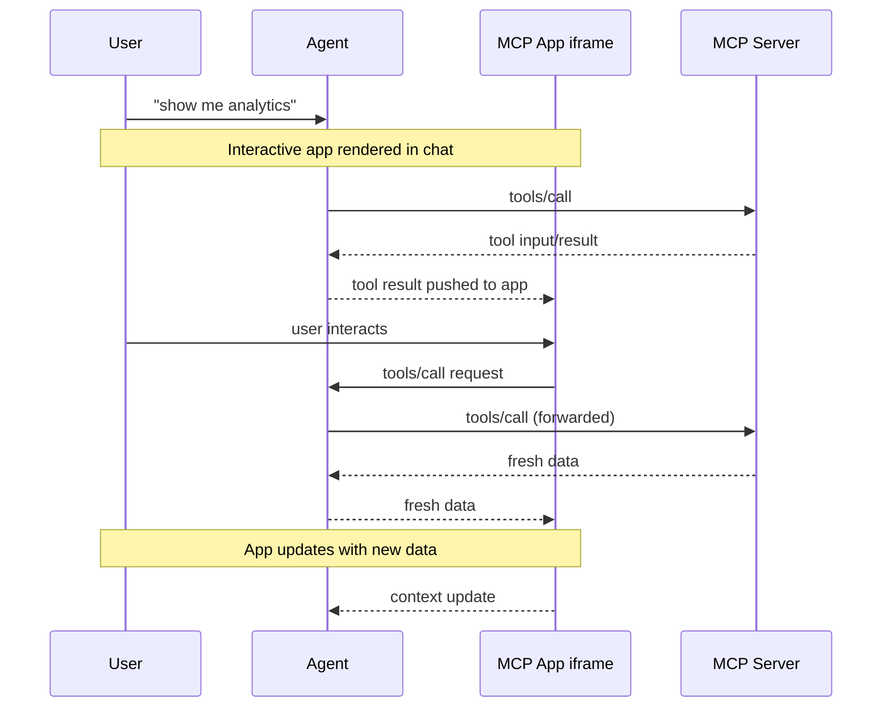

# MCP Documentation -- 07 Ecosystem

- Example Clients
- Example Servers
- Using uvx
- Using pip
- Build an MCP App
- MCP Apps
- Extension Support Matrix
- Extensions Overview
- MCP Extensions

---

# Example Clients
Source: https://modelcontextprotocol.io/clients

A list of applications that support MCP integrations

This page showcases applications that support the Model Context Protocol (MCP). Each client may support different MCP features:

| Feature          | Description                                                                                                  |
| ---------------- | ------------------------------------------------------------------------------------------------------------ |
| ✓ | Server-exposed data and content                                                                              |
| ✓ | Pre-defined templates for LLM interactions                                                                   |
| ✓ | Executable functions that LLMs can invoke                                                                    |
| ✓ | Support for tools/prompts/resources changed notifications                                                    |
| ✓ | Server-provided guidance for LLMs                                                                            |
| ✓ | Server-initiated LLM completions                                                                             |
| ✓ | Filesystem boundary definitions                                                                              |
| ✓ | User information requests                                                                                    |
| ✓ | [Client ID Metadata Document](specification/latest/basic/authorization#client-id-metadata-documents) support |
| ✓ | [Dynamic Client Registration](specification/latest/basic/authorization#dynamic-client-registration) support  |
| ✓ | [OAuth Client Credentials](/extensions/auth/oauth-client-credentials) extension support                      |
| ✓ | [Enterprise-Managed Authorization](/extensions/auth/enterprise-managed-authorization) extension support      |
| ✓ | Long-running operation tracking                                                                              |
| ✓ | Interactive HTML interfaces                                                                                  |

  This list is maintained by the community. If you notice any inaccuracies or would like to add or update information about MCP support in your application, please [submit a pull request](https://github.com/modelcontextprotocol/modelcontextprotocol/pulls).

## Client details

  5ire is an open source cross-platform desktop AI assistant that supports tools through MCP servers.

  **Key features:**

  * Built-in MCP servers can be quickly enabled and disabled.
  * Users can add more servers by modifying the configuration file.
  * It is open-source and user-friendly, suitable for beginners.
  * Future support for MCP will be continuously improved.

  AgentAI is a Rust library designed to simplify the creation of AI agents. The library includes seamless integration with MCP Servers.

  **Key features:**

  * Multi-LLM – We support most LLM APIs (OpenAI, Anthropic, Gemini, Ollama, and all OpenAI API Compatible).
  * Built-in support for MCP Servers.
  * Create agentic flows in a type- and memory-safe language like Rust.

  **Learn more:**

  * [Example of MCP Server integration](https://github.com/AdamStrojek/rust-agentai/blob/master/examples/tools_mcp.rs)

  AgenticFlow is a no-code AI platform that helps you build agents that handle sales, marketing, and creative tasks around the clock. Connect 2,500+ APIs and 10,000+ tools securely via MCP.

  **Key features:**

  * No-code AI agent creation and workflow building.
  * Access a vast library of 10,000+ tools and 2,500+ APIs through MCP.
  * Simple 3-step process to connect MCP servers.
  * Securely manage connections and revoke access anytime.

  **Learn more:**

  * [AgenticFlow MCP Integration](https://agenticflow.ai/mcp)

  AIQL TUUI is a native, cross-platform desktop AI chat application with MCP support. It supports multiple AI providers (e.g., Anthropic, Cloudflare, Deepseek, OpenAI, Qwen), local AI models (via vLLM, Ray, etc.), and aggregated API platforms (such as Deepinfra, Openrouter, and more).

  **Key features:**

  * **Dynamic LLM API & Agent Switching**: Seamlessly toggle between different LLM APIs and agents on the fly.
  * **Comprehensive Capabilities Support**: Built-in support for tools, prompts, resources, and sampling methods.
  * **Configurable Agents**: Enhanced flexibility with selectable and customizable tools via agent settings.
  * **Advanced Sampling Control**: Modify sampling parameters and leverage multi-round sampling for optimal results.
  * **Cross-Platform Compatibility**: Fully compatible with macOS, Windows, and Linux.
  * **Free & Open-Source (FOSS)**: Permissive licensing allows modifications and custom app bundling.

  **Learn more:**

  * [TUUI document](https://www.tuui.com/)
  * [AIQL GitHub repository](https://github.com/AI-QL)

  Amazon Q CLI is an open-source, agentic coding assistant for terminals.

  **Key features:**

  * Full support for MCP servers.
  * Edit prompts using your preferred text editor.
  * Access saved prompts instantly with `@`.
  * Control and organize AWS resources directly from your terminal.
  * Tools, profiles, context management, auto-compact, and so much more!

  **Get Started**

  ```bash 
  brew install amazon-q
  ```

  Amazon Q IDE is an open-source, agentic coding assistant for IDEs.

  **Key features:**

  * Support for the VSCode, JetBrains, Visual Studio, and Eclipse IDEs.
  * Control and organize AWS resources directly from your IDE.
  * Manage permissions for each MCP tool via the IDE user interface.

  Amp is an agentic coding tool built by Sourcegraph. It runs in VS Code (and compatible forks like Cursor, Windsurf, and VSCodium), JetBrains IDEs, Neovim, and as a command-line tool. It's also multiplayer — you can share threads and collaborate with your team.

  **Key features:**

  * Granular control over enabled tools and permissions
  * Support for MCP servers defined in VS Code `mcp.json`

  Apidog, an all-in-one API development and testing platform, features a built-in MCP Client designed for debugging and testing MCP Servers.

  **Key features:**

  * **Full Feature Support**: Debug Tools, Prompts, and Resources of MCP servers with a user-friendly GUI.
  * **Dual Transport Modes**: Supports both STDIO for local processes and HTTP for remote servers.
  * **Easy Setup**: Automatically parses MCP configuration files and supports direct command or URL input.
  * **Authentication**: Supports OAuth 2.0, API Key, Bearer Token, and other methods for secure connections.

  Apify MCP Tester is an open-source client that connects to any MCP server using Server-Sent Events (SSE).
  It is a standalone Apify Actor designed for testing MCP servers over SSE, with support for Authorization headers.
  It uses plain JavaScript (old-school style) and is hosted on Apify, allowing you to run it without any setup.

  **Key features:**

  * Connects to any MCP server via SSE.
  * Works with the [Apify MCP Server](https://mcp.apify.com) to interact with one or more Apify [Actors](https://apify.com/store).
  * Dynamically utilizes tools based on context and user queries (if supported by the server).

  Apigene MCP Client is an AI-powered conversational interface that enables seamless interaction with multiple applications, APIs, and MCP servers through natural language. It provides a unified interface for deploying agents across different AI platforms with optimized performance and governance.

  **Key features:**

  * **Multi-LLM Compatibility**: Works seamlessly with all leading AI platforms including Claude, OpenAI (ChatGPT), Gemini, xAI, and OpenRouter. Deploy the same agent across different platforms without modification.
  * **Optimized for Cost & Performance**: Dynamic tool loading loads tools only when needed, enabling thousands of tools without context bloat. Tool output optimization provides up to 99% payload reduction via compact JSON representation. Parallel execution runs multiple tool calls simultaneously for 10x faster responses.
  * **Unified Multi-Tool Interface**: Mesh multiple APIs and MCP servers into a single agent. Interact with all tools seamlessly from one Copilot interface without glue code or framework-specific logic.
  * **Governed Access & Audit**: Fine-grained access control defines exactly which operations each user or agent can perform. Complete audit trail tracks every tool call with timestamps, inputs, and outputs for compliance.

  **Learn more:**

  * [Apigene Copilot Documentation](https://docs.apigene.ai/user-guide/copilot)

  Archestra is an enterprise AI platform that combines an LLM proxy, MCP registry/orchestrator, MCP gateway, agent runtime, and chat UI into a single control plane for building, routing, and securing AI workflows.

  **Key features:**

  * Unified MCP gateway that exposes a single endpoint for orchestrating tools across remote and self-hosted MCP servers.
  * Supports MCP Apps for inline, interactive tool UIs in chat.
  * Supports DCR and CIMD for MCP-native OAuth 2.1 client registration.
  * Supports the Enterprise-Managed Authorization extension for centrally managed enterprise identity flows.
  * Includes an LLM proxy with deterministic, context-aware tool guardrails to reduce prompt-injection and data-exfiltration risk.
  * Adds per-team cost tracking, usage limits, and optimization controls for model traffic.

  Augment Code is an AI-powered coding platform for VS Code and JetBrains with autonomous agents, chat, and completions. Both local and remote agents are backed by full codebase awareness and native support for MCP, enabling enhanced context through external sources and tools.

  **Key features:**

  * Full MCP support in local and remote agents.
  * Add additional context through MCP servers.
  * Automate your development workflows with MCP tools.
  * Works in VS Code and JetBrains IDEs.

  Avatar-Shell is an electron-based MCP client application that prioritizes avatar conversations and media output such as images.

  **Key features:**

  * MCP tools and resources can be used
  * Supports avatar-to-avatar communication via socket.io.
  * Supports the mixed use of multiple LLM APIs.
  * The daemon mechanism allows for flexible scheduling.

  BeeAI Framework is an open-source framework for building, deploying, and serving powerful agentic workflows at scale. The framework includes the **MCP Tool**, a native feature that simplifies the integration of MCP servers into agentic workflows.

  **Key features:**

  * Seamlessly incorporate MCP tools into agentic workflows.
  * Quickly instantiate framework-native tools from connected MCP client(s).
  * Planned future support for agentic MCP capabilities.

  **Learn more:**

  * [Example of using MCP tools in agentic workflow](https://i-am-bee.github.io/beeai-framework/#/typescript/tools?id=using-the-mcptool-class)

  BoltAI is a native, all-in-one AI chat client with MCP support. BoltAI supports multiple AI providers (OpenAI, Anthropic, Google AI...), including local AI models (via Ollama, LM Studio or LMX)

  **Key features:**

  * MCP Tool integrations: once configured, user can enable individual MCP server in each chat
  * MCP quick setup: import configuration from Claude Desktop app or Cursor editor
  * Invoke MCP tools inside any app with AI Command feature
  * Integrate with remote MCP servers in the mobile app

  **Learn more:**

  * [BoltAI docs](https://boltai.com/docs/plugins/mcp-servers)
  * [BoltAI website](https://boltai.com)

  Bob Shell brings IBM Bob's AI capabilities to your command line.

  **Key features:**

  * Custom slash commands for workflow automation and team standardization
  * Checkpointing system with automatic Git snapshots before file changes
  * Trusted folders security to control project access and capabilities
  * Sandboxing support (macOS Seatbelt, Docker, Podman) for isolated operations
  * Specialized modes (Code, Ask, Plan, Advanced) for different workflows

  Call Chirp uses AI to capture every critical detail from your business conversations, automatically syncing insights to your CRM and project tools so you never miss another deal-closing moment.

  **Key features:**

  * Save transcriptions from Zoom, Google Meet, and more
  * MCP Tools for voice AI agents
  * Remote MCP servers support

  Chatbox is a better UI and desktop app for ChatGPT, Claude, and other LLMs, available on Windows, Mac, Linux, and the web. It's open-source and has garnered 37K stars on GitHub.

  **Key features:**

  * Tools support for MCP servers
  * Support both local and remote MCP servers
  * Built-in MCP servers marketplace

  ChatFrame is a cross-platform desktop chatbot that unifies access to multiple AI language models, supports custom tool integration via MCP servers, and enables RAG conversations with your local files—all in a single, polished app for macOS and Windows.

  **Key features:**

  * Unified access to top LLM providers (OpenAI, Anthropic, DeepSeek, xAI, and more) in one interface
  * Built-in retrieval-augmented generation (RAG) for instant, private search across your PDFs, text, and code files
  * Plug-in system for custom tools via Model Context Protocol (MCP) servers
  * Multimodal chat: supports images, text, and live interactive artifacts

  ChatGPT is OpenAI's AI assistant that provides MCP support for remote servers to conduct deep research and to power MCP-based apps.

  **Key features:**

  * Support for MCP via connections UI in settings
  * Access to search tools from configured MCP servers for deep research
  * Support for MCP Apps, allowing ChatGPT to connect to MCP-based applications
  * Enterprise-grade security and compliance features

  ChatWise is a desktop-optimized, high-performance chat application that lets you bring your own API keys. It supports a wide range of LLMs and integrates with MCP to enable tool workflows.

  **Key features:**

  * Tools support for MCP servers
  * Offer built-in tools like web search, artifacts and image generation.

  Chorus is a native Mac app for chatting with AIs. Chat with multiple models at once, run tools and MCPs, create projects, quick chat, bring your own key, all in a blazing fast, keyboard shortcut friendly app.

  **Key features:**

  * MCP support with one-click install
  * Built in tools, like web search, terminal, and image generation
  * Chat with multiple models at once (cloud or local)
  * Create projects with scoped memory
  * Quick chat with an AI that can see your screen

  Claude Code is an interactive agentic coding tool from Anthropic that helps you code faster through natural language commands. It supports MCP integration for resources, prompts, tools, and roots, and also functions as an MCP server to integrate with other clients.

  **Key features:**

  * Full support for resources, prompts, tools, and roots from MCP servers
  * Offers its own tools through an MCP server for integrating with other MCP clients

  Claude Desktop provides comprehensive support for MCP, enabling deep integration with local tools and data sources.

  **Key features:**

  * Full support for resources, allowing attachment of local files and data
  * Support for prompt templates
  * Tool integration for executing commands and scripts
  * Local server connections for enhanced privacy and security

  Claude.ai is Anthropic's web-based AI assistant that provides MCP support for remote servers.

  **Key features:**

  * Support for remote MCP servers via integrations UI in settings
  * Access to tools, prompts, and resources from configured MCP servers
  * Seamless integration with Claude's conversational interface
  * Enterprise-grade security and compliance features

  Cline is an autonomous coding agent in VS Code that edits files, runs commands, uses a browser, and more–with your permission at each step.

  **Key features:**

  * Create and add tools through natural language (e.g. "add a tool that searches the web")
  * Share custom MCP servers Cline creates with others via the `~/Documents/Cline/MCP` directory
  * Displays configured MCP servers along with their tools, resources, and any error logs

  CodeGPT is a popular VS Code and Jetbrains extension that brings AI-powered coding assistance to your editor. It supports integration with MCP servers for tools, allowing users to leverage external AI capabilities directly within their development workflow.

  **Key features:**

  * Use MCP tools from any configured MCP server
  * Seamless integration with VS Code and Jetbrains UI
  * Supports multiple LLM providers and custom endpoints

  **Learn more:**

  * [CodeGPT Documentation](https://docs.codegpt.co/)

  Codex is a lightweight AI-powered coding agent from OpenAI that runs in your terminal.

  **Key features:**

  * Support for MCP tools (listing and invocation)
  * Support for MCP resources (list, read, and templates)
  * Elicitation support (routes requests to TUI for user input)
  * Supports STDIO and HTTP streaming transports with OAuth
  * Also available as VS Code extension

  Continue is an open-source AI code assistant, with built-in support for MCP Tools, Resource, Prompts, and Apps

  **Key features:**

  * Type "@" to mention MCP resources
  * Prompt templates surface as slash commands
  * Use both built-in and MCP tools directly in chat
  * Limited MCP Apps support for displaying MCP UIs
  * Supports VS Code and JetBrains IDEs, with any LLM

  Copilot-MCP enables AI coding assistance via MCP.

  **Key features:**

  * Support for MCP tools and resources
  * Integration with development workflows
  * Extensible AI capabilities

  Cursor is an AI code editor.

  **Key features:**

  * Support for MCP tools in Cursor Composer
  * Support for roots
  * Support for prompts
  * Support for elicitation
  * Support for both STDIO and SSE

  Daydreams is a generative agent framework for executing anything onchain

  **Key features:**

  * Supports MCP Servers in config
  * Exposes MCP Client

  ECA is a Free and open-source editor-agnostic tool that aims to easily link LLMs and Editors, giving the best UX possible for AI pair programming using a well-defined protocol

  **Key features:**

  * **Editor-agnostic**: protocol for any editor to integrate.
  * **Single configuration**: Configure eca making it work the same in any editor via global or local configs.
  * **Chat** interface: ask questions, review code, work together to code.
  * **Agentic**: let LLM work as an agent with its native tools and MCPs you can configure.
  * **Context**: support: giving more details about your code to the LLM, including MCP resources and prompts.
  * **Multi models**: Login to OpenAI, Anthropic, Copilot, Ollama local models and many more.
  * **OpenTelemetry**: Export metrics of tools, prompts, server usage.

  Emacs Mcp is an Emacs client designed to interface with MCP servers, enabling seamless connections and interactions. It provides MCP tool invocation support for AI plugins like [gptel](https://github.com/karthink/gptel) and [llm](https://github.com/ahyatt/llm), adhering to Emacs' standard tool invocation format. This integration enhances the functionality of AI tools within the Emacs ecosystem.

  **Key features:**

  * Provides MCP tool support for Emacs.

  fast-agent is a Python Agent framework, with simple declarative support for creating Agents and Workflows, with full multi-modal support for Anthropic and OpenAI models.

  **Key features:**

  * PDF and Image support, based on MCP Native types
  * Interactive front-end to develop and diagnose Agent applications, including passthrough and playback simulators
  * Built in support for "Building Effective Agents" workflows.
  * Deploy Agents as MCP Servers

  Firebender is an IntelliJ plugin that offers a world-class coding agent with MCP integration for tool calling.

  **Key features:**

  * Tool integration for executing commands and scripts via STDIO, SSE indirectly supported via mcp-remote npm package.
  * Local server connections for enhanced privacy and security
  * MCPs can be installed via project rules or local workstation rules files.
  * Individual tools within MCPs can be turned off.

  FlowDown is a blazing fast and smooth client app for using AI/LLM, with a strong emphasis on privacy and user experience. It supports MCP servers to extend its capabilities with external tools, allowing users to build powerful, customized workflows.

  **Key features:**

  * **Seamless MCP Integration**: Easily connect to MCP servers to utilize a wide range of external tools.
  * **Privacy-First Design**: Your data stays on your device. We don't collect any user data, ensuring complete privacy.
  * **Lightweight & Efficient**: A compact and optimized design ensures a smooth and responsive experience with any AI model.
  * **Broad Compatibility**: Works with all OpenAI-compatible service providers and supports local offline models through MLX.
  * **Rich User Experience**: Features beautifully formatted Markdown, blazing-fast text rendering, and intelligent, automated chat titling.

  **Learn more:**

  * [FlowDown website](https://flowdown.ai/)
  * [FlowDown documentation](https://apps.qaq.wiki/docs/flowdown/)

  Think n8n + ChatGPT. FLUJO is a desktop application that integrates with MCP to provide a workflow-builder interface for AI interactions. Built with Next.js and React, it supports both online and offline (ollama) models, it manages API Keys and environment variables centrally and can install MCP Servers from GitHub. FLUJO has a ChatCompletions endpoint and flows can be executed from other AI applications like Cline, Roo or Claude.

  **Key features:**

  * Environment & API Key Management
  * Model Management
  * MCP Server Integration
  * Workflow Orchestration
  * Chat Interface

  Gemini CLI is an open-source AI agent that brings the power of Gemini directly into your terminal.

  Programmatically assemble prompts for LLMs using GenAIScript (in JavaScript). Orchestrate LLMs, tools, and data in JavaScript.

  **Key features:**

  * JavaScript toolbox to work with prompts
  * Abstraction to make it easy and productive
  * Seamless Visual Studio Code integration

  Genkit is a cross-language SDK for building and integrating GenAI features into applications. The [genkitx-mcp](https://github.com/firebase/genkit/tree/main/js/plugins/mcp) plugin enables consuming MCP servers as a client or creating MCP servers from Genkit tools and prompts.

  **Key features:**

  * Client support for tools and prompts (resources partially supported)
  * Rich discovery with support in Genkit's Dev UI playground
  * Seamless interoperability with Genkit's existing tools and prompts
  * Works across a wide variety of GenAI models from top providers

  Delegate tasks to GitHub Copilot coding agent and let it work in the background while you stay focused on the highest-impact and most interesting work

  **Key features:**

  * Delegate tasks to Copilot from GitHub Issues, Visual Studio Code, GitHub Copilot Chat or from your favorite MCP host using the GitHub MCP Server
  * Tailor Copilot to your project by [customizing the agent's development environment](https://docs.github.com/en/enterprise-cloud@latest/copilot/how-tos/agents/copilot-coding-agent/customizing-the-development-environment-for-copilot-coding-agent#preinstalling-tools-or-dependencies-in-copilots-environment) or [writing custom instructions](https://docs.github.com/en/enterprise-cloud@latest/copilot/how-tos/agents/copilot-coding-agent/best-practices-for-using-copilot-to-work-on-tasks#adding-custom-instructions-to-your-repository)
  * [Augment Copilot's context and capabilities with MCP tools](https://docs.github.com/en/enterprise-cloud@latest/copilot/how-tos/agents/copilot-coding-agent/extending-copilot-coding-agent-with-mcp), with support for both local and remote MCP servers

  Glama is a comprehensive AI workspace and integration platform that offers a unified interface to leading LLM providers, including OpenAI, Anthropic, and others. It supports the Model Context Protocol (MCP) ecosystem, enabling developers and enterprises to easily discover, build, and manage MCP servers.

  **Key features:**

  * Integrated [MCP Server Directory](https://glama.ai/mcp/servers)
  * Integrated [MCP Tool Directory](https://glama.ai/mcp/tools)
  * Host MCP servers and access them via the Chat or SSE endpoints
    – Ability to chat with multiple LLMs and MCP servers at once
  * Upload and analyze local files and data
  * Full-text search across all your chats and data

  goose is an open source AI agent that supercharges your software development by automating coding tasks.

  **Key features:**

  * Expose MCP functionality to goose through tools.
  * MCPs can be installed directly via the [extensions directory](https://block.github.io/goose/v1/extensions/), CLI, or UI.
  * goose allows you to extend its functionality by [building your own MCP servers](https://block.github.io/goose/docs/tutorials/custom-extensions).
  * Includes built-in extensions for development, memory, computer control, and auto-visualization.

  gptme is a open-source terminal-based personal AI assistant/agent, designed to assist with programming tasks and general knowledge work.

  **Key features:**

  * CLI-first design with a focus on simplicity and ease of use
  * Rich set of built-in tools for shell commands, Python execution, file operations, and web browsing
  * Local-first approach with support for multiple LLM providers
  * Open-source, built to be extensible and easy to modify

  HyperAgent is Playwright supercharged with AI. With HyperAgent, you no longer need brittle scripts, just powerful natural language commands. Using MCP servers, you can extend the capability of HyperAgent, without having to write any code.

  **Key features:**

  * AI Commands: Simple APIs like page.ai(), page.extract() and executeTask() for any AI automation
  * Fallback to Regular Playwright: Use regular Playwright when AI isn't needed
  * Stealth Mode – Avoid detection with built-in anti-bot patches
  * Cloud Ready – Instantly scale to hundreds of sessions via [Hyperbrowser](https://www.hyperbrowser.ai/)
  * MCP Client – Connect to tools like Composio for full workflows (e.g. writing web data to Google Sheets)

  IBM Bob is an AI SDLC partner that enables AI coding assistance via MCP. Built with security-first principles and enterprise-grade deployment flexibility, Bob integrates security into development workflows through shift-left practices, helping accelerate modernization while maintaining governance and compliance.

  **Key features:**

  * Support for MCP tools and resources with fine-grained control
  * Global and project-level MCP server configuration
  * STDIO and SSE transport support for local and remote servers
  * Individual tool enable/disable for optimized context usage
  * Auto-approval capabilities for trusted tools
  * Built-in MCP server creation through natural language
  * Enterprise-grade security with shift-left integration
  * Integration with development workflows

  Inspector is a visual editor for your codebase. It connects to Cursor, Claude Code, and Codex so you can edit your frontend visually. Move elements, change text, and ship real code without touching CSS.

  **Key features:**

  * Design Mode: Move elements, edit text, and zoom in to interact with your front-end like Figma.
  * Agent Connect: Plug in Cursor, Claude Code, or Codex.
  * Version Control: Stage changes and open PRs from Inspector.
  * MCP Client: Connect any MCP Server you want!

  Jenova is the best MCP client for non-technical users, especially on mobile.

  **Key features:**

  * 30+ pre-integrated MCP servers with one-click integration of custom servers
  * MCP recommendation capability that suggests the best servers for specific tasks
  * Multi-agent architecture with leading tool use reliability and scalability, supporting unlimited concurrent MCP server connections through RAG-powered server metadata
  * Model agnostic platform supporting any leading LLMs (OpenAI, Anthropic, Google, etc.)
  * Unlimited chat history and global persistent memory powered by RAG
  * Easy creation of custom agents with custom models, instructions, knowledge bases, and MCP servers
  * Local MCP server (STDIO) support coming soon with desktop apps

  JetBrains AI Assistant plugin provides AI-powered features for software development available in all JetBrains IDEs.

  **Key features:**

  * Unlimited code completion powered by Mellum, JetBrains' proprietary AI model.
  * Context-aware AI chat that understands your code and helps you in real time.
  * Access to top-tier models from OpenAI, Anthropic, and Google.
  * Offline mode with connected local LLMs via Ollama or LM Studio.
  * Deep integration into IDE workflows, including code suggestions in the editor, VCS assistance, runtime error explanation, and more.

  Junie is JetBrains' AI coding agent for JetBrains IDEs and Android Studio.

  **Key features:**

  * Connects to MCP servers over **stdio** to use external tools and data sources.
  * Per-command approval with an optional allowlist.
  * Config via `mcp.json` (global `~/.junie/mcp.json` or project `.junie/mcp/`).

  Joey is a mobile-first MCP client for **iOS and Android** (also available on macOS, Windows, and Linux) that connects to AI models via OpenRouter and remote MCP servers over Streamable HTTP.

  **Key features:**

  * **Mobile MCP support** — use MCP servers directly from your phone or tablet on iOS and Android.
  * Connects to remote MCP servers over **Streamable HTTP** with OAuth support.
  * Supports multiple MCP servers per conversation with tool calling.
  * MCP sampling and elicitation support for interactive server-initiated workflows.
  * Image and audio attachments with SSE streaming responses.

  Kilo Code is an autonomous coding AI dev team in VS Code that edits files, runs commands, uses a browser, and more.

  **Key features:**

  * Create and add tools through natural language (e.g. "add a tool that searches the web")
  * Discover MCP servers via the MCP Marketplace
  * One click MCP server installs via MCP Marketplace
  * Displays configured MCP servers along with their tools, resources, and any error logs

  Klavis AI is an Open-Source Infra to Use, Build & Scale MCPs with ease.

  **Key features:**

  * Slack/Discord/Web MCP clients for using MCPs directly
  * Simple web UI dashboard for easy MCP configuration
  * Direct OAuth integration with Slack & Discord Clients and MCP Servers for secure user authentication
  * SSE transport support

  **Learn more:**

  * [Demo video showing MCP usage in Slack/Discord](https://youtu.be/9-QQAhrQWw8)

  Langdock is the enterprise-ready solution for rolling out AI to all of your employees while enabling your developers to build and deploy custom AI workflows on top.

  **Key features:**

  * Remote MCP Server (SSE & Streamable HTTP) support, connect to any MCP server via OAuth, API Key, or without authentication.
  * MCP Tool discovery and management, including tool confirmation UI.
  * Enterprise-grade security and compliance features

  Langflow is an open-source visual builder that lets developers rapidly prototype and build AI applications, it integrates with the Model Context Protocol (MCP) as both an MCP server and an MCP client.

  **Key features:**

  * Full support for using MCP server tools to build agents and flows.
  * Export agents and flows as MCP server
  * Local & remote server connections for enhanced privacy and security

  **Learn more:**

  * [Demo video showing how to use Langflow as both an MCP client & server](https://www.youtube.com/watch?v=pEjsaVVPjdI)

  LibreChat is an open-source, customizable AI chat UI that supports multiple AI providers, now including MCP integration.

  **Key features:**

  * Extend current tool ecosystem, including [Code Interpreter](https://www.librechat.ai/docs/features/code_interpreter) and Image generation tools, through MCP servers
  * Add tools to customizable [Agents](https://www.librechat.ai/docs/features/agents), using a variety of LLMs from top providers
  * Open-source and self-hostable, with secure multi-user support
  * Future roadmap includes expanded MCP feature support

  LM Studio is a cross-platform desktop app for discovering, downloading, and running open-source LLMs locally. You can now connect local models to tools via Model Context Protocol (MCP).

  **Key features:**

  * Use MCP servers with local models on your computer. Add entries to `mcp.json` and save to get started.
  * Tool confirmation UI: when a model calls a tool, you can confirm the call in the LM Studio app.
  * Cross-platform: runs on macOS, Windows, and Linux, one-click installer with no need to fiddle in the command line
  * Supports GGUF (llama.cpp) or MLX models with GPU acceleration
  * GUI & terminal mode: use the LM Studio app or CLI (lms) for scripting and automation

  **Learn more:**

  * [Docs: Using MCP in LM Studio](https://lmstudio.ai/docs/app/plugins/mcp)
  * [Create a 'Add to LM Studio' button for your server](https://lmstudio.ai/docs/app/plugins/mcp/deeplink)
  * [Announcement blog: LM Studio + MCP](https://lmstudio.ai/blog/mcp)

  LM-Kit.NET is a local-first Generative AI SDK for .NET (C# / VB.NET) that can act as an **MCP client**. Current MCP support: **Tools only**.

  **Key features:**

  * Consume MCP server tools over HTTP/JSON-RPC 2.0 (initialize, list tools, call tools).
  * Programmatic tool discovery and invocation via `McpClient`.
  * Easy integration in .NET agents and applications.

  **Learn more:**

  * [Docs: Using MCP in LM-Kit.NET](https://docs.lm-kit.com/lm-kit-net/api/LMKit.Mcp.Client.McpClient.html)
  * [Creating AI agents](https://lm-kit.com/solutions/ai-agents)
  * Product page: [LM-Kit.NET](https://lm-kit.com/products/lm-kit-net/)

  Lutra is an AI agent that transforms conversations into actionable, automated workflows.

  **Key features:**

  * Easy MCP Integration: Connecting Lutra to MCP servers is as simple as providing the server URL; Lutra handles the rest behind the scenes.
  * Chat to Take Action: Lutra understands your conversational context and goals, automatically integrating with your existing apps to perform tasks.
  * Reusable Playbooks: After completing a task, save the steps as reusable, automated workflows—simplifying repeatable processes and reducing manual effort.
  * Shareable Automations: Easily share your saved playbooks with teammates to standardize best practices and accelerate collaborative workflows.

  **Learn more:**

  * [Lutra AI agent explained (video)](https://www.youtube.com/watch?v=W5ZpN0cMY70)

  MCP Bundler is perfect local proxy for your MCP workflow. The app centralizes all your MCP servers — toggle, group, turn off capabilities instantly. Switch bundles on the fly inside the MCP Bundler.

  **Key features:**

  * Unified Control Panel: Manage all your MCP servers — both Local STDIO and Remote HTTP/SSE — from one clear macOS window. Start, stop, or edit them instantly without touching configs.
  * One Click, All Connected: Launch or disable entire MCP setups with one toggle. Switch bundles per project or workspace and keep your AI tools synced automatically.
  * Per-Tool Control: Enable or hide individual tools inside each server. Keep your bundles clean, lightweight, and tailored for every AI workflow.
  * Instant Health & Logs: Real-time health indicators and request logs show exactly what's running. Diagnose and fix connection issues without leaving the app.
  * Auto-Generate MCP Config: Copy a ready-made JSON snippet for any client in seconds. No manual wiring — connect your Bundler as a single MCP endpoint.

  **Learn more:**

  * [MCP Bundler in action (video)](https://www.youtube.com/watch?v=CEHVSShw_NU)

  MCPBundles provides MCPBundle Studio, a browser-based MCP client for testing and executing MCP tools on remote MCP servers.

  **Key features:**

  * Discover and inspect available tools with parameter schemas and descriptions
  * Supports OAuth and API key authentication for secure provider connections
  * Execute MCP tools with form-based and chat based input
  * Implements Apps for rendering interactive UI responses from tools
  * Streamable HTTP transport for remote MCP server connections

  mcp-agent is a simple, composable framework to build agents using Model Context Protocol.

  **Key features:**

  * Automatic connection management of MCP servers.
  * Expose tools from multiple servers to an LLM.
  * Implements every pattern defined in [Building Effective Agents](https://www.anthropic.com/research/building-effective-agents).
  * Supports workflow pause/resume signals, such as waiting for human feedback.

  mcp-client-chatbot is a local-first chatbot built with Vercel's Next.js, AI SDK, and Shadcn UI.

  **Key features:**

  * It supports standard MCP tool calling and includes both a custom MCP server and a standalone UI for testing MCP tools outside the chat flow.
  * All MCP tools are provided to the LLM by default, but the project also includes an optional `@toolname` mention feature to make tool invocation more explicit—particularly useful when connecting to multiple MCP servers with many tools.
  * Visual workflow builder that lets you create custom tools by chaining LLM nodes and MCP tools together. Published workflows become callable as `@workflow_name` tools in chat, enabling complex multi-step automation sequences.

  mcp-use is an open source python library to very easily connect any LLM to any MCP server both locally and remotely.

  **Key features:**

  * Very simple interface to connect any LLM to any MCP.
  * Support the creation of custom agents, workflows.
  * Supports connection to multiple MCP servers simultaneously.
  * Supports all langchain supported models, also locally.
  * Offers efficient tool orchestration and search functionalities.

  `mcpc` is a universal command-line client for MCP. It maps MCP operations to intuitive CLI commands, giving AI coding agents full protocol access through a single `Bash()` tool call. It works with any MCP server over Streamable HTTP or stdio, with or without a config file. Agents discover commands through `--help` without needing external skills, while MCP handles remote concerns like server discovery, authentication, payments, and access control.

  **Key features:**

  * **Code mode in the shell:** `--json` output composes with `jq`, `xargs`, and shell pipelines for writing MCP workflows as shell scripts, which can be more accurate and token-efficient than tool calling. `--schema` validates tool schemas against snapshots to detect breaking changes.
  * **Progressive tool discovery:** `grep` searches tools, resources, and prompts across all active sessions with regex, so agents load only relevant tools into context.
  * **Full MCP coverage:** tools, resources (including subscriptions and templates), prompts, instructions, async tasks with progress tracking and cancellation, list-change notifications, pagination, and logging control.
  * **Persistent sessions:** maintain multiple simultaneous server connections via named `@sessions`, with automatic reconnection and health monitoring.
  * **Authentication:** OAuth 2.1 with PKCE and dynamic client registration, bearer tokens, multiple named profiles per server, and secure credential storage in the OS keychain.
  * **AI sandboxing:** built-in MCP proxy server (`--proxy`) exposes authenticated sessions to AI-generated code without leaking credentials.
  * **Interactive shell:** `shell` command provides a REPL with command history, arrow-key navigation, and in-session help for exploratory server testing.
  * **x402 payments (experimental):** autonomous USDC payments on Base blockchain, letting AI agents pay for tool calls via the HTTP 402 protocol.
  * **Lightweight and cross-platform:** no LLM required, minimal dependencies, production-ready. Runs on macOS, Windows, and Linux. Install via `npm install -g @apify/mcpc`.

  MCPHub is a powerful Neovim plugin that integrates MCP (Model Context Protocol) servers into your workflow.

  **Key features:**

  * Install, configure and manage MCP servers with an intuitive UI.
  * Built-in Neovim MCP server with support for file operations (read, write, search, replace), command execution, terminal integration, LSP integration, buffers, and diagnostics.
  * Create Lua-based MCP servers directly in Neovim.
  * Integrates with popular Neovim chat plugins Avante.nvim and CodeCompanion.nvim

  MCPJam Inspector is the local development client for ChatGPT apps, MCP ext-apps, and MCP servers.

  **Key features:**

  * Local emulator for ChatGPT Apps SDK and MCP ext-apps. No more ChatGPT subscription or ngrok needed.
  * OAuth debugger to visually inspect MCP server OAuth at every step.
  * LLM playground to chat with your MCP server against any LLM. We provide our own API tokens for free.
  * Connect, test, and inspect any MCP server that's local or remote. Manually invoke MCP tools, resource, prompts, etc. View all JSON-RPC logs.
  * Supports all transports - STDIO, SSE, and Streamable HTTP.

  MCPOmni-Connect is a versatile command-line interface (CLI) client designed to connect to various Model Context Protocol (MCP) servers using both stdio and SSE transport.

  **Key features:**

  * Support for resources, prompts, tools, and sampling
  * Agentic mode with ReAct and orchestrator capabilities
  * Seamless integration with OpenAI models and other LLMs
  * Dynamic tool and resource management across multiple servers
  * Support for both stdio and SSE transport protocols
  * Comprehensive tool orchestration and resource analysis capabilities

  Memex is the first MCP client and MCP server builder - all-in-one desktop app. Unlike traditional MCP clients that only consume existing servers, Memex can create custom MCP servers from natural language prompts, immediately integrate them into its toolkit, and use them to solve problems—all within a single conversation.

  **Key features:**

  * **Prompt-to-MCP Server**: Generate fully functional MCP servers from natural language descriptions
  * **Self-Testing & Debugging**: Autonomously test, debug, and improve created MCP servers
  * **Universal MCP Client**: Works with any MCP server through intuitive, natural language integration
  * **Curated MCP Directory**: Access to tested, one-click installable MCP servers (Neon, Netlify, GitHub, Context7, and more)
  * **Multi-Server Orchestration**: Leverage multiple MCP servers simultaneously for complex workflows

  **Learn more:**

  * [Memex Launch 2: MCP Teams and Agent API](https://memex.tech/blog/memex-launch-2-mcp-teams-and-agent-api-private-preview-125f)

  [Memgraph Lab](https://memgraph.com/lab) is a visualization and management tool for Memgraph graph databases. Its [GraphChat](https://memgraph.com/docs/memgraph-lab/features/graphchat) feature lets you query graph data using natural language, with MCP server integrations to extend your AI workflows.

  **Key features:**

  * Build GraphRAG workflows powered by knowledge graphs as the data backbone
  * Connect remote MCP servers via `SSE` or `Streamable HTTP`
  * Support for MCP resources, prompts, tools, sampling, elicitation, and instructions
  * Create multiple agents with different configurations for easy comparison and debugging
  * Works with various LLM providers (OpenAI, Azure OpenAI, Anthropic, Gemini, Ollama, DeepSeek)
  * Available as a Desktop app or Docker container

  **Learn more:**

  * [Memgraph Lab: MCP integration](https://memgraph.com/docs/memgraph-lab/features/graphchat#mcp-servers)

  Microsoft Copilot Studio is a robust SaaS platform designed for building custom AI-driven applications and intelligent agents, empowering developers to create, deploy, and manage sophisticated AI solutions.

  **Key features:**

  * Support for MCP tools
  * Extend Copilot Studio agents with MCP servers
  * Leveraging Microsoft unified, governed, and secure API management solutions

  MindPal is a no-code platform for building and running AI agents and multi-agent workflows for business processes.

  **Key features:**

  * Build custom AI agents with no-code
  * Connect any SSE MCP server to extend agent tools
  * Create multi-agent workflows for complex business processes
  * User-friendly for both technical and non-technical professionals
  * Ongoing development with continuous improvement of MCP support

  **Learn more:**

  * [MindPal MCP Documentation](https://docs.mindpal.io/agent/mcp)

  Mistral AI: Le Chat is Mistral AI assistant with MCP support for remote servers and enterprise workflows.

  **Key features:**

  * Remote MCP server integration
  * Enterprise-grade security
  * Low-latency, high-throughput interactions with structured data

  **Learn more:**

  * [Mistral MCP Documentation](https://help.mistral.ai/en/collections/911943-connectors)

  modelcontextchat.com is a web-based MCP client designed for working with remote MCP servers, featuring comprehensive authentication support and integration with OpenRouter.

  **Key features:**

  * Web-based interface for remote MCP server connections
  * Header-based Authorization support for secure server access
  * OAuth authentication integration
  * OpenRouter API Key support for accessing various LLM providers
  * No installation required - accessible from any web browser

  MooPoint is a web-based AI chat platform built for developers and advanced users, letting you interact with multiple large language models (LLMs) through a single, unified interface. Connect your own API keys (OpenAI, Anthropic, and more) and securely manage custom MCP server integrations.

  **Key features:**

  * Accessible from any PC or smartphone—no installation required
  * Choose your preferred LLM provider
  * Supports `SSE`, `Streamable HTTP`, `npx`, and `uvx` MCP servers
  * OAuth and sampling support
  * New features added daily

  Msty Studio is a privacy-first AI productivity platform that seamlessly integrates local and online language models (LLMs) into customizable workflows. Designed for both technical and non-technical users, Msty Studio offers a suite of tools to enhance AI interactions, automate tasks, and maintain full control over data and model behavior.

  **Key features:**

  * **Toolbox & Toolsets**: Connect AI models to local tools and scripts using MCP-compliant configurations. Group tools into Toolsets to enable dynamic, multi-step workflows within conversations.
  * **Turnstiles**: Create automated, multi-step AI interactions, allowing for complex data processing and decision-making flows.
  * **Real-Time Data Integration**: Enhance AI responses with up-to-date information by integrating real-time web search capabilities.
  * **Split Chats & Branching**: Engage in parallel conversations with multiple models simultaneously, enabling comparative analysis and diverse perspectives.

  **Learn more:**

  * [Msty Studio Documentation](https://docs.msty.studio/features/toolbox/tools)

  Needle is a RAG workflow platform that also works as an MCP client, letting you connect and use MCP servers in seconds.

  **Key features:**

  * **Instant MCP integration:** Connect any remote MCP server to your collection in seconds
  * **Built-in RAG:** Automatically get retrieval-augmented generation out of the box
  * **Secure OAuth:** Safe, token-based authorization when connecting to servers
  * **Smart previews:** See what each MCP server can do and selectively enable the tools you need

  **Learn more:**

  * [Getting Started](https://docs.needle.app/docs/guides/hello-needle/getting-started/)

  NVIDIA Agent Intelligence (AIQ) toolkit is a flexible, lightweight, and unifying library that allows you to easily connect existing enterprise agents to data sources and tools across any framework.

  **Key features:**

  * Acts as an MCP **client** to consume remote tools
  * Acts as an MCP **server** to expose tools
  * Framework agnostic and compatible with LangChain, CrewAI, Semantic Kernel, and custom agents
  * Includes built-in observability and evaluation tools

  **Learn more:**

  * [AIQ toolkit MCP documentation](https://docs.nvidia.com/aiqtoolkit/latest/workflows/mcp/index.html)

  OpenCode is an open source AI coding agent. It’s available as a terminal-based interface, desktop app, or IDE extension.

  **Key features:**

  * Support for MCP tools
  * Support for MCP resources in the cli using `@` prefix
  * Support for MCP prompts in the cli as slash commands using `/` prefix

  OpenSumi is a framework helps you quickly build AI Native IDE products.

  **Key features:**

  * Supports MCP tools in OpenSumi
  * Supports built-in IDE MCP servers and custom MCP servers

  oterm is a terminal client for Ollama allowing users to create chats/agents.

  **Key features:**

  * Support for multiple fully customizable chat sessions with Ollama connected with tools.
  * Support for MCP tools.

  Postman is the most popular API client and now supports MCP server testing and debugging.

  **Key features:**

  * Full support of all major MCP features (tools, prompts, resources, and subscriptions)
  * Fast, seamless UI for debugging MCP capabilities
  * MCP config integration (Claude, VSCode, etc.) for fast first-time experience in testing MCPs
  * Integration with history, variables, and collections for reuse and collaboration

  Proxyman is a native macOS app for HTTP debugging and network monitoring. It now includes an MCP Server that enables AI assistants (Claude, Cursor, and other MCP-compatible tools) to directly interact with Proxyman for inspecting HTTP traffic, creating debugging rules, and controlling the app through natural language.

  **Key features:**

  * **AI-Powered Debugging**: Ask AI to analyze captured traffic, find specific requests, or explain API responses
  * **Hands-Free Rule Creation**: Create breakpoints, map local/remote rules through conversation
  * **Traffic Inspection Tools**: Get flows, flow details, export cURL commands, and filter traffic with multiple criteria
  * **Session Control**: Clear sessions, toggle recording, and manage SSL proxying domains
  * **Secure by Design**: Localhost-only server with per-session token authentication

  **Learn more:**

  * [Proxyman MCP Documentation](https://docs.proxyman.com/mcp)
  * [Proxyman Website](https://proxyman.com)

  Qoder is a next-generation agentic coding platform by Alibaba, engineered for real-world software development. By combining enhanced context engineering with autonomous agents, it provides deep awareness of very large codebases and can support workflows ranging from co-pilot assistance to fully autonomous coding.

  **Key features:**

  * **Agent Mode**: High-efficiency single-agent collaboration that autonomously decides actions from project context, including cross-file refactoring, debugging, and feature iteration.
  * **Experts Mode**: Multi-agent orchestration that decomposes complex requirements and delegates to a virtual expert team (Design, Implementation, Testing, QA) for parallel execution.
  * **Quest Mode**: Fully autonomous end-to-end coding from goal definition through requirement clarification, planning, execution, and validation with a comprehensive final report.
  * **Engineering Knowledge Engine**: Repo Wiki-powered architecture understanding that gives agents full codebase awareness and alignment with project standards.
  * **Memory Engine**: Persistent memory for developer preferences, project conventions, and historical interactions to improve alignment over time.

  RecurseChat is a powerful, fast, local-first chat client with MCP support. RecurseChat supports multiple AI providers including LLaMA.cpp, Ollama, and OpenAI, Anthropic.

  **Key features:**

  * Local AI: Support MCP with Ollama models.
  * MCP Tools: Individual MCP server management. Easily visualize the connection states of MCP servers.
  * MCP Import: Import configuration from Claude Desktop app or JSON

  **Learn more:**

  * [RecurseChat docs](https://recurse.chat/docs/features/mcp/)

  Replit Agent is an AI-powered software development tool that builds and deploys applications through natural language. It supports MCP integration, enabling users to extend the agent's capabilities with custom tools and data sources.

  **Learn more:**

  * [Replit MCP Documentation](https://docs.replit.com/replitai/mcp/overview)
  * [MCP Install Links](https://docs.replit.com/replitai/mcp/install-links)

  Roo Code enables AI coding assistance via MCP.

  **Key features:**

  * Support for MCP tools and resources
  * Integration with development workflows
  * Extensible AI capabilities

  [Runbear](https://runbear.io) is an AI agent platform for Slack and Microsoft Teams that acts as a managed MCP host. It enables teams to connect 2,000+ tools (HubSpot, Linear, NetSuite, etc.) to their chat workspace using the Model Context Protocol.

  **Key features:**

  * **Managed MCP Servers**: Out-of-the-box support for HubSpot, Linear, and more.
  * **Secure Hosting**: SOC 2 Type II compliant environment for MCP operations.
  * **Cross-Platform**: Access your MCP tools from Slack, Teams, and HubSpot.
  * **Vast Integration Library**: Connect to 2,000+ tools via native integrations and custom MCP servers.

  [rtrvr.ai](https://rtrvr.ai) is AI Web Agent Chrome Extension that autonomously runs complex browser workflows, retrieves data to Sheets, and calls API's/MCP Servers – all with just prompting and within your own browser!

  **Key features:**

  * Easy MCP Integration within your browser: Just open the Chrome Extension, add the server URL, and prompt server calls with the web as context!
  * Remote control your browser by turning your browser into MCP Server: Just copy/paste MCP URL into any MCP Client (no npx needed), and trigger agentic browser workflows!
  * Prompt our agent to execute workflows combining web agentic actions with MCP tool calls; find someone's email on the web and then send them an email with Zapier MCP.
  * Reusable and Schedulable Automations: After running a workflow, easily rerun or put on a schedule to execute in the background while you do other tasks in your browser.

  Shortwave is an AI-powered email client that supports MCP tools to enhance email productivity and workflow automation.

  **Key features:**

  * MCP tool integration for enhanced email workflows
  * Rich UI for adding, managing and interacting with a wide range of MCP servers
  * Support for both remote (Streamable HTTP and SSE) and local (Stdio) MCP servers
  * AI assistance for managing your emails, calendar, tasks and other third-party services

  Simtheory is an agentic AI workspace that unifies multiple AI models, tools, and capabilities under a single subscription. It provides comprehensive MCP support through its MCP Store, allowing users to extend their workspace with productivity tools and integrations.

  **Key features:**

  * **MCP Store**: Marketplace for productivity tools and MCP server integrations
  * **Parallel Tasking**: Run multiple AI tasks simultaneously with MCP tool support
  * **Model Catalogue**: Access to frontier models with MCP tool integration
  * **Hosted MCP Servers**: Plug-and-play MCP integrations with no technical setup
  * **Advanced MCPs**: Specialized tools like Tripo3D (3D creation), Podcast Maker, and Video Maker
  * **Enterprise Ready**: Flexible workspaces with granular access control for MCP tools

  **Learn more:**

  * [Simtheory website](https://simtheory.ai)

  Slack MCP Client acts as a bridge between Slack and Model Context Protocol (MCP) servers. Using Slack as the interface, it enables large language models (LLMs) to connect and interact with various MCP servers through standardized MCP tools.

  **Key features:**

  * **Supports Popular LLM Providers:** Integrates seamlessly with leading large language model providers such as OpenAI, Anthropic, and Ollama, allowing users to leverage advanced conversational AI and orchestration capabilities within Slack.
  * **Dynamic and Secure Integration:** Supports dynamic registration of MCP tools, works in both channels and direct messages and manages credentials securely via environment variables or Kubernetes secrets.
  * **Easy Deployment and Extensibility:** Offers official Docker images, a Helm chart for Kubernetes, and Docker Compose for local development, making it simple to deploy, configure, and extend with additional MCP servers or tools.

  Smithery Playground is a developer-first MCP client for exploring, testing and debugging MCP servers against LLMs. It provides detailed traces of MCP RPCs to help troubleshoot implementation issues.

  **Key features:**

  * One-click connect to MCP servers via URL or from Smithery's registry
  * Develop MCP servers that are running on localhost
  * Inspect tools, prompts, resources, and sampling configurations with live previews
  * Run conversational or raw tool calls to verify MCP behavior before shipping
  * Full OAuth MCP-spec support

  SpinAI is an open-source TypeScript framework for building observable AI agents. The framework provides native MCP compatibility, allowing agents to seamlessly integrate with MCP servers and tools.

  **Key features:**

  * Built-in MCP compatibility for AI agents
  * Open-source TypeScript framework
  * Observable agent architecture
  * Native support for MCP tools integration

  Superinterface is AI infrastructure and a developer platform to build in-app AI assistants with support for MCP, interactive components, client-side function calling and more.

  **Key features:**

  * Use tools from MCP servers in assistants embedded via React components or script tags
  * SSE transport support
  * Use any AI model from any AI provider (OpenAI, Anthropic, Ollama, others)

  Superjoin brings the power of MCP directly into Google Sheets extension. With Superjoin, users can access and invoke MCP tools and agents without leaving their spreadsheets, enabling powerful AI workflows and automation right where their data lives.

  **Key features:**

  * Native Google Sheets add-on providing effortless access to MCP capabilities
  * Supports OAuth 2.1 and header-based authentication for secure and flexible connections
  * Compatible with both SSE and Streamable HTTP transport for efficient, real-time streaming communication
  * Fully web-based, cross-platform client requiring no additional software installation

  Swarms is a production-grade multi-agent orchestration framework that supports MCP integration for dynamic tool discovery and execution.

  **Key features:**

  * Connects to MCP servers via SSE transport for real-time tool integration
  * Automatic tool discovery and loading from MCP servers
  * Support for distributed tool functionality across multiple agents
  * Enterprise-ready with high availability and observability features
  * Modular architecture supporting multiple AI model providers

  **Learn more:**

  * [Swarms MCP Integration Documentation](https://docs.swarms.world/en/latest/swarms/tools/tools_examples/)

  systemprompt is a voice-controlled mobile app that manages your MCP servers. Securely leverage MCP agents from your pocket. Available on iOS and Android.

  **Key features:**

  * **Native Mobile Experience**: Access and manage your MCP servers anytime, anywhere on both Android and iOS devices
  * **Advanced AI-Powered Voice Recognition**: Sophisticated voice recognition engine enhanced with cutting-edge AI and Natural Language Processing (NLP), specifically tuned to understand complex developer terminology and command structures
  * **Unified Multi-MCP Server Management**: Effortlessly manage and interact with multiple Model Context Protocol (MCP) servers from a single, centralized mobile application

  Tambo is a platform for building custom chat experiences in React, with integrated custom user interface components.

  **Key features:**

  * Hosted platform with React SDK for integrating chat or other LLM-based experiences into your own app.
  * Support for selection of arbitrary React components in the chat experience, with state management and tool calling.
  * Support for MCP servers, from Tambo's servers or directly from the browser.
  * Supports OAuth 2.1 and custom header-based authentication.
  * Support for MCP tools and sampling, with additional MCP features coming soon.

  Tencent CloudBase AI DevKit is a tool for building AI agents in minutes, featuring zero-code tools, secure data integration, and extensible plugins via MCP.

  **Key features:**

  * Support for MCP tools
  * Extend agents with MCP servers
  * MCP servers hosting: serverless hosting and authentication support

  Theia AI is a framework for building AI-enhanced tools and IDEs. The [AI-powered Theia IDE](https://eclipsesource.com/blogs/2024/10/08/introducting-ai-theia-ide/) is an open and flexible development environment built on Theia AI.

  **Key features:**

  * **Tool Integration**: Theia AI enables AI agents, including those in the Theia IDE, to utilize MCP servers for seamless tool interaction.
  * **Customizable Prompts**: The Theia IDE allows users to define and adapt prompts, dynamically integrating MCP servers for tailored workflows.
  * **Custom agents**: The Theia IDE supports creating custom agents that leverage MCP capabilities, enabling users to design dedicated workflows on the fly.

  Theia AI and Theia IDE's MCP integration provide users with flexibility, making them powerful platforms for exploring and adapting MCP.

  **Learn more:**

  * [Theia IDE and Theia AI MCP Announcement](https://eclipsesource.com/blogs/2024/12/19/theia-ide-and-theia-ai-support-mcp/)
  * [Download the AI-powered Theia IDE](https://theia-ide.org/)

  Tome is an open source cross-platform desktop app designed for working with local LLMs and MCP servers. It is designed to be beginner friendly and abstract away the nitty gritty of configuration for people getting started with MCP.

  **Key features:**

  * MCP servers are managed by Tome so there is no need to install uv or npm or configure JSON
  * Users can quickly add or remove MCP servers via UI
  * Any tool-supported local model on Ollama is compatible

  TypingMind is an advanced frontend for LLMs with MCP support. TypingMind supports all popular LLM providers like OpenAI, Gemini, Claude, and users can use with their own API keys.

  **Key features:**

  * **MCP Tool Integration**: Once MCP is configured, MCP tools will show up as plugins that can be enabled/disabled easily via the main app interface.
  * **Assign MCP Tools to Agents**: TypingMind allows users to create AI agents that have a set of MCP servers assigned.
  * **Remote MCP servers**: Allows users to customize where to run the MCP servers via its MCP Connector configuration, allowing the use of MCP tools across multiple devices (laptop, mobile devices, etc.) or control MCP servers from a remote private server.

  **Learn more:**

  * [TypingMind MCP Document](https://www.typingmind.com/mcp)
  * [Download TypingMind (PWA)](https://www.typingmind.com/)

  v0 turns your ideas into fullstack apps, no code required. Describe what you want with natural language, and v0 builds it for you. v0 can search the web, inspect sites, automatically fix errors, and integrate with external tools.

  **Key features:**

  * **Visual to Code**: Create high-fidelity UIs from your wireframes or mockups
  * **One-Click Deploy**: Deploy with one click to a secure, scalable infrastructure
  * **Web Search**: Search the web for current information and get cited results
  * **Site Inspector**: Inspect websites to understand their structure and content
  * **Auto Error Fixing**: Automatically fix errors in your code with intelligent diagnostics
  * **MCP Integrations**: Connect to MCP servers from the Vercel Marketplace for zero-config setup, or add your own custom MCP servers

  **Learn more:**

  * [v0 Website](https://v0.app)

  VS Code integrates MCP with GitHub Copilot [agents](https://code.visualstudio.com/docs/copilot/agents/overview), which plan, write code, and verify results across your project. Install MCP servers from the built-in gallery or configure them in workspace (`.vscode/mcp.json`) or user settings, with secure handling of keys via input variables.

  **Key features:**

  * MCP server gallery in the Extensions view for one-click install and discovery
  * Support for stdio, SSE, and streamable HTTP transports
  * Sandbox mode for stdio servers on macOS and Linux to restrict file system and network access
  * MCP Apps for interactive UI components like forms and visualizations rendered in chat
  * Per-session tool selection, editable inputs, and auto-approve toggle
  * Enterprise management of MCP server access via GitHub policies
  * Settings Sync support to share MCP configuration across devices

  VT Code is a terminal coding agent that integrates with Model Context Protocol (MCP) servers, focusing on predictable tool permissions and robust transport controls.

  **Key features:**

  * Connect to MCP servers over stdio; optional experimental RMCP/streamable HTTP support
  * Configurable per-provider concurrency, startup/tool timeouts, and retries via `vtcode.toml`
  * Pattern-based allowlists for tools, resources, and prompts with provider-level overrides

  **Learn more:**

  * [MCP Integration Guide](https://github.com/vinhnx/vtcode/blob/main/docs/guides/mcp-integration.md)

  Warp is the intelligent terminal with AI and your dev team's knowledge built-in. With natural language capabilities integrated directly into an agentic command line, Warp enables developers to code, automate, and collaborate more efficiently -- all within a terminal that features a modern UX.

  **Key features:**

  * **Agent Mode with MCP support**: invoke tools and access data from MCP servers using natural language prompts
  * **Flexible server management**: add and manage CLI or SSE-based MCP servers via Warp's built-in UI
  * **Live tool/resource discovery**: view tools and resources from each running MCP server
  * **Configurable startup**: set MCP servers to start automatically with Warp or launch them manually as needed

  WhatsMCP is an MCP client for WhatsApp. WhatsMCP lets you interact with your AI stack from the comfort of a WhatsApp chat.

  **Key features:**

  * Supports MCP tools
  * SSE transport, full OAuth2 support
  * Chat flow management for WhatsApp messages
  * One click setup for connecting to your MCP servers
  * In chat management of MCP servers
  * Oauth flow natively supported in WhatsApp

  Windsurf Editor is an agentic IDE that combines AI assistance with developer workflows. It features an innovative AI Flow system that enables both collaborative and independent AI interactions while maintaining developer control.

  **Key features:**

  * Revolutionary AI Flow paradigm for human-AI collaboration
  * Intelligent code generation and understanding
  * Rich development tools with multi-model support

  Witsy is an AI desktop assistant, supporting Anthropic models and MCP servers as LLM tools.

  **Key features:**

  * Multiple MCP servers support
  * Tool integration for executing commands and scripts
  * Local server connections for enhanced privacy and security
  * Easy-install from Smithery.ai
  * Open-source, available for macOS, Windows and Linux

  Zed is a high-performance code editor with built-in MCP support, focusing on prompt templates and tool integration.

  **Key features:**

  * Prompt templates surface as slash commands in the editor
  * Tool integration for enhanced coding workflows
  * Tight integration with editor features and workspace context
  * Does not support MCP resources

  Zencoder is a coding agent that's available as an extension for VS Code and JetBrains family of IDEs, meeting developers where they already work. It comes with RepoGrokking (deep contextual codebase understanding), agentic pipeline, and the ability to create and share custom agents.

  **Key features:**

  * RepoGrokking - deep contextual understanding of codebases
  * Agentic pipeline - runs, tests, and executes code before outputting it
  * Zen Agents platform - ability to build and create custom agents and share with the team
  * Integrated MCP tool library with one-click installations
  * Specialized agents for Unit and E2E Testing

  **Learn more:**

  * [Zencoder Documentation](https://docs.zencoder.ai)

## Adding MCP support to your application

If you've added MCP support to your application, we encourage you to submit a pull request to add it to this list. MCP integration can provide your users with powerful contextual AI capabilities and make your application part of the growing MCP ecosystem.

Benefits of adding MCP support:

* Enable users to bring their own context and tools
* Join a growing ecosystem of interoperable AI applications
* Provide users with flexible integration options
* Support local-first AI workflows

To get started with implementing MCP in your application, check out our [Python](https://github.com/modelcontextprotocol/python-sdk) or [TypeScript SDK Documentation](https://github.com/modelcontextprotocol/typescript-sdk)

# Example Servers
Source: https://modelcontextprotocol.io/examples

A list of example servers and implementations

This page showcases various Model Context Protocol (MCP) servers that demonstrate the protocol's capabilities and versatility. These servers enable Large Language Models (LLMs) to securely access tools and data sources.

## Reference implementations

These official reference servers demonstrate core MCP features and SDK usage:

### Current reference servers

* **[Everything](https://github.com/modelcontextprotocol/servers/tree/main/src/everything)** - Reference / test server with prompts, resources, and tools
* **[Fetch](https://github.com/modelcontextprotocol/servers/tree/main/src/fetch)** - Web content fetching and conversion for efficient LLM usage
* **[Filesystem](https://github.com/modelcontextprotocol/servers/tree/main/src/filesystem)** - Secure file operations with configurable access controls
* **[Git](https://github.com/modelcontextprotocol/servers/tree/main/src/git)** - Tools to read, search, and manipulate Git repositories
* **[Memory](https://github.com/modelcontextprotocol/servers/tree/main/src/memory)** - Knowledge graph-based persistent memory system
* **[Sequential Thinking](https://github.com/modelcontextprotocol/servers/tree/main/src/sequentialthinking)** - Dynamic and reflective problem-solving through thought sequences
* **[Time](https://github.com/modelcontextprotocol/servers/tree/main/src/time)** - Time and timezone conversion capabilities

### Additional example servers (archived)

Visit the [servers-archived repository](https://github.com/modelcontextprotocol/servers-archived) to get access to archived example servers that are no longer actively maintained.

They are provided for historical reference only.

## Official integrations

Visit the [MCP Servers Repository (Official Integrations section)](https://github.com/modelcontextprotocol/servers?tab=readme-ov-file#%EF%B8%8F-official-integrations) for a list of MCP servers maintained by companies for their platforms.

## Community implementations

Visit the [MCP Servers Repository (Community section)](https://github.com/modelcontextprotocol/servers?tab=readme-ov-file#-community-servers) for a list of MCP servers maintained by community members.

## Getting started

### Using reference servers

TypeScript-based servers can be used directly with `npx`:

```bash 
npx -y @modelcontextprotocol/server-memory
```

Python-based servers can be used with `uvx` (recommended) or `pip`:

```bash 
# Using uvx
uvx mcp-server-git

# Using pip
pip install mcp-server-git
python -m mcp_server_git
```

### Configuring with Claude

To use an MCP server with Claude, add it to your configuration:

```json 
{
  "mcpServers": {
    "memory": {
      "command": "npx",
      "args": ["-y", "@modelcontextprotocol/server-memory"]
    },
    "filesystem": {
      "command": "npx",
      "args": [
        "-y",
        "@modelcontextprotocol/server-filesystem",
        "/path/to/allowed/files"
      ]
    },
    "github": {
      "command": "npx",
      "args": ["-y", "@modelcontextprotocol/server-github"],
      "env": {
        "GITHUB_PERSONAL_ACCESS_TOKEN": "<YOUR_TOKEN>"
      }
    }
  }
}
```

## Additional resources

Visit the [MCP Servers Repository (Resources section)](https://github.com/modelcontextprotocol/servers?tab=readme-ov-file#-resources) for a collection of other resources and projects related to MCP.

Visit our [GitHub Discussions](https://github.com/orgs/modelcontextprotocol/discussions) to engage with the MCP community.

# Build an MCP App
Source: https://modelcontextprotocol.io/extensions/apps/build

Getting started guide for building interactive UI applications with MCP Apps

## Prerequisites

You'll need [Node.js](https://nodejs.org/en/download) 18 or higher. Familiarity
with [MCP tools](/specification/latest/server/tools) and
[resources](/specification/latest/server/resources) is recommended since MCP
Apps combine both primitives. Experience with the
[MCP TypeScript SDK](https://github.com/modelcontextprotocol/typescript-sdk)
will help you better understand the server-side patterns.

## Getting started

The fastest way to create an MCP App is using an AI coding agent with the MCP
Apps skill. If you prefer to set up a project manually, skip to
[Manual setup](#manual-setup).

### Using an AI coding agent

AI coding agents with Skills support can scaffold a complete MCP App project for
you. Skills are folders of instructions and resources that your agent loads when
relevant. They teach the AI how to perform specialized tasks like creating MCP
Apps.

The `create-mcp-app` skill includes architecture guidance, best practices, and
working examples that the agent uses to generate your project.

  
    If you are using Claude Code, you can install the skill directly with:

    ```
    /plugin marketplace add modelcontextprotocol/ext-apps
    /plugin install mcp-apps@modelcontextprotocol-ext-apps
    ```

    You can also use the [Vercel Skills CLI](https://skills.sh/) to install skills across different AI coding agents:

    ```bash 
    npx skills add modelcontextprotocol/ext-apps
    ```

    Alternatively, you can install the skill manually by cloning the ext-apps repository:

    ```bash 
    git clone https://github.com/modelcontextprotocol/ext-apps.git
    ```

    And then copying the skill to the appropriate location for your agent:

    | Agent                                                                                                                                                                        | Skills directory (macOS/Linux) | Skills directory (Windows)            |
    | ---------------------------------------------------------------------------------------------------------------------------------------------------------------------------- | ------------------------------ | ------------------------------------- |
    | [Claude Code](https://docs.anthropic.com/en/docs/claude-code/skills)                                                                                                         | `~/.claude/skills/`            | `%USERPROFILE%\.claude\skills\`       |
    | [VS Code](https://code.visualstudio.com/docs/copilot/customization/agent-skills) and [GitHub Copilot](https://docs.github.com/en/copilot/concepts/agents/about-agent-skills) | `~/.copilot/skills/`           | `%USERPROFILE%\.copilot\skills\`      |
    | [Gemini CLI](https://geminicli.com/docs/cli/skills/)                                                                                                                         | `~/.gemini/skills/`            | `%USERPROFILE%\.gemini\skills\`       |
    | [Cline](https://cline.bot/blog/cline-3-48-0-skills-and-websearch-make-cline-smarter)                                                                                         | `~/.cline/skills/`             | `%USERPROFILE%\.cline\skills\`        |
    | [Goose](https://block.github.io/goose/docs/guides/context-engineering/using-skills/)                                                                                         | `~/.config/goose/skills/`      | `%USERPROFILE%\.config\goose\skills\` |
    | [Codex](https://developers.openai.com/codex/skills/)                                                                                                                         | `~/.codex/skills/`             | `%USERPROFILE%\.codex\skills\`        |
    | [Cursor](https://cursor.com/docs/context/skills)                                                                                                                             | `~/.cursor/skills/`            | `%USERPROFILE%\.cursor\skills\`       |

    
      This list is not comprehensive. Other agents may support skills in different locations; check your agent's documentation.
    

    For example, with Claude Code you can install the skill globally (available in all projects):

    
      ```bash macOS/Linux 
      cp -r ext-apps/plugins/mcp-apps/skills/create-mcp-app ~/.claude/skills/create-mcp-app
      ```

      ```powershell Windows 
      Copy-Item -Recurse ext-apps\plugins\mcp-apps\skills\create-mcp-app $env:USERPROFILE\.claude\skills\create-mcp-app
      ```
    

    Or install it for a single project only by copying to `.claude/skills/` in your project directory:

    
      ```bash macOS/Linux 
      mkdir -p .claude/skills && cp -r ext-apps/plugins/mcp-apps/skills/create-mcp-app .claude/skills/create-mcp-app
      ```

      ```powershell Windows 
      New-Item -ItemType Directory -Force -Path .claude\skills | Out-Null; Copy-Item -Recurse ext-apps\plugins\mcp-apps\skills\create-mcp-app .claude\skills\create-mcp-app
      ```
    

    To verify the skill is installed, ask your agent "What skills do you have access to?" — you should see `create-mcp-app` as one of the available skills.
  

  
    Ask your AI coding agent to build it:

    ```
    Create an MCP App that displays a color picker
    ```

    The agent will recognize the `create-mcp-app` skill is relevant, load its instructions, then scaffold a complete project with server, UI, and configuration files.

    
      
[Image: Creating a new MCP App with Claude Code]

    
  

  
    
      ```bash macOS/Linux 
      npm install && npm run build && npm run serve
      ```

      ```powershell Windows 
      npm install; npm run build; npm run serve
      ```
    

    
      You might need to make sure that you are first in the **app folder** before running the commands above.
    
  

  
    Follow the instructions in [Testing your app](#testing-your-app) below. For the color picker example, start a new chat and ask Claude to provide you a color picker.

    
      
[Image: Testing the color picker in Claude]

    
  

### Manual setup

If you're not using an AI coding agent, or prefer to understand the setup
process, follow these steps.

  
    A typical MCP App project separates the server code from the UI code:

    <Tree>
      <Tree.Folder name="my-mcp-app">
        <Tree.File name="package.json" />

        <Tree.File name="tsconfig.json" />

        <Tree.File name="vite.config.ts" />

        <Tree.File name="server.ts" />

        <Tree.File name="mcp-app.html" />

        <Tree.Folder name="src">
          <Tree.File name="mcp-app.ts" />
        </Tree.Folder>
      </Tree.Folder>
    </Tree>

    The server registers the tool and serves the UI resource. The UI resource will eventually be rendered in a secure iframe with deny-by-default CSP configuration. If your app has CSS and JS assets, you will need to [configure CSP](https://apps.extensions.modelcontextprotocol.io/api/documents/Patterns.html#configuring-csp-and-cors), or you can bundle your assets into the HTML with a tool like `vite-plugin-singlefile`, which is what we will do in this tutorial.
  

  
    ```bash 
    npm install @modelcontextprotocol/ext-apps @modelcontextprotocol/sdk
    npm install -D typescript vite vite-plugin-singlefile express cors @types/express @types/cors tsx
    ```

    The `ext-apps` package provides helpers for both the server side (registering tools and resources) and the client side (the `App` class for UI-to-host communication). Vite with the `vite-plugin-singlefile` plugin is used here to bundle your UI and assets into a single HTML file for convenience, but this is optional — you can use any bundler or serve unbundled files if you [configure CSP](https://apps.extensions.modelcontextprotocol.io/api/documents/Patterns.html#configuring-csp-and-cors).
  

  
    
      
        The `"type": "module"` setting enables ES module syntax. The `build` script uses the `INPUT` environment variable to tell Vite which HTML file to bundle. The `serve` script runs your server using `tsx` for TypeScript execution.

        ```json 
        {
          "type": "module",
          "scripts": {
            "build": "INPUT=mcp-app.html vite build",
            "serve": "npx tsx server.ts"
          }
        }
        ```
      

      
        The TypeScript configuration targets modern JavaScript (`ES2022`) and uses ESNext modules with bundler resolution, which works well with Vite. The `include` array covers both the server code in the root and UI code in `src/`.

        ```json 
        {
          "compilerOptions": {
            "target": "ES2022",
            "module": "ESNext",
            "moduleResolution": "bundler",
            "strict": true,
            "esModuleInterop": true,
            "skipLibCheck": true,
            "outDir": "dist"
          },
          "include": ["*.ts", "src/**/*.ts"]
        }
        ```
      

      
        ```typescript 
        import { defineConfig } from "vite";
        import { viteSingleFile } from "vite-plugin-singlefile";

        export default defineConfig({
          plugins: [viteSingleFile()],
          build: {
            outDir: "dist",
            rollupOptions: {
              input: process.env.INPUT,
            },
          },
        });
        ```
      
    
  

  
    With the project structure and configuration in place, continue to [Building an MCP App](#building-an-mcp-app) below to implement the server and UI.
  

## Building an MCP App

Let's build a simple app that displays the current server time. This example
demonstrates the full pattern: registering a tool with UI metadata, serving the
bundled HTML as a resource, and building a UI that communicates with the server.

### Server implementation

The server needs to do two things: register a tool that includes the
`_meta.ui.resourceUri` field, and register a resource handler that serves the
bundled HTML. Here's the complete server file:

```typescript 
// server.ts
console.log("Starting MCP App server...");

import { McpServer } from "@modelcontextprotocol/sdk/server/mcp.js";
import { StreamableHTTPServerTransport } from "@modelcontextprotocol/sdk/server/streamableHttp.js";
import {
  registerAppTool,
  registerAppResource,
  RESOURCE_MIME_TYPE,
} from "@modelcontextprotocol/ext-apps/server";
import cors from "cors";
import express from "express";
import fs from "node:fs/promises";
import path from "node:path";

const server = new McpServer({
  name: "My MCP App Server",
  version: "1.0.0",
});

// The ui:// scheme tells hosts this is an MCP App resource.
// The path structure is arbitrary; organize it however makes sense for your app.
const resourceUri = "ui://get-time/mcp-app.html";

// Register the tool that returns the current time
registerAppTool(
  server,
  "get-time",
  {
    title: "Get Time",
    description: "Returns the current server time.",
    inputSchema: {},
    _meta: { ui: { resourceUri } },
  },
  async () => {
    const time = new Date().toISOString();
    return {
      content: [{ type: "text", text: time }],
    };
  },
);

// Register the resource that serves the bundled HTML
registerAppResource(
  server,
  resourceUri,
  resourceUri,
  { mimeType: RESOURCE_MIME_TYPE },
  async () => {
    const html = await fs.readFile(
      path.join(import.meta.dirname, "dist", "mcp-app.html"),
      "utf-8",
    );
    return {
      contents: [
        { uri: resourceUri, mimeType: RESOURCE_MIME_TYPE, text: html },
      ],
    };
  },
);

// Expose the MCP server over HTTP
const expressApp = express();
expressApp.use(cors());
expressApp.use(express.json());

expressApp.post("/mcp", async (req, res) => {
  const transport = new StreamableHTTPServerTransport({
    sessionIdGenerator: undefined,
    enableJsonResponse: true,
  });
  res.on("close", () => transport.close());
  await server.connect(transport);
  await transport.handleRequest(req, res, req.body);
});

expressApp.listen(3001, (err) => {
  if (err) {
    console.error("Error starting server:", err);
    process.exit(1);
  }
  console.log("Server listening on http://localhost:3001/mcp");
});
```

Let's break down the key parts:

* **`resourceUri`**: The `ui://` scheme tells hosts this is an MCP App resource.
  The path structure is arbitrary.
* **`registerAppTool`**: Registers a tool with the `_meta.ui.resourceUri` field.
  When the host calls this tool, the UI is fetched and rendered, and the tool result is passed to it upon arrival.
* **`registerAppResource`**: Serves the bundled HTML when the host requests the UI resource.
* **Express server**: Exposes the MCP server over HTTP on port 3001.

### UI implementation

The UI consists of an HTML page and a TypeScript module that uses the `App`
class to communicate with the host. Here's the HTML:

```html 
<!-- mcp-app.html -->
<!DOCTYPE html>
<html lang="en">
  <head>
    <meta charset="UTF-8" />
    <title>Get Time App</title>
  </head>
  <body>
    <p>
      <strong>Server Time:</strong>
      <code id="server-time">Loading...</code>
    </p>
    <button id="get-time-btn">Get Server Time</button>
    <script type="module" src="/src/mcp-app.ts"></script>
  </body>
</html>
```

And the TypeScript module:

```typescript 
// src/mcp-app.ts
import { App } from "@modelcontextprotocol/ext-apps";

const serverTimeEl = document.getElementById("server-time")!;
const getTimeBtn = document.getElementById("get-time-btn")!;

const app = new App({ name: "Get Time App", version: "1.0.0" });

// Establish communication with the host
app.connect();

// Handle the initial tool result pushed by the host
app.ontoolresult = (result) => {
  const time = result.content?.find((c) => c.type === "text")?.text;
  serverTimeEl.textContent = time ?? "[ERROR]";
};

// Proactively call tools when users interact with the UI
getTimeBtn.addEventListener("click", async () => {
  const result = await app.callServerTool({
    name: "get-time",
    arguments: {},
  });
  const time = result.content?.find((c) => c.type === "text")?.text;
  serverTimeEl.textContent = time ?? "[ERROR]";
});
```

The key parts:

* **`app.connect()`**: Establishes communication with the host. Call this once
  when your app initializes.
* **`app.ontoolresult`**: A callback that fires when the host pushes a tool
  result to your app (e.g., when the tool is first called and the UI renders).
* **`app.callServerTool()`**: Lets your app proactively call tools on the server.
  Keep in mind that each call involves a round-trip to the server, so design your
  UI to handle latency gracefully.

The `App` class provides additional methods for logging, opening URLs, and
updating the model's context with structured data from your app. See the full
[API documentation](https://apps.extensions.modelcontextprotocol.io/api/).

## Testing your app

To test your MCP App, build the UI and start your local server:

  ```bash macOS/Linux 
  npm run build && npm run serve
  ```

  ```powershell Windows 
  npm run build; npm run serve
  ```

In the default configuration, your server will be available at
`http://localhost:3001/mcp`. However, to see your app render, you need an MCP
host that supports MCP Apps. You have several options.

### Testing with Claude

[Claude](https://claude.ai) (web) and [Claude Desktop](https://claude.ai/download)
support MCP Apps. For local development, you'll need to expose your server to
the internet. You can run an MCP server locally and use tools like `cloudflared`
to tunnel traffic through.

In a separate terminal, run:

```bash 
npx cloudflared tunnel --url http://localhost:3001
```

Copy the generated URL (e.g., `https://random-name.trycloudflare.com`) and add it
as a [custom connector](https://support.anthropic.com/en/articles/11175166-getting-started-with-custom-connectors-using-remote-mcp)
in Claude - click on your profile, go to **Settings**, **Connectors**, and
finally **Add custom connector**.

  Custom connectors are available on paid Claude plans (Pro, Max, or Team).

  
[Image: Adding a custom connector in Claude]

### Testing with the basic-host

The `ext-apps` repository includes a test host for development. Clone the repo and
install dependencies:

  ```bash macOS/Linux 
  git clone https://github.com/modelcontextprotocol/ext-apps.git
  cd ext-apps/examples/basic-host
  npm install
  ```

  ```powershell Windows 
  git clone https://github.com/modelcontextprotocol/ext-apps.git
  cd ext-apps\examples\basic-host
  npm install
  ```

Running `npm start` from `ext-apps/examples/basic-host/` will start the basic-host
test interface. To connect it to a specific server (e.g., one you're developing),
pass the `SERVERS` environment variable inline:

  ```bash macOS/Linux 
  SERVERS='["http://localhost:3001/mcp"]' npm start
  ```

  ```powershell Windows 
  $env:SERVERS='["http://localhost:3001/mcp"]'; npm start
  ```

Navigate to `http://localhost:8080`. You'll see a simple interface where you can
select a tool and call it. When you call your tool, the host fetches the UI
resource and renders it in a sandboxed iframe. You can then interact with your
app and verify that tool calls work correctly.

  
[Image: Example of the QR code MCP App running with the basic host]

## Learn more

  
    Full SDK reference and API details
  

  
    Source code, examples, and issue tracker
  

  
    Technical specification for implementers
  

## Feedback

MCP Apps is under active development. If you encounter issues or have ideas for
improvements, open an issue on the
[GitHub repository](https://github.com/modelcontextprotocol/ext-apps/issues).
For broader discussions about the extension's direction, join the conversation
in [GitHub Discussions](https://github.com/modelcontextprotocol/ext-apps/discussions).

# MCP Apps
Source: https://modelcontextprotocol.io/extensions/apps/overview

Interactive UI applications that render inside MCP hosts like Claude Desktop

  For comprehensive API documentation, advanced patterns, and the full specification, visit the [official MCP Apps documentation](https://apps.extensions.modelcontextprotocol.io).

Text responses can only go so far. Sometimes users need to interact with data, not
just read about it. MCP Apps let servers return interactive HTML interfaces (data
visualizations, forms, dashboards) that render directly in the chat.

## Why not just build a web app?

You could build a standalone web app and send users a link. However, MCP Apps
offer these key advantages that a separate page can't match:

* **Context preservation.** The app lives inside the conversation. Users don't
  switch tabs, lose their place, or wonder which chat thread had that dashboard.
  The UI is right there, alongside the discussion that led to it.
* **Bidirectional data flow.** Your app can call any tool on the MCP server, and
  the host can push fresh results to your app. A standalone web app would need its
  own API, authentication, and state management. MCP Apps get this via existing
  MCP patterns.
* **Integration with the host's capabilities**. The app can delegate actions to the host, which can then invoke the capabilities and tools the user has already connected (subject to user consent). Instead of every app implementing and maintaining direct integrations (e.g., email providers), the app can request an outcome (like "schedule this meeting"), and the host routes it through the user's existing connected capabilities.
* **Security guarantees.** MCP Apps run in a sandboxed iframe controlled by the
  host. They can't access the parent page, steal cookies, or escape their
  container. This means hosts can safely render third-party apps without trusting
  the server author completely.

If your use case doesn't benefit from these properties, a regular web app might
be simpler. But if you want tight integration with the LLM-based conversation,
MCP Apps are a much better tool.

## How MCP Apps work

Traditional MCP tools return text, images, resources or structured data that the host displays as
part of the conversation. MCP Apps extend this pattern by allowing tools to
declare a reference to an interactive UI in their tool description that the host
renders in place.

The core pattern combines two MCP primitives: a tool that declares a UI resource
in its description, plus a UI resource that renders data as an interactive HTML
interface.

When a large language model (LLM) decides to call a tool that supports MCP Apps,
here's what happens:

1. **UI preloading**: The tool description includes a `_meta.ui.resourceUri`
   field pointing to a `ui://` resource. The host can preload this resource before
   the tool is even called, enabling features like streaming tool inputs to the
   app.

2. **Resource fetch**: The host fetches the UI resource from the server. This
   resource contains an HTML page, often bundled with its JavaScript and CSS for
   simplicity. Apps can also load external scripts and resources from origins
   specified in `_meta.ui.csp`.

3. **Sandboxed rendering**: Web hosts typically render the HTML inside a
   sandboxed [iframe](https://developer.mozilla.org/en-US/docs/Web/HTML/Element/iframe)
   within the conversation. The sandbox restricts the app's access to the parent
   page, ensuring security. The resource's `_meta.ui` object can include
   `permissions` to request additional capabilities (e.g., microphone, camera)
   and `csp` to control what external origins the app can load resources from.

4. **Bidirectional communication**: The app and host communicate through a
   JSON-RPC protocol that forms its own dialect of MCP. Some requests and
   notifications are shared with the core MCP protocol (e.g., `tools/call`), some
   are similar (e.g., `ui/initialize`), and most are new with a `ui/` method name
   prefix. The app can request tool calls, send messages, update the model's
   context, and receive data from the host.



The app stays isolated from the host but can still call MCP tools through the
secure postMessage channel.

## When to use MCP Apps

MCP Apps are a good fit when your use case involves:

**Exploring complex data.** A user asks "show me sales by region." A text
response might list numbers, but an MCP App can render an interactive map where
users click regions to drill down, hover for details, and toggle between
metrics, all without additional prompts.

**Configuring with many options.** Setting up a deployment involves dozens of
interdependent choices. Rather than a back-and-forth conversation ("Which
region?" "What instance size?" "Enable autoscaling?"), an MCP App presents a
form where users see all options at once, with validation and defaults.

**Viewing rich media.** When a user asks to review a PDF, see a 3D model, or
preview generated images, text descriptions fall short. An MCP App embeds the
actual viewer (pan, zoom, rotate) directly in the conversation.

**Real-time monitoring.** A dashboard showing live metrics, logs, or system
status needs continuous updates. An MCP App maintains a persistent connection,
updating the display as data changes without requiring the user to ask "what's
the status now?"

**Multi-step workflows.** Approving expense reports, reviewing code changes, or
triaging issues involves examining items one by one. An MCP App provides
navigation controls, action buttons, and state that persists across
interactions.

## Security model

MCP Apps run in a sandboxed
[iframe](https://developer.mozilla.org/docs/Web/HTML/Element/iframe), which
provides strong isolation from the host application. The sandbox prevents your
app from accessing the parent window's
[DOM](https://developer.mozilla.org/docs/Web/API/Document_Object_Model), reading
the host's cookies or local storage, navigating the parent page, or executing
scripts in the parent context.

All communication between your app and the host goes through the
[postMessage API](https://developer.mozilla.org/docs/Web/API/Window/postMessage).
The host controls which capabilities your app can access. For example, a host
might restrict which tools an app can call or disable the `sendOpenLink` capability.

The sandbox is designed to prevent apps from escaping to access the host or user data.

## Framework support

MCP Apps use their own dialect of MCP, built on JSON-RPC like the core protocol.
Some messages are shared with regular MCP (e.g., `tools/call`), while others are
specific to apps (e.g., `ui/initialize`). The transport is
[postMessage](https://developer.mozilla.org/docs/Web/API/Window/postMessage)
instead of stdio or HTTP. Since it's all standard web primitives, you can use any
framework or none at all.

The `App` class from `@modelcontextprotocol/ext-apps` is a convenience wrapper,
not a requirement. You can implement the
[postMessage protocol](https://github.com/modelcontextprotocol/ext-apps/blob/main/specification/2026-01-26/apps.mdx)
directly if you prefer to avoid dependencies or need tighter control.

The [examples directory](https://github.com/modelcontextprotocol/ext-apps/tree/main/examples)
includes starter templates for React, Vue, Svelte, Preact, Solid, and vanilla
JavaScript. These demonstrate recommended patterns for each framework's system,
but they're examples rather than requirements. You can choose whatever works
best for your use case.

## Client support

  MCP Apps is an extension to the [core MCP specification](/specification). Host support varies by client.

MCP Apps are currently supported by [Claude](https://claude.ai),
[Claude Desktop](https://claude.ai/download),
[VS Code GitHub Copilot](https://code.visualstudio.com/), [Goose](https://block.github.io/goose/), [Postman](https://postman.com), and [MCPJam](https://www.mcpjam.com/). See the
[client matrix](/extensions/client-matrix) for the full list of extension support across clients.

If you're building an MCP client and want to support MCP Apps, you have two options:

1. **Use a framework**: The [`@mcp-ui/client`](https://github.com/MCP-UI-Org/mcp-ui)
   package provides React components for rendering and interacting with MCP Apps
   views in your host application. See the
   [MCP-UI documentation](https://mcpui.dev/) for usage details.

2. **Build on AppBridge**: The SDK includes an
   [**App Bridge**](https://apps.extensions.modelcontextprotocol.io/api/modules/app-bridge.html)
   module that handles rendering apps in sandboxed iframes, message passing, tool
   call proxying, and security policy enforcement. The
   [basic-host example](https://github.com/modelcontextprotocol/ext-apps/tree/main/examples/basic-host)
   shows how to integrate it.

See the [API documentation](https://apps.extensions.modelcontextprotocol.io/api/)
for implementation details.

## Examples

The [ext-apps repository](https://github.com/modelcontextprotocol/ext-apps/tree/main/examples)
includes ready-to-run examples demonstrating different use cases:

* **3D and visualization**:
  [map-server](https://github.com/modelcontextprotocol/ext-apps/tree/main/examples/map-server)
  (CesiumJS globe),
  [threejs-server](https://github.com/modelcontextprotocol/ext-apps/tree/main/examples/threejs-server)
  (Three.js scenes),
  [shadertoy-server](https://github.com/modelcontextprotocol/ext-apps/tree/main/examples/shadertoy-server)
  (shader effects)
* **Data exploration**:
  [cohort-heatmap-server](https://github.com/modelcontextprotocol/ext-apps/tree/main/examples/cohort-heatmap-server),
  [customer-segmentation-server](https://github.com/modelcontextprotocol/ext-apps/tree/main/examples/customer-segmentation-server),
  [wiki-explorer-server](https://github.com/modelcontextprotocol/ext-apps/tree/main/examples/wiki-explorer-server)
* **Business applications**:
  [scenario-modeler-server](https://github.com/modelcontextprotocol/ext-apps/tree/main/examples/scenario-modeler-server),
  [budget-allocator-server](https://github.com/modelcontextprotocol/ext-apps/tree/main/examples/budget-allocator-server)
* **Media**:
  [pdf-server](https://github.com/modelcontextprotocol/ext-apps/tree/main/examples/pdf-server),
  [video-resource-server](https://github.com/modelcontextprotocol/ext-apps/tree/main/examples/video-resource-server),
  [sheet-music-server](https://github.com/modelcontextprotocol/ext-apps/tree/main/examples/sheet-music-server),
  [say-server](https://github.com/modelcontextprotocol/ext-apps/tree/main/examples/say-server)
  (text-to-speech)
* **Utilities**:
  [qr-server](https://github.com/modelcontextprotocol/ext-apps/tree/main/examples/qr-server),
  [system-monitor-server](https://github.com/modelcontextprotocol/ext-apps/tree/main/examples/system-monitor-server),
  [transcript-server](https://github.com/modelcontextprotocol/ext-apps/tree/main/examples/transcript-server)
  (speech-to-text)
* **Starter templates**:
  [React](https://github.com/modelcontextprotocol/ext-apps/tree/main/examples/basic-server-react),
  [Vue](https://github.com/modelcontextprotocol/ext-apps/tree/main/examples/basic-server-vue),
  [Svelte](https://github.com/modelcontextprotocol/ext-apps/tree/main/examples/basic-server-svelte),
  [Preact](https://github.com/modelcontextprotocol/ext-apps/tree/main/examples/basic-server-preact),
  [Solid](https://github.com/modelcontextprotocol/ext-apps/tree/main/examples/basic-server-solid),
  [vanilla JavaScript](https://github.com/modelcontextprotocol/ext-apps/tree/main/examples/basic-server-vanillajs)

To start building your own MCP App, see the [build guide](/extensions/apps/build).

# Extension Support Matrix
Source: https://modelcontextprotocol.io/extensions/client-matrix

Which MCP clients implement which official extensions

This matrix shows which MCP clients support each [official extension](/extensions/overview). Extensions are always opt-in — a client only uses an extension if both client and server declare support during the [initialization handshake](/extensions/overview#negotiation).

  This list is maintained by the community. If you notice any inaccuracies or would like to add or update information, please [submit a pull request](https://github.com/modelcontextprotocol/modelcontextprotocol/pulls).

## Extension overview

| Extension                                                                             | Identifier                                                 | Description                                                     |
| ------------------------------------------------------------------------------------- | ---------------------------------------------------------- | --------------------------------------------------------------- |
| [MCP Apps](/extensions/apps/overview)                                                 | `io.modelcontextprotocol/ui`                               | Interactive HTML interfaces rendered inline in the conversation |
| [OAuth Client Credentials](/extensions/auth/oauth-client-credentials)                 | `io.modelcontextprotocol/oauth-client-credentials`         | Machine-to-machine auth without interactive user login          |
| [Enterprise-Managed Authorization](/extensions/auth/enterprise-managed-authorization) | `io.modelcontextprotocol/enterprise-managed-authorization` | Centralized access control via enterprise IdP                   |

## Support matrix

| Client                                                   | [MCP Apps](/extensions/apps/overview) | [OAuth Client Credentials](/extensions/auth/oauth-client-credentials) | [Enterprise Auth](/extensions/auth/enterprise-managed-authorization) |
| -------------------------------------------------------- | :-----------------------------------: | :-------------------------------------------------------------------: | :------------------------------------------------------------------: |
| [Claude (web)](https://claude.ai)                        | ✓ |                                                                       |                                                                      |
| [Claude Desktop](https://claude.ai/download)             | ✓ |                                                                       |                                                                      |
| [VS Code GitHub Copilot](https://code.visualstudio.com/) | ✓ |                                                                       |                                                                      |
| [Goose](https://block.github.io/goose/)                  | ✓ |                                                                       |                                                                      |
| [Postman](https://postman.com)                           | ✓ |                                                                       |                                                                      |
| [MCPJam](https://www.mcpjam.com/)                        | ✓ |                                                                       |                                                                      |
| [ChatGPT](https://chatgpt.com/)                          | ✓ |                                                                       |                                                                      |
| [Cursor](https://cursor.com/)                            | ✓ |                                                                       |                                                                      |

  Auth extension support (OAuth Client Credentials and Enterprise-Managed Authorization) is tracked separately from the core MCP authorization features (DCR, CIMD) shown on the [clients page](/clients). Check each extension's specification and the [ext-auth repository](https://github.com/modelcontextprotocol/ext-auth) for the latest implementation status.

## Adding extension support to your client

If you're building an MCP client and want to implement extension support:

1. Review the extension specification (e.g., in the [ext-auth](https://github.com/modelcontextprotocol/ext-auth) or [ext-apps](https://github.com/modelcontextprotocol/ext-apps) repository)
2. Declare support in the `extensions` field of your `initialize` capabilities
3. Implement the extension's protocol requirements
4. Submit a pull request to update this matrix

See [Extensions Overview](/extensions/overview#negotiation) for details on the capability negotiation mechanism.

# Extensions Overview
Source: https://modelcontextprotocol.io/extensions/overview

Optional extensions to the Model Context Protocol

# MCP Extensions

MCP extensions are optional additions to the specification that define capabilities beyond the core protocol. Extensions enable functionality that may be modular (e.g., distinct features like authentication), specialized (e.g., industry-specific logic), or experimental (e.g., features being incubated for potential core inclusion).

Extensions are identified using a unique *extension identifier* with the format: `{vendor-prefix}/{extension-name}`, e.g. `io.modelcontextprotocol/oauth-client-credentials`. Official extensions use the `io.modelcontextprotocol` vendor prefix.

  If you're building a third-party extension, use a reversed domain name you own as the vendor prefix to avoid collisions (similar to Java package naming). For example, a company owning `example.com` would use `com.example/` as their prefix (e.g., `com.example/my-extension`).

## Official Extension Repositories

Official extensions live inside the [Model Context Protocol GitHub organization](https://github.com/modelcontextprotocol/) in repositories with the `ext-` prefix.

### MCP Authorization Extensions

  Extensions for supplementary authorization mechanisms beyond the core
  specification.

| Extension                                                                             | Description                                                                 |
| ------------------------------------------------------------------------------------- | --------------------------------------------------------------------------- |
| [OAuth Client Credentials](/extensions/auth/oauth-client-credentials)                 | OAuth 2.0 client credentials flow for machine-to-machine authentication.    |
| [Enterprise-Managed Authorization](/extensions/auth/enterprise-managed-authorization) | Framework for enterprise environments requiring centralized access control. |

### MCP Apps

  Extensions for interactive UI elements in conversational MCP clients.

| Extension                             | Description                                                                                                      |
| ------------------------------------- | ---------------------------------------------------------------------------------------------------------------- |
| [MCP Apps](/extensions/apps/overview) | Allows MCP Servers to display interactive UI elements (charts, forms, video players) inline within conversations |

To get started building MCP Apps, see the [quickstart guide](/extensions/apps/build#getting-started) or read the full [MCP Apps documentation](https://apps.extensions.modelcontextprotocol.io/api/documents/Quickstart.html).

## Experimental Extensions

Experimental extensions provide an incubation pathway for [Working Groups and Interest Groups](/community/working-interest-groups) to prototype ideas and collaborate on extension concepts before formal SEP submission.

Experimental extension repositories live within the MCP GitHub organization with the `experimental-ext-` prefix (e.g., `experimental-ext-interceptors`).

### Ground Rules

* Every experimental extension needs to be associated with a Working Group or Interest Group
* Repositories and published packages need to clearly indicate their experimental status (e.g., in the README and package name)
* [Core Maintainers](/community/contributor-ladder#core-maintainer) retain oversight of experimental extension repositories, including the ability to archive or remove them

### Graduation to Official Status

To promote an experimental extension to official status, it goes through the standard SEP process (Extensions Track). Feel free to reference the experimental repository and any reference implementations you built during incubation to demonstrate the extension's practicality.

## Creating Extensions

The lifecycle for official extensions follows a SEP-based process. For full details, see [SEP-2133: Extensions](/seps/2133-extensions).

1. **Propose**: Create a SEP in the main MCP repository using the [standard SEP guidelines](/community/sep-guidelines) with type **Extensions Track**.
2. **Implement**: Build at least one reference implementation in an official SDK — this is required before the SEP can be reviewed.
3. **Review**: [Core Maintainers](/community/contributor-ladder#core-maintainer) review the SEP and have final authority over inclusion.
4. **Publish**: Once approved, open a PR to add the extension to the extension repository.
5. **Adopt**: After that, other clients, servers, and SDKs can implement the extension too.

### Requirements

* Extension specifications need to use RFC 2119 language (MUST, SHOULD, MAY)
* Extensions must have an associated working group or interest group

### SDK Implementation

SDKs can choose to implement extensions, but it's not required for protocol conformance. SDK maintainers have full autonomy over which extensions they support. Where an SDK does support extensions, SDK documentation should list which extensions are supported.

  Extensions are always disabled by default and require explicit opt-in from the developer.

### Evolution

Extensions evolve independently of the core protocol. Updates are managed by the extension repository maintainers and don't require core maintainer review.

That said, backwards compatibility matters. When you need to change an extension, prefer using capability flags or versioning within the extension settings object rather than creating a new extension identifier. If a breaking change is unavoidable, use a new identifier (e.g., `io.modelcontextprotocol/my-extension-v2`).

A **breaking change** is any modification that would cause existing implementations to fail or behave incorrectly, including:

* Removing or renaming fields
* Changing field types
* Altering the semantics of existing behavior
* Adding new required fields

## Negotiation

Clients and servers advertise their support for extensions in the `extensions` field within their respective capabilities during the [initialization handshake](/specification/latest/basic/lifecycle).

### Client Capabilities

Clients advertise extension support in the `initialize` request:

```json 
{
  "jsonrpc": "2.0",
  "id": 1,
  "method": "initialize",
  "params": {
    "protocolVersion": "2025-06-18",
    "capabilities": {
      "roots": {
        "listChanged": true
      },
      "extensions": {
        "io.modelcontextprotocol/ui": {
          "mimeTypes": ["text/html;profile=mcp-app"]
        }
      }
    },
    "clientInfo": {
      "name": "ExampleClient",
      "version": "1.0.0"
    }
  }
}
```

### Server Capabilities

Servers advertise extension support in the `initialize` response:

```json 
{
  "jsonrpc": "2.0",
  "id": 1,
  "result": {
    "protocolVersion": "2025-06-18",
    "capabilities": {
      "tools": {},
      "extensions": {
        "io.modelcontextprotocol/ui": {}
      }
    },
    "serverInfo": {
      "name": "ExampleServer",
      "version": "1.0.0"
    }
  }
}
```

Each extension specifies the schema of its settings object; an empty object indicates no settings.

### Graceful Degradation

If one side supports an extension but the other doesn't, the supporting side needs to either fall back to core protocol behavior or reject the request with an appropriate error if the extension is mandatory.

It's a good practice to document expected fallback behavior in your extension. For example, a server offering UI-enhanced tools should still return meaningful text content for clients that don't support the UI extension. On the other hand, a server that requires a specific authentication extension can reject connections from clients that don't support it.
