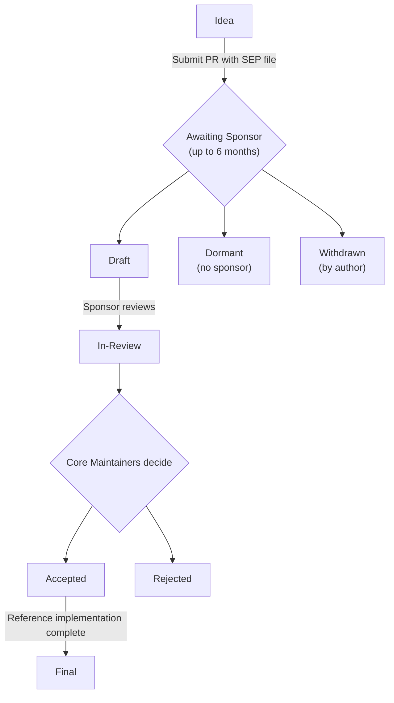

# MCP Documentation -- 10 Community

- Antitrust Policy
- Group Charter Template
- Contributor Communication
- Contributing to MCP
- Contributor Ladder
- File Uploads Charter
- Governance and Stewardship
- Inspector V2 Working Group Charter
- Interceptors Charter
- SDK Tiering System
- SDK Working Group Charter
- SEP Guidelines
- Server Card Charter
- Skills Over MCP Charter
- Triggers and Events Charter
- Working and Interest Groups

---

# Antitrust Policy
Source: https://modelcontextprotocol.io/community/antitrust

MCP Project Antitrust Policy for participants and contributors

**Effective: September 29, 2025**

  This policy applies when participating in MCP meetings, Working Groups,
  Interest Groups, and other collaborative forums where competitors may be
  present. Most individual contributors working on code or documentation don't
  need to worry about this in day-to-day work - it's primarily relevant for
  group discussions about standards and specifications.

## Introduction

The goal of the Model Context Protocol open source project (the "Project") is to develop a universal standard for model-to-world interactions, including enabling LLMs and agents to seamlessly connect with and utilize external data sources and tools. The purpose of this Antitrust Policy (the "Policy") is to avoid antitrust risks in carrying out this pro-competitive mission.

Participants in and contributors to the Project (collectively, "participants") will use their best reasonable efforts to comply in all respects with all applicable state and federal antitrust and trade regulation laws, and applicable antitrust/competition laws of other countries (collectively, the "Antitrust Laws").

The goal of Antitrust Laws is to encourage vigorous competition. Nothing in this Policy prohibits or limits the ability of participants to make, sell or use any product, or otherwise to compete in the marketplace. This Policy provides general guidance on compliance with Antitrust Law. Participants should contact their respective legal counsel to address specific questions.

This Policy is conservative and is intended to promote compliance with the Antitrust Laws, not to create duties or obligations beyond what the Antitrust Laws actually require. In the event of any inconsistency between this Policy and the Antitrust Laws, the Antitrust Laws preempt and control.

## Participation

Technical participation in the Project shall be open to all, subject only to compliance with the provisions of the Project's charter and other governance documents.

## Conduct of Meetings

At meetings among actual or potential competitors, there is a risk that participants in those meetings may improperly disclose or discuss information in violation of the Antitrust Laws or otherwise act in an anti-competitive manner. To avoid this risk, participants must adhere to the following policies when participating in Project-related or sponsored meetings, conference calls, or other forums (collectively, "Project Meetings").

Participants must not, in fact or appearance, discuss or exchange information regarding:

* An individual company's current or projected prices, price changes, price differentials, markups, discounts, allowances, terms and conditions of sale, including credit terms, etc., or data that bear on prices, including profits, margins or cost.
* Industry-wide pricing policies, price levels, price changes, differentials, or the like.
* Actual or projected changes in industry production, capacity or inventories.
* Matters relating to bids or intentions to bid for particular products, procedures for responding to bid invitations or specific contractual arrangements.
* Plans of individual companies concerning the design, characteristics, production, distribution, marketing or introduction dates of particular products, including proposed territories or customers.
* Matters relating to actual or potential individual suppliers that might have the effect of excluding them from any market or of influencing the business conduct of firms toward such suppliers.
* Matters relating to actual or potential customers that might have the effect of influencing the business conduct of firms toward such customers.
* Individual company current or projected cost of procurement, development or manufacture of any product.
* Individual company market shares for any product or for all products.
* Confidential or otherwise sensitive business plans or strategy.

In connection with all Project Meetings, participants must do the following:

* Adhere to prepared agendas.
* Insist that meeting minutes be prepared and distributed to all participants, and that meeting minutes accurately reflect the matters that transpired.
* Consult with their respective counsel on all antitrust questions related to Project Meetings.
* Protest against any discussions that appear to violate these policies or the Antitrust Laws, leave any meeting in which such discussions continue, and either insist that such protest be noted in the minutes.

## Requirements/Standard Setting

The Project may establish standards, technical requirements and/or specifications for use (collectively, "requirements"). Participants shall not enter into agreements that prohibit or restrict any participant from establishing or adopting any other requirements. Participants shall not undertake any efforts, directly or indirectly, to prevent any firm from manufacturing, selling, or supplying any product not conforming to a requirement.

The Project shall not promote standardization of commercial terms, such as terms for license and sale.

## Contact Information

To contact the Project regarding matters addressed by this Antitrust Policy, please send an email to [antitrust@modelcontextprotocol.io](mailto:antitrust@modelcontextprotocol.io), and reference "Antitrust Policy" in the subject line.

# Group Charter Template
Source: https://modelcontextprotocol.io/community/charter-template

Template for MCP Working Group and Interest Group charters.

Every MCP Working Group and Interest Group must maintain a charter document following this structure. Charters are stored at `docs/community/<group-name>/charter.mdx` in the [modelcontextprotocol repository](https://github.com/modelcontextprotocol/modelcontextprotocol) and added to `docs/docs.json`.

The charter captures information specific to your group. Governance rules — leadership requirements, decision-making process, meeting requirements, escalation paths — are defined in the [Working and Interest Groups](/community/working-interest-groups) documentation and apply automatically. Do not repeat them here.

Sections marked **(WG only)** are required for Working Groups and optional for Interest Groups.

  Copy the markdown below into `docs/community/<group-name>/charter.mdx` and replace the placeholder text.

***

```markdown 
---
title:  Charter
description: Charter for the MCP  <Working Group | Interest Group>.
---

## Group Type

<!-- State whether this is a Working Group or an Interest Group. -->

**Working Group** | **Interest Group**

## Mission Statement

<!--
A 2-3 sentence summary of the group's purpose.
- The problem space being addressed
- Why cross-cutting collaboration is needed
- For WGs: what concrete deliverables the group will produce
- For IGs: what discussions and knowledge-sharing the group will facilitate
-->

## Scope

### In Scope

<!--
For WGs:
- Specification Work: Specific spec sections or SEPs owned
- Reference Implementations: SDK components or reference implementations
- Cross-Cutting Concerns: Areas requiring coordination with other groups
- Documentation: Documentation responsibilities

For IGs:
- Topic areas for discussion
- Types of output (problem statements, use cases, recommendations)
-->

### Out of Scope

<!-- Explicit statements of what is NOT within the group's purview to prevent mission creep. -->

### Related Groups

<!-- List of other WGs or IGs with intersecting work and the nature of overlap. -->

## Leadership

<!--
Leadership requirements and responsibilities are defined in the governance rules.
List current Leads (WG) or Facilitators (IG).
-->

| Role | Name | Organization | GitHub | Term |
| ---- | ---- | ------------ | ------ | ---- |
|      |      |              |        |      |

## Authority & Decision Rights (WG only)

<!--
The decision-making process (lazy consensus → vote → escalation) is defined in
the governance rules. This table documents which decisions this WG can make at
which authority level.

IGs do not make binding decisions and do not need this section.
-->

| Decision Type                       | Authority Level                                        |
| ----------------------------------- | ------------------------------------------------------ |
| Meeting logistics & scheduling      | WG Leads (autonomous)                                  |
| Proposal prioritization within WG   | WG Leads (autonomous)                                  |
| SEP triage & closure (in scope)     | WG Leads (autonomous, with documented rationale)       |
| Technical design within scope       | WG consensus                                           |
| Spec changes (additive)             | WG consensus → Core Maintainer approval                |
| Spec changes (breaking/fundamental) | WG consensus → Core Maintainer approval + wider review |
| Scope expansion                     | Core Maintainer approval required                      |
| WG Member approval                  | WG Member sponsors                                     |

## Membership

<!--
List current group members and their participation levels, if any.
Leave out if no members exist yet. Participation tiers and membership
criteria are defined in the governance rules.
-->

| Name | Organization | GitHub | Discord | Level |
| ---- | ------------ | ------ | ------- | ----- |
|      |              |        |         |       |

## Operations

<!--
Document the group's current meeting approach. Meeting requirements (open,
published 7 days ahead, agendas/notes to GitHub Discussions) and communication
channels are defined in the governance rules.
-->

| Meeting         | Frequency | Duration | Purpose                               |
| --------------- | --------- | -------- | ------------------------------------- |
| Working Session |           |          | Technical discussion, proposal review |
| Office Hours    |           |          | Open Q&A for newcomers and observers  |

## Deliverables & Success Metrics (WG only)

<!--
Track active work items with status and ownership.
IGs may optionally list current discussion topics or planned outputs here.
-->

### Active Work Items

| Item          | Status                    | Target Date | Champion |
| ------------- | ------------------------- | ----------- | -------- |
| SEP-XXX: Name | Draft / Review / Approved |             |          |

### Success Criteria

<!-- Measurable outcomes for WG success. -->

## Changelog

| Date | Change |
| ---- | ------ |
|      |        |
```

***

## Example Mission Statements

**Working Group:**

> The Transport Working Group exists to evolve MCP's transport mechanisms to support diverse deployment scenarios—from local subprocess communication to horizontally-scaled cloud deployments—while maintaining protocol coherence and backward compatibility.

**Interest Group:**

> The Enterprise IG explores the challenges of deploying MCP in enterprise environments, gathering use cases and requirements to inform future specification work.

# Contributor Communication
Source: https://modelcontextprotocol.io/community/communication

Communication strategy and framework for the Model Context Protocol community

This document explains how to communicate and collaborate within the Model Context Protocol (MCP) project.

## Communication Channels

| Channel                                                                                                     | Purpose               | When to Use                                      |
| ----------------------------------------------------------------------------------------------------------- | --------------------- | ------------------------------------------------ |
| [Discord](https://discord.gg/6CSzBmMkjX)                                                                    | Real-time discussion  | Quick questions, coordination, WG/IG discussions |
| [Live calls](https://meet.modelcontextprotocol.io/)                                                         | Sync up               | WG/IG presentations, progress reports            |
| [GitHub Discussions](https://github.com/modelcontextprotocol/modelcontextprotocol/discussions)              | Structured discussion | Proposals, roadmap planning, longer-form debate  |
| [GitHub Issues](https://github.com/modelcontextprotocol/modelcontextprotocol/issues)                        | Actionable tasks      | Bug reports, documentation fixes                 |
| [Vulnerability reports](https://github.com/modelcontextprotocol/modelcontextprotocol/blob/main/SECURITY.md) | Security issues       | Vulnerabilities - **never post publicly**        |

All communication is governed by our [Code of Conduct](https://github.com/modelcontextprotocol/modelcontextprotocol/blob/main/CODE_OF_CONDUCT.md). We expect respectful, professional, and inclusive interactions across all channels.

## Discord

The [MCP Contributor Discord](https://discord.gg/6CSzBmMkjX) is for real-time contributor discussion and collaboration. The server is designed for **MCP contributors** and is not intended for general MCP support.

### Public Channels (Default)

**Purpose:** Open community engagement, collaborative development, and transparent project coordination.

**Primary use cases:**

* SDK and tooling development (e.g., `#typescript-sdk-dev`, `#inspector-dev`)
* [Working Group and Interest Group](/community/working-interest-groups) discussions (e.g., `#auth-wg`, `#security-ig`)
* Community onboarding and contribution guidance
* Community feedback and collaborative brainstorming
* Public office hours and maintainer availability

**Avoid:**

* MCP user support - Read official documentation and use GitHub Discussions for questions
* Service or product marketing - Keep discussions vendor-neutral; mentions of brands are discouraged except as examples relevant to the specification

### Private Channels (Exceptions)

**Purpose:** Confidential coordination and sensitive matters. Access is restricted to designated maintainers.

**Criteria for private use:**

* Security incidents (CVEs, protocol vulnerabilities)
* People matters (maintainer discussions, code of conduct issues)
* Coordination requiring immediate or focused response with a limited audience
* Some channels are read-only for maintainer decision-making

**Transparency requirements:**

* All technical and governance decisions affecting the community must be documented in GitHub Discussions and/or Issues, labeled with `notes`
* Private channels are temporary "incident rooms," not for routine development
* Some matters related to individual contributors may remain private when appropriate

Any significant discussion on Discord that leads to a potential decision or proposal must be moved to GitHub Discussion or Issue for a persistent, searchable record.

## GitHub Discussions

Use for structured, long-form discussion and debate on project direction.

**When to use:**

* Project roadmap planning and milestone discussions
* Announcements and release communications
* Community polls and consensus-building
* Feature requests with context and rationale
* If a repository doesn't have Discussions enabled, use GitHub Issues instead

## GitHub Issues

Use for bug reports and actionable development tasks. Feature requests should go to [GitHub Discussions](https://github.com/modelcontextprotocol/modelcontextprotocol/discussions).

**When to use:**

* Bug reports with reproducible steps
* Documentation improvements with specific scope
* CI/CD problems and infrastructure issues
* Release tasks and milestone tracking

**Note:** SEP proposals are submitted as pull requests to the [`seps/` directory](https://github.com/modelcontextprotocol/modelcontextprotocol/tree/main/seps), not as GitHub Issues. See the [SEP Guidelines](/community/sep-guidelines).

## Security Issues

**Do not post security issues publicly.**

1. Use the private security reporting process in [SECURITY.md](https://github.com/modelcontextprotocol/modelcontextprotocol/blob/main/SECURITY.md)
2. Contact Lead or [Core Maintainers](/community/governance#current-core-maintainers) directly
3. Follow responsible disclosure guidelines

## Decision Records

All MCP decisions are documented in public channels:

| Type                  | Location                                                                                      |
| --------------------- | --------------------------------------------------------------------------------------------- |
| Technical decisions   | [GitHub Issues](https://github.com/modelcontextprotocol/modelcontextprotocol/issues) and SEPs |
| Specification changes | [Changelog](https://modelcontextprotocol.io/specification/draft/changelog)                    |
| Process changes       | [Community documentation](https://modelcontextprotocol.io/community/governance)               |
| Governance decisions  | [GitHub Issues](https://github.com/modelcontextprotocol/modelcontextprotocol/issues) and SEPs |

When documenting decisions, we retain as much context as possible:

* Decision makers
* Background context and motivation
* Options considered
* Rationale for chosen approach
* Implementation steps

# Contributing to MCP
Source: https://modelcontextprotocol.io/community/contributing

How to contribute to the Model Context Protocol project

The Model Context Protocol (MCP) is an open source project that welcomes contributions from the
community. This guide walks you through everything you need to get started.

## Before You Begin

### Prerequisites

Before contributing, ensure you have the following installed and ready:

* **[Git](https://git-scm.com/downloads)** - For cloning repositories and submitting changes
* **[Node.js 24+](https://nodejs.org/)** - Required for building and testing our projects
* **npm** - Comes with Node.js, used for dependency management
* **[GitHub account](https://github.com/signup)** - For submitting pull requests and issues
* **Language-specific tooling** - If contributing to an SDK, you'll need the appropriate
  development environment for that language (e.g., Python, Rust, Go)

Verify your setup:

```bash 
node --version  # Should be 24.x or higher
npm --version   # Should be 11.x or higher
git --version   # Any recent version
```

  These commands work the same on macOS, Linux, and Windows, so you're good to
  go on any platform.

### Repository Structure

MCP spans multiple repositories in the
[`modelcontextprotocol`](https://github.com/modelcontextprotocol) organization on GitHub. Here are
a few notable sub-projects worth checking out:

| Repository                                                                                                  | Contents                  |
| ----------------------------------------------------------------------------------------------------------- | ------------------------- |
| [`modelcontextprotocol/modelcontextprotocol`](https://github.com/modelcontextprotocol/modelcontextprotocol) | Specification, docs, SEPs |
| [`modelcontextprotocol/typescript-sdk`](https://github.com/modelcontextprotocol/typescript-sdk)             | TypeScript/JavaScript SDK |
| [`modelcontextprotocol/python-sdk`](https://github.com/modelcontextprotocol/python-sdk)                     | Python SDK                |
| [`modelcontextprotocol/go-sdk`](https://github.com/modelcontextprotocol/go-sdk)                             | Go SDK                    |
| [`modelcontextprotocol/java-sdk`](https://github.com/modelcontextprotocol/java-sdk)                         | Java SDK                  |
| [`modelcontextprotocol/kotlin-sdk`](https://github.com/modelcontextprotocol/kotlin-sdk)                     | Kotlin SDK                |
| [`modelcontextprotocol/csharp-sdk`](https://github.com/modelcontextprotocol/csharp-sdk)                     | C# SDK                    |
| [`modelcontextprotocol/swift-sdk`](https://github.com/modelcontextprotocol/swift-sdk)                       | Swift SDK                 |
| [`modelcontextprotocol/rust-sdk`](https://github.com/modelcontextprotocol/rust-sdk)                         | Rust SDK                  |
| [`modelcontextprotocol/ruby-sdk`](https://github.com/modelcontextprotocol/ruby-sdk)                         | Ruby SDK                  |
| [`modelcontextprotocol/php-sdk`](https://github.com/modelcontextprotocol/php-sdk)                           | PHP SDK                   |

Throughout this guide, **specification repository** refers to
`modelcontextprotocol/modelcontextprotocol`, which contains the protocol spec, this documentation
site, and [Spec Enhancement Proposals (SEPs)](/community/sep-guidelines).

### Project Roles

MCP follows a [governance model](/community/governance) with different levels of responsibility:

* **Contributors** - Anyone who files issues, submits PRs, or participates in discussions (that's
  you!)
* **Maintainers** - Steward specific areas like SDKs, documentation, or
  [Working Groups](/community/working-interest-groups)
* **Core Maintainers** - Guide overall project direction, review SEPs, and oversee the specification

You can find the current list of maintainers in the
[`MAINTAINERS.md`](https://github.com/modelcontextprotocol/modelcontextprotocol/blob/main/MAINTAINERS.md)
file.

Maintainers are here to help you succeed! Don't hesitate to reach out if you have questions or
need guidance on your contribution.

## Your First Contribution

Start here if you are new to MCP and contributing to its ecosystem.

  While we use the specification repository as an example, the key patterns are
  applicable to other MCP repos as well.

### Step 1: Set Up Your Environment

Set up your local environment so you can test and validate changes before submitting them.

  
    Click the **Fork** button on the [repository page](https://github.com/modelcontextprotocol/modelcontextprotocol) to create your own copy. This gives you a personal workspace where you can make changes without affecting the main project.
  

  
    ```bash 
    git clone https://github.com/YOUR-USERNAME/modelcontextprotocol.git
    cd modelcontextprotocol
    ```

    Replace `YOUR-USERNAME` with your GitHub username.
  

  
    ```bash 
    npm install
    ```

    This installs the tools needed for schema generation, documentation building, and validation.
  

  
    ```bash 
    npm run check
    ```

    This runs TypeScript compilation, schema validation, example validation, documentation link checks, and formatting checks. If everything passes, your environment is good and you're ready to contribute.
  

If `npm run check` fails, see [Troubleshooting](#troubleshooting) below.

### Step 2: Find Something to Work On

While a lot of the items you might see tracked in the repository can feel intimidating, especially
for newcomers, there are plenty of places where you can start with your first improvements:

1. **Documentation improvements** - Help us fix typos, unclear explanations, broken links, or
   incomplete examples
2. **Issues labeled `good first issue`** - Tackle issues tagged in the
   [specification repo](https://github.com/modelcontextprotocol/modelcontextprotocol/issues?q=is%3Aissue+is%3Aopen+label%3A%22good+first+issue%22)
   as well as our SDK repos
3. **Schema examples** - Add examples to `schema/draft/examples/` to make it easier for developers
   to understand protocol primitives

### Step 3: Make Your Change

Create your changes in a dedicated branch.

  
    ```bash 
    git checkout -b fix/your-description
    ```

    Use a descriptive branch name that reflects your change, like `fix/typo-in-tools-doc` or `feat/add-example-for-resources`.
  

  
    Edit the relevant files in your local copy. If you're editing schema files, remember to run `npm run generate:schema` to regenerate the JSON schema and documentation.
  

  
    ```bash 
    npm run check
    ```

    Fix any issues before committing. If you have formatting errors, `npm run format` can auto-fix most of them.
  

  
    ```bash 
    git commit -m "Fix typo in tools documentation"
    ```

    Write a concise message that describes what you changed and why. Reference issue numbers if applicable (e.g., `Fix typo in tools documentation (#123)`).
  

### Step 4: Submit a Pull Request

When you're ready, push your branch and open a pull request.

  
    ```bash 
    git push origin fix/your-description
    ```
  

  
    You can use the [GitHub CLI](https://cli.github.com/) to make this process easier:

    ```bash 
    gh pr create --fill
    ```

    Alternatively, navigate to your fork on GitHub and click **Compare & pull request**.
  

  
    Provide a clear description of your changes and link any related issues.
  

  
    Maintainers typically respond within 1-5 business days.
  

  That's it, **congratulations on your first contribution**! Every improvement,
  no matter how small, helps make MCP better for everyone.

### What Makes a Good Contribution

Help us review your contribution quickly by following these patterns:

| Harder to Review                             | Thoughtful and Impactful                         |
| -------------------------------------------- | ------------------------------------------------ |
| Large PR with unrelated changes              | Focused PR addressing one issue                  |
| Reformatting code without functional changes | Fixing a bug with a clear explanation            |
| Vague commit messages ("fixed stuff")        | Descriptive commits linking to issues            |
| Submitting with failing CI checks            | All CI tests pass before requesting review       |
| Duplicating existing documentation           | Documenting an undocumented feature or edge case |

## Types of Contributions

Different contributions follow different processes depending on their scope.

  Not sure which category your change falls into? Ask in the [MCP Contributor
  Discord](/community/communication#discord) before starting any significant
  work.

### Small Changes (Direct PR)

Simply submit a pull request directly to the repo for:

* Bug fixes and typo corrections
* Documentation improvements, such as bringing clarity to an ambiguous or unclear section
* Adding examples to existing features
* Minor schema fixes that don't materially change the specification or SDK behavior
* Test improvements

### Major Changes (SEP Required)

Anything that changes the MCP specification requires following the
[Specification Enhancement Proposal (SEP)](/community/sep-guidelines) process. This includes, but
is not limited to:

* New protocol features or API methods
* Breaking changes to existing behavior
* Changes to the message format or schema structure
* New interoperability standards
* Governance or process changes

Here are a few concrete examples of what would require following the SEP steps:

* Adding a new RPC method like `tools/execute`
* Changing how authentication and authorization works
* Adding a new capability negotiation field
* Modifying the transport layer specification

## Working with the Specification Repository

Once you've determined [what type of contribution](#types-of-contributions) you're making, here's
how to work with the specification repository.

### Schema Changes

The TypeScript schema (`schema/draft/schema.ts`) is the **source of truth** for the protocol. It
defines every message type, request/response structure, and primitive (tools, resources, prompts)
that clients and servers exchange. SDK implementers across all languages rely on this schema to
build conformant implementations.

When you run `npm run generate:schema`, it generates:

* The JSON schema (`schema/draft/schema.json`) for validation
* The Schema Reference documentation (`docs/specification/draft/schema.mdx`)

To modify the schema:

  
    Make your changes in `schema/draft/schema.ts`.
  

  
    Add JSON examples in `schema/draft/examples/[TypeName]/` (e.g., `Tool/my-example.json`). Reference them in the schema using `@example` + `@includeCode` JSDoc tags.
  

  
    ```bash 
    npm run generate:schema
    ```
  

  
    ```bash 
    npm run check
    ```
  

### Documentation Changes

Docs are written in [MDX format](https://mdxjs.com/) (Markdown with JSX components) and powered by
[Mintlify](https://mintlify.com/). The `docs/` directory contains:

* `docs/docs/` - Guides and tutorials for getting started and building with MCP
* `docs/specification/` - Formal protocol specification (versioned by date)

Here is how you can contribute to our documentation:

  
    ```bash 
    npm run serve:docs
    ```

    This launches a live preview at `http://localhost:3000` with hot reloading.
  

  
    Edit the relevant `.mdx` files. You can use [Mintlify components](https://www.mintlify.com/docs/components) like ``, ``, ``, and `` for richer formatting.
  

  
    ```bash 
    npm run check:docs
    ```

    This validates formatting, broken links, and other common issues.
  

### Major Protocol Changes

For significant changes, follow the [SEP process](/community/sep-guidelines). Prior to spending a
lot of time on a spec proposal, make sure to follow these best practices.

  
    Discuss in an [Interest Group](/community/working-interest-groups) or on
    [Discord](https://discord.gg/6CSzBmMkjX).
  

  
    Demonstrate practical application of your idea.
  

  
    A maintainer from the [maintainer
    list](https://github.com/modelcontextprotocol/modelcontextprotocol/blob/main/MAINTAINERS.md)
    who will champion your proposal.
  

  
    Follow the [SEP Guidelines](/community/sep-guidelines).
  

## Working with the SDK Repositories

MCP maintains official SDKs in multiple languages. Contributions are welcome - whether you're
fixing bugs, improving performance, adding features, or enhancing documentation.

  Each SDK has its own repository, maintainers, and contribution guidelines.
  Some SDKs are maintained in collaboration with larger partner organizations,
  such as Google, Microsoft, JetBrains, and others, so processes may vary
  slightly between repositories.

### Before Contributing to an SDK

Before diving into code, follow these steps.

  
    Before starting significant work, open an issue to discuss your approach.
    This helps avoid duplicate effort, ensures your contribution aligns with the
    SDK's direction, and gives maintainers a chance to provide early feedback.
  

  
    Find the relevant channel in [Discord](https://discord.gg/6CSzBmMkjX) (e.g.,
    `#typescript-sdk-dev`, `#python-sdk-dev`).
  

  
    Each repository has its own `CONTRIBUTING.md` with specific instructions for
    setting up your development environment, coding standards, commit message
    conventions, and PR requirements.
  

  
    All contributions should include appropriate test coverage. Bug fixes should
    include a test that reproduces the issue, and new features should have tests
    covering the expected behavior. This helps maintain SDK reliability and
    prevents regressions.
  

### SDK Repositories

  

  

  

  

  

  

  

  

  

  

## Getting Help

### Communication Channels

Got questions or need guidance? The MCP community is here to help.

* **[Discord](/community/communication#discord)** - Real-time discussion with contributors and
  maintainers, focused on MCP contributions (not general MCP support)
* **[GitHub Discussions](https://github.com/modelcontextprotocol/modelcontextprotocol/discussions)**
  \- Exploration and conversation: **feature requests**, questions, roadmap planning, and proposals
  that need input before becoming concrete tasks
* **[GitHub Issues](https://github.com/modelcontextprotocol/modelcontextprotocol/issues)** -
  Actionable work: bug reports with reproducible steps, documentation fixes, and tasks that are
  well-defined and ready to implement (not feature requests)

This separation helps maintainers focus on work that's ready for implementation while giving ideas
room to develop. If you're unsure whether something is ready to be an issue, start with a
discussion. For a complete guide, see our [Contributor Communication](/community/communication)
documentation.

For protocol discussions, join [Working Group](/community/working-interest-groups) channels like
`#auth-wg` or `#server-identity-wg`. For SDK help, find your language's channel (e.g.,
`#typescript-sdk-dev`).

### Finding a Sponsor for SEPs

A **sponsor** is a Core Maintainer or Maintainer who champions your SEP through the review
process. They provide feedback, help refine your proposal, and present it at Core Maintainer
meetings.

  Every SEP needs a sponsor to move forward. SEPs that don't find a sponsor
  within 6 months are marked as **dormant**. Dormant SEPs aren't rejected
  outright - they can be revived later if a sponsor is found or the proposal is
  re-assessed to be needed.

To find a sponsor:

  
    Look at the [maintainer
    list](https://github.com/modelcontextprotocol/modelcontextprotocol/blob/main/MAINTAINERS.md)
    to find maintainers working in your area.
  

  
    Tag 1-2 relevant maintainers (don't spam everyone).
  

  
    Post your PR in the relevant Discord channel to increase visibility.
  

  
    If no response after 2 weeks, ask in `#general` or reach out to a Core
    Maintainer.
  

Maintainers review open proposals regularly, but response time varies based on complexity and
availability.

## Troubleshooting

Sometimes things don't go as planned - that's completely normal! Here are solutions to common
issues. If you're still stuck, don't hesitate to ask for help in
[Discord](/community/communication#discord). The community is friendly and happy to help you get
unstuck.

### `npm run check` fails

Common causes:

* **Wrong Node.js version** - Ensure you have Node.js 24+
* **Missing dependencies** - Run `npm install` again
* **Schema out of sync** - Run `npm run generate:schema`
* **Formatting issues** - Run `npm run format` to auto-fix

### My PR has been sitting unnoticed for weeks

1. Ensure all CI checks pass
2. Politely ping the desired reviewer in a comment
3. Ask in the relevant Discord channel
4. For urgent issues, reach out to a Core Maintainer

### I can't find a sponsor for my SEP

1. Make sure your idea has been discussed in Discord or an Interest Group first
2. Proposals with demonstrated community interest are more likely to find sponsors
3. Consider whether your change might be too large - could it be split into smaller SEPs?

### My SEP was rejected

Don't take it personally - a SEP rejection doesn't mean your idea was bad. SEPs can be rejected
for many reasons: timing, scope, competing priorities, or simply because the protocol isn't ready
for that change yet. The feedback you receive is valuable and often points toward a path forward.

Rejection is not permanent. You have a few options ahead:

1. **Address the feedback and resubmit** - Often, rejection comes with specific concerns.
   Addressing those concerns and resubmitting can be the right path forward.
2. **Discuss in Discord** - Talk with maintainers to better understand the concerns. Sometimes a
   brief conversation reveals a simpler path forward.
3. **Try a different approach** - Submit a new SEP that addresses the same problem differently,
   incorporating what you learned.
4. **Wait for the right moment** - Circumstances change. New use cases emerge, the community
   grows, and priorities shift. An idea rejected today might be welcomed tomorrow.

## Out of Scope

This guide covers contributions to the **core MCP project** - the specification, official SDKs,
and documentation.

Building your own MCP servers, clients, or tools is **not** covered here. For guidance on building
with MCP, see our documentation:

* [Build a Server](/docs/develop/build-server)
* [Build a Client](/docs/develop/build-client)
* [Example Servers](/examples)

If you build something you'd like to share with the community, you can submit it to the
[MCP Registry](/registry/about).

## AI Contributions

We welcome the use of AI tools like Claude or ChatGPT to help with your contributions! If you do
use AI assistance, just let us know in your pull request or issue - a quick note about how you
used it (drafting docs, generating code, brainstorming, etc.) is all we need.

The key is that you understand and can stand behind your contribution:

* **You get it** - You understand what the changes do and can explain them
* **You know why** - You can articulate why the change is needed
* **You've verified it** - You've tested or validated that it works as intended

You can read more about our stance in
[our spec contribution guidelines](https://github.com/modelcontextprotocol/modelcontextprotocol/blob/main/CONTRIBUTING.md#ai-contributions).

## Code of Conduct

All contributors must follow the
[Code of Conduct](https://github.com/modelcontextprotocol/modelcontextprotocol/blob/main/CODE_OF_CONDUCT.md).
We expect respectful, professional, and inclusive interactions across all channels.

## License

By contributing, you agree that your contributions will be licensed under:

* **Code and specifications**: Apache License 2.0
* **Documentation** (excluding specifications): CC-BY 4.0

See the
[LICENSE](https://github.com/modelcontextprotocol/modelcontextprotocol/blob/main/LICENSE) file for
details.

# Contributor Ladder
Source: https://modelcontextprotocol.io/community/contributor-ladder

Roles, responsibilities, and advancement criteria for MCP contributors, from first contribution to Core Maintainer

The Model Context Protocol contributor ladder defines roles, responsibilities, and advancement criteria for the project. It shows community members how to grow their involvement from a first contribution to project leadership.

This document implements [SEP-2148](/seps/2148-contributor-ladder). For Working Group and Interest Group governance, see [SEP-2149](/seps/2149-working-group-charter-template).

## Guiding Principles

* **Earned Trust.** Advancement follows from demonstrated contributions, good judgment, and sustained engagement. Tenure alone is not enough.
* **Multiple Growth Pathways.** Code, specification work, documentation, and community building all lead to advancement.
* **Transparency.** Criteria for advancement are explicit and applied consistently.
* **Alignment With MCP Goals.** Contributors must show commitment to MCP beyond any single employer's interests.

## Roles at a Glance

| Role                                            | Summary                                       | Key Privileges                                                            | Minimum Timeline                                      |
| ----------------------------------------------- | --------------------------------------------- | ------------------------------------------------------------------------- | ----------------------------------------------------- |
| [**Contributor**](#contributor)                 | Anyone who contributes to MCP                 | Submit issues, PRs, participate in discussions                            | Immediate                                             |
| [**Member**](#member)                           | Established, active contributor               | GitHub org membership, triage rights, eligible for WG/IG leadership       | 2-3 months of meaningful contributions                |
| [**Maintainer**](#maintainer)                   | Area steward with operational responsibility  | Merge rights, release participation                                       | 6+ months as Member                                   |
| [**Core Maintainer**](#core-maintainer)         | Technical leadership and protocol stewardship | Final decision authority, governance participation                        | By invitation after sustained Maintainer contribution |
| [**Lead Maintainer**](#lead-maintainer)         | Ultimate project authority (founders)         | All Core Maintainer privileges, veto authority, appoints Core Maintainers | Reserved for project founders; succession only        |
| [**Community Moderator**](#community-moderator) | CoC enforcement and community health          | Moderation rights on community platforms, incident handling               | Parallel track: Member status + appointment           |

  Timelines are minimums, not guarantees. They protect the project from rapid
  privilege escalation and ensure a high bar of demonstrated commitment. Actual
  advancement is discretionary and may take longer. Exceptions require explicit
  Core Maintainer approval with documented rationale.

***

## Contributor

Anyone who has contributed to MCP in any form is a Contributor. This includes opening issues, submitting pull requests, participating in working group discussions, improving documentation, or helping other community members.

**There are no formal requirements.** We welcome all contributions that follow our contributing guidelines.

**Getting started:**

* Review the [Contributing Guide](/community/contributing)
* Join community channels (Discord, GitHub Discussions)
* Look for issues tagged `good-first-issue` or `help-wanted`
* Attend working group meetings

***

## Member

Members are established contributors with a record of ongoing commitment to MCP.

**Requirements:**

* Multiple contributions to MCP (code, documentation, and/or community)
* At least one merged PR or accepted contribution
* Ongoing engagement with the community, not just one-off contributions
* Two-factor authentication enabled on GitHub
* No objections from existing Members within 7 days

**Sponsorship:**

* Sponsored by two existing Members or Maintainers from different organizations, **or**
* Sponsored by one Core Maintainer or Lead Maintainer

**Minimum timeline:** 2-3 months of active participation

**Responsibilities:**

* Continue contributing in good faith
* Respond to assigned issues and PRs
* Follow community guidelines and the code of conduct
* Help onboard new contributors when possible

**Privileges:**

* GitHub organization membership with triage rights
* Can be assigned to issues and PRs
* Can use shortcut approval or review commands on PRs, such as `/lgtm`
* Listed in the community membership roster
* Can create PRs in restricted repositories
* Eligible for Working Group Lead or Interest Group Facilitator roles

**Inactivity:** Members with no contributions for 3 months may be moved to emeritus status. Re-engagement follows a simplified re-familiarization process.

***

## Maintainer

Maintainers are trusted stewards who take operational responsibility for specific areas.

**Requirements:**

* Member for at least 6 months with sustained, high-quality contributions
* Demonstrated leadership in working groups or significant initiatives
* Ability to represent MCP's interests above those of any single employer or organization
* Deep understanding of the MCP vision, roadmap, and design principles
* Understanding of how the area impacts real-world AI integration and model interaction patterns
* Completed security and governance onboarding

**Sponsorship and Approval:**

* Sponsored by an existing Maintainer or Core Maintainer
* Approved by Core Maintainers

**Responsibilities:**

* Own the operational health of the area (test stability, documentation currency)
* Run release processes and milestone planning for the scope
* Provide timely review of escalated decisions
* Participate actively in governance discussions
* Mentor Members and develop future Maintainers
* Represent MCP in external contexts when appropriate
* Engage with the area ecosystem and stakeholders; understand real-world usage and represent community needs
* Ensure proposals reaching Core Maintainers are refined, well-considered, and account for ecosystem-wide impact
* Participate actively in discussions on communication channels (GitHub issues, Discord)

**Privileges:**

* Merge privileges for owned areas
* Can sponsor new Maintainers
* Participate in roadmap and prioritization discussions
* Listed in `MAINTAINERS.md`

**Inactivity:** Maintainers with no contributions for 6 months may be moved to emeritus status following review by Core Maintainers. Merge rights are revoked upon emeritus transition. Re-engagement requires completing security and governance onboarding again.

All contribution pathways can lead to Maintainer. The specific scope will align with the contribution type.

***

## Core Maintainer

Core Maintainers hold final decision-making authority for MCP's technical direction. This is the highest level of trust in the community.

  The Core Maintainer role is intentionally limited. This ensures a coherent
  technical vision while the project scales. Bandwidth concerns are addressed
  through delegation to Maintainers, Working Group Leads, and Interest Group
  Facilitators, not by expanding Core Maintainer numbers.

**Requirements:**

* Sustained contribution as Maintainer or similar role over at least 6 months
* Demonstrated judgment on complex, project-wide decisions
* Trust and respect across organizational boundaries
* Deep commitment to MCP's long-term success

**Appointment:**

* Nominated by a majority of Core Maintainers and approved by Lead Maintainers, **or**
* Direct appointment by Lead Maintainers

When evaluating candidates, Core Maintainers should consider whether the current composition adequately represents the breadth of the MCP ecosystem. This includes enterprise adopters deploying MCP in production.

**Responsibilities:**

* Final technical decision authority for contested or cross-cutting issues
* Stewardship of project vision and design principles
* Governance and policy decisions
* External representation of MCP
* Succession planning and community health
* Ensure restraint and sustainability in protocol evolution
* Attend Core Maintainer meetings and meetups

**Privileges:**

* Final approval on breaking changes and major spec revisions
* Voting rights on [SEPs](/community/sep-guidelines)
* Approval of Maintainers
* Governance voting rights and expectation of governance participation
* Administrative rights to all MCP GitHub repositories
* Listed in `MAINTAINERS.md` as Core Maintainer

**Inactivity:** Core Maintainers with no participation in governance or technical decisions for 6 months may be moved to emeritus status following review by Lead Maintainers. Given the visibility of this role, Core Maintainers should proactively communicate reduced availability.

***

## Lead Maintainer

Lead Maintainers hold ultimate authority over MCP's direction and governance. This is a lifetime appointment reserved for project founders. There is no advancement path to this role. It is only assumed through succession (see [Succession](#succession)).

**Responsibilities:**

* All Core Maintainer responsibilities
* Appoint and remove Core Maintainers
* Final authority on contested governance decisions
* Project-wide strategic direction

**Privileges:**

* Can act alone where Core Maintainers require multiple approvals
* Veto authority over any decision
* Appoints successor

### Succession

If a Lead Maintainer leaves the role for any reason, succession begins upon their written notice. If they cannot give notice, the remaining Lead Maintainers or Core Maintainers may determine that the Lead Maintainer is unable to continue serving.

If one or more Lead Maintainers remain, they appoint a successor. If more than one remains, they decide by majority vote. The remaining Lead Maintainers continue to govern until a successor is appointed.

If no Lead Maintainers remain, the Core Maintainers appoint a successor by majority vote within 30 days. Until a new Lead Maintainer is appointed, the project operates by two-thirds vote of Core Maintainers.

***

## Community Moderator

Community Moderators help keep the MCP community healthy, safe, and welcoming. This role focuses on moderation and Code of Conduct enforcement rather than technical contribution.

**Requirements:**

* Member status minimum
* Demonstrated good judgment and composure in community interactions
* Understanding of the MCP Code of Conduct and community guidelines
* Ability to handle sensitive situations with discretion and fairness

**Sponsorship:**

* Sponsored by a Core Maintainer or Lead Maintainer

**Responsibilities:**

* Monitor community channels (Discord, GitHub Discussions, etc.) for Code of Conduct adherence
* Handle Code of Conduct incident reports, including initial triage and response
* Escalate serious or complex incidents to Core Maintainers
* Help maintain a welcoming and inclusive environment
* Coordinate with other moderators to ensure consistent enforcement
* Document moderation actions and maintain confidentiality of incident details
* Recuse from any incident involving them personally; such incidents go directly to Core Maintainers

**Privileges:**

* Moderation rights on community platforms (Discord, GitHub Discussions)
* Access to moderation tools and private moderation channels
* Authority to issue warnings, mute, or temporarily ban users for Code of Conduct violations
* Listed in the community moderator roster

**Relationship to Contributor Ladder:** Community Moderator is a parallel track, not a prerequisite for technical advancement. Moderator experience counts toward any role, especially where community judgment matters. Moderators may hold other roles at the same time (Member, Maintainer, etc.).

**Removal:** Core Maintainers may remove Community Moderators for failure to uphold moderation standards or for Code of Conduct violations. Moderators may step down voluntarily at any time.

***

## Working Group and Interest Group Leadership

Working Group (WG) Leads and Interest Group (IG) Facilitators are a form of community leadership that does not require Maintainer status. WG and IG leadership centers on facilitation and coordination rather than merge authority.

The full governance rules for WGs and IGs are defined in [SEP-2149: MCP Group Governance and Charter Template](/seps/2149-working-group-charter-template). These include participation tiers, decision-making process, meeting requirements, and lifecycle.

**Requirements:**

* Member status minimum
* Demonstrated sustained engagement with the group's scope
* Good facilitation and communication skills
* Ability to represent multiple perspectives fairly
* Group and its leadership sponsored by at least two Core Maintainers or one Lead Maintainer

**Relationship to Contributor Ladder:**

* WG Lead and IG Facilitator experience is valuable for advancement to Maintainer
* Leads and Facilitators without Maintainer status work with Maintainers for merge decisions
* Leads and Facilitators have authority over group operations but not spec approval
* WG Leads and Maintainers may sponsor SEPs
* WG Leads may triage SEPs in their scope area. This includes closing SEPs that do not fit the roadmap. Closures require documented rationale, and authors may appeal to Core Maintainers.

***

## Advancement Process

### Self-Nomination vs. Recognition

Contributors may either:

1. **Self-nominate** when they believe they meet the requirements
2. **Be nominated** by a sponsor who has observed their contributions

Both paths are equally valid. Self-nomination is encouraged. It shows initiative and self-awareness of one's contribution scope.

### Process Steps

1. **Nomination.** The nominee or sponsor opens an issue using the nomination template. It must include links to contributions that demonstrate the requirements, plus sponsor confirmations.
2. **Community Review.** A 7-day period follows for community input.
3. **Decision.** The approving authority reviews and decides.
4. **Onboarding.** The new role-holder receives appropriate access and onboarding.

| Advancement To      | Approved By                                                                     |
| ------------------- | ------------------------------------------------------------------------------- |
| Member              | 2 existing Members+ from different organizations, **or** 1 Core/Lead Maintainer |
| Maintainer          | 1 Maintainer or Core Maintainer sponsor + Core Maintainer approval              |
| Core Maintainer     | Lead Maintainers                                                                |
| Community Moderator | 1 Core Maintainer or Lead Maintainer                                            |

Nominees who self-nominate must still secure the required sponsorship. Sponsors confirm support in the nomination issue.

***

## Decision-Making and Escalation

### Delegation as Default

MCP operates on a principle of delegation. Decisions should be made at the lowest appropriate level. This lets the project move quickly while preserving Core Maintainer bandwidth for cross-cutting concerns.

* **Maintainers, WG Leads, and IG Facilitators** handle day-to-day decisions within scope.
* **Core Maintainers** intervene on escalation, cross-cutting issues, or when required by process (spec changes, Maintainer approval).
* **Lead Maintainers** intervene only on contested governance decisions or when Core Maintainers cannot reach consensus.

When in doubt, make the decision at your level and document it. Escalate only when blocked, when the decision has project-wide implications, or when process explicitly requires it.

The detailed escalation procedure for Working Group and Interest Group disputes is defined in [SEP-2149 §1.5](/seps/2149-working-group-charter-template). It includes the designation of a Core Maintainer without shared organizational affiliation to resolve the issue.

### Escalation Matrix

| Issue Type                                 | First Escalation    | Second Escalation | Timeline         |
| ------------------------------------------ | ------------------- | ----------------- | ---------------- |
| Technical disagreement in PR               | Maintainer in scope | Core Maintainer   | 5 business days  |
| Technical disagreement in WG               | WG Lead             | Core Maintainer   | 5 business days  |
| Technical disagreement in IG               | IG Facilitator      | Core Maintainer   | 5 business days  |
| Disagreement with WG Lead / IG Facilitator | Core Maintainer     | Lead Maintainer   | 7 business days  |
| Disagreement with Maintainer decision      | Core Maintainer     | Lead Maintainer   | 7 business days  |
| Core Maintainer disagreement               | Lead Maintainer     | N/A               | 10 business days |
| Code of Conduct violation                  | Community Moderator | Core Maintainer   | Immediate        |
| Security issue                             | Core Maintainer     | Lead Maintainer   | Immediate        |

**Escalation process:**

1. Document the decision, the options considered, and the points of disagreement
2. Present to the escalation authority with a clear ask
3. The escalation authority either (a) provides binding guidance, (b) requests more information, or (c) escalates further if needed

***

## Contribution Pathways

MCP values diverse contributions. All of these pathways can lead to advancement.

**Code Contributions.** SDK development (TypeScript, Python, etc.), testing infrastructure, tooling and developer experience.

**Specification Work.** Drafting or refining spec text, [SEP](/community/sep-guidelines) authorship or co-authorship, protocol design participation, compatibility analysis.

**Documentation.** User guides and tutorials, API documentation, architecture documentation, keeping content current.

**Community Building.** Onboarding new contributors, working group facilitation, community support (Discord, GitHub discussions), event organization or representation.

**Quality and Security.** Bug triage and reproduction, security review and analysis, test coverage improvement, release validation.

***

## Stepping Down and Emeritus Status

Contributors may step down from roles for any reason. This is normal and healthy.

**Process:**

1. Notify relevant leadership (WG Lead, IG Facilitator, Maintainer, or Core Maintainer as appropriate)
2. Help transition any ongoing work
3. Move to emeritus status

**Emeritus status:**

* Recognized for past contributions
* May return to active status with abbreviated re-onboarding
* No ongoing responsibilities or privileges

**Involuntary Removal.** Roles may be revoked for code of conduct violations or sustained non-participation. Removal follows appropriate review processes.

***

## Recognition and Visibility

The community recognizes contributors through:

* **Contributor lists** such as `MAINTAINERS.md`
* **GitHub teams** for appropriate access
* **Public acknowledgment** in release notes
* **Speaking opportunities** at community events
* **Badges** (if implemented) on community platforms

# File Uploads Charter
Source: https://modelcontextprotocol.io/community/file-uploads/charter

Charter for the MCP File Uploads Working Group.

## Group Type

**Working Group**

## Mission Statement

The File Uploads Working Group exists to define how MCP tools and elicitation requests declare file
inputs so that hosts can present native file pickers and pass user-selected file content to servers.
Today, servers that need a file from the user resort to prose instructions asking for base64 strings
or local paths, which produces inconsistent UX and pushes encoding details onto end users. This WG
will specify a minimal, schema-level mechanism for declaring file inputs and the wire format for
delivering them, anchored on [SEP-2356](https://github.com/modelcontextprotocol/modelcontextprotocol/pull/2356).

## Scope

### In Scope

* **Specification Work**: SEPs defining declarative file input descriptors on tool input schemas and
  elicitation request schemas, the wire encoding for file content, and host-side handling
  requirements.
* **Reference Implementations**: SDK types and helpers for `FileInputDescriptor`, data URI encoding,
  and a sample host flow demonstrating picker invocation and value substitution.
* **Cross-Cutting Concerns**: Coordination with the MCP Apps WG where embedded UI surfaces present
  their own file pickers, and with the Security WG on host-side validation requirements.
* **Documentation**: Specification sections covering file input declaration and a migration guide
  for servers currently using ad-hoc base64 instructions.

### Out of Scope

* Server-to-client file delivery, which is already covered by Resources and `BlobResourceContents`.
* Changes to the transport layer or session model.

The WG may evaluate approaches such as streaming, chunked transfer, or presigned upload URLs as part
of its design work; whether those land in the initial SEP or a follow-up is a WG decision rather
than a charter constraint.

### Related Groups

* **MCP Apps WG** — embedded app UIs may surface their own file pickers; the descriptor format
  should be reusable in that context.
* **Security WG** — host-side validation requirements for user-supplied file content (the SEP
  references [OWASP ASVS V5](https://owasp.org/www-project-application-security-verification-standard/)
  for general upload hygiene).
* **Tool Annotations IG** — file input descriptors are a form of input-parameter metadata and should
  remain consistent with the broader annotation taxonomy.

## Leadership

| Role | Name           | Organization | GitHub                                   | Term    |
| ---- | -------------- | ------------ | ---------------------------------------- | ------- |
| Lead | Den Delimarsky | Anthropic    | [@localden](https://github.com/localden) | Initial |

Sponsored by Den Delimarsky ([@localden](https://github.com/localden)) and Nick Cooper
([@nickcoai](https://github.com/nickcoai)).

## Authority & Decision Rights

| Decision Type                       | Authority Level                                        |
| ----------------------------------- | ------------------------------------------------------ |
| Meeting logistics & scheduling      | WG Leads (autonomous)                                  |
| Proposal prioritization within WG   | WG Leads (autonomous)                                  |
| SEP triage & closure (in scope)     | WG Leads (autonomous, with documented rationale)       |
| Technical design within scope       | WG consensus                                           |
| Spec changes (additive)             | WG consensus → Core Maintainer approval                |
| Spec changes (breaking/fundamental) | WG consensus → Core Maintainer approval + wider review |
| Scope expansion                     | Core Maintainer approval required                      |
| WG Member approval                  | WG Member sponsors                                     |

## Membership

| Name           | Organization | GitHub                                   | Discord | Level     |
| -------------- | ------------ | ---------------------------------------- | ------- | --------- |
| Den Delimarsky | Anthropic    | [@localden](https://github.com/localden) |         | Lead      |
| Nick Cooper    | OpenAI       | [@nickcoai](https://github.com/nickcoai) |         | WG Member |
| Olivier Chafik | Anthropic    | [@ochafik](https://github.com/ochafik)   |         | WG Member |

## Operations

| Meeting         | Frequency | Duration | Purpose                               |
| --------------- | --------- | -------- | ------------------------------------- |
| Working Session | Biweekly  | 30 min   | Technical discussion, proposal review |

Discord: `#file-uploads-wg`

## Deliverables & Success Metrics

### Active Work Items

| Item                                                                                                        | Status | Target Date | Champion                               |
| ----------------------------------------------------------------------------------------------------------- | ------ | ----------- | -------------------------------------- |
| [SEP-2356: Declarative file inputs](https://github.com/modelcontextprotocol/modelcontextprotocol/pull/2356) | Draft  | End May     | [@ochafik](https://github.com/ochafik) |
| TypeScript SDK reference implementation                                                                     | —      | End May     | [@ochafik](https://github.com/ochafik) |
| Reference implementation in a second Tier-1 SDK                                                             | —      | End June    | TBD                                    |

### Success Criteria

* An accepted SEP defining the file input descriptor and wire encoding.
* Reference implementations in at least two Tier-1 SDKs.
* At least one production host rendering a native file picker from the descriptor.
* Conformance test coverage for the new schema keyword.

## Changelog

| Date       | Change          |
| ---------- | --------------- |
| 2026-04-23 | Initial charter |

# Governance and Stewardship
Source: https://modelcontextprotocol.io/community/governance

Learn about the Model Context Protocol's governance structure and how to participate in the community

The Model Context Protocol (MCP) follows a formal governance model to ensure transparent decision-making and community participation. This document outlines how the project is organized and how decisions are made.

## General Project Policies

Model Context Protocol has been established as **Model Context Protocol a Series of LF Projects, LLC**. Policies applicable to Model Context Protocol and participants in Model Context Protocol, including guidelines on the usage of trademarks, are located at [https://www.lfprojects.org/policies/](https://www.lfprojects.org/policies/). Governance changes approved as per the provisions of this governance document must also be approved by LF Projects, LLC.

Model Context Protocol participants acknowledge that the copyright in all new contributions will be retained by the copyright holder as independent works of authorship and that no contributor or copyright holder will be required to assign copyrights to the project.

Except as described below, all code and specification contributions to the project must be made using the Apache License, Version 2.0 (available here: [https://www.apache.org/licenses/LICENSE-2.0](https://www.apache.org/licenses/LICENSE-2.0)) (the "Project License").

All outbound code and specifications will be made available under the Project License. The Core Maintainers may approve the use of an alternative open license or licenses for inbound or outbound contributions on an exception basis.

All documentation (excluding specifications) will be made available under Creative Commons Attribution 4.0 International license, available at: [https://creativecommons.org/licenses/by/4.0](https://creativecommons.org/licenses/by/4.0).

## Technical Governance

The MCP project adopts a hierarchical structure, similar to Python, PyTorch, and other open source projects:

| Role                        | Scope                            |
| --------------------------- | -------------------------------- |
| **Lead Maintainers (BDFL)** | Final decision authority         |
| **Core Maintainers**        | Overall project direction        |
| **Maintainers**             | Working Groups, SDKs, components |
| **Contributors**            | Issues, PRs, discussions         |

* **Contributors** file issues, make pull requests, and contribute to the project.
* **Maintainers** drive components within the MCP project, such as SDKs, documentation, and Working Groups.
* **Core Maintainers** drive the overall project direction and oversee contributors and maintainers.
* **Lead Maintainers** are the final decision makers (also known as BDFL - Benevolent Dictator for Life).

Together, Maintainers, Core Maintainers, and Lead Maintainers form the **MCP Steering Group**.

All maintainers are expected to have a strong bias towards MCP's design philosophy. Membership in the technical governance process is for individuals, not companies. That is, there are no seats reserved for specific companies, and membership is associated with the person rather than the company employing that person.

### Communication Channels

Technical governance is facilitated through a shared [Discord server](https://discord.gg/6CSzBmMkjX) for all maintainers. Each maintainer group can choose additional communication channels, but all decisions and their supporting discussions must be recorded and made transparently available on the Discord server.

### Roles

The [Contributor Ladder](/community/contributor-ladder) is the canonical definition of each role — its requirements, responsibilities, privileges, advancement process, and inactivity policy. This section gives a conceptual overview of how the roles relate to governance.

**Maintainers** steward specific areas such as SDKs, documentation, or [Working Groups](/community/working-interest-groups). They make decisions for their area independently and escalate to Core Maintainers when needed. Maintainers have write access to their respective repositories.

**Core Maintainers** steer the MCP specification and overall project direction. They can veto Maintainer decisions by majority vote, resolve disputes, and appoint or remove Maintainers. Core Maintainers have admin access to all MCP repositories but use the same pull-request workflow as outside contributors.

**Lead Maintainers** hold final authority and can veto any decision by Core Maintainers or Maintainers — the role commonly known as Benevolent Dictator for Life (BDFL). Lead Maintainers appoint and remove Core Maintainers, and are administrators on all project infrastructure. They are part of the Core Maintainer group and are expected to publicly articulate their reasoning.

The [Contributor Ladder](/community/contributor-ladder) also defines the **Member** and **Community Moderator** roles, which sit outside the Steering Group.

### Decision Process

The Core Maintainer group meets every two weeks to discuss and vote on proposals, as well as discuss any topics needed. The shared Discord server can be used to discuss and vote on smaller proposals if needed.

The Lead Maintainer, Core Maintainer, and Maintainer group should attempt to meet in person every three to six months.

## Processes

Core Maintainers and Lead Maintainers are responsible for all aspects of Model Context Protocol, including documentation, issues, suggestions for content, and all other parts under the [MCP project](https://github.com/modelcontextprotocol). Maintainers are responsible for documentation, issues, and suggestions of content for their area of the MCP project, but are encouraged to partake in general maintenance of the MCP projects.

Maintainers, Core Maintainers, and Lead Maintainers should use the same contribution process as external contributors, rather than making direct changes to repos. This provides insight into intent and opportunity for discussion.

### Working Groups and Interest Groups

MCP collaboration and contributions are organized around two structures: [Working Groups and Interest Groups](/community/working-interest-groups).

* **Interest Groups** identify and articulate problems that MCP should address through open discussions
* **Working Groups** develop concrete solutions by producing deliverables like SEPs or implementations

For details on how to create, participate in, and facilitate these groups, see the [Working and Interest Groups](/community/working-interest-groups) documentation.

### Specification Enhancement Proposals (SEPs)

Proposed changes to the specification must be submitted as [Specification Enhancement Proposals (SEPs)](/community/sep-guidelines). SEPs are the primary mechanism for proposing major new features, collecting community input, and documenting design decisions.

For the complete SEP process, format requirements, and status workflow, see the [SEP Guidelines](/community/sep-guidelines).

### Maintenance Responsibilities

Components without dedicated maintainers (such as documentation) fall under Core Maintainer responsibility. These follow standard contribution guidelines through pull requests, with maintainers handling reviews and escalating to Core Maintainer review for any significant changes.

Core Maintainers and Maintainers are encouraged to improve any part of the MCP project, regardless of formal maintenance assignments.

## Communication

### Core Maintainer Meetings

The Core Maintainer group meets on a bi-weekly basis to discuss proposals and the project. Notes on proposals should be made public. The Core Maintainer group will strive to meet in person every 3-6 months.

### Public Chat

The MCP project maintains a [public Discord server](https://discord.gg/6CSzBmMkjX) with open chats for interest groups. The MCP project may have private channels for certain communications.

## Nominating, Confirming, and Removing Maintainers

Membership in maintainer groups is given to **individuals** on a merit basis after demonstrated expertise and alignment with MCP's direction. Membership is associated with the person, not their employer, and has no term limit.

The nomination process, sponsorship requirements, review timeline, and inactivity criteria for each role are defined in the [Contributor Ladder's Advancement Process](/community/contributor-ladder#advancement-process).

## Current Lead Maintainers

* David Soria Parra
* Den Delimarsky

## Current Core Maintainers

* Peter Alexander
* Caitie McCaffrey
* Kurtis Van Gent
* Clare Liguori
* Paul Carleton
* Nick Cooper
* Nick Aldridge

## Emeritus

* Justin Spahr-Summers (Co-Inventor, Lead Maintainer Emeritus)
* Basil Hosmer (Core Maintainer Emeritus)
* Che Liu (Core Maintainer Emeritus)

## Current Maintainers and Working Groups

Refer to [the maintainer list](https://github.com/modelcontextprotocol/modelcontextprotocol/blob/main/MAINTAINERS.md).

# Inspector V2 Working Group Charter
Source: https://modelcontextprotocol.io/community/inspector-v2/charter

Charter for the Inspector V2 Working Group, a Working Group of the Model Context Protocol community.

## Group Type

Working Group

## Mission Statement

The Inspector V2 Working Group is building Inspector V2, a new web-based MCP inspector redesigned from the ground up for maintainability and reliability. The group delivers a shared Inspector Core architecture that maximizes code reuse across Web, CLI, and TUI implementations, together with a comprehensive testing apparatus. This effort requires cross-maintainer collaboration because it spans UI, protocol tooling, and test infrastructure that no single maintainer owns today.

## Scope

### In Scope

* The `modelcontextprotocol/inspector` repository, including:
* **Inspector Core** — a new shared-code architecture that provides common MCP and protocol interfaces for all Inspector front-ends.
* **Web Inspector UI** — browser-based inspector built on Mantine and TypeScript.
* **CLI Inspector** — command-line interface sharing Inspector Core.
* **TUI Inspector** — terminal UI sharing Inspector Core.
* **Testing apparatus** — shared test harnesses, fixtures, and integration tests across all Inspector surfaces.
* Deprecation and migration of the existing Inspector on `main` to a `v1.x` maintenance branch.
* Adoption of MCP TypeScript SDK V2 inside Inspector Core once available.

### Out of Scope

* The core MCP specification.
* MCP SDK maintenance (TypeScript, Python, or any other language SDK).
* MCP server implementations.

### Related Groups

* **SDK WG** — Inspector Core consumes the TypeScript SDK; coordination required for SDK V2 adoption.
* **MCP Apps WG** — shared surface area around client/app ergonomics and inspection workflows.
* **Auth WG** — authentication flows exercised by Inspector when connecting to protected servers.
* **Registry WG** — discovery and metadata surfaces that Inspector presents to users.

## Leadership

| Role    | Name           | Organization | GitHub                                           | Term    |
| ------- | -------------- | ------------ | ------------------------------------------------ | ------- |
| WG Lead | Cliff Hall     | Futurescale  | [@cliffhall](https://github.com/cliffhall)       | Ongoing |
| WG Lead | Ola Hungerford | Nordstrom    | [@olaservo](https://github.com/olaservo)         | Ongoing |
| WG Lead | Bob Dickinson  | TeamSpark.ai | [@BobDickinson](https://github.com/BobDickinson) | Ongoing |

## Authority & Decision Rights

| Decision Type                       | Authority Level                                        |
| ----------------------------------- | ------------------------------------------------------ |
| Meeting logistics & scheduling      | WG Leads (autonomous)                                  |
| Proposal prioritization within WG   | WG Leads (autonomous)                                  |
| SEP triage & closure (in scope)     | WG Leads (autonomous, with documented rationale)       |
| Technical design within scope       | WG consensus                                           |
| Spec changes (additive)             | WG consensus → Core Maintainer approval                |
| Spec changes (breaking/fundamental) | WG consensus → Core Maintainer approval + wider review |
| Scope expansion                     | Core Maintainer approval required                      |
| WG Member approval                  | WG Member sponsors                                     |

## Membership

| Name           | Organization | GitHub                                           | Discord     | Level      |
| -------------- | ------------ | ------------------------------------------------ | ----------- | ---------- |
| Cliff Hall     | Futurescale  | [@cliffhall](https://github.com/cliffhall)       | seaofarrows | Maintainer |
| Ola Hungerford | Nordstrom    | [@olaservo](https://github.com/olaservo)         | olaservo    | Maintainer |
| Bob Dickinson  | TeamSpark.ai | [@BobDickinson](https://github.com/BobDickinson) | rddthree    | Maintainer |
| Tobin South    | Anthropic    | [@tobinsouth](https://github.com/tobinsouth)     | tobinsouth  | Member     |

## Operations

| Meeting         | Frequency                                  | Duration   | Purpose                               |
| --------------- | ------------------------------------------ | ---------- | ------------------------------------- |
| Working Session | Weekly, Wednesdays 11:00 America/New\_York | 60 minutes | Technical discussion, proposal review |

Meetings are held at [meet.modelcontextprotocol.io/tag/inspector-v2-wg](https://meet.modelcontextprotocol.io/tag/inspector-v2-wg). Agendas are posted at least 7 days in advance per current MCP meeting policy. Meeting notes are published to the [Meeting Notes — Inspector V2 WG](https://github.com/modelcontextprotocol/modelcontextprotocol/discussions/categories/meeting-notes-inspector-v2-wg) discussion category in the `modelcontextprotocol/modelcontextprotocol` repository.

**Communication channels**

* Primary channel: `#inspector-v2-wg` on the MCP Discord.
* Async discussion: GitHub Discussions in `modelcontextprotocol/inspector`.
* Quarterly updates: posted to the WG's GitHub Discussions category.

## Deliverables & Success Metrics

### Active Work Items

| Work Item                                                                               | Status                       | Owner(s)                   |
| --------------------------------------------------------------------------------------- | ---------------------------- | -------------------------- |
| Web Inspector UI (Mantine / TypeScript) — dumb components with real MCP/Core interfaces | In Progress                  | Cliff Hall, Ola Hungerford |
| Inspector Core shared-code architecture                                                 | In Progress                  | Bob Dickinson              |
| CLI Inspector and TUI Inspector                                                         | In Progress                  | Bob Dickinson              |
| Migration of existing Inspector on `main` to `v1.x` maintenance branch                  | Planning                     | WG Leads                   |
| Testing apparatus across Core, Web, CLI, and TUI                                        | Planning                     | WG Leads                   |
| Inspector Core adoption of MCP TypeScript SDK V2                                        | Blocked (gated by TS SDK WG) | Bob Dickinson              |

### Success Criteria

1. **End of Q1** — Web UI complete with "dumb" components wired to real MCP/Inspector Core interfaces.
2. **End of Q1** — Inspector Core architecture finalized.
3. **End of Q2** — Inspector Core merged to `v2/main` and working end-to-end with the Web UI.
4. **End of Q2** — CLI and TUI Inspectors merged to `v2/main` and working end-to-end with Inspector Core.
5. **End of Q2** — Existing Inspector on `main` moved to the `v1.x` branch and officially deprecated.
6. **End of Q2** — New Inspector family (Web, CLI, TUI) published and generally available.
7. **End of Q3** — Inspector Core running on MCP TypeScript SDK V2 (gated by the TypeScript SDK WG's delivery schedule).

## Changelog

| Date       | Change                                           | Author               |
| ---------- | ------------------------------------------------ | -------------------- |
| 2026-04-11 | Initial charter adopted for SEP-2149 compliance. | Cliff Hall (Co-Lead) |

# Interceptors Charter
Source: https://modelcontextprotocol.io/community/interceptors/charter

Charter for the MCP Interceptors Working Group.

## Group Type

**Working Group**

## Mission Statement

The Interceptors Working Group exists to standardize how context operations are intercepted, validated, and transformed at key points in the agentic lifecycle. This covers MCP-defined operations such as tool invocations, resource access, prompt handling, sampling, and elicitation, as well as any other operation that shapes agent context — including LLM completions and custom application-specific workflows. The ecosystem is developing a sprawling landscape of sidecars, proxies, and gateways for cross-cutting concerns that are largely non-reusable and non-interoperable, creating an M × N integration problem. The WG will produce specification extensions and reference implementations that define interceptors as a new MCP primitive with two types — validators (inspect and return pass/fail decisions) and mutators (transform context payloads) — discoverable and invocable through MCP's existing JSON-RPC patterns across deployment models including in-process, sidecar, and remote service.

## Scope

### In Scope

* **Specification Work**: SEPs defining the interceptor primitive — validator and mutator types, lifecycle event hooks for MCP operations (tool calls, resource reads, prompt gets, sampling, elicitation) and extensible to non-MCP context operations (LLM completions, custom workflows), trust-boundary-aware execution model, priority-based chain ordering, and audit mode semantics.
* **Reference Implementations**: Multi-language SDK libraries for building interceptors, sample interceptors (PII redaction, schema validation, audit logging), a common interceptor sidecar/proxy runtime, and a CLI client for interceptor invocation and testing.
* **Cross-Cutting Concerns**: Transport-level interception points, gateway-based deployment patterns, and interplay with routing and policy layers (see Related Groups).
* **Documentation**: Specification sections covering interceptor authoring, deployment models (in-process, sidecar, remote service), chain configuration, and migration guidance from ad-hoc middleware approaches.

### Out of Scope

* Client-specific hook implementation details (e.g., Claude Code's internal hook execution engine) — the WG standardizes the protocol-level interface, not host internals.
* Transport-layer wire format or session model changes (owned by the Transports WG).
* General-purpose middleware or proxy infrastructure beyond what the MCP protocol requires.

### Related Groups

* **Transports WG** — interceptors operate on MCP message flows whose delivery behavior depends on the transport; coordination needed on transport-level interception points.
* **Gateways IG** — gateways are a key deployment model for interceptors; coordination needed on gateway-based interceptor patterns and shared concerns around routing, policy, and observability.

## Leadership

| Role | Name                     | Organization | GitHub                                       | Term    |
| ---- | ------------------------ | ------------ | -------------------------------------------- | ------- |
| Lead | Sambhav Kothari          | Bloomberg    | [@sambhav](https://github.com/sambhav)       | Initial |
| Lead | Peder Holdgaard Pedersen | Saxo Bank    | [@PederHP](https://github.com/PederHP)       | Initial |
| Lead | Kurt Degiorgio           | Bloomberg    | [@degiorgio](https://github.com/degiorgio)   | Initial |
| Lead | Uk-Jae Jeong             | Bloomberg    | [@jeongukjae](https://github.com/jeongukjae) | Initial |

## Authority & Decision Rights

| Decision Type                       | Authority Level                                        |
| ----------------------------------- | ------------------------------------------------------ |
| Meeting logistics & scheduling      | WG Leads (autonomous)                                  |
| Proposal prioritization within WG   | WG Leads (autonomous)                                  |
| SEP triage & closure (in scope)     | WG Leads (autonomous, with documented rationale)       |
| Technical design within scope       | WG consensus                                           |
| Spec changes (additive)             | WG consensus → Core Maintainer approval                |
| Spec changes (breaking/fundamental) | WG consensus → Core Maintainer approval + wider review |
| Scope expansion                     | Core Maintainer approval required                      |
| WG Member approval                  | WG Member sponsors                                     |

## Operations

| Meeting         | Frequency | Duration   | Purpose                               |
| --------------- | --------- | ---------- | ------------------------------------- |
| Working Session | Biweekly  | 60 minutes | Technical discussion, proposal review |

## Resources

* Experimental extension repository: [modelcontextprotocol/experimental-ext-interceptors](https://github.com/modelcontextprotocol/experimental-ext-interceptors)
* Motivation: [SEP-1763](https://github.com/modelcontextprotocol/modelcontextprotocol/issues/1763)

## Deliverables & Success Metrics

### Active Work Items

| Item                                                                  | Status      | Target Date | Champion |
| --------------------------------------------------------------------- | ----------- | ----------- | -------- |
| SEP-1763: Interceptors                                                | Draft       |             | TBD      |
| Sample interceptors (PII redaction, schema validation, audit logging) | In Progress |             | TBD      |
| Common interceptor sidecar runtime                                    | Ideating    |             | TBD      |
| CLI client for interceptor invocation and testing                     | Ideating    |             | TBD      |
| Reference implementation in Go SDK                                    | In Progress |             | TBD      |
| Reference implementation in C# SDK                                    | In Progress |             | TBD      |

### Success Criteria

* An accepted SEP defining the interceptor primitive (validators, mutators), lifecycle event hooks, and trust-boundary-aware chain execution.
* Reference implementations in at least two Tier-1 SDKs (Go, C#).
* A common interceptor sidecar runtime enabling platform teams to deploy interceptors without modifying individual MCP servers.
* CLI tooling for interceptor invocation and testing.
* Demonstrated interoperability across deployment models (in-process, sidecar, remote service).

## Changelog

| Date       | Change          |
| ---------- | --------------- |
| 2026-04-21 | Initial charter |

# SDK Tiering System
Source: https://modelcontextprotocol.io/community/sdk-tiers

Feature completeness, protocol support, and maintenance commitment levels for Model Context Protocol SDKs

The MCP SDK Tiering System establishes clear expectations for feature completeness, protocol support, and maintenance commitments across official and community-driven SDKs. This helps developers choose the right SDK for their needs and provides SDK maintainers with a clear path to improving adoption expectations.

  **Key dates:**

  * **January 23, 2026**: Conformance tests available
  * **February 23, 2026**: Official SDK tiering published

  Between January 23 and February 23, SDK maintainers can work with the
  Conformance Testing working group to adopt the tests and set up GitHub issue
  tracking with the standardized labels defined below.

## Overview

SDKs are classified into three tiers based on feature completeness, maintenance commitments, and documentation quality:

* **Tier 1**: Fully supported SDKs with complete protocol implementation, including all
  non-experimental features and optional capabilities like sampling and elicitation
* **Tier 2**: Actively-maintained SDKs working toward full protocol specification support
* **Tier 3**: Experimental, partially implemented, or specialized SDKs

Experimental features (such as Tasks) and protocol extensions (such as MCP Apps) are not required
for any tier.

## Tier Requirements

| Requirement                 | Tier 1: Fully Supported                                                                  | Tier 2: Commitment to Full Support                               | Tier 3: Experimental   |
| --------------------------- | ---------------------------------------------------------------------------------------- | ---------------------------------------------------------------- | ---------------------- |
| **Conformance Tests**       | 100% pass rate                                                                           | 80% pass rate                                                    | No minimum             |
| **New Protocol Features**   | Before new spec version release, timeline agreed per release based on feature complexity | Within 6 months                                                  | No timeline commitment |
| **Issue Triage**            | Within 2 business days                                                                   | Within a month                                                   | No requirement         |
| **Critical Bug Resolution** | Within 7 days                                                                            | Within two weeks                                                 | No requirement         |
| **Stable Release**          | Required with clear versioning                                                           | At least one stable release                                      | Not required           |
| **Documentation**           | Comprehensive with examples for all features                                             | Basic documentation covering core features                       | No minimum             |
| **Dependency Policy**       | Published update policy                                                                  | Published update policy                                          | Not required           |
| **Roadmap**                 | Published roadmap                                                                        | Published plan toward Tier 1 or explanation for remaining Tier 2 | Not required           |

**Issue Triage** means labeling and determining whether an issue is valid, not resolving the issue.

**Critical Bug** refers to P0 issues (see [Priority labels](#priority-only-if-actionable) for
detailed criteria).

**Stable Release** is a published version explicitly marked as production-ready (e.g., version `1.0.0`
or higher without pre-release identifiers like `-alpha`, `-beta`, or `-rc`).

**Clear Versioning** means following idiomatic versioning patterns with documented
breaking change policies, so users can understand compatibility expectations when upgrading.

**Roadmap** outlines concrete steps and work items that track implementation of required MCP
specification components (non-experimental features and optional capabilities as described in
[Conformance Testing](#conformance-testing)), giving users visibility into upcoming feature support.

## Conformance Testing

All SDKs are evaluated using [automated conformance tests](https://github.com/modelcontextprotocol/conformance)
that validate protocol support against the published specifications. SDKs receive a conformance score
based on test results:

* **Tier 1**: 100% conformance required
* **Tier 2**: 80% conformance required
* **Tier 3**: No minimum requirement

Conformance scores are calculated against **applicable required tests** only:

* Tests for the specification version the SDK targets
* Excluding tests marked as pending or skipped
* Excluding tests for experimental features
* Excluding legacy backward-compatibility tests (unless the SDK claims legacy support)

Conformance testing validates that SDKs correctly implement the protocol by running standardized test
scenarios and checking protocol message exchanges. See [Tier Relegation](#tier-relegation) for how
temporary test failures are handled.

## Tier Advancement

SDK maintainers can request tier advancement by:

1. Self-assessing against tier requirements
2. Opening an issue in the [modelcontextprotocol/modelcontextprotocol](https://github.com/modelcontextprotocol/modelcontextprotocol) repository with supporting evidence
3. Passing automated conformance testing
4. Receiving approval from SDK Working Group maintainers

The SDK Working Group reviews advancement requests and makes final tier assignments.

## Tier Relegation

An SDK may be moved to a lower tier if existing conformance tests on the latest stable release fail
continuously for 4 weeks:

* **Tier 1 → Tier 2**: Any conformance test fails
* **Tier 2 → Tier 3**: More than 20% of conformance tests fail

## Issue Triage Labels

SDK repositories must use consistent labels to enable automated reporting on issue handling metrics.
Tier calculations use these metrics to measure triage response times (time from issue creation to
first label) and critical bug resolution times (time from P0 label to issue close).

### Type (pick one)

| Label         | Description                   |
| ------------- | ----------------------------- |
| `bug`         | Something isn't working       |
| `enhancement` | Request for new feature       |
| `question`    | Further information requested |

Repositories using [GitHub's native issue types](https://docs.github.com/en/issues/tracking-your-work-with-issues/using-issues/managing-issue-types-in-an-organization)
satisfy this requirement without needing type labels.

### Status (pick one)

Use these exact label names across all repositories to enable consistent reporting and analysis.

| Label                | Description                                             |
| -------------------- | ------------------------------------------------------- |
| `needs confirmation` | Unclear if still relevant                               |
| `needs repro`        | Insufficient information to reproduce                   |
| `ready for work`     | Has enough information to start                         |
| `good first issue`   | Good for newcomers                                      |
| `help wanted`        | Contributions welcome from those familiar with codebase |

### Priority (only if actionable)

| Label | Description                                                     |
| ----- | --------------------------------------------------------------- |
| `P0`  | Critical: core functionality failures or high-severity security |
| `P1`  | Significant bug affecting many users                            |
| `P2`  | Moderate issues, valuable feature requests                      |
| `P3`  | Nice to haves, rare edge cases                                  |

**P0 (Critical)** issues are:

* **Security vulnerabilities** with CVSS score ≥ 7.0 (High or Critical severity)
* **Core functionality failures** that prevent basic MCP operations: connection establishment,
  message exchange, or use of core primitives (tools, resources, prompts)

# SDK Working Group Charter
Source: https://modelcontextprotocol.io/community/sdk/charter

Charter for the MCP SDK Working Group.

## Group Type

**Working Group**

## Mission Statement

The SDK Working Group exists to keep the official MCP SDKs consistent, conformant, and current with the specification. It coordinates implementation of new protocol versions across languages, governs the [SDK Tiering System](/community/sdk-tiers), and establishes shared design patterns where sensible, so that developers get a coherent experience across SDKs while each remains idiomatic to its language.

## Scope

### In Scope

* **SDK Tiering**: Operating the [SDK Tiering System](/community/sdk-tiers), including reviewing tier advancement requests, applying relegation criteria, and maintaining the published tier assignments.
* **Official SDK Roster**: Evaluating proposals to add new official SDKs or retire existing ones.
* **Release Coordination**: Aligning Tier-1 SDK release plans with specification version dates so that protocol features land in SDKs on the timelines their tier requires.
* **Cross-SDK Design Guidance**: Recommending common patterns for SDK API surface, versioning, deprecation, error handling, and extension packaging, so that SDKs remain recognisably similar across languages while staying idiomatic.
* **Conformance Integration**: Working with the Conformance Testing project to ensure each official SDK runs the conformance suite and publishes results.
* **Maintainer Coordination**: Providing a forum for per-language SDK maintainers to share implementation experience and surface specification ambiguities back to Core Maintainers.

### Out of Scope

* **Per-SDK day-to-day maintenance**: Issue triage, PR review, and releases for an individual SDK remain the responsibility of that SDK's maintainers as listed in [MAINTAINERS.md](https://github.com/modelcontextprotocol/modelcontextprotocol/blob/main/MAINTAINERS.md).
* **Specification authorship**: Protocol changes are proposed through the [SEP process](/community/sep-guidelines) and owned by the relevant working group or Core Maintainers. The SDK WG implements accepted SEPs; it does not own spec sections.
* **Conformance test authoring**: The conformance test suite itself is owned by the [Conformance Testing](https://github.com/modelcontextprotocol/conformance) project.
* **Third-party and community SDKs**: SDKs outside the [modelcontextprotocol](https://github.com/modelcontextprotocol) organization are not governed by this group.

### Related Groups

* **Transports WG**: Transport implementations are a substantial part of every SDK. The SDK WG coordinates with the Transports WG on rollout sequencing when transport SEPs land.
* **Conformance Testing**: Tier assignments depend on conformance scores. The SDK WG consumes conformance results and feeds back gaps in test coverage.
* **All specification-producing WGs**: The SDK WG is a downstream consumer of accepted SEPs and coordinates reference-implementation timing with the originating group.

## Leadership

| Role | Name             | Organization | GitHub                                                 | Term    |
| ---- | ---------------- | ------------ | ------------------------------------------------------ | ------- |
| Lead | Felix Weinberger | Anthropic    | [@felixweinberger](https://github.com/felixweinberger) | Ongoing |

## Authority & Decision Rights

| Decision Type                            | Authority Level                                |
| ---------------------------------------- | ---------------------------------------------- |
| Meeting logistics & scheduling           | WG Leads (autonomous)                          |
| Proposal prioritization within WG        | WG Leads (autonomous)                          |
| SDK tier advancement or relegation       | WG consensus                                   |
| Cross-SDK design guidance                | WG consensus (advisory to per-SDK maintainers) |
| Per-SDK releases, versioning, API design | That SDK's maintainers (autonomous)            |
| Adding or retiring an official SDK       | WG consensus → Core Maintainer approval        |
| Changes to the tiering criteria          | WG consensus → Core Maintainer approval        |
| Scope expansion                          | Core Maintainer approval required              |
| WG Member approval                       | WG Member sponsors                             |

## Membership

WG Members are the maintainers of each official SDK as recorded in [MAINTAINERS.md](https://github.com/modelcontextprotocol/modelcontextprotocol/blob/main/MAINTAINERS.md) and the corresponding roles in [modelcontextprotocol/access](https://github.com/modelcontextprotocol/access). Maintainers of any official SDK are WG Members by default.

## Operations

| Meeting         | Frequency | Duration | Purpose                                              |
| --------------- | --------- | -------- | ---------------------------------------------------- |
| Working Session | Biweekly  | 45 min   | Release coordination, tier reviews, cross-SDK design |

Communication happens in the `#general-sdk-dev` Discord channel and the SDK Working Group category in [GitHub Discussions](https://github.com/modelcontextprotocol/modelcontextprotocol/discussions).

## Deliverables & Success Metrics

### Active Work Items

| Item                                                | Status      | Target Date | Champion            |
| --------------------------------------------------- | ----------- | ----------- | ------------------- |
| 2026-06-30 spec support across Tier-1 SDKs          | Planning    | 2026 Q3     | Per-SDK maintainers |
| Cross-SDK guidance for stateless transport adoption | In progress | 2026 Q2     | WG Leads            |
| Quarterly tier review                               | Recurring   | Quarterly   | WG Leads            |

### Success Criteria

* All official SDKs have a published tier and a passing conformance run on their default branch.
* Tier-1 SDKs ship support for each released specification version within the timeline their tier requires.
* Tier advancement and relegation decisions are recorded with rationale in GitHub Discussions.

## Changelog

| Date       | Change          |
| ---------- | --------------- |
| 2026-04-28 | Initial charter |

# SEP Guidelines
Source: https://modelcontextprotocol.io/community/sep-guidelines

Specification Enhancement Proposal (SEP) guidelines for proposing changes to the Model Context Protocol

## What is a SEP?

SEP stands for Specification Enhancement Proposal. A SEP is a design document providing information to the MCP community, or describing a new feature for the Model Context Protocol or its processes. The SEP should provide a concise technical specification of the feature and a rationale for the feature.

SEPs are the primary mechanism for proposing major new features, collecting community input on an issue, and documenting the design decisions that have gone into MCP. The SEP author is responsible for building consensus within the community and documenting dissenting opinions.

When drafting a SEP, authors should review the [MCP design principles](/community/design-principles), which outline the core values and tradeoffs that guide the protocol's evolution.

SEPs are maintained as markdown files in the [`seps/` directory](https://github.com/modelcontextprotocol/modelcontextprotocol/tree/main/seps) of the specification repository. Their revision history serves as the historical record of the feature proposal.

## When to Write a SEP

The SEP process is reserved for changes that are substantial enough to require broad community discussion, a formal design document, and a historical record. A regular GitHub pull request is often more appropriate for smaller changes.

**Write a SEP if your change involves:**

* **A new feature or protocol change** - Adding, modifying, or removing features in the protocol (new API methods, message format changes, interoperability standards)
* **A breaking change** - Any change that is not backwards-compatible
* **A governance or process change** - Altering decision-making or contribution guidelines
* **A complex or controversial topic** - Changes likely to have multiple valid solutions or generate significant debate

**Skip the SEP process for:**

* Bug fixes and typo corrections
* Documentation clarifications
* Adding examples to existing features
* Minor schema fixes that don't change behavior

Not sure? Ask in [Discord](/community/communication#discord) before starting significant work.

## SEP Types

There are three kinds of SEP:

1. **Standards Track** - Describes a new feature or implementation for the Model Context Protocol, or an interoperability standard supported outside the core specification.
2. **Informational** - Describes a design issue or provides guidelines/information to the community without proposing a new feature.
3. **Process** - Describes a process surrounding MCP or proposes a change to a process (like this document).

## SEP Workflow



### Step-by-Step Process

  To improve your chances of a SEP being accepted:

  * **Discuss your idea with the relevant [working or interest group](/community/working-interest-groups) in [Discord](/community/communication#discord) first.** This is the single best way to refine your proposal and build early support.
  * **If no relevant group exists, start a conversation in [GitHub Discussions](https://github.com/modelcontextprotocol/modelcontextprotocol/discussions) or the `#general` channel in [Discord](/community/communication#discord).** If there is enough interest, it may be worth [creating a new IG or WG](/community/working-interest-groups#creating-an-interest-group) — the effort involved in finding sponsors and facilitators is a good signal of whether the idea has sufficient traction, and is still preferable to a cold submission.
  * **Check alignment with [Core Maintainer](/community/governance#roles) priorities and [design principles](/community/design-principles).** Priorities are generally reflected in the [project roadmap](/development/roadmap). Proposals outside current priorities or that conflict with design principles are more likely to face delays or additional friction in the review process.

1. **Draft your SEP** as a markdown file named `0000-your-feature-title.md`, using `0000` as a placeholder. Follow the [SEP format](#sep-format) below.

2. **Create a pull request** adding your SEP file to the `seps/` directory in the [specification repository](https://github.com/modelcontextprotocol/modelcontextprotocol).

3. **Update the SEP number**: Once your PR is created, rename the file using the PR number (e.g., PR #1850 becomes `1850-your-feature-title.md`) and update the SEP header.

4. **Find a Sponsor**: Tag a Core Maintainer or Maintainer from [the maintainer list](https://github.com/modelcontextprotocol/modelcontextprotocol/blob/main/MAINTAINERS.md). Choose someone whose area relates to your proposal. Tips:
   * Tag 1-2 relevant maintainers, not everyone
   * Share your PR in the relevant Discord channel
   * If no response after 2 weeks, ask in `#general`

5. **Sponsor assigns themselves**: When a sponsor agrees, they assign themselves to the PR and update the SEP status to `draft`.

6. **Informal review**: The sponsor reviews the proposal and may request changes. Discussion happens in PR comments.

7. **Formal review**: When ready, the sponsor updates the status to `in-review`. The SEP enters formal review by Core Maintainers (meetings every two weeks).

8. **Resolution**: The SEP may be `accepted`, `rejected`, or returned for revision. The sponsor updates the status.

9. **Finalization**: Once accepted, the reference implementation must be completed. When complete and incorporated into the specification, the sponsor updates the status to `final`.

### SEP Statuses

| Status       | Meaning                                          |
| ------------ | ------------------------------------------------ |
| `draft`      | Has a sponsor, undergoing informal review        |
| `in-review`  | Ready for formal Core Maintainer review          |
| `accepted`   | Approved, awaiting reference implementation      |
| `rejected`   | Declined by Core Maintainers                     |
| `withdrawn`  | Author withdrew the proposal                     |
| `final`      | Complete with reference implementation           |
| `superseded` | Replaced by a newer SEP                          |
| `dormant`    | No sponsor found within 6 months; can be revived |

**Important distinction**: `dormant` is not the same as `rejected`. A dormant SEP simply didn't find a sponsor - the idea may still be valid. If circumstances change (new community interest, new use cases), a dormant SEP can be revived by finding a sponsor and reopening the PR.

## SEP Format

Each SEP should have the following parts:

### 1. Preamble

A short descriptive title, author names/contact info, current status, SEP type, and PR number.

### 2. Abstract

A short (\~200 word) description of the technical issue being addressed.

### 3. Motivation

Why the existing protocol specification is inadequate. This is critical - SEPs without sufficient motivation may be rejected outright.

### 4. Specification

The technical specification describing syntax and semantics of the new feature. Must be detailed enough for competing, interoperable implementations.

### 5. Rationale

Why particular design decisions were made, alternate designs considered, and related work. Should provide evidence of community consensus and address objections raised during discussion.

### 6. Backward Compatibility

All SEPs introducing backward incompatibilities must describe these incompatibilities, their severity, and how to deal with them.

### 7. Reference Implementation

Must be completed before the SEP reaches "Final" status, but need not be complete before acceptance.

### 8. Security Implications

Any security concerns related to the SEP should be explicitly documented.

See the [SEP template](https://github.com/modelcontextprotocol/modelcontextprotocol/blob/main/seps/README.md#sep-file-structure) for the complete file structure.

## Prototype Requirements

Before a SEP can be accepted, you need "a prototype implementation demonstrating the proposal." Here's what qualifies:

**Acceptable prototypes:**

* A working implementation in one of the official SDKs (as a branch/fork)
* A standalone proof-of-concept demonstrating the key mechanics
* Integration tests showing the proposed behavior
* A reference server or client implementing the feature

**The prototype should:**

* Demonstrate the core functionality works as described
* Show the API design is practical and ergonomic
* Reveal any edge cases or implementation challenges
* Be runnable by reviewers (include setup instructions)

**Not sufficient:**

* Pseudocode alone
* A design document without code
* "Trust me, it works" - reviewers need to see it

The prototype doesn't need to be production-ready. It exists to prove feasibility and surface issues early.

## The Sponsor Role

A Sponsor is a Core Maintainer or Maintainer who champions the SEP through the review process. The sponsor's responsibilities include:

* Reviewing the proposal and providing constructive feedback
* Requesting changes based on community input
* **Updating the SEP status** as the proposal progresses
* Initiating formal review when the SEP is ready
* Presenting and discussing the proposal at Core Maintainer meetings
* Ensuring the proposal meets quality standards

Authors should request status changes through their sponsor rather than modifying the status field themselves.

## Status Management

**The Sponsor is responsible for updating the SEP status.** This ensures status transitions are made by someone with the authority and context to do so appropriately.

The sponsor:

1. Updates the `Status` field directly in the SEP markdown file (or, if they do not have access to the source repo, work with the author to set the right status)
2. Applies matching labels to the pull request (e.g., `draft`, `in-review`, `accepted`)

Both the markdown status field and PR labels should be kept in sync. The markdown file is the canonical record (versioned with the proposal), while PR labels make it easy to filter and search.

## SEP Review & Resolution

SEPs are reviewed by the MCP Core Maintainers team every two weeks.

For a SEP to be accepted it must meet these criteria:

* A prototype implementation demonstrating the proposal
* Clear benefit to the MCP ecosystem
* Community support and consensus

Once a SEP has been accepted, the reference implementation must be completed. When complete and incorporated into the main repository, the status changes to "Final".

## After Rejection

Rejection is not permanent. You can:

1. **Address the feedback** - If specific concerns were raised, address them and resubmit
2. **Discuss the rejection** - Ask in Discord to understand the reasoning
3. **Submit a competing SEP** - Sometimes a different approach works better
4. **Wait for the right time** - Community needs evolve; what's rejected today may be welcomed later

## Reporting SEP Bugs or Updates

For SEPs not yet reaching `final` state, comment directly on the SEP's pull request. Once a SEP is finalized and merged, submit updates by creating a new pull request that modifies the SEP file.

## Transferring SEP Ownership

It occasionally becomes necessary to transfer ownership of SEPs to a new author. In general, we'd like to retain the original author as a co-author, but that's up to the original author.

Good reasons to transfer ownership:

* Original author no longer has time or interest
* Original author is unreachable

Bad reasons:

* You disagree with the direction (submit a competing SEP instead)

## Copyright

This document is placed in the public domain or under the CC0-1.0-Universal license, whichever is more permissive.

# Server Card Charter
Source: https://modelcontextprotocol.io/community/server-card/charter

Charter for the MCP Server Card Working Group.

## Group Type

**Working Group**

## Mission Statement

The Server Card Working Group exists to define mechanisms that facilitate discovery and usage of MCP servers via common discovery mechanisms, and to provide guidance on how this fits into broader AI standardization efforts around discovery. Concretely, the WG will define what constitutes an MCP Server Card, the standardized document format a Server Card must follow, and how clients discover a Server Card for a given server.

## Scope

### In Scope

* **Specification Work**: SEPs or extensions defining what constitutes an MCP Server Card and the specific format of the Server Card document.
* **Discovery Mechanism**: Specification of how an MCP Server Card document is discovered (well-known URL, resource-based discovery, etc.).
* **Cross-Ecosystem Coordination**: A recommendation to the [AI Card](https://github.com/Agent-Card/ai-card) effort on how to interact with MCP Server Cards.
* **Documentation**: Specification sections and guidance covering Server Card authoring and consumption.

### Out of Scope

* Changes to the MCP initialization handshake or transport layer.
* A general-purpose MCP server registry or catalog (owned by the Registry WG).
* Internationalization of Server Card content until an MCP-wide i18n approach is defined.

### Related Groups

* **Registry WG** — Server Card format should stay as close as possible to a subset of `server.json`; coordination required to avoid divergence.
* **AI Card effort** (external) — ongoing discussion on whether and how an AI Catalog can link directly to an MCP Server Card.

## Leadership

| Role | Name              | Organization | GitHub                                               | Term                         |
| ---- | ----------------- | ------------ | ---------------------------------------------------- | ---------------------------- |
| Lead | David Soria Parra | Anthropic    | [@dsp-ant](https://github.com/dsp-ant)               | 6 months (ends Aug 14, 2026) |
| Lead | Sam Morrow Drums  | GitHub       | [@SamMorrowDrums](https://github.com/SamMorrowDrums) | 6 months (ends Aug 14, 2026) |

## Authority & Decision Rights

| Decision Type                       | Authority Level                                        |
| ----------------------------------- | ------------------------------------------------------ |
| Meeting logistics & scheduling      | WG Leads (autonomous)                                  |
| Proposal prioritization within WG   | WG Leads (autonomous)                                  |
| SEP triage & closure (in scope)     | WG Leads (autonomous, with documented rationale)       |
| Technical design within scope       | WG consensus                                           |
| Spec changes (additive)             | WG consensus → Core Maintainer approval                |
| Spec changes (breaking/fundamental) | WG consensus → Core Maintainer approval + wider review |
| Scope expansion                     | Core Maintainer approval required                      |
| WG Member approval                  | WG Member sponsors                                     |

## Membership

| Name               | Organization | GitHub                                               | Discord | Level     |
| ------------------ | ------------ | ---------------------------------------------------- | ------- | --------- |
| David Soria Parra  | Anthropic    | [@dsp-ant](https://github.com/dsp-ant)               |         | Lead      |
| Sam Morrow Drums   | GitHub       | [@SamMorrowDrums](https://github.com/SamMorrowDrums) |         | Lead      |
| Tadas Antanavicius |              | [@tadasant](https://github.com/tadasant)             |         | WG Member |

## Operations

| Meeting         | Frequency | Duration | Purpose                               |
| --------------- | --------- | -------- | ------------------------------------- |
| Working Session | Weekly    | 60 min   | Technical discussion, proposal review |

Discord: [#server-card-wg](https://discord.com/channels/1358869848138059966/1399986204405141534)

## Deliverables & Success Metrics

### Active Work Items

| Item                                                                                                | Status | Target Date | Champion                               |
| --------------------------------------------------------------------------------------------------- | ------ | ----------- | -------------------------------------- |
| [SEP-2127: MCP Server Card](https://github.com/modelcontextprotocol/modelcontextprotocol/pull/2127) | Draft  | Apr 3, 2026 | [@dsp-ant](https://github.com/dsp-ant) |

### Success Criteria

### Active Work Items

| Item                                    | Status | Target Date | Champion |
| --------------------------------------- | ------ | ----------- | -------- |
| SEP 2127: MCP Server Cards              | Draft  | End March   | @dsp-ant |
| Reference implementation in Tier-1 SDKs | —      | End April   | TBD      |

### Success Criteria

* Spec changes accepted by Core Maintainers.
* SDK implementations available.
* Real-world clients with reach implementing the proposal.
* Real-world servers with reach implementing the proposal.

## Changelog

| Date       | Change          |
| ---------- | --------------- |
| 2026-03-26 | Initial charter |

# Skills Over MCP Charter
Source: https://modelcontextprotocol.io/community/skills-over-mcp/charter

Charter for the MCP Skills Over MCP Working Group.

## Group Type

**Working Group**

## Mission Statement

The Skills Over MCP Working Group defines how "agent skills" — rich, structured
instructions for agent workflows — are discovered, distributed, and consumed through MCP.
Native skills support in host applications demonstrates strong demand, and the group
emerged from discussion on [SEP-2076 — Agent Skills as a First-Class MCP Primitive](https://github.com/modelcontextprotocol/modelcontextprotocol/pull/2076),
which raised open questions about whether existing MCP primitives suffice or what
conventions to standardize. The WG produces specification extensions, reference
implementations, and coordination artifacts because solutions touch the protocol spec,
registry schema, SDK implementations, and client behavior. The WG's current direction
is captured in [SEP-2640 — Skills Extension](https://github.com/modelcontextprotocol/modelcontextprotocol/pull/2640)
(Resources-based, Extensions Track).

## Scope

### In Scope

* **Specification Work**: SEPs defining how skills are represented, discovered, and
  consumed within MCP — including the Skills Extension (Extensions Track) and related
  protocol changes
* **Reference Implementations**: SDK components and reference servers demonstrating
  skill discovery and consumption patterns
* **Cross-Cutting Concerns**: Coordination with Registry WG (skills discovery/distribution,
  registry schema changes), Agents WG (skill activation, server metadata consumption),
  Primitive Grouping WG (progressive disclosure patterns), and external projects including
  the [Agent Skills](https://agentskills.io/) spec (content format and well-known URI
  discovery), FastMCP, and PydanticAI
* **Documentation**: Specification sections and guidance covering skill authoring,
  discovery, and consumption

### Out of Scope

* **Registry schema decisions**: Schema ownership belongs to the Registry WG; this WG
  contributes requirements but does not own the schema
* **Client implementation mandates**: We can document patterns but not require specific
  client behavior
* **Plugin/bundle packaging**: Installable bundles (skills + servers + subagents +
  configuration as a single artifact) — surfaced by use cases but belongs to a broader
  packaging effort

### Related Groups

* **Agents WG** — How agents consume server metadata, skill activation
* **Registry WG** — Skills discovery/distribution, registry schema changes
* **Primitive Grouping WG** — Progressive disclosure patterns

## Leadership

| Role | Name            | Organization                | GitHub                                   | Term    |
| ---- | --------------- | --------------------------- | ---------------------------------------- | ------- |
| Lead | Ola Hungerford  | Nordstrom / MCP Maintainer  | [@olaservo](https://github.com/olaservo) | Initial |
| Lead | Peter Alexander | Anthropic / Core Maintainer | [@pja-ant](https://github.com/pja-ant)   | Initial |

## Authority & Decision Rights

| Decision Type                       | Authority Level                                        |
| ----------------------------------- | ------------------------------------------------------ |
| Meeting logistics & scheduling      | WG Leads (autonomous)                                  |
| Proposal prioritization within WG   | WG Leads (autonomous)                                  |
| SEP triage & closure (in scope)     | WG Leads (autonomous, with documented rationale)       |
| Technical design within scope       | WG consensus                                           |
| Spec changes (additive)             | WG consensus → Core Maintainer approval                |
| Spec changes (breaking/fundamental) | WG consensus → Core Maintainer approval + wider review |
| Scope expansion                     | Core Maintainer approval required                      |
| WG Member approval                  | WG Member sponsors                                     |

## Membership

| Name                     | Organization                    | GitHub                                                 | Discord | Level       |
| ------------------------ | ------------------------------- | ------------------------------------------------------ | ------- | ----------- |
| Ola Hungerford           | Nordstrom / MCP Maintainer      | [@olaservo](https://github.com/olaservo)               |         | Lead        |
| Peter Alexander          | Anthropic / Core Maintainer     | [@pja-ant](https://github.com/pja-ant)                 |         | Lead        |
| Yu Yi                    | Google                          | [@erain](https://github.com/erain)                     |         | Participant |
| Sunish Sheth             | Databricks                      | [@sunishsheth2009](https://github.com/sunishsheth2009) |         | Participant |
| Keith A Groves           | Hyix                            | [@keithagroves](https://github.com/keithagroves)       |         | Participant |
| Peder Holdgaard Pedersen | Saxo Bank / MCP Maintainer      | [@pederhp](https://github.com/pederhp)                 |         | Participant |
| Sam Morrow               | GitHub                          | [@SamMorrowDrums](https://github.com/SamMorrowDrums)   |         | Participant |
| Jacob MacDonald          | Google                          | [@jakemac53](https://github.com/jakemac53)             |         | Participant |
| Jonathan Hefner          | Independent / MCP Maintainer    | [@jonathanhefner](https://github.com/jonathanhefner)   |         | Participant |
| Luca Chang               | AWS / MCP Maintainer            | [@LucaButBoring](https://github.com/LucaButBoring)     |         | Participant |
| Bob Dickinson            | TeamSpark.ai / MCP Maintainer   | [@BobDickinson](https://github.com/BobDickinson)       |         | Participant |
| Radoslav Dimitrov        | Stacklok / MCP Maintainer       | [@rdimitrov](https://github.com/rdimitrov)             |         | Participant |
| Juan Antonio Osorio      | Stacklok                        | [@JAORMX](https://github.com/JAORMX)                   |         | Participant |
| Kaxil Naik               | Astronomer / Apache Airflow PMC | [@kaxil](https://github.com/kaxil)                     |         | Participant |
| Cliff Hall               | Futurescale                     | [@cliffhall](https://github.com/cliffhall)             |         | Participant |
| Haoyu Wang               | Google                          | [@helloeve](https://github.com/helloeve)               |         | Participant |

## Operations

| Meeting         | Frequency         | Duration   | Purpose                                                                             |
| --------------- | ----------------- | ---------- | ----------------------------------------------------------------------------------- |
| Working Session | Weekly (Tuesdays) | 60 minutes | Technical discussion, pattern evaluation, proposal review; open to all participants |

Default start time is 9:00 AM Pacific. Sessions may occasionally be scheduled earlier to better accommodate non-US time zones.

Meetings are published at [meet.modelcontextprotocol.io](https://meet.modelcontextprotocol.io). Agendas are posted in advance per MCP meeting policy. Meeting notes are published to [Meeting Notes — Skills Over MCP WG](https://github.com/modelcontextprotocol/modelcontextprotocol/discussions/categories/meeting-notes-skills-over-mcp-wg).

Discord: [#skills-over-mcp-wg](https://discord.com/channels/1358869848138059966/1464745826629976084)

## Resources

* Experimental findings and reference implementations: [modelcontextprotocol/experimental-ext-skills](https://github.com/modelcontextprotocol/experimental-ext-skills)
* Project board: [Skills Over MCP WG](https://github.com/orgs/modelcontextprotocol/projects/38/views/1)

## Deliverables & Success Metrics

### Active Work Items

Full live tracking is on the [Skills Over MCP WG project board](https://github.com/orgs/modelcontextprotocol/projects/38/views/1). Headline workstreams:

| Item                                                                                                              | Status      | Target Date | Champion                                                                                     |
| ----------------------------------------------------------------------------------------------------------------- | ----------- | ----------- | -------------------------------------------------------------------------------------------- |
| [Skills Extension SEP](https://github.com/modelcontextprotocol/modelcontextprotocol/pull/2640) (Extensions Track) | In Review   |             | [@pja-ant](https://github.com/pja-ant)                                                       |
| Skills Extension reference implementation                                                                         | In Review   |             | [@olaservo](https://github.com/olaservo)                                                     |
| Agent Skills spec coordination                                                                                    | In Progress |             | [@jonathanhefner](https://github.com/jonathanhefner), [@pja-ant](https://github.com/pja-ant) |
| Registry skills.json proposal                                                                                     | In Progress |             | [@JAORMX](https://github.com/JAORMX)                                                         |

### Success Criteria

* **Short-term**: Documented consensus on requirements and evaluation of existing approaches
* **Medium-term**: Clear recommendation (convention vs. protocol extension vs. both) — the draft Skills Extension SEP represents the WG's current direction: a formal extension using existing Resources primitives
* **Long-term**: Interoperable skill distribution across MCP servers and clients

## Changelog

| Date       | Change                                                                                                                                                                                                                                                                                                           |
| ---------- | ---------------------------------------------------------------------------------------------------------------------------------------------------------------------------------------------------------------------------------------------------------------------------------------------------------------- |
| 2026-04-25 | Linked SEP-2640 in Active Work Items; added @helloeve (Google) as Participant                                                                                                                                                                                                                                    |
| 2026-04-16 | Converted from Interest Group to Working Group                                                                                                                                                                                                                                                                   |
| 2026-04-14 | Initial charter (formalized from [experimental-ext-skills](https://github.com/modelcontextprotocol/experimental-ext-skills) repo README, which served as the de facto charter before the charter process was established via [SEP-2149](https://github.com/modelcontextprotocol/modelcontextprotocol/pull/2149)) |
| 2026-02-01 | IG formed; experimental repo created                                                                                                                                                                                                                                                                             |

# Triggers and Events Charter
Source: https://modelcontextprotocol.io/community/triggers-events/charter

Charter for the MCP Triggers and Events Working Group.

## Group Type

**Working Group**

## Mission Statement

The Triggers and Events Working Group exists to define how MCP servers proactively notify clients of state changes. Today, clients learn about server-side updates by polling or holding an SSE connection open. This WG will specify a standardized callback mechanism—webhooks or similar—that lets servers push notifications when new data is available, with defined ordering guarantees that hold across all transports.

## Scope

### In Scope

* **Specification Work**: SEPs defining the trigger/callback mechanism, subscription lifecycle, delivery semantics, and event ordering guarantees.
* **Reference Implementations**: SDK components demonstrating server-initiated notifications and client-side callback handling.
* **Cross-Cutting Concerns**: Coordination with the Transports WG on transport-specific delivery behavior, and with the Agents WG where task completion notifications intersect with event triggers.
* **Documentation**: Specification sections covering event-driven patterns and migration guidance from polling-based approaches.

### Out of Scope

* Changes to the transport wire format or session model (owned by the Transports WG).
* General-purpose pub/sub infrastructure beyond what the MCP protocol requires.
* Modifications to existing notification primitives (`notifications/resources/updated`, `notifications/tools/list_changed`, etc.) that do not relate to proactive server-initiated delivery.

### Related Groups

* **Transports WG** — delivery and ordering guarantees depend on transport capabilities; callback semantics must be coherent across stdio, Streamable HTTP, and future transports.
* **Agents WG** — [SEP-1686 (Tasks)](https://github.com/modelcontextprotocol/modelcontextprotocol/issues/1686) identifies webhook-style task completion notifications as a future consideration; this WG owns that mechanism.

## Leadership

| Role | Name            | Organization        | GitHub                                           | Term    |
| ---- | --------------- | ------------------- | ------------------------------------------------ | ------- |
| Lead | Clare Liguori   | Amazon Web Services | [@clareliguori](https://github.com/clareliguori) | Initial |
| Lead | Peter Alexander | Anthropic           | [@pja-ant](https://github.com/pja-ant)           | Initial |

## Authority & Decision Rights

| Decision Type                       | Authority Level                                        |
| ----------------------------------- | ------------------------------------------------------ |
| Meeting logistics & scheduling      | WG Leads (autonomous)                                  |
| Proposal prioritization within WG   | WG Leads (autonomous)                                  |
| SEP triage & closure (in scope)     | WG Leads (autonomous, with documented rationale)       |
| Technical design within scope       | WG consensus                                           |
| Spec changes (additive)             | WG consensus → Core Maintainer approval                |
| Spec changes (breaking/fundamental) | WG consensus → Core Maintainer approval + wider review |
| Scope expansion                     | Core Maintainer approval required                      |
| WG Member approval                  | WG Member sponsors                                     |

## Operations

| Meeting         | Frequency | Duration | Purpose                               |
| --------------- | --------- | -------- | ------------------------------------- |
| Working Session | Weekly    | 30 min   | Technical discussion, proposal review |

## Deliverables & Success Metrics

### Active Work Items

| Item                                    | Status   | Target Date | Champion |
| --------------------------------------- | -------- | ----------- | -------- |
| SEP: Events in MCP v1 RFC               | Ideating | End April   | TBD      |
| Reference implementation in Tier-1 SDKs | —        | End April   | TBD      |

### Success Criteria

* An accepted SEP defining the trigger/callback mechanism and its subscription lifecycle.
* Reference implementations in at least two Tier-1 SDKs.
* Conformance test coverage for the new primitives.

## Changelog

| Date       | Change          |
| ---------- | --------------- |
| 2026-03-24 | Initial charter |

# Working and Interest Groups
Source: https://modelcontextprotocol.io/community/working-interest-groups

Governance rules for the two forms of collaborative groups within the Model Context Protocol community — Working Groups and Interest Groups.

Within the MCP contributor community we maintain two types of collaboration formats: **Interest Groups (IGs)** and **Working Groups (WGs)**.

## Quick Reference

|                | Interest Group (IG)                                | Working Group (WG)                                     |
| -------------- | -------------------------------------------------- | ------------------------------------------------------ |
| **Purpose**    | Identify and discuss problems                      | Build concrete solutions                               |
| **Output**     | Problem statements, use cases, recommendations     | SEPs, implementations, code                            |
| **Commitment** | Active contribution expected                       | Active contribution expected                           |
| **Duration**   | Ongoing as long as topic is relevant               | Until deliverables complete                            |
| **Leadership** | Facilitator(s)                                     | Lead(s)                                                |
| **Decisions**  | Rough consensus, non-binding                       | Binding (lazy consensus → vote → escalation)           |
| **Example**    | "Security in MCP" — discussing security challenges | "Server Identity" — implementing identity verification |

## When to Use Which

**Join an Interest Group when you:**

* Have a problem but aren't sure of the solution
* Want to explore whether an idea has community support
* Are new to MCP and want to learn about a topic area
* Want to share use cases and requirements

**Join a Working Group when you:**

* Have a specific solution to implement
* Are ready to write code or a SEP
* Can commit regular time to active development
* Want to help build a particular feature

**Typical flow**: Discuss a problem in an IG → Validate that it's worth solving → Form or join a WG to build the solution → Submit a SEP → Implement

## Interest Groups (IGs)

**Goal:** Facilitate discussion and knowledge-sharing among MCP contributors who share interests in a specific topic. The focus is on identifying problems worth solving and gathering requirements — not building solutions.

**What IGs do:**

* Host discussions in Discord channels
* Run regular meetings to share use cases
* Document problem statements and requirements
* Build consensus on what should be prioritized
* Provide input to Working Groups and SEPs

**Examples:**

* Security in MCP
* Auth in MCP
* Using MCP in enterprise settings
* Tooling and practices for hosting MCP clients

## Working Groups (WGs)

**Goal:** Collaborate on a SEP, a series of related SEPs, or an officially endorsed project. WGs produce concrete deliverables.

**What WGs do:**

* Write and iterate on SEPs
* Build reference implementations
* Maintain ongoing projects (Inspector, Registry, SDKs)
* Drive features from proposal to specification

**Examples:**

* Registry
* Inspector
* Tool Filtering
* Server Identity

## Governance

The following rules apply to all MCP Working Groups and Interest Groups. Individual group charters cannot override these requirements. Where rules differ between WGs and IGs, this is noted explicitly.

### Leadership

Each group has one or more **Leads** (referred to as **Facilitators** for Interest Groups).

**Requirements for all Leads and Facilitators:**

* Hold at least Member status on the MCP Contributor Ladder — see [Governance](/community/governance) for role definitions
* Demonstrated sustained engagement with the group's scope area
* Ability to facilitate across organizational boundaries
* Commitment to running the group's operations
* Group and its leadership sponsored by at least two Core Maintainers or one Lead Maintainer

**Additional requirements for WG Leads:**

* Commitment to 2-3 hours/week for WG activities

**All Leads are responsible for:**

* Schedule and facilitate regular meetings
* Set agendas in collaboration with participants and publish them in advance
* Ensure meeting notes are published within 48 hours
* Maintain the group's documentation
* Maintain a members list and respective access list in the [access repository](https://github.com/modelcontextprotocol/access)
* Proactively recruit and retain broad, representative membership across organizations and perspectives

**WG Leads are additionally responsible for:**

* Drive proposals through the [SEP process](/community/sep-guidelines) to resolution
* Triage SEPs in the WG's scope area, including closing SEPs that do not fit the roadmap (with documented rationale; authors may appeal to Core Maintainers)
* Escalate blocked decisions to Core Maintainers with clear context
* Maintain the working group's roadmap
* Solicit feedback from one or more Core Maintainers on the general direction of the group on a continuous basis
* Provide quarterly status updates to the Community and Core Maintainer Group

### Participation Levels

All groups use the following participation tiers. Note that **WG Member** is a group-specific participation level distinct from the org-wide **Member** role — an individual may be a WG Member in a specific group without holding org-wide Member status, and vice versa.

| Level                | Description                                       | Privileges                                                         |
| -------------------- | ------------------------------------------------- | ------------------------------------------------------------------ |
| **Observer**         | Anyone interested in following the group's work   | Read access, may attend meetings, limited discussion participation |
| **Participant**      | Active contributor to group discussions           | Can propose agenda items, participate in async votes               |
| **WG Member**        | Sustained contributor with demonstrated expertise | Counted for quorum (WGs only)                                      |
| **Lead/Facilitator** | Operational leadership of the group               | Sets agenda, facilitates, escalates                                |

Interest Groups primarily operate with Observers, Participants, and Facilitators. IGs may adopt the WG Member tier if their work warrants formal decision-making, but are not required to.

**Becoming a WG Member** (WGs, and IGs that adopt the WG Member tier):

* Sustained participation over 3 months
* Meaningful contributions (code, spec text, reviews, or documentation)
* Nomination by existing WG Member or Lead
* No objections from Leads, Core Maintainers, or Lead Maintainers within 7 days

**WG Member Responsibilities:**

* Continue contributing in good faith
* Maintain name, organization, and Discord name in the respective group's member list

**Active vs. Emeritus:** WG Members who do not participate for 3 consecutive months are moved to emeritus status and may return by demonstrating renewed participation.

### Decision-Making Process

This section applies primarily to Working Groups, which make binding decisions (consensus on technical designs, spec changes, etc.). Interest Groups typically operate by rough consensus in discussions and do not make binding decisions — their output is recommendations, problem statements, and use cases. IGs that adopt the WG Member tier may use this process for internal decisions.

**WG Consensus** is achieved through the following progression. Each step is attempted before moving to the next.

  
    * Proposals announced with clear deadline (5 days minimum for minor items, 10 days for significant items)
    * Silence is consent
    * Any WG Member may block with documented objection
    * Blocks must propose alternatives or clear criteria for resolution
    * If no blocks are raised by the deadline, the proposal is accepted
  

  
    A formal vote is triggered when a WG Member blocks during the lazy consensus period, or when a Lead or three or more WG Members request one.

    * Quorum: 50% of active WG Members
    * Passage: simple majority for routine matters; 2/3 majority for scope changes
    * Core Maintainer feedback is advisory unless explicitly stated as binding
    * All votes documented with rationale
  

  
    If a vote fails to resolve the matter (no quorum, does not pass, or the result is contested), the Lead escalates to Core Maintainers following the escalation path below.
  

### Escalation Path

For technical and design disagreements within a group's scope, groups should resolve disagreements locally before involving Core Maintainers. For WGs, this means using the decision-making progression above. For IGs, the Facilitator should attempt to find rough consensus before escalating.

Some disagreements are not appropriate for group-level resolution and should be escalated directly to Core Maintainers:

* Scope disputes (whether a topic falls within the group's charter)
* Authority disputes (whether the group has the right to decide a matter)
* Cross-group conflicts (disagreements spanning multiple WGs or IGs)
* Code of conduct or behavioral concerns
* Membership or participation disputes

When escalation is necessary:

1. Lead documents the decision, options considered, and points of disagreement
2. Lead presents the escalation to the Core Maintainer group with a clear ask
3. The Core Maintainer group designates a CM — who should not share organizational affiliation with the parties involved — to resolve the issue and report back to the group
4. The designated CM either: (a) provides binding guidance, (b) requests more information, or (c) recommends the full Core Maintainer group deliberate
5. Timeline: escalations should receive initial response within 5 business days

### Meeting Requirements

Leads determine meeting frequency, format, and duration based on the group's current needs and lifecycle stage. There is no fixed cadence requirement — a WG near a specification release may meet weekly, while an IG in early exploration may meet monthly or work primarily asynchronously.

Regardless of format or frequency, all group meetings must:

* Be open to all community participants (no closed or organization-internal meetings)
* Be published on [meet.modelcontextprotocol.io](https://meet.modelcontextprotocol.io) at least 7 days in advance
* Have agendas published and publicly available. The agenda or a link to the agenda should be published as a [GitHub Discussion in the Meeting Notes category](https://github.com/modelcontextprotocol/modelcontextprotocol/discussions/)
* Have notes published within 48 hours to the same discussion

Leads should actively involve WG Members and Participants in operational duties such as preparing agendas, taking meeting notes, and facilitating discussions.

### Communication Channels

All groups use the following channels:

| Channel                              | Purpose                        | Response Expectation |
| ------------------------------------ | ------------------------------ | -------------------- |
| Discord `#{name}-wg` or `#{name}-ig` | Quick questions, coordination  | Best effort          |
| GitHub Discussions                   | Long-form technical discussion | Weekly triage        |

In addition to Discord, groups can establish a discussion category in [GitHub Discussions](https://github.com/modelcontextprotocol/modelcontextprotocol/discussions/). Leads will be granted the appropriate roles to manage and moderate discussions.

### Reporting

**Working Groups** provide quarterly updates (end of January, April, July, October) including:

* Progress against deliverables
* Blocked items and escalations
* Membership changes
* Upcoming priorities
* Resource needs

The quarterly updates are provided as a document posted in the [GitHub Discussions](https://github.com/modelcontextprotocol/modelcontextprotocol/discussions/) category of the Working Group. They are optionally discussed with the Core Maintainers in a core maintainer meeting.

**Interest Groups** do not have formal reporting requirements but should keep their charter and member list current.

### Lifecycle

**Working Group Formation:**

* There must be a widely acknowledged concern requiring coordination
* PR for creation of WG into `docs/community/<name>/overview.mdx`, gated by CODEOWNERS requiring approval by Maintainers
* PR for charter into `docs/community/<name>/charter.mdx`, gated by CODEOWNERS requiring approval from Core Maintainers
* Initial member list approved by WG Lead

**Interest Group Formation:**

* Fill out the creation template in the `#wg-ig-group-creation` channel on [Discord](https://discord.gg/6CSzBmMkjX)
* A Core Maintainer reviews the proposal; the IG and its Facilitator(s) must be sponsored by at least two Core Maintainers or one Lead Maintainer
* Once sponsored, the Facilitator(s) organize the IG and create a charter

**Retirement:**

* **WGs**: WG Lead or Core Maintainer proposes retirement with rationale; Core Maintainer or Lead Maintainer approval required. WGs are also retired when they have no active work for a sustained period or have completed all planned deliverables.
* **IGs**: Core Maintainers or Lead Maintainers may retire an IG that is no longer active or needed.
* In both cases, documentation is archived and channels are marked inactive.

### Charter Amendments

Changes to a group's charter (WG or IG) require:

* Proposal by Lead/Facilitator or Core Maintainer
* Approval by Core Maintainers

## Charters

Every MCP Working Group and Interest Group must maintain a charter document that captures its specific mission, scope, leadership, membership, and operations. The governance rules above apply automatically and do not need to be repeated in the charter.

See the [Group Charter Template](/community/charter-template) for the required structure and a copyable template.

## FAQ

### How do I get involved contributing to MCP?

These groups provide an on-ramp:

1. [Join Discord](https://discord.gg/6CSzBmMkjX) and follow IGs relevant to you. Attend [live calls](https://meet.modelcontextprotocol.io/). Participate in discussions.
2. Offer to help with operational duties — facilitating calls, preparing agendas, taking notes. Share your use cases in SEP discussions.
3. When ready for hands-on work, contribute to WG deliverables.
4. Sustained contribution is a recognized pathway to WG Member status and contributor ladder advancement.

### Where can I find a list of all current WGs and IGs?

On the [MCP Contributor Discord](https://discord.gg/6CSzBmMkjX), there is a section of channels for each Working and Interest Group. Chartered groups also have documentation under `docs/community/` in the [modelcontextprotocol repository](https://github.com/modelcontextprotocol/modelcontextprotocol).

### Do I need to join an IG before starting a WG?

No. IG participation can help validate ideas and build support, but it's not required. You can propose a WG directly if you have a clear deliverable in mind and can secure Core Maintainer sponsorship.

### Do I need to be in a WG to submit a SEP?

No. Anyone can submit a SEP. However, WG collaboration can strengthen your proposal and help it find a sponsor.

### What if my IG discussion leads to a concrete solution?

You can either:

* Form a new WG to build the solution
* Join an existing WG if one covers the area
* Submit a SEP directly if the solution is well-defined

### Can one person be in multiple IGs/WGs?

Yes. Participate in as many groups as your time allows.
