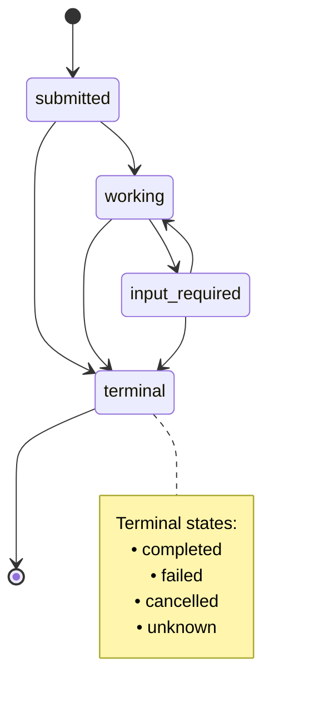
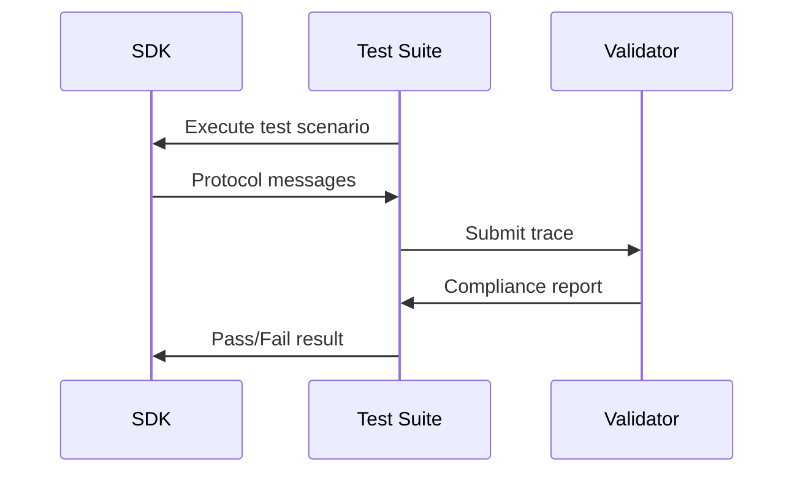
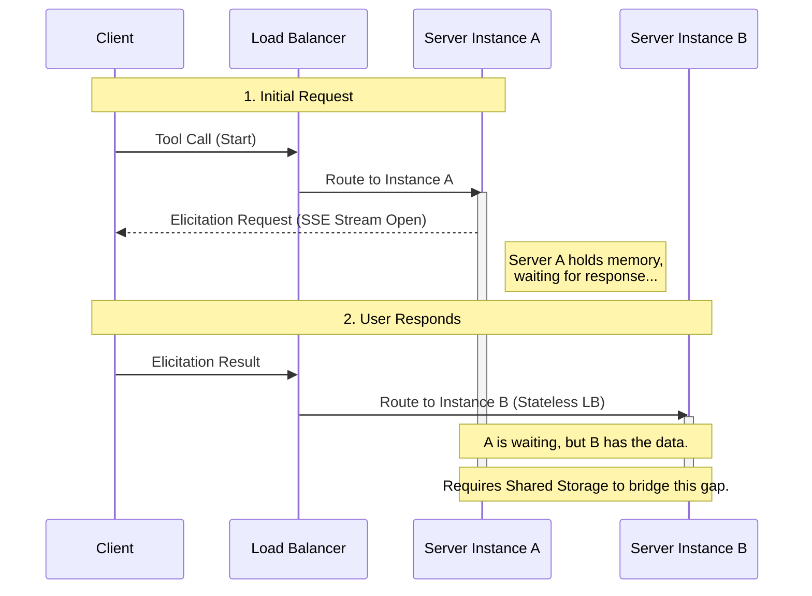
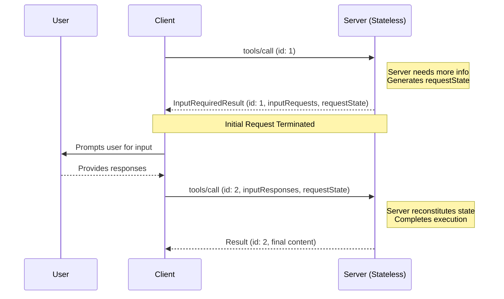
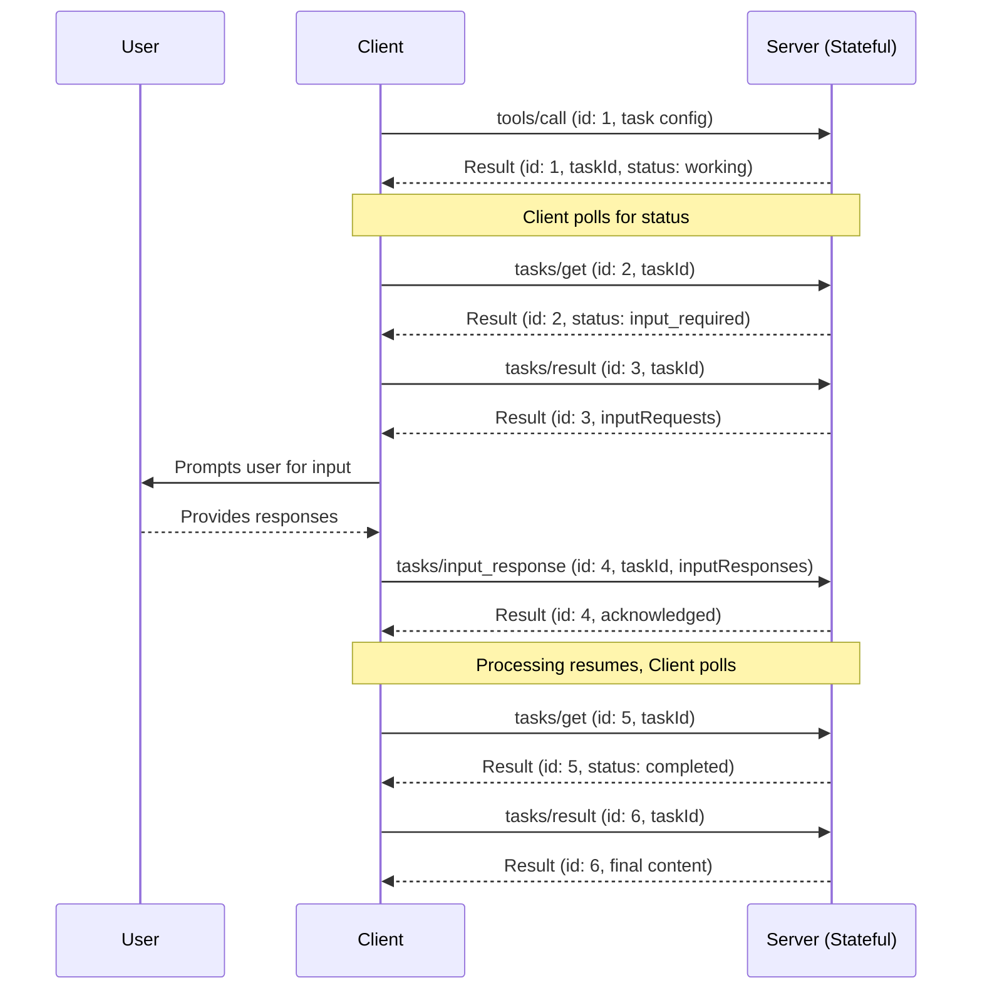
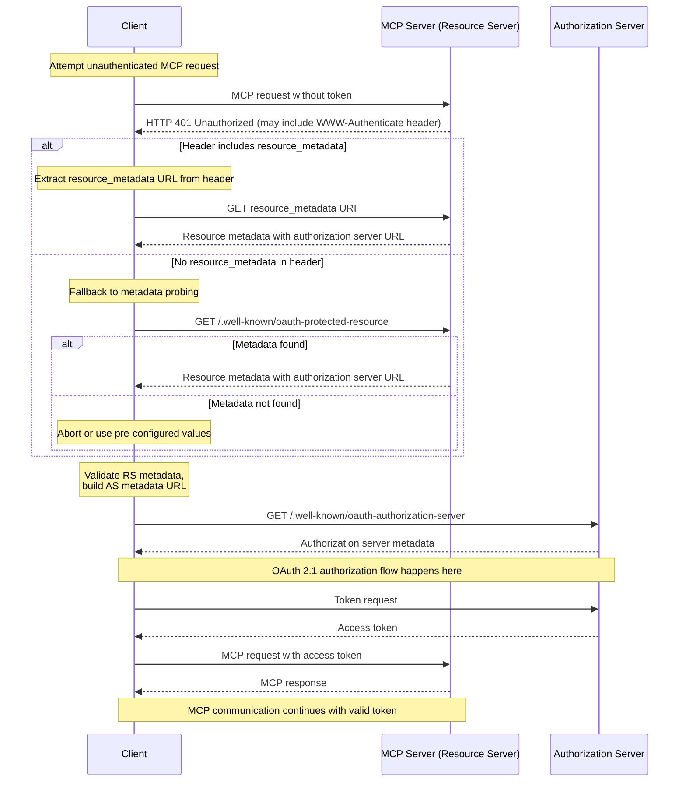
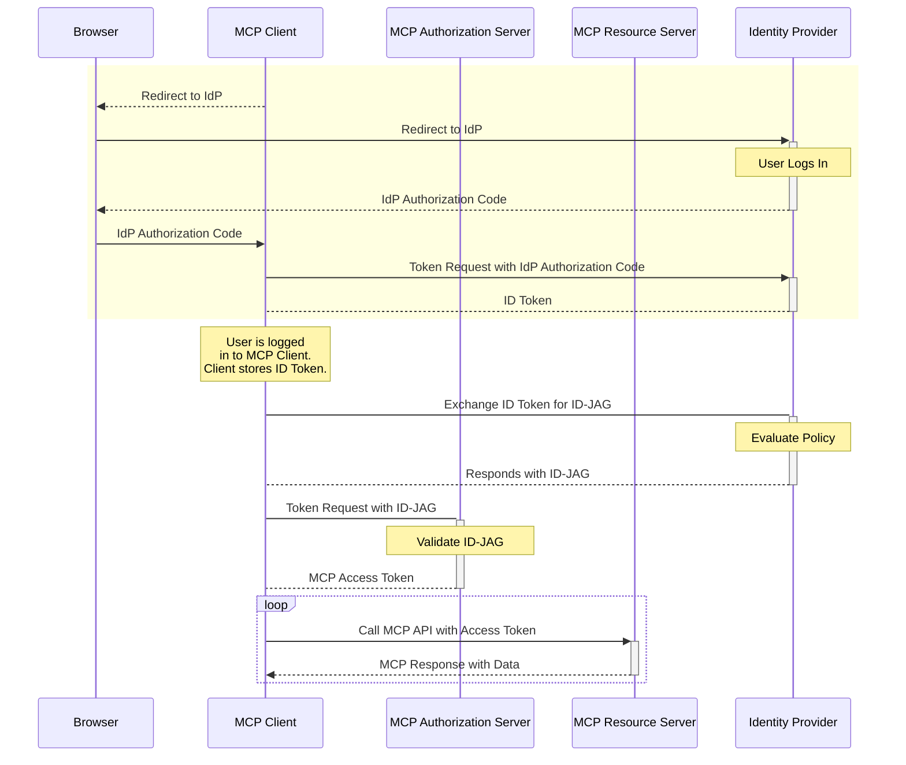
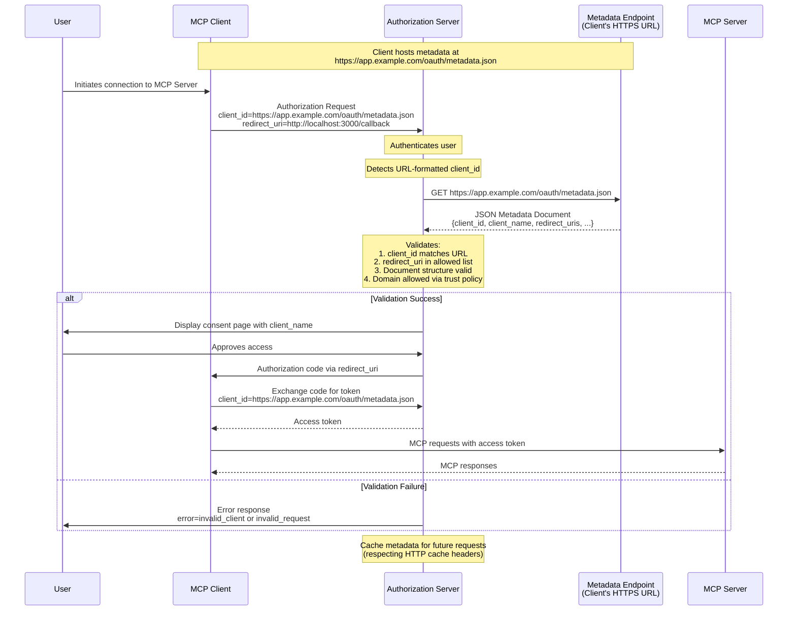

# MCP Documentation -- 11 Seps

- SEP-1024: MCP Client Security Requirements for Local Server Installation
- SEP-1034: Support default values for all primitive types in elicitation schemas
- SEP-1036: URL Mode Elicitation for secure out-of-band interactions
- Reference Implementation
- SEP-1046: Support OAuth client credentials flow in authorization
- SEP-1302: Formalize Working Groups and Interest Groups in MCP Governance
- SEP-1303: Input Validation Errors as Tool Execution Errors
- SEP-1319: Decouple Request Payload from RPC Methods Definition
- SEP-1330: Elicitation Enum Schema Improvements and Standards Compliance
- SEP-1577: Sampling With Tools
- SEP-1613: Establish JSON Schema 2020-12 as Default Dialect for MCP
- SEP-1686: Tasks
- SEP-1699: Support SSE polling via server-side disconnect
- SEP-1730: SDKs Tiering System
- SEP-1850: PR-Based SEP Workflow
- SEP-{NUMBER}: {Title}
- Vote
- SEP-1865: MCP Apps - Interactive User Interfaces for MCP
- SEP-2085: Governance Succession and Amendment Procedures
- SEP-2133: Extensions
- SEP-2148: MCP Contributor Ladder
- SEP-2149: MCP Group Governance and Charter Template
- SEP-2207: OIDC-Flavored Refresh Token Guidance
- SEP-2243: HTTP Header Standardization for Streamable HTTP Transport
- Flask example: Header-based routing requires manual dispatch
- SEP-2260: Require Server requests to be associated with a Client request.
- SEP-2322: Multi Round-Trip Requests
- SEP-414: Document OpenTelemetry Trace Context Propagation Conventions
- SEP-932: Model Context Protocol Governance
- SEP-973: Expose additional metadata for Implementations, Resources, Tools and Prompts
- SEP-985: Align OAuth 2.0 Protected Resource Metadata with RFC 9728
- SEP-986: Specify Format for Tool Names
- SEP-990: Enable enterprise IdP policy controls during MCP OAuth flows
- SEP-991: Enable URL-based Client Registration using OAuth Client ID Metadata Documents
- SEP-994: Shared Communication Practices/Guidelines

---

# SEP-1024: MCP Client Security Requirements for Local Server Installation
Source: https://modelcontextprotocol.io/seps/1024-mcp-client-security-requirements-for-local-server-

MCP Client Security Requirements for Local Server Installation

    Final
  

  
    Standards Track
  

| Field         | Value                                                                           |
| ------------- | ------------------------------------------------------------------------------- |
| **SEP**       | 1024                                                                            |
| **Title**     | MCP Client Security Requirements for Local Server Installation                  |
| **Status**    | Final                                                                           |
| **Type**      | Standards Track                                                                 |
| **Created**   | 2025-07-22                                                                      |
| **Author(s)** | Den Delimarsky                                                                  |
| **Sponsor**   | None                                                                            |
| **PR**        | [#1024](https://github.com/modelcontextprotocol/modelcontextprotocol/pull/1024) |

***

## Abstract

This SEP addresses critical security vulnerabilities in MCP client implementations that support one-click installation of local MCP servers. The current MCP specification lacks explicit security requirements for client-side installation flows, allowing malicious actors to execute arbitrary commands on user systems through crafted MCP server configurations distributed via links or social engineering.

This proposal establishes a best practice for MCP clients, requiring explicit user consent before executing any local server installation commands and complete command transparency.

## Motivation

The existing MCP specification does not address client-side security concerns related to streamlined ("one-click") local server configuration. Current MCP clients that implement these configuration experiences create significant attack vectors:

1. **Silent Command Execution**: MCP clients can automatically execute embedded commands without user review or consent when installing local servers via one-click flows.

2. **Lack of Visibility**: Users have no insight into what commands are being executed on their systems, creating opportunities for data exfiltration, system compromise, and privilege escalation.

3. **Social Engineering Vulnerabilities**: Users become comfortable executing commands labeled as "MCP servers" without proper scrutiny, making them susceptible to malicious configurations.

4. **Arbitrary Code Execution**: Attackers can embed harmful commands in MCP server configurations and distribute them through legitimate channels (repositories, documentation, social media).

Visual Studio Code [addressed this](https://den.dev/blog/vs-code-mcp-install-consent/) by implementing consent dialogs. Similarly, Cursor also supports a consent dialog for one-click local MCP server installation.

Without explicit security requirements in the specification, MCP client implementers may unknowingly create vulnerable installation flows, putting end users at risk of system compromise.

## Specification

### Client Security Requirements

MCP clients that support one-click local MCP server configuration **MUST** implement the following security controls:

#### Pre-Configuration Consent

Before executing any command to install or configure a local MCP server, the MCP client **MUST**:

1. Display a clear consent dialog that shows:
   * The exact command that will be executed, without truncation
   * All arguments and parameters
   * A clear warning that this operation may be potentially dangerous

2. Require explicit user approval through an affirmative action (button click, checkbox, etc.)

3. Provide an option for users to cancel the installation

4. Not proceed with installation if consent is denied or not provided

## Rationale

### Design Decisions

**Mandatory Consent Dialogs**: The requirement for explicit consent dialogs balances security with usability. While this adds friction to the MCP server configuration process, it prevents potential breaches from silent command execution.

## Backward Compatibility

This SEP introduces new **requirements** for MCP client implementations but does not change the core MCP protocol or wire format.

**Impact Assessment:**

* **Low Impact**: Existing MCP servers and the core protocol remain unchanged
* **Client Implementation Required**: MCP clients must update their local server installation flows to comply with new security requirements
* **User Experience Changes**: Users will see consent dialogs where none existed before

**Migration Path:**

1. MCP clients can implement these changes in new versions without breaking existing functionality
2. Existing installed MCP servers continue to work normally
3. Only new installation flows require the consent mechanisms

No protocol-level backward compatibility issues exist, as this SEP addresses client behavior rather than the MCP wire protocol.

## Reference Implementation

N/A

## Security Implications

### Security Benefits

This SEP directly addresses:

* **Arbitrary Code Execution**: Prevents silent execution of malicious commands
* **Social Engineering**: Forces users to consciously review commands before execution
* **Supply Chain Attacks**: Creates visibility into MCP server installation commands
* **Privilege Escalation**: Users can identify and reject commands requesting elevated privileges

### Residual Risks

Even with these controls, risks remain:

* **User Override**: Users may approve malicious commands despite warnings
* **Sophisticated Obfuscation**: Advanced attackers may craft commands that appear legitimate
* **Implementation Gaps**: Clients may implement controls incorrectly

### Risk Mitigation

These residual risks are addressed through:

* Clear warning language in consent dialogs
* Recommendation for additional security layers (sandboxing, signatures)
* Ongoing security research and community awareness

# SEP-1034: Support default values for all primitive types in elicitation schemas
Source: https://modelcontextprotocol.io/seps/1034--support-default-values-for-all-primitive-types-in

Support default values for all primitive types in elicitation schemas

    Final
  

  
    Standards Track
  

| Field         | Value                                                                           |
| ------------- | ------------------------------------------------------------------------------- |
| **SEP**       | 1034                                                                            |
| **Title**     | Support default values for all primitive types in elicitation schemas           |
| **Status**    | Final                                                                           |
| **Type**      | Standards Track                                                                 |
| **Created**   | 2025-07-22                                                                      |
| **Author(s)** | Tapan Chugh (chugh.tapan[@gmail](https://github.com/gmail).com)                 |
| **Sponsor**   | None                                                                            |
| **PR**        | [#1034](https://github.com/modelcontextprotocol/modelcontextprotocol/pull/1034) |

***

## Abstract

This SEP recommends adding support for default values to all primitive types in the MCP elicitation schema (StringSchema, NumberSchema, and EnumSchema), extending the existing support that only covers BooleanSchema.

## Motivation

Elicitations in MCP offer a way to mitigate complex API designs: tools can request information on-demand rather than resorting to convoluted parameter handling. The challenge however is that users must manually enter obvious information that could be pre-populated for more natural interactions. Currently, only `BooleanSchema` supports default values in elicitation requests. This limitation prevents servers from providing sensible defaults for text inputs, numbers, and enum selections leading to more user overhead.

### Real-World Example

Consider implementing an email reply function. Without elicitation, the tool becomes unwieldy:

```python 
def reply_to_email_thread(
    thread_id: str,
    content: str,
    recipient_list: List[str] = [],
    cc_list: List[str] = []
) -> None:
    # Ambiguity: Does empty list mean "no recipients" or "use defaults"?
    # Complex logic needed to handle different combinations
```

With elicitation, the tool signature itself can be much simpler

```python 
def reply_to_email_thread(
    thread_id: str,
    content: Optional[str] = ""
) -> None:
    # Code can lookup the participants from the original thread
    # and prepare an elicitation request with the defaults setup
```

```typescript 
const response = await client.request("elicitation/create", {
  message: "Configure email reply",
  requestedSchema: {
    type: "object",
    properties: {
      recipients: {
        type: "string",
        title: "Recipients",
        default: "alice@company.com, bob@company.com"  // Pre-filled
      },
      cc: {
        type: "string",
        title: "CC",
        default: "john@company.com"  // Pre-filled
      },
      content: {
        type: "string",
        title: "Message"
        default: "" // If provided in the tool above
      }
    }
  }
});
```

### Implementation

A working implementation demonstrating clients require minimal changes to display defaults (\~10 lines of code):

* Implementation PR: [https://github.com/chughtapan/fast-agent/pull/2](https://github.com/chughtapan/fast-agent/pull/2)
* A demo with the above email reply workflow: [https://asciinema.org/a/X7aQZjT2B5jVwn9dJ9sqQVkOM](https://asciinema.org/a/X7aQZjT2B5jVwn9dJ9sqQVkOM)

## Specification

### Schema Changes

Extend the elicitation primitive schemas to include optional default values:

```typescript 
export interface StringSchema {
  type: "string";
  title?: string;
  description?: string;
  minLength?: number;
  maxLength?: number;
  format?: "email" | "uri" | "date" | "date-time";
  default?: string; // NEW
}

export interface NumberSchema {
  type: "number" | "integer";
  title?: string;
  description?: string;
  minimum?: number;
  maximum?: number;
  default?: number; // NEW
}

export interface EnumSchema {
  type: "string";
  title?: string;
  description?: string;
  enum: string[];
  enumNames?: string[];
  default?: string; // NEW - must be one of enum values
}

// BooleanSchema already has default?: boolean
```

### Behavior

1. The `default` field is optional, maintaining full backward compatibility
2. Default values must match the schema type
3. For EnumSchema, the default must be one of the valid enum values
4. Clients that support defaults SHOULD pre-populate form fields. Clients that don't support defaults MAY ignore the field entirely.

## Rationale

1. The high-level rationale is to follow the precedent set by BooleanSchema rather than creating new mechanisms.
2. Making defaults optional ensures backward compatibility.
3. This maintains the high-level intuition of keeping the client implementation simple.

### Alternatives Considered

1. **Server-side Templates**: Servers could maintain templates separately, but this adds complexity
2. **New Request Type**: A separate request type for forms with defaults would fragment the API
3. **Required Defaults**: Making defaults required would break existing implementations

## Backwards Compatibility

This change is fully backward compatible with no breaking changes. Clients that don't understand defaults will ignore them, and existing elicitation requests continue to work unchanged. Clients can adopt default support at their own pace

## Security Implications

No new security concerns:

1. **No Sensitive Data**: The existing guidance against requesting sensitive information still applies
2. **Client Control**: Clients retain full control over what data is sent to servers
3. **User Visibility**: Default values are visible to users who can modify them before submission

# SEP-1036: URL Mode Elicitation for secure out-of-band interactions
Source: https://modelcontextprotocol.io/seps/1036-url-mode-elicitation-for-secure-out-of-band-intera

URL Mode Elicitation for secure out-of-band interactions

    Final
  

  
    Standards Track
  

| Field         | Value                                                                                                                     |
| ------------- | ------------------------------------------------------------------------------------------------------------------------- |
| **SEP**       | 1036                                                                                                                      |
| **Title**     | URL Mode Elicitation for secure out-of-band interactions                                                                  |
| **Status**    | Final                                                                                                                     |
| **Type**      | Standards Track                                                                                                           |
| **Created**   | 2025-07-22                                                                                                                |
| **Author(s)** | Nate Barbettini ([@nbarbettini](https://github.com/nbarbettini)) and Wils Dawson ([@wdawson](https://github.com/wdawson)) |
| **Sponsor**   | None                                                                                                                      |
| **PR**        | [#1036](https://github.com/modelcontextprotocol/modelcontextprotocol/pull/1036)                                           |

***

## Abstract

This SEP introduces a new `url` mode for the existing elicitation client capability, enabling secure out-of-band interactions that bypass the MCP client. URL mode elicitation addresses sensitive use cases that form mode elicitation cannot, such as gathering sensitive credentials, performing OAuth flows for external (3rd-party) authorization, and handling payments, *without* exposing sensitive data to the MCP client. By directing users to trusted URLs in their browser, this mode maintains security boundaries while enabling rich integrations with third-party services.

## Motivation

The current MCP specification (2025-06-18) provides an elicitation mechanism for gathering non-sensitive information from users through structured, in-band requests (most commonly imagined as the MCP client rendering a form to collect data from the end-user). However, several critical use cases require interactions that must not pass through the MCP client:

1. Sensitive data collection: API keys, passwords, and other credentials must never transit through intermediary systems.
2. External authorization: MCP servers often need to access third-party APIs on behalf of users. The MCP authorization specification only covers client-to-server authorization, not server-to-third-party authorization. The [Security Best Practices](https://modelcontextprotocol.io/specification/2025-06-18/basic/security_best_practices) document explicitly forbids token passthrough, requiring a secure mechanism for external (3rd-party) OAuth flows. This was a particularly important motivating factor emerging from discussions in #234 and #284.
3. Payment and Subscription Flows: Financial transactions require PCI compliance and secure payment processing that cannot be achieved through in-band data collection.

Without a standardized mechanism for these interactions, MCP servers must resort to non-standard workarounds or insecure practices like requesting API keys through in-band, form-style elicitation. This SEP addresses these gaps by introducing a URL elicitation mode that leverages established web security patterns to handle sensitive interactions securely.

URL elicitation is fundamentally different from [MCP authorization](https://modelcontextprotocol.io/specification/2025-06-18/basic/authorization). URL elicitation is not for authorizing the MCP client's access to the MCP server (that's handled directly by MCP authorization). Instead, it's used when the MCP server needs to obtain sensitive information or third-party authorization on behalf of the user. The MCP client's bearer token remains unchanged, and the client's only responsibility is to provide the user with context about the elicitation URL the server wants them to open.

## Specification

### Overview

Elicitation is updated to support two modes:

* **Form mode** (in-band): Servers can request structured data from users with optional JSON schemas to validate responses (no change here, other than adding a name to the existing capability)
* **URL mode** (out-of-band): Servers can direct users to external URLs for sensitive interactions that must not pass through the MCP client

### Capabilities

Clients that support elicitation **MUST** declare the `elicitation` capability during initialization:

```json 
{
  "capabilities": {
    "elicitation": {
      "form": {},
      "url": {}
    }
  }
}
```

For backwards compatibility, an empty capabilities object is equivalent to declaring support for `form` mode only:

```jsonc 
{
  "capabilities": {
    "elicitation": {},
  },
}
```

Clients declaring the `elicitation` capability **MUST** support at least one mode (`form` or `url`).

### Form Elicitation Requests

The only change from the existing specification is the addition of a `mode` field in the `elicitation/create` request:

```json 
{
  "jsonrpc": "2.0",
  "id": 1,
  "method": "elicitation/create",
  "params": {
    "mode": "form", // New field
    "message": "Please provide your GitHub username",
    "requestedSchema": {
      "type": "object",
      "properties": {
        "name": {
          "type": "string"
        }
      },
      "required": ["name"]
    }
  }
}
```

### URL Elicitation Requests

URL elicitation requests **MUST** specify `mode: "url"` and include these parameters:

| Name            | Type   | Description                                                        |
| --------------- | ------ | ------------------------------------------------------------------ |
| `url`           | string | The URL that the user should navigate to.                          |
| `elicitationId` | string | A unique identifier for the elicitation.                           |
| `message`       | string | A human-readable message explaining why the interaction is needed. |

#### Example: OAuth Authorization Flow

```json 
{
  "jsonrpc": "2.0",
  "id": 3,
  "method": "elicitation/create",
  "params": {
    "mode": "url",
    "elicitationId": "550e8400-e29b-41d4-a716-446655440000",
    "url": "https://github.com/login/oauth/authorize?client_id=abc123&state=xyz789&scope=repo",
    "message": "Please authorize access to your GitHub repositories to continue."
  }
}
```

#### Response Actions

URL elicitation responses use the same three-action model as form elicitation:

```json 
{
  "jsonrpc": "2.0",
  "id": 3,
  "result": {
    "action": "accept" // or "decline" or "cancel"
  }
}
```

The response with `action: "accept"` indicates that the user has consented to the interaction. The interaction occurs out of band and the client is not aware of the outcome unless the server sends a completion notification.

#### Completion Notifications

Servers **SHOULD** send a `notifications/elicitation/complete` notification when an
out-of-band interaction started by URL mode elicitation is completed. This allows clients to react programmatically if appropriate.

* The notification **MUST** only be sent to the client that initiated the elicitation request.
* The notification **MUST** include the `elicitationId` established in the original `elicitation/create` request.
* Clients **MUST** ignore notifications referencing unknown or already-completed IDs.
* If a completion notification never arrives, clients **SHOULD** provide a manual way for the user to continue the interaction.

Clients **MAY** use the notification to automatically retry requests that received a URL elicitation required error, update the user interface, or otherwise continue an interaction. However, because delivery of the notification is not guaranteed, clients must not wait indefinitely for a notification from the server.

```json 
{
  "jsonrpc": "2.0",
  "method": "notifications/elicitation/complete",
  "params": {
    "elicitationId": "550e8400-e29b-41d4-a716-446655440000"
  }
}
```

#### URL Elicitation Required Error

When a request cannot be processed until an elicitation is completed, the server **MAY** return a `URLElicitationRequiredError` (code `-32042`) to indicate that a URL mode elicitation is required. The server **MUST NOT** return this error except when URL mode elicitation is required by the user interaction.

```json 
{
  "jsonrpc": "2.0",
  "id": 2,
  "error": {
    "code": -32042,
    "message": "This request requires more information.",
    "data": {
      "elicitations": [
        {
          "mode": "url",
          "elicitationId": "550e8400-e29b-41d4-a716-446655440000",
          "url": "https://oauth.example.com/authorize?client_id=abc123&response_type=code&...",
          "message": "Authorization is required to access your Example Co files."
        }
      ]
    }
  }
}
```

Any elicitations returned in the error **MUST** be URL mode elicitations and include an `elicitationId`.

Returning a `URLElicitationRequiredError` is equivalent to sending an `elicitation/create` request. The server may return an error (instead of sending a separate `elicitation/create` request) as an affordance to the client to make it clear that a particular elicitation is directly related to a failed client request.

The client must treat `URLElicitationRequiredError` responses as equivalent to `elicitation/create` requests. Clients may automatically retry the failed request after the elicitation is completed successfully, for example after receiving a completion notification.

## Rationale

### Design Decisions

**Why extend elicitation instead of creating a new mechanism?**

Initially, we considered creating a separate mechanism for out-of-band interactions (discussed in #475). However, after discussions with the MCP maintainers, we decided to extend the existing elicitation specification because:

1. Both mechanisms serve the same fundamental purpose: gathering information from users
2. Having two similar-but-separate mechanisms for the same purpose is confusing and error-prone
3. The `mode` parameter cleanly separates the two interaction patterns

**Why can't the client perform the interaction itself?**

It is tempting to suggest that the MCP client should perform the interaction itself, e.g. act as an OAuth client to a third-party authorization server. However, there are several reasons why this is not a good idea:

* If the MCP client obtains user tokens from a third-party authorization server, the MCP server becomes a [token passthrough](https://modelcontextprotocol.io/specification/2025-06-18/basic/security_best_practices#token-passthrough) server, which is explicitly forbidden.
* Similarly, for payment-type flows, the MCP client would need to perform PCI-compliant payment processing, which is not a desired requirement for MCP clients.

**Why doesn't the server block (wait) on the elicitation to complete?**

URL mode elicitation requests are asynchronous or "disconnected" flows by design, because the kinds of interactions they enable are inherently asynchronous. Payment flows, external authorization, etc. can take minutes or more to complete, and in some cases never complete at all (if abandoned by the end-user).

**Why disallow URLs in form mode?**

Being very explicit about when URLs can (and cannot) be sent in an elicitation request improves the client's security posture. By clearly stating in the spec that URLs are *only* allowed in the `url` field of a URL mode elicitation request, client implementers can implement UX patterns that are consistent with the security model. For example, a client could refuse to render a URL as a clickable hyperlink in a form mode elicitation request, reducing the likelihood of a user clicking on a malicious URL sent by a malicious server.

### Alternative Approaches Considered

1. **Token Passthrough**: Simply passing the MCP client's token to external services was rejected due to security concerns documented in the Security Best Practices. Having the MCP client obtain additional tokens and passing those to the MCP server was rejected for the same reason.

2. **OAuth-specific Capability**: Creating a capability specific to external (3rd-party) authorization with OAuth was considered, but rejected in favor of the more general URL mode elicitation approach that supports multiple use cases.

### Community Feedback

This proposal incorporates extensive community feedback from discussions in #475, #234, and #284, as well as the #auth-wg working group on Discord. The community identified the need for:

* Secure credential collection without client exposure
* External authorization patterns separate from MCP authorization
* Payment and subscription flow support
* Clear security boundaries and trust models

## Backward Compatibility

This SEP introduces the following breaking changes:

1. **Capability Declaration**: Clients must now specify which elicitation modes they support:

   ```json 
   {
     "capabilities": {
       "elicitation": {
         "form": {},
         "url": {}
       }
     }
   }
   ```

   Previously, clients only declared `"elicitation": {}` without mode specification.

2. **Mode Parameter**: All `elicitation/create` requests must now include a `mode` parameter (`"form"` or `"url"`).

### Migration Path

To ease migration:

* Servers SHOULD check client capabilities before sending mode-specific requests
* Clients MAY initially support only form mode to maintain compatibility
* Existing form elicitation implementations continue to work with the addition of the mode parameter

# Reference Implementation

Client/server implementation in TypeScript: [feat/url-elicitation](https://github.com/modelcontextprotocol/typescript-sdk/compare/main...ArcadeAI:mcp-typescript-sdk:feat/url-elicitation)

Explainer video: [https://drive.google.com/file/d/1llCFS9wmkK\_RUgi5B-zHfUUgy-CNb0n0/view?usp=sharing](https://drive.google.com/file/d/1llCFS9wmkK_RUgi5B-zHfUUgy-CNb0n0/view?usp=sharing)

## Security Implications

This SEP introduces several security considerations:

### URL Security Requirements

1. **SSRF Prevention**: Clients must validate URLs to prevent Server-Side Request Forgery attacks
2. **Protocol Restrictions**: Only HTTPS URLs are allowed for URL elicitation
3. **Domain Validation**: Clients must clearly display target domains to users

### Trust Boundaries

URL elicitation explicitly creates clear trust boundaries:

* The MCP client never sees sensitive data obtained by the MCP server via URL elicitation
* The MCP server must independently verify user identity
* Third-party services interact directly with users through secure browser contexts

### Identity Verification

Servers must verify that the user completing a URL elicitation is the same user who initiated the request. Verifying the identity of the user must not rely on untrusted input (e.g. user input) from the client.

### Implementation Requirements

1. **Clients must**:
   * Use secure browser contexts that prevent inspection of user inputs
   * Validate URLs for SSRF protection
   * Obtain explicit user consent before opening URLs
   * Clearly display target domains

2. **Servers must**:
   * Bind elicitation state to authenticated user sessions
   * Verify user identity at the beginning and end of a URL elicitation flow
   * Implement appropriate rate limiting

3. **Both parties should**:
   * Log security events for audit purposes
   * Implement timeout mechanisms for elicitation requests
   * Provide clear error messages for security failures

### Relationship to Existing Security Measures

This proposal builds upon and complements existing MCP security measures:

* Works within the existing MCP authorization framework (MCP authorization is not affected by this proposal)
* Follows Security Best Practices regarding token handling
* Maintains separation of concerns between client-server and server-third-party authorization

# SEP-1046: Support OAuth client credentials flow in authorization
Source: https://modelcontextprotocol.io/seps/1046-support-oauth-client-credentials-flow-in-authoriza

Support OAuth client credentials flow in authorization

    Final
  

  
    Standards Track
  

| Field         | Value                                                                           |
| ------------- | ------------------------------------------------------------------------------- |
| **SEP**       | 1046                                                                            |
| **Title**     | Support OAuth client credentials flow in authorization                          |
| **Status**    | Final                                                                           |
| **Type**      | Standards Track                                                                 |
| **Created**   | 2025-07-23                                                                      |
| **Author(s)** | Darin McAdams ([@D-McAdams](https://github.com/D-McAdams) )                     |
| **Sponsor**   | None                                                                            |
| **PR**        | [#1046](https://github.com/modelcontextprotocol/modelcontextprotocol/pull/1046) |

***

## Abstract

Recommends adding the OAuth client credentials flow to the authorization spec to enable machine-to-machine scenarios.

### Motivation

The original authorization spec mentioned the client credentials flow, but it was dropped in subsequent revisions. Therefore, the spec is currently silent on how to solve machine-to-machine scenarios where an end-user is unavailable for interactive authorization.

### Specification

The authorization spec would be amended to list the OAuth client credentials flow as being allowed. Adhering to the patterns established by OAuth 2.1, the specification would RECOMMEND the use of asymmetric methods defined in RFC 753 (JWT Assertions), but also allow client secrets.

As guidance to implementors, the spec overview would also be updated to describe the different flows and when each is applicable. In addition, to address a common question, the spec would be updated to indicate that implementors may implement other authorization scenarios beyond what's defined; emphasizing that the specification defines the baseline requirements.

### Rationale

To maximize interoperability (and minimize SDK complexity), this change would intentionally constrain the client credentials flow to two options:

1. JWT Assertions as per RFC 7523 (RECOMMENDED)
2. Client Secrets via HTTP Basic authentication (Allowed for maximum compatibility with existing systems)

Other options, such as mTLS, are not included.

While the spec encourages the use of RFC 7523 (JWT Assertions), it does not yet specify how to populate the JWT contents nor how to discover the client's JWKS URI to validate the JWT. In future iterations of the spec, it will be beneficial to do so. However, this was currently left unspecified pending maturity of other RFCs that can define these profiles. The other RFCs include [WIMSE Headless JWT Authentication](https://www.ietf.org/archive/id/draft-levy-wimse-headless-jwt-authentication-01.html) (for specifying JWT contents) and [Client ID Metadata](https://datatracker.ietf.org/doc/draft-parecki-oauth-client-id-metadata-document/) (for specifying the JWKS URI). This revision intentionally leaves extensibility for these future profiles. As a practical matter, this means implementers needing to ship solutions ASAP will most likely use client secrets which are widely supported today, whereas the JWT Assertion pattern represents the longer-term direction.

### Backward Compatibility

This change is fully backward compatible. It introduces a new authorization flow, but does not alter the existing flows.

### Security Implications

The specification refers to the existing OAuth security guidance.

# SEP-1302: Formalize Working Groups and Interest Groups in MCP Governance
Source: https://modelcontextprotocol.io/seps/1302-formalize-working-groups-and-interest-groups-in-mc

Formalize Working Groups and Interest Groups in MCP Governance

    Final
  

  
    Standards Track
  

| Field         | Value                                                                           |
| ------------- | ------------------------------------------------------------------------------- |
| **SEP**       | 1302                                                                            |
| **Title**     | Formalize Working Groups and Interest Groups in MCP Governance                  |
| **Status**    | Final                                                                           |
| **Type**      | Standards Track                                                                 |
| **Created**   | 2025-08-05                                                                      |
| **Author(s)** | tadasant                                                                        |
| **Sponsor**   | None                                                                            |
| **PR**        | [#1302](https://github.com/modelcontextprotocol/modelcontextprotocol/pull/1302) |

***

## Abstract

*A short (\~200 word) description of the technical issue being addressed.*

In [SEP-994](https://github.com/modelcontextprotocol/modelcontextprotocol/pull/1002), we introduced a notion of “Working Groups” and “Interest Groups” that facilitate MCP sub-communities for discussion and collaboration. This SEP aims to formally define those two terms: what they are meant to achieve, how groups can be created, how they are governed, and how they can be retired.

Interest Groups work to define *problems* that MCP should solve by facilitating *discussions*, while Working Groups push forward specific *solutions* by collaboratively producing *deliverables* (in the form of SEPs or community-owned implementations of the specification). Interest Group input is a welcome (but not required) justification for creation of a Working Group. Interest Group or Working Group input is collectively a welcome (but not required) input into a SEP.

## Motivation

*The motivation should clearly explain why the existing protocol specification is inadequate to address the problem that the SEP solves.*

The community has already been self-organizing into several disparate systems for these collaborative groups:

* The Steering group has had a long-standing practice of managing a handful of collaborative groups through Discord channels (e.g. security, auth, agents). See [bottom of MAINTAINERS.md](https://github.com/modelcontextprotocol/modelcontextprotocol/blob/main/MAINTAINERS.md).
* The “CWG Discord” has had a [semi-formal process](https://github.com/modelcontextprotocol-community/working-groups) for pushing equivalent grassroots initiatives, mostly in pursuit of creating artifacts for SEP consideration (e.g. hosting, UI, tool-interfaces, search-tools)

With SEP-994 resulting in the merging of the Discord communities, we have a need to:

* Merge the existing initiatives into one unified approach, so when we reference “working group” or “interest group”, everyone knows what that means and what kind of weight the reference might carry
* Standardize a process around the creation (and eventual retirement) of such groups
* Properly distinguish between “working” and “interest” groups; the CWG experience has shown two very different motivations for starting a group worth treating with different expectations and lifecycle. Put succinctly, “interest” groups are about brainstorming possible *problems*, and “working” groups are about pushing forward specific *solutions*.

These groups exist to:

* **Facilitate high signal spaces for discussion** such that those opting into notifications and meetings feel most content is relevant to them and they can meaningfully contribute their experience and learn from others
* **Create norms, expectations, and single points of involved leadership** around making collaborative progress towards concrete deliverables that help evolve MCP

It will also form the foundation for cross-group initiatives, such as maintaining a calendar of live meetings.

## Specification

*The technical specification should describe the syntax and semantics of any new protocol feature. The specification should be detailed enough to allow competing, interoperable implementations. A PR with the changes to the specification should be provided.*

### Interest Groups (IG) \[Problems]

**Goal**: facilitate discussion and knowledge-sharing among MCP community members with similar interests surrounding some MCP sub-topic or context. The focus is on collecting *problems* that may or may not be worth solving with SEPs or other community artifacts.

**Expectations**:

* At least one substantive thread / conversation per month
* AND/OR a live meeting attended by 3+ unaffiliated individuals

**Examples**:

* Security in MCP (currently: #security)
* Auth in MCP (currently: #auth)
* Using MCP in an internal enterprise setting (currently: #enterprise-wg)
* Tooling and practices surrounding hosting MCP servers (currently: #hosting-wg)
* Tooling and practices surrounding implementing MCP clients (currently: #client-implementors)

**Lifecycle**:

* Creation begins by filling out a template in #wg-ig-group-creation Discord channel
* A community moderator will review and call for a vote in the (private) #community-moderators Discord channel. Majority positive vote by members over a 72h period approves creation of the group. Can be reversed at any time (e.g. after more input comes in). Core and lead maintainers can veto.
* Facilitator(s) and Maintainer(s) responsible for organizing IG into meeting expectations
  * Facilitator is an informal role responsible for shepherding or speaking for a group
  * Maintainer is an official representative from the MCP steering group (not required for every group to have this)
* IG is retired only when community moderators or core+ maintainers decide it is not meeting expectations
  * This means successful IG’s will live on in perpetuity

**Creation Template**:

* Facilitator(s)
* Maintainer(s) (optional)
* Flag potential overlap with other IG’s
* How this IG differentiates itself from the related IG’s
* First topic you want to discuss

There is no requirement to be part of an IG to start a WG, or even to start a SEP. However, forming consensus in IG’s to support justifying the creation of a WG is often a good idea. Similarly, citing IG or WG support of a SEP helps the SEP as well.

### Working Groups (WG) \[Solutions]

**Goal**: facilitate MCP community collaboration on a specific SEP, themed series of SEPs, or officially endorsed Project.

**Expectations**:

* Minimum monthly progress towards at least one SEP or spec-related implementation OR holds maintenance responsibilities for a Project
* Facilitator(s) is/are responsible for fielding status update requests by community moderators or maintainers

**Examples**:

* Registry
* Inspector
* Tool Filtering
* Server Identity

**Lifecycle**:

* Creation begins by filling out a template in #wg-ig-group-creation Discord channel
* A community moderator will review and call for a vote in the (private) #community-moderators Discord channel. Majority positive vote by members over a 72h period approves creation of the group. Can be reversed at any time (e.g. after more input comes in). Core and lead maintainers can veto.
* Facilitator(s) and Maintainer(s) responsible for organizing WG into meeting expectations
  * Facilitator is an informal role responsible for shepherding or speaking for a group
  * Maintainer is an official representative from the MCP steering group (not required for every group to have this)
* WG is retired when either:
  * Community moderators or core+ maintainers decide it is not meeting expectations
  * The WG does not have a WIP Issue/PR for at least a month, or has completed all Issues/PRs it intends to pursue.

**Creation Template**:

* Facilitator(s)
* Maintainer(s) (optional)
* Explanation of interest/use cases (ideally from an IG but can come from anywhere)
* First Issue/PR/SEP you intend to procure

### WG/IG Facilitators

A “Facilitator” role in a WG or IG does *not* result in a [maintainership role](https://github.com/modelcontextprotocol/modelcontextprotocol/blob/main/MAINTAINERS.md) across the MCP organization. It is an informal role into which anyone can self-nominate, responsible for helping shepherd discussions and collaboration within the group.

Core Maintainers reserve the right to modify the list of Facilitators and Maintainers for any WG/IG at any time.

PR for the changes to our documentation we'd want to enact this SEP: [https://github.com/modelcontextprotocol/modelcontextprotocol/pull/1350](https://github.com/modelcontextprotocol/modelcontextprotocol/pull/1350)

## Rationale

*The rationale explains why particular design decisions were made. It should describe alternate designs that were considered and related work. The rationale should provide evidence of consensus within the community and discuss important objections or concerns raised during discussion.*

The design above comes from experience in facilitating the creation of + observing the behavior of informal “Community Working Groups” in the CWG Discord, and leading one of / participating in / observing the “Steering Committee Working Groups”. While the Steering WG’s were usually informally created by Lead Maintainers, the CWG Discord had a lightweight WG-creation process that involved similar steps to the proposal above (community members would propose WG’s in #working-group-ideation, and moderators would create channels from that collaboration).

As precedent, the WG and IG concepts here are similar to W3C’s notion of [Working Groups](https://www.w3.org/groups/wg/) and [Interest Groups](https://www.w3.org/groups/ig/).

### Considerations

In proposing the WG/IG design, we took the following into consideration:

#### Clear on-ramp for community involvement

A very common question for folks looking to invest in the MCP ecosystem is, "how do I get involved?"

These IG and WG abstractions help provide an elegant on-ramp:

1. Join the Discord, follow the conversation in IGs relevant to you. Attend live calls. Participate.
2. Offer to facilitate calls. Contribute your use cases in SEP proposals and other work.
3. When you're comfortable contributing to deliverables, jump in to contribute to WG work.
4. Do this for a period of time, get noticed by WG maintainers to get nominated as a new maintainer.

#### Minimal changes to existing governance structure

We did not want this change to introduce new elections, appointments, or other notions of leadership. We leverage community moderators to thumbs-up creation of new groups, allow core maintainers to veto, maintainership status stays unchanged, and the notion of "facilitator" is new but self-nominated, so does not introduce any new governance processes.

#### Alignment with current status quo

There is a clear "migration" path for the existing "CWG" working groups and Steering working groups - just a matter of sorting out what is "working" vs. "interest", but functionally this proposal stays out of the way of changing anything that has been working within each group's existing structure.

#### Nature of requests for gathering spaces

It has been clear from the requests to CWG that some groups form with a motivation to collaborate on some deliverable (e.g. `search-tools`), and others form due to common interests and a want for sub-community but not yet specific deliverables (e.g. `enterprise`). Hence, we separate the motivations into Working Groups vs. Interest Groups.

#### Potential for overlap in scope

In the requests for new group spaces, it is sometimes non-obvious why a new one needs to exist. For example, the stated motivation for `enterprise` at times sounded like it may just be another flavor of `hosting`. We ultimately settled on a distinction that made it clear one was not a direct subset of the other, but the concern of making clear boundaries between groups (and letting community moderators / maintainers centralize the decision-making around "what are the right layers of abstraction") is what led to the questions in the creation templates around e.g. "flag potential overlap with other IG’s".

#### Path to retiring stale groups

Many working groups in the old CWG and Steering models have gone stale since creation. They serve no real purpose and should be retired. For this, we introduce the formal concept of facilitators and optional maintainers in groups; and the community moderator right to retire them. By having at least informal leadership in place per group, a moderator can easily make the decision to retire a group if everyone is in agreement to proceed.

### Alternatives Considered

#### Hierarchy between IGs and WGs

We considered *requiring* that WGs be owned or spawned by a "sponsor" IG, for the purpose of more clearly exhibiting a progression of ideas to the community; but decided against this requiring to avoid adding a new layer of governance and alignment with how the less formal groups works today.

#### A single WG concept (instead of both WG and IG)

There has been regular tension in both CWG and the Steering group around the question of "is XYZ really a working group? how will maintainership work?" By making IG's explicitly discussion-oriented and maintainership involvement optional, we create a space to drive those discussions without requiring some formal expectation of deliverables like we might in a well-defined WG.

#### Free-for-all WG/IG creation process

While very community-driven, the concern of group overlap would quickly fragment the conversations and collaboration to an untenable level; we need a centralized point of discernment here.

## Backward Compatibility

*All SEPs that introduce backward incompatibilities must include a section describing these incompatibilities and their severity. The SEP must explain how the author proposes to deal with these incompatibilities.*

There is no major change suggested in the day to day of existing groups - the expectations laid out of IGs and WGs are easily met by existing active groups as long as they keep doing as they are doing.

A migration path for all groups is laid out below.

## Reference Implementation

*The reference implementation must be completed before any SEP is given status “Final”, but it need not be completed before the SEP is accepted. While there is merit to the approach of reaching consensus on the specification and rationale before writing code, the principle of “rough consensus and running code” is still useful when it comes to resolving many discussions of protocol details.*

The below is the suggested migration path for each group. "Migration" just involves acknowledgement of this SEP and the expectations of each group, plus methodology for possible eventual retirement (or immediate retirement, in some cases).

After this SEP is approved, we can ping each of the groups to confirm they are on board with the migration plan.

### Steering Working Groups

* All official SDK groups --> Working Groups
* Registry --> Working Group
* Documentation --> Working Group
* Inspector --> Working Group
* Auth --> Interest Group + some WGs: client-registration, improve-devx, profiles, tool-scopes
* Agents --> Working Group \[Long Running / Async Tool Calls; unless we want an Agents IG on top of that?]
* Connection Lifetime --> Retire
* Streaming --> Retire
* Spec Compliance --> Retire (good idea but stale; would be good for someone to spearhead a new Working Group)
* Security --> Interest Group (perhaps with Security Best Practices WG?)
* Transports --> Interest Group
* Server Identity --> Working Group
* Governance --> Working Group (or Retire if no more work here?)

### Community Working Groups

* agent-comms --> Retire
* enterprise --> Interest Group (request a proposal to start)
* hosting --> Interest Group (request a proposal to start)
* load-balancing --> Retire
* model-awareness --> Working Group (request a proposal to start)
* search-tools (tool-filtering) --> Working Group
* server-identity --> merge with Steering equivalent
* security --> merge with Steering equivalent
* server-identity --> merge with Steering equivalent
* tool-interfaces --> Retire
* ui --> Interest Group
* schema-validation --> Retire (same as Steering equivalent)

# SEP-1303: Input Validation Errors as Tool Execution Errors
Source: https://modelcontextprotocol.io/seps/1303-input-validation-errors-as-tool-execution-errors

Input Validation Errors as Tool Execution Errors

    Final
  

  
    Standards Track
  

| Field         | Value                                                                           |
| ------------- | ------------------------------------------------------------------------------- |
| **SEP**       | 1303                                                                            |
| **Title**     | Input Validation Errors as Tool Execution Errors                                |
| **Status**    | Final                                                                           |
| **Type**      | Standards Track                                                                 |
| **Created**   | 2025-08-05                                                                      |
| **Author(s)** | [@fredericbarthelet](https://github.com/fredericbarthelet)                      |
| **Sponsor**   | None                                                                            |
| **PR**        | [#1303](https://github.com/modelcontextprotocol/modelcontextprotocol/pull/1303) |

***

## Abstract

This SEP proposes treating tools input validation errors as Tool Execution Errors rather than Protocol Errors. This change would enable language models to receive validation error feedback in their context window, allowing them to self-correct and successfully complete tasks without human intervention, significantly improving task completion rate.

## Motivation

Language models can learn from tool input validation error messages and retry a tools/call with corrected parameters accordingly, but only if they receive the error feedback in their context window. Protocol Errors are catch at the application level by the MCP Client. Only Tool Execution Errors are forwarded back to the model as JSON-RPC responses. With the current specifications, models cannot see these error messages and thus cannot self-correct, leading to repeated failures and poor user experiences.

### Problem Statement

Consider a flight booking tool that validates departure dates using the following `zod` validation schema:

```typescript 
departureDate: z.string()
  .regex(/^\d{2}\/\d{2}\/\d{4}$/, "date must be in dd/mm/yyyy format")
  .superRefine((dateStr, ctx) => {
    const date = parseDateFr(dateStr);
    if (date.getTime() < Date.now()) {
      ctx.addIssue({
        code: z.ZodIssueCode.custom,
        message:
          "Dates must be in the future. Current date is " +
          formatDateFr(new Date()),
      });
    }
    return true;
  })
  .describe("Departure date in dd/mm/yyyy format");
```

Tool expected input JSON schema can only describe the regex statement. The actual programmatic check that the date is in the past cannot be expressed here as JSON schema.
Even when a model provides a syntactically correct date that passes JSON schema validation, there is no guarantee it will be in the future. When a validation error is raised and returned as a Protocol Error:

1. The model doesn't receive the error message explaining why the date was rejected
2. The model repeats the same mistake multiple times (e.g., Cursor typically consistently sends dates in 2024 when the user only specify day and month or relative date and repeats the same tools/call request 3 times without getting any information as to why the tools call fails)
3. The task fails despite the model being capable of correcting itself if given proper feedback
4. Users experience frustration and must manually intervene

### Benefits of This Proposal

1. **Higher Task Completion Rates**: Models can self-correct validation errors without human intervention
2. **Better User Experience**: Reduced failures and faster task completion
3. **Leverages Model Capabilities**: Modern LLMs excel at understanding and responding to error messages
4. **Reduced API Calls**: Fewer retry attempts as models correct themselves on the first error

## Specification

### Current Behavior

The [tool errors specification](https://modelcontextprotocol.io/specification/2025-06-18/server/tools#error-handling) currently provides ambiguous guidance:

* "Invalid arguments" should be treated as Protocol Error
* "Invalid input data" should be treated as Tool Execution Error

This ambiguity leads to inconsistent implementations where valuable error feedback is lost.

### Proposed Change

Clarify the specification with the following changes:

1. Removes the "invalid argument" category from **Protocol Errors**.
2. **Tool Execution Errors** should be used for all tool argument validation failures (merging `invalid argument` and `invalid input data` under a new `input validation errors` category)

### Specification Text Changes

Update the error handling section to include:

```
## Error Handling

Tools use two error reporting mechanisms:

1. **Protocol Errors**: Standard JSON-RPC errors for issues like:

   - Unknown tools
   - Server errors

2. **Tool Execution Errors**: Reported in tool results with `isError: true`:
   - API failures
   - Input validation errors
   - Business logic errors
```

## Implementation

### Before (Protocol Error)

```typescript 
// Model submits past date
request: {
  ...
  method: "tools/call",
  params: {
    name: "book_flight",
    arguments: {
      departureDate: "12/12/2024"  // Past date
    }
  }
}

// Server returns Protocol Error
response: {
  ...
  error: {
    code: -32602,
    message: "Invalid params"
  }
}

// Model retries blindly with another past date
// This cycle repeats until failure
```

### After (Tool Execution Error)

```typescript 
// Model submits past date
request: {
  ...
  method: "tools/call",
  params: {
    name: "book_flight",
    arguments: {
      departureDate: "12/12/2024"  // Past date
    }
  }
}

// Server returns Tool Execution Error (visible to model)
response: {
  ...
  "result": {
    "content": [
      {
        "type": "text",
        "text": "Dates must be in the future. Current date is 08/08/2025"
      }
    ],
    "isError": true
  }
}

// Model understands the error and corrects itself
request: {
  method: "tools/call",
  params: {
    name: "book_flight",
    arguments: {
      departureDate: "12/12/2025"  // Future date
    }
  }
}
```

## Backwards Compatibility

This change is backwards compatible as it:

* Does not alter the protocol structure
* Only clarifies existing ambiguous behavior
* Maintains all existing error types and formats
* Improves behavior without breaking existing implementations

Servers implementing the clarified behavior will provide better model self-recovery while continuing to work with all existing clients.

## References

* [MCP Tools Error Handling Specification](https://modelcontextprotocol.io/specification/2025-06-18/server/tools#error-handling)
* [Better MCP tools/call Error Responses: Help Your AI Recover Gracefully](https://dev.to/alpic/better-mcp-toolscall-error-responses-help-your-ai-recover-gracefully-15c7)
* Related Issue: [https://github.com/modelcontextprotocol/typescript-sdk/pull/824](https://github.com/modelcontextprotocol/typescript-sdk/pull/824)

# SEP-1319: Decouple Request Payload from RPC Methods Definition
Source: https://modelcontextprotocol.io/seps/1319-decouple-request-payload-from-rpc-methods-definiti

Decouple Request Payload from RPC Methods Definition

    Final
  

  
    Standards Track
  

| Field         | Value                                                                           |
| ------------- | ------------------------------------------------------------------------------- |
| **SEP**       | 1319                                                                            |
| **Title**     | Decouple Request Payload from RPC Methods Definition                            |
| **Status**    | Final                                                                           |
| **Type**      | Standards Track                                                                 |
| **Created**   | 2025-08-08                                                                      |
| **Author(s)** | [@kurtisvg](https://github.com/kurtisvg)                                        |
| **Sponsor**   | None                                                                            |
| **PR**        | [#1319](https://github.com/modelcontextprotocol/modelcontextprotocol/pull/1319) |

***

## Abstract

This SEP proposes a structural refactoring of the Model Context Protocol (MCP) specification. The core change is to define payload of requests (e.g., CallToolRequest) as independent definitions and have the RPC method definitions refer to these models. This decouples the definition of the data payload from the definition of the remote procedure that transports it, leading to a clearer, more modular, and more maintainable specification.

## Motivation

The current MCP specification tightly couples the data payload of a request with the JSON-RPC method that transports it. This design presents several challenges:

* **Reduced Clarity:** It forces developers to mentally parse the JSON-RPC transport structure just to understand the core data being exchanged. This increases cognitive load and makes the specification difficult to read and implement correctly.
* **Hindered Maintainability:** Defining data structures inline prevents their reuse across different methods, leading to redundancy and making future updates to the protocol more complex and error-prone.
* **Tightly Coupled to JSON-RPC:** Most critically, this tight coupling to JSON-RPC is the primary blocker for defining bindings for other transport protocols. To support transports like **gRPC** (which is currently a [popular ask from the community](https://github.com/modelcontextprotocol/modelcontextprotocol/issues/966)), a transport-agnostic definition of its request and response messages. The current structure makes this practically impossible.

By refactoring the specification to separate the data model (the "what") from the RPC method (the "how"), this proposal will create a clearer, more modular specification. This change will immediately improve the developer experience and, most importantly, pave the way for the future evolution of MCP across multiple transports.

## Specification

The proposal introduces the following principle: All data structures used as parameters (params) or results (result) for RPC methods should be defined as standalone, named schemas. The RPC method definitions will then use references to these schemas.

### Current Approach (Inline Definition):

The RPC method definition contains the full structure of its parameters and results.

```ts 
export interface CallToolRequest extends Request {
  method: "tools/call";
  params: {
    name: string;
    arguments?: { [key: string]: unknown };
  };
}
```

### Proposed Approach (Decoupled Definition):

First, the data models for the request and response are defined as top-level schemas.

```ts 
/**
 * Parameters for a `tools/call` request.
 *
 * @category tools/call
 */
export interface CallToolRequestParams extends RequestParams {
  name: string;
  arguments?: { [key: string]: unknown };
}
```

Then, the RPC method definition becomes much simpler, merely referring to these models.

```ts 
export interface CallToolRequest extends Request {
  method: "tools/call";
  params: CallToolRequestParams;
}
```

## Rationale

The proposed solution—separating payload definitions from the RPC method—was chosen as the most direct and non-disruptive path to achieving the goals outlined in the motivation.

This approach establishes a clear architectural boundary between two distinct concerns:

1. **The Data Layer:** The transport-agnostic payload definition (e.g., `CallToolRequestParams`), which represents the core information being exchanged.
2. **The Transport Layer:** The protocol-specific wrapper (e.g., the JSON-RPC `CallToolRequest` object), which describes how the data is sent.

This architectural separation is superior to maintaining separate, parallel specifications for each transport (e.g., one for JSON-RPC, another for gRPC), which would introduce significant maintenance overhead and risk inconsistencies.

Crucially, this design refactors the specification document itself but intentionally **leaves the on-the-wire format unchanged**. This makes the proposal fully backward-compatible, requiring no changes from existing, compliant clients and servers. In short, this change is a strategic, foundational improvement that enables future growth without penalizing the current ecosystem.

## Backward Compatibility

This proposal is a **non-breaking change** for existing implementations. It is a refactoring of the *specification document itself* and does not alter the on-the-wire JSON format of the protocol messages. A client or server that is compliant with the old specification structure will remain compliant with the new one, as the resulting JSON payloads are identical.

The primary impact is on developers who read the specification and on tools that parse the specification to generate code or documentation.

# SEP-1330: Elicitation Enum Schema Improvements and Standards Compliance
Source: https://modelcontextprotocol.io/seps/1330-elicitation-enum-schema-improvements-and-standards

Elicitation Enum Schema Improvements and Standards Compliance

    Final
  

  
    Standards Track
  

| Field         | Value                                                                           |
| ------------- | ------------------------------------------------------------------------------- |
| **SEP**       | 1330                                                                            |
| **Title**     | Elicitation Enum Schema Improvements and Standards Compliance                   |
| **Status**    | Final                                                                           |
| **Type**      | Standards Track                                                                 |
| **Created**   | 2025-08-11                                                                      |
| **Author(s)** | chughtapan                                                                      |
| **Sponsor**   | None                                                                            |
| **PR**        | [#1330](https://github.com/modelcontextprotocol/modelcontextprotocol/pull/1330) |

***

## Abstract

This SEP proposes improvements to enum schema definitions in MCP, deprecating the non-standard `enumNames` property in favor of JSON Schema-compliant patterns, and introducing additional support for multi-select enum schemas in addition to single choice schemas. The new schemas have been validated against the JSON specification.

**Schema Changes:** [https://github.com/modelcontextprotocol/modelcontextprotocol/pull/1148](https://github.com/modelcontextprotocol/modelcontextprotocol/pull/1148)
Typescript SDK Changes: [https://github.com/modelcontextprotocol/typescript-sdk/pull/1077](https://github.com/modelcontextprotocol/typescript-sdk/pull/1077)
Python SDK Changes: [https://github.com/modelcontextprotocol/python-sdk/pull/1246](https://github.com/modelcontextprotocol/python-sdk/pull/1246)
**Client Implementation:** [https://github.com/evalstate/fast-agent/pull/324/files](https://github.com/evalstate/fast-agent/pull/324/files)
**Working Demo:** [https://asciinema.org/a/anBvJdqEmTjw0JkKYOooQa5Ta](https://asciinema.org/a/anBvJdqEmTjw0JkKYOooQa5Ta)

## Motivation

The existing schema for enums uses a non-standard approach to adding titles to enumerated values. It also limits use of enums in Elicitation (and any other schema object that should adopt `EnumSchema` in the future) to a single selection model. It is a common pattern to ask the user to select multiple entries. In the UI, this amounts to the difference between using checkboxes or radio buttons.

For these reasons, we propose the following non-breaking minor improvements to the `EnumSchema` for improving user and developer experience.

* Keep the existing `EnumSchema` as "Legacy"
  * It uses a non-standard approach for adding titles to enumerated values
  * Mark it as Legacy but still support it for now.
  * As per @dsp-ant When we have a proper deprecation strategy, we'll mark it deprecated
* Introduce the distinction between Untitled and Titled enums.
  * If the enumerated values are sufficient, no separate title need be specified for each value.
  * If the enumerated values are not optimal for display, a title may be specified for each value.
* Introduce the distinction between Single and Multi-select enums.
  * If only one value can be selected, a Single select schema can be used
  * If more than one value can be selected, a Multi-select schema can be used
* In `ElicitResponse`, add array as an `additionalProperty` type
  * Allows multiple selection of enumerated values to be returned to the server

## Specification

### 1. Mark Current `EnumSchema` with Non-Standard `enumNames` Property as "Legacy"

The current MCP specification uses a non-standard `enumNames` property for providing display names for enum values. We propose to mark `enumNames` property as legacy, suggest using `TitledSingleSelectEnum`, a standards compliant enum type we define below.

```typescript 
// Continue to support the current EnumSchema as Legacy

/**
 * Legacy: Use TitledSingleSelectEnumSchema instead.
 * This interface will be removed in a future version.
 */
export interface LegacyEnumSchema {
  type: "string";
  title?: string;
  description?: string;
  enum: string[];
  enumNames?: string[]; // Titles for enum values (non-standard, legacy)
}
```

### 2. Define Single Selection Enums (with Titled and Untitled varieties)

Enums may or may not need titles. The enumerated values may be human readable and fine for display. In which case an untitled implementation using the JSON Schema keyword `enum` is simpler. Adding titles requires the `enum` array to be replaced with an array of objects using `const` and `title`.

```typescript 
// Single select enum without titles
export type UntitledSingleSelectEnumSchema = {
  type: "string";
  title?: string;
  description?: string;
  enum: string[]; // Plain enum without titles
};

// Single select enum with titles
export type TitledSingleSelectEnumSchema = {
  type: "string";
  title?: string;
  description?: string;
  oneOf: Array<{
    const: string; // Enum value
    title: string; // Display name for enum value
  }>;
};

// Combined single selection enumeration
export type SingleSelectEnumSchema =
  | UntitledSingleSelectEnumSchema
  | TitledSingleSelectEnumSchema;
```

### 3. Introduce Multiple Selection Enums (with Titled and Untitled varieties)

While elicitation does not support arbitrary JSON types like arrays and objects so clients can display the selection choice easily, multiple selection enumerations can be easily implemented.

```typescript 
// Multiple select enums without titles
export type UntitledMultiSelectEnumSchema = {
  type: "array";
  title?: string;
  description?: string;
  minItems?: number; // Minimum number of items to choose
  maxItems?: number; // Maximum number of items to choose
  items: {
    type: "string";
    enum: string[]; // Plain enum without titles
  };
};

// Multiple select enums with titles
export type TitledMultiSelectEnumSchema = {
  type: "array";
  title?: string;
  description?: string;
  minItems?: number; // Minimum number of items to choose
  maxItems?: number; // Maximum number of items to choose
  items: {
    oneOf: Array<{
      const: string; // Enum value
      title: string; // Display name for enum value
    }>;
  };
};

// Combined Multiple select enumeration
export type MultiSelectEnumSchema =
  | UntitledMultiSelectEnumSchema
  | TitledMultiSelectEnumSchema;
```

### 4. Combine All Varieties as `EnumSchema`

The final `EnumSchema` rolls up the legacy, multi-select, and single-select schemas as one, defined as:

```typescript 
// Combined legacy, multiple, and single select enumeration
export type EnumSchema =
  | SingleSelectEnumSchema
  | MultiSelectEnumSchema
  | LegacyEnumSchema;
```

### 5. Extend ElicitResult

The current elicitation result schema only allows returning primitive types. We extend this to include string arrays for MultiSelectEnums:

```typescript 
export interface ElicitResult extends Result {
  action: "accept" | "decline" | "cancel";
  content?: { [key: string]: string | number | boolean | string[] }; // string[] is new
}
```

## Instance Schema Examples

### Single-Select Without Titles (No change)

```json 
{
  "type": "string",
  "title": "Color Selection",
  "description": "Choose your favorite color",
  "enum": ["Red", "Green", "Blue"],
  "default": "Green"
}
```

### Legacy Single Select With Titles

```json 
{
  "type": "string",
  "title": "Color Selection",
  "description": "Choose your favorite color",
  "enum": ["#FF0000", "#00FF00", "#0000FF"],
  “enumNames”: ["Red", "Green", "Blue"],
  "default": "Green"
}
```

### Single-Select with Titles

```json 
{
  "type": "string",
  "title": "Color Selection",
  "description": "Choose your favorite color",
  "oneOf": [
    { "const": "#FF0000", "title": "Red" },
    { "const": "#00FF00", "title": "Green" },
    { "const": "#0000FF", "title": "Blue" }
  ],
  "default": "#00FF00"
}
```

### Multi-Select Without Titles

```json 
{
  "type": "array",
  "title": "Color Selection",
  "description": "Choose your favorite colors",
  "minItems": 1,
  "maxItems": 3,
  "items": {
    "type": "string",
    "enum": ["Red", "Green", "Blue"]
  },
  "default": ["Green"]
}
```

### Multi-Select with Titles

```json 
{
  "type": "array",
  "title": "Color Selection",
  "description": "Choose your favorite colors",
  "minItems": 1,
  "maxItems": 3,
  "items": {
    "anyOf": [
      { "const": "#FF0000", "title": "Red" },
      { "const": "#00FF00", "title": "Green" },
      { "const": "#0000FF", "title": "Blue" }
    ]
  },
  "default": ["Green"]
}
```

## Rationale

1. **Standards Compliance**: Aligns with official JSON Schema specification. Standard patterns work with existing JSON Schema validators
2. **Flexibility**: Supports both plain enums and enums with display names for single and multiple choice enums.
3. **Client Implementation:** shows that the additional overhead of implementing a group of checkboxes v/s a single checkbox is minimal: [https://github.com/evalstate/fast-agent/pull/324/files](https://github.com/evalstate/fast-agent/pull/324/files)

## Backwards Compatibility

The `LegacyEnumSchema` type maintains backwards compatible during the migration period. Existing implementations using `enumNames` will continue to work until a protocol-wide deprecation strategy is implemented, and this schema is removed.

## Reference Implementation

**Schema Changes:** [https://github.com/modelcontextprotocol/modelcontextprotocol/pull/1148](https://github.com/modelcontextprotocol/modelcontextprotocol/pull/1148)
Typescript SDK Changes: [https://github.com/modelcontextprotocol/typescript-sdk/pull/1077](https://github.com/modelcontextprotocol/typescript-sdk/pull/1077)
Python SDK Changes: [https://github.com/modelcontextprotocol/python-sdk/pull/1246](https://github.com/modelcontextprotocol/python-sdk/pull/1246)
**Client Implementation:** [https://github.com/evalstate/fast-agent/pull/324/files](https://github.com/evalstate/fast-agent/pull/324/files)
**Working Demo:** [https://asciinema.org/a/anBvJdqEmTjw0JkKYOooQa5Ta](https://asciinema.org/a/anBvJdqEmTjw0JkKYOooQa5Ta)

## Security Considerations

No security implications identified. This change is purely about schema structure and standards compliance.

## Appendix

### Validations

Using stored validations in the JSON Schema Validator at [https://www.jsonschemavalidator.net/](https://www.jsonschemavalidator.net/) we validate:

* All of the example instance schemas from this document against the proposed JSON meta-schema `EnumSchema` in the next section.
* Valid and invalid values against the example instance schemas from this document.

#### Legacy Single Selection

* `EnumSchema` validating a [legacy single select instance schema with titles](https://www.jsonschemavalidator.net/s/lsK7Bn0C)
* The legacy titled single select instance schema validating [a correct single selection](https://www.jsonschemavalidator.net/s/GSk7rnRe)
* The legacy titled single select instance schema validating [an incorrect single selection](https://www.jsonschemavalidator.net/s/3kYvxsVP)

#### Single Selection

* `EnumSchema` validating a [single select instance schema without titles](https://www.jsonschemavalidator.net/s/MBlHW5IQ)
* `EnumSchema` validating a [single select instance schema with titles](https://www.jsonschemavalidator.net/s/s38xt4JV)
* The untitled single select instance schema validating [a correct single selection](https://www.jsonschemavalidator.net/s/M0hkYoeG)
* The untitled single select instance schema invalidating [an incorrect single selection](https://www.jsonschemavalidator.net/s/3Try4BCt)
* The titled single select instance schema validating [a correct single selection](https://www.jsonschemavalidator.net/s/4oDbv9yt)
* The titled single select instance schema invalidating [an incorrect single selection](https://www.jsonschemavalidator.net/s/A2KlNzLH)

#### Multiple Selection

* `EnumSchema` validating the [multi-select instance schema without titles](https://www.jsonschemavalidator.net/s/4uc3Ndsq)
* `EnumSchema` validating the [multi-select instance schema with titles](https://www.jsonschemavalidator.net/s/TmkIqqXI)
* The untitled multi-select instance schema validating [a correct multiple selection](https://www.jsonschemavalidator.net/s/IE8Bkvtg)
  The untitled multi-select instance schema validating invalidating[ an incorrect multiple selection](https://www.jsonschemavalidator.net/s/8tlqjUgW)
  The titled multi-select instance schema validating [a correct multiple selection](https://www.jsonschemavalidator.net/s/Nb1Rw1qa)
  The titled multi-select instance schema validating invalidating [an incorrect multiple selection](https://www.jsonschemavalidator.net/s/MRfyqrVC)

### JSON meta-schema

This is our proposal for the replacement of the current `EnumSchema` in the specification’s `schema.json`.

```json 
{
  "$schema": "https://json-schema.org/draft-07/schema",
  "definitions": {
    // New Definitions Follow
    "UntitledSingleSelectEnumSchema": {
      "type": "object",
      "properties": {
        "type": { "const": "string" },
        "title": { "type": "string" },
        "description": { "type": "string" },
        "enum": {
          "type": "array",
          "items": { "type": "string" },
          "minItems": 1
        }
      },
      "required": ["type", "enum"],
      "additionalProperties": false
    },

    "UntitledMultiSelectEnumSchema": {
      "type": "object",
      "properties": {
        "type": { "const": "array" },
        "title": { "type": "string" },
        "description": { "type": "string" },
        "minItems": {
          "type": "number",
          "minimum": 0
        },
        "maxItems": {
          "type": "number",
          "minimum": 0
        },
        "items": {
          "type": "object",
          "properties": {
            "type": { "const": "string" },
            "enum": {
              "type": "array",
              "items": { "type": "string" },
              "minItems": 1
            }
          },
          "required": ["type", "enum"],
          "additionalProperties": false
        }
      },
      "required": ["type", "items"],
      "additionalProperties": false
    },

    "TitledSingleSelectEnumSchema": {
      "type": "object",
      "required": ["type", "anyOf"],
      "properties": {
        "type": { "const": "string" },
        "title": { "type": "string" },
        "description": { "type": "string" },
        "anyOf": {
          "type": "array",
          "items": {
            "type": "object",
            "required": ["const", "title"],
            "properties": {
              "const": { "type": "string" },
              "title": { "type": "string" }
            },
            "additionalProperties": false
          }
        }
      },
      "additionalProperties": false
    },

    "TitledMultiSelectEnumSchema": {
      "type": "object",
      "required": ["type", "anyOf"],
      "properties": {
        "type": { "const": "array" },
        "title": { "type": "string" },
        "description": { "type": "string" },
        "anyOf": {
          "type": "array",
          "items": {
            "type": "object",
            "required": ["const", "title"],
            "properties": {
              "const": { "type": "string" },
              "title": { "type": "string" }
            },
            "additionalProperties": false
          }
        }
      },
      "additionalProperties": false
    },

    "LegacyEnumSchema": {
      "properties": {
        "type": {
          "type": "string",
          "const": "string"
        },
        "title": { "type": "string" },
        "description": { "type": "string" },
        "enum": {
          "type": "array",
          "items": { "type": "string" }
        },
        "enumNames": {
          "type": "array",
          "items": { "type": "string" }
        }
      },
      "required": ["enum", "type"],
      "type": "object"
    },

    "EnumSchema": {
      "oneOf": [
        { "$ref": "#/definitions/UntitledSingleSelectEnumSchema" },
        { "$ref": "#/definitions/UntitledMultiSelectEnumSchema" },
        { "$ref": "#/definitions/TitledSingleSelectEnumSchema" },
        { "$ref": "#/definitions/TitledMultiSelectEnumSchema" },
        { "$ref": "#/definitions/LegacyEnumSchema" }
      ]
    }
  }
}
```

# SEP-1577: Sampling With Tools
Source: https://modelcontextprotocol.io/seps/1577--sampling-with-tools

Sampling With Tools

    Final
  

  
    Standards Track
  

| Field         | Value                                                                           |
| ------------- | ------------------------------------------------------------------------------- |
| **SEP**       | 1577                                                                            |
| **Title**     | Sampling With Tools                                                             |
| **Status**    | Final                                                                           |
| **Type**      | Standards Track                                                                 |
| **Created**   | 2025-09-30                                                                      |
| **Author(s)** | Olivier Chafik ([@ochafik](https://github.com/ochafik))                         |
| **Sponsor**   | None                                                                            |
| **PR**        | [#1577](https://github.com/modelcontextprotocol/modelcontextprotocol/pull/1577) |

***

## Abstract

This SEP introduces `tools` & `toolChoice` params to `sampling/createMessage` and soft-deprecates `includeContext` (fences `thisServer` & `allServers` under a capability). This allows MCP servers to run their own agentic loops using the client's tokens (still under the user supervision), and reduces the complexity of client implementations (context support becoming explicitly optional).

## Motivation

* [Sampling](https://modelcontextprotocol.io/specification/2025-06-18/client/sampling) doesn't support tool calling, although it's a cornerstone of modern agentic behaviour. Without explicit support for it, MCP servers that use Sampling can either try and emulate tool calling w/ complex prompting / custom parsing of the outputs, or are limited to simpler, non-agentic requests. Adding support for tool calling could unlock many novel use cases in the MCP ecosystem.

* Context inclusion is ambiguously defined (see [this doc](https://docs.google.com/document/d/1KUsloHpsjR4fdXdJuofb9jUuK0XWi88clbRm9sWE510/edit?tab=t.0#heading=h.edw7oyac2e87)): it makes it particularly tricky to fully implement sampling, which along with other precautions needed for sampling (unaffected by this SEP) may have contributed to [low adoption of the feature in clients](https://modelcontextprotocol.io/clients#feature-support-matrix) (feature was introduced in the MCP Nov 2024 spec).

Please note some related work:

* [MCP Sampling](https://docs.google.com/document/d/1KUsloHpsjR4fdXdJuofb9jUuK0XWi88clbRm9sWE510/edit?tab=t.0#heading=h.5diekssgi3pq) (@jerome3o-anthropic): extremely similar proposal:
  * Add same tools semantics,
  * Deprecate `includeContext` (doc explains why its semantics are ambiguous)
  * (goes further to suggest explicit context sharing, which is out of scope from this proposal)
* [Allow Prompt/Sampling Messages to contain multiple content blocks. #198](https://github.com/modelcontextprotocol/modelcontextprotocol/pull/198)
  * In this PR we've made `{CreateMessageResult,SamplingMessage}.content` to accept a single content or an array of contents. The `result.content` change is backwards incompatible but is required to support parallel tool calls. The `SamplingMessage.content` change then makes it much more natural to write a tool loop (see example in reference implementation: [toolLoopSampling.ts](https://github.com/modelcontextprotocol/typescript-sdk/blob/ochafik/sep1577/src/examples/server/toolLoopSampling.ts))

In the "Possible Follow ups" Section below, we give examples of features that were kept out of scope from this SEP but which we took care to make this SEP reasonably compatible with.

## Specification

### Overview

* Add traditional tool call support in [CreateMessageRequest](https://modelcontextprotocol.io/specification/2025-06-18/schema#createmessagerequest) w/ `tools` (w/ JSON schemas) & `toolChoice` params, requiring a server-side tool loop
  * Sampling may now yield ToolCallBlock responses
  * Server needs to call tools by itself
  * Server calls sampling again with ToolResultParamBlock to inject tool results
  * `toolChoice.mode` can be `“auto" | "required" | "none"` to allow common structured outputs use case (see below for possible follow up improvements)
  * Fenced by new capability (`sampling { tools {} }`)
* Fix/update underspecified strings in [CreateMessageResult](https://modelcontextprotocol.io/specification/2025-06-18/schema#createmessageresult):
  * `stopReason: “endTurn" | "stopSequence" | “toolUse" | “maxToken" | string` (explicit enums + open string for compat)
  * `role: “assistant”`
* Soft-deprecate [CreateMessageRequest.params.includeContext](https://modelcontextprotocol.io/specification/2025-06-18/schema#createmessagerequest) != ‘none’ (now fenced by capability)
  * Incentivize context-free sampling implementation

### Protocol changes

* `sampling/createMessage`
  * ~~MUST throw an error when `includeContext is “thisServer” | “allServers”` but `clientCapabilities.sampling.context` is missing~~
  * MUST throw an error when `tool` or `toolChoice` are defined but `clientCapabilities.sampling.tools` is missing
  * Servers SHOULD avoid `[includeContext](https://modelcontextprotocol.io/specification/2025-06-18/schema#createmessagerequest)` != ‘none’`as values`“thisServer”`and`“allServers”\` may be removed in future spec releases.
  * `CreateMessageRequest.messages` MUST balance any “assistant” message w/ a `ToolUseContent` (and `id: $id1`) w/ a “user” message w/ a ToolResultContent (and `tool_result_id: $id1`)
    * Note: this is a requirement for Claude API implementation (parallel tool call must all be responded to in one go)
  * SamplingMessage with tool result content blocks MUST NOT contain other content types.

### Schema changes

* [ClientCapabilities](https://modelcontextprotocol.io/specification/2025-06-18/schema#clientcapabilities)

  ```typescript 
  interface ClientCapabilities {
    ...
    sampling?: {
      context?: object; // NEW: Allows CreateMessageRequest.params.includeContext != "none"
      tools?: object;   // NEW: Allows CreateMessageRequest.params.{tools,toolChoice}
    };
  }
  ```

* [CreateMessageRequest](https://modelcontextprotocol.io/specification/2025-06-18/schema#createmessagerequest) (use existing [Tool](https://modelcontextprotocol.io/specification/2025-06-18/schema#tool))

  ```typescript 
  interface CreateMessageRequest {
    method: “sampling/createMessage”;
    params: {
      ...
      messages: SamplingMessage[]; // Note: type updated, see below
      
      tools?: Tool[] // NEW (existing type)

      toolChoice?: ToolChoice // NEW
    };
  }

  interface ToolChoice { // NEW
    mode?: “auto” | "required" | "none";
    // disable_parallel_tool_use?: boolean; // Update (Nov 10): removed, see below
  }
  ```

  * Notes:
    * OpenAI vs. Anthropic API idioms to avoid parallel tool calls:
      * OpenAI: `parallel_tool_calls: false` (top-level param)
      * Anthropic: `tool_choice.disable_parallel_tool_use: true`
        * Preferred here as default value if unset is false (e.g. parallel tool calls allowed)
    * OpenAI vs. Anthropic API re/ `tool_choice` `"none"` vs. `tools`:
      * OpenAI: `tools: [$Foo], tool_choice: "none"` forbids any tool call
        * Preferred behaviour here
      * Anthropic: `tools: [$Foo], tool_choice: {mode: "none"}` may still call tool `Foo`
    * Gemini vs. OAI / Anthropic re/ `disable_parallel_tool_use`:
      * Gemini API has no way to disable parallel tool calls atm (unlike OAI / Anthropic APIs). Removing this flag for now, to be reintroduced when Gemini has any way of supporting it. Otherwise clients would get unexpected multiple tool calls (or alternatively if implemented that way, unexpected failures / costly retry until a single tool call is emitted)
      * Gemini API's [Function calling modes](https://ai.google.dev/gemini-api/docs/function-calling?example=meeting#function_calling_modes) have an `ANY` value that should match the proposed `required`

* [SamplingMessage](https://modelcontextprotocol.io/specification/2025-06-18/schema#samplingmessage):

  ```typescript 
  /*
    BEFORE:
    
    interface SamplingMessage {
      content: TextContent | ImageContent | AudioContent
      role: Role;
    }
  */

  type SamplingMessage = UserMessage | AssistantMessage; // NEW

  type AssistantMessageContent =
    | TextContent
    | ImageContent
    | AudioContent
    | ToolUseContent;
  type UserMessageContent =
    | TextContent
    | ImageContent
    | AudioContent
    | ToolResultContent;
  interface AssistantMessage {
    // NEW
    role: "assistant";
    content: AssistantMessageContent | AssistantMessageContent[];
  }

  interface ToolUseContent {
    // NEW
    type: "tool_use";
    name: string;
    id: string;
    input: object;
  }

  interface UserMessage {
    // NEW
    role: "user";
    content: UserMessageContent | UserMessageContent[];
  }

  interface ToolResultContent {
    // NEW
    _meta?: { [key: string]: unknown };
    type: "tool_result";
    toolUseId: string;
    content: ContentBlock[];
    structuredContent: object;
    isError?: boolean;
  }
  ```

* Notes:
  * Differences of role vs. content type when it comes to tool calling between APIs:
    * OpenAI: `role: “system" | “user" | “assistant" | “tool"` (where tool is for tool results), while tool calls are nested in assistant messages, content is then typically null but some “OpenAI compatible” APIs accept non-null values
      * ```typescript 
        [
          { role: "user", content: "what is the temperature in london?" },
          {
            role: "assistant",
            content: "Let me use a tool...",
            tool_calls: [
              {
                id: "call_1",
                type: "function",
                function: {
                  name: "get_weather",
                  arguments: '{"location": "London"}',
                },
              },
            ],
          },
          {
            role: "tool",
            content: '{"temperature": 20, "condition": "sunny"}',
            tool_call_id: "call_1",
          },
        ];
        ```
    * Claude API: `role: “user" | “assistant"`, tool use and result are passed through specially-typed message content parts:
      * ```typescript 
        [
          {
            "role": "user",
            "content": [
              {
                "type": "text",
                "text": "what is the temperature in london?"
              }
            },
          {
            "role": "assistant",
            "content": [
              {
                "type": "text",
                "text": "Let me use a tool..."
              },
              {
                "type": "tool_use",
                "id": "call_1",
                "name": "get_weather",
                "input": {"location": "London"}
              }
            ]
          },
          {
            "role": "user",
            "content": [
              {
                "type": "tool_result",
                "tool_call_id": "call_1",
                "content": {"temperature": 20, "condition": "sunny"}
              }
            ]
          }
        ]
        ```
    * Gemini API:
      * `function` role (similar to OAI's `tool` role)
      * No tool call id concept ([function calling](https://ai.google.dev/gemini-api/docs/function-calling?example=meeting#parallel_function_calling): Gemini requires tool results to be provided in the exact same order as the tool use parts. An implementation could generate the tool call ids and use them to reorder the tool results if needed.

* [CreateMessageResult](https://modelcontextprotocol.io/specification/2025-06-18/schema#createmessageresult)

  ```typescript 
  /*
    BEFORE:

    interface CreateMessageResult {
      _meta?: { [key: string]: unknown };
      content: TextContent | ImageContent | AudioContent;
      role: Role;
      stopReason?: string;
      [key: string]: unknown;
  }
  */
  interface CreateMessageResult {
    _meta?: { [key: string]: unknown };

    content: AssistantMessageContent | AssistantMessageContent[] // UPDATED

    role: "assistant"; // UPDATED

    stopReason?: “endTurn" | "stopSequence" | “toolUse" | “maxToken" | string // UPDATED

    [key: string]: unknown;
  }
  ```

  * Notes:
    * Backwards compatibility issue: returning CreateMessageResult.content as an array of contents OR a single content is problematic, so we propose:
      * `sampling/createMessage` MUST NOT return an array in `CreateMessageResult.content` before spec version Nov 2025.
        * This guarantees wire-level backwards-compatibility
      * Existing code that uses sampling may break w/ new SDK releases as it will need to test content to know if it's an array or a single block, and act accordingly.
      * This seems reasonable(?)
    * `CreateMessageResult.stopReason` field is currently defined as an open `string`, and the spec only mentions the `endTurn` as example value.
    * OpenAI vs. Anthropic API idioms
      * Finish/stop reason
        * OpenAI’s [ChatCompletion](https://platform.openai.com/docs/api-reference/chat/object): `finish_reason: “stop” | “length” | “tool_use”` (…?)
        * [Anthropic](https://docs.claude.com/en/api/handling-stop-reasons): `stop_reason: “end_turn” | “max_tokens” | “stop_sequence” | “tool_use” | “pause_turn” | “refusal”`

## Possible Follow ups

Theses are out of scope for this SEP, but care was taken not to preclude them, so where appropriate we give examples of how they could be implemented on top of / after this SEP.

### Streaming support

See: [Streaming tool use results #117](https://github.com/modelcontextprotocol/modelcontextprotocol/issues/117)

This could be important for some longer-running use cases or when latency is important, but would play better w/ streaming support in MCP tools.

A possible way to implement this would be to use notifications w/ payload, and possibly create a new method `sampling/createMessageStreamed`. Both should be orthogonal w/ this SEP (but we'd need to create delta types for results, similar to streaming APIs in inference API such as Claude API and OpenAI API).

### Cache friendliness updates

Two bits needed here:

* Introduce cache awareness
  * Implicit caching guidelines phrased as SHOULDs
  * Explicit cache points and TTL semantics [as in the Claude API](https://docs.claude.com/en/docs/build-with-claude/prompt-caching)? (incl. beta behaviour for longer caching)
    * Pros: easy to implement *for at least 1 implementor (Anthropic)*
    * Cons: if hard to implement for others, unlikely to get approval.
  * “Whole prompt” / prompt-prefix cache w/ an explicit key [as in the OpenAI API](https://platform.openai.com/docs/api-reference/responses/create#responses-create-prompt_cache_key)?
    * Pros:
      * simpler for users (no need to think about where the shared prefix stops)
      * implicitly supports updating the cache (maybe even as subtree)
    * Cons: possibly harder to implement / more storage inefficient
* Introduce allowed\_tools feature to enable / disable tools w/o breaking context caching
  * Relevant to this SEP as we may want to merge this feature [under the tool\_choice field, similar to what OpenAI did](https://platform.openai.com/docs/guides/function-calling).

    ```typescript 
    interface ToolChoice { // NEW
      mode?: “auto” | "required";
      allowed_tools?: string[]
    }
    ```

### Allow client to call the server’s tools by itself in an agentic loop

From the server’s perspective, that would remove the need to call tools by itself / inject tool results in follow up sampling calls.

The MCP server would just allowlist its own tools in the sampling request, w/t a dedicated tool definition such as:

```typescript 
{
  type: "server-tool"; // MCP tool from same server.
  name: string;
}
```

Pros:

* Safe, limited to that server’s tools.
* If we propagate the mcp-session-id, can leverage keep any server-side session context / caching

### Allow client to call any other MCP servers’ tools by itself in an agentic loop

Although this sounds similar to the previous one (allow only same server’s tools), this option wouldn’t need a protocol change / could be entirely done by the client as an implementation detail of their sampling support.

The end user would allowlist tools from any other MCP server for use in a sampling request, without the server having to ask for anything. The client UI would e.g. display a tool selection UI as part of the sampling approval flow, auto enabling tools from same server by default.

Pros:

* Technically no spec change needed (if anything, mention this as a freedom clients have)
* Possibly similar to what [CreateMessageRequest.params.includeContext](https://modelcontextprotocol.io/specification/2025-06-18/schema#createmessagerequest) = thisServer / allServers intended semantics may have meant
  * `CreateMessageRequest.params.allowImplicitToolCalls = “none” | “thisServer” | “allServers”`
    (assuming we wanted to give the server any control over this)

Cons:

* Classifier might be needed to avoid High potential for privacy leaks / abuse
  * If user approves Gmail MCP tool usage / delegation by mistake, server gets access to their private emails through sampling

### Allow server to list & call clients’ tools (client/server → p2p)

If we say the client can now expose tools that the server can call, it opens a set of possibilities:

* The client can “forward” other servers’ tools (maybe w/ some namespacing for seamless aggregation)
  * The server can then call these tools as part of its tool loop.
* Client & Server semantics start to lose weight, we enter a more peer-to-peer, symmetrical relationship
  * Client could also ask a server for sampling, while we’re at it
  * Symmetry at the protocol layer, but still directionality at the transport layer (e.g. for HTTP transport, direction of POST requests still matters)

### Simplify structured outputs use case

A major use case of sampling is to get outputs that conform to a given schema.

This is possible in [OpenAI’s API](https://platform.openai.com/docs/guides/structured-outputs) for instance.

The most common workaround is to give a single tool and set `tool_choice: "required"`, which guarantees the output is a ToolCall containing inputs that conform to the tool’s input schema.

While this SEP proposes we enable this `"required"`-based workaround, as a follow up it would be great to provide more explicit / simpler JSON schema support, which would also allow schema types not allowed in tool inputs (which require an object w/ properties, so one has to pick at least a name for their outputs, which requires thinking / interplay w/ the prompting strategy):

```typescript 
interface CreateMessageRequest {
  method: “sampling/createMessage”;
  params: {
    messages: SamplingMessage[];
    ...
    format: {
      type: "json_schema",
      "schema": {
        "type": "array",
        "minItems": 5,
        "maxItems": 100
      }
    }
  }
```

# SEP-1613: Establish JSON Schema 2020-12 as Default Dialect for MCP
Source: https://modelcontextprotocol.io/seps/1613-establish-json-schema-2020-12-as-default-dialect-f

Establish JSON Schema 2020-12 as Default Dialect for MCP

    Final
  

  
    Standards Track
  

| Field         | Value                                                                           |
| ------------- | ------------------------------------------------------------------------------- |
| **SEP**       | 1613                                                                            |
| **Title**     | Establish JSON Schema 2020-12 as Default Dialect for MCP                        |
| **Status**    | Final                                                                           |
| **Type**      | Standards Track                                                                 |
| **Created**   | 2025-10-06                                                                      |
| **Author(s)** | Ola Hungerford                                                                  |
| **Sponsor**   | None                                                                            |
| **PR**        | [#1613](https://github.com/modelcontextprotocol/modelcontextprotocol/pull/1613) |

***

## Abstract

This SEP establishes JSON Schema 2020-12 as the default dialect for embedded schemas within MCP messages (tool `inputSchema`/`outputSchema` and elicitation `requestedSchema` fields). Schemas may explicitly declare alternative dialects via the `$schema` field. This resolves ambiguity that has caused compatibility issues between implementations.

## Motivation

The MCP specification does not explicitly state which JSON Schema version to use for embedded schemas. This has caused:

* Validation failures between clients and servers assuming different versions
* Implementation divergence across SDK ecosystems
* Developer uncertainty requiring arbitrary version choices

Community discussion (GitHub Discussion #366, PR #655) revealed that implementations were split between draft-07 and 2020-12, with multiple maintainers and community members expressing strong preference for 2020-12 as the default.

## Specification

### 1. Default Dialect

Embedded JSON schemas within MCP messages **MUST** conform to [JSON Schema 2020-12](https://json-schema.org/draft/2020-12/schema) when no `$schema` field is present.

### 2. Explicit Dialect Declaration

Schemas **MAY** include an explicit `$schema` field to declare a different dialect:

```json 
{
  "$schema": "https://json-schema.org/draft/2020-12/schema",
  "type": "object",
  "properties": {
    "name": { "type": "string" }
  }
}
```

### 3. Schema Validation Requirements

* Schemas **MUST** be valid according to their declared or default dialect
* The `inputSchema` field **MUST NOT** be `null`

**For tools with no parameters**, use one of these valid approaches:

* `true` - accepts any input (most permissive)
* `{}` - equivalent to `true`, accepts any input
* `{ "type": "object" }` - accepts any object with any properties
* `{ "type": "object", "additionalProperties": false }` - accepts only empty objects `{}`

**Example** for a tool with no parameters:

```json 
{
  "name": "get_current_time",
  "description": "Returns the current server time",
  "inputSchema": {
    "type": "object",
    "additionalProperties": false
  }
}
```

### 4. Scope of Application

This specification applies to:

* `tools/list` response: `inputSchema` and `outputSchema`
* `prompts/elicit` request: `requestedSchema`
* Future MCP features embedding JSON Schema definitions

### 5. Implementation Requirements

**Servers MUST:**

* Generate schemas conforming to 2020-12 by default
* Include explicit `$schema` when using non-default dialects

**Clients MUST:**

* Validate schemas according to declared or default dialect
* Support at least JSON Schema 2020-12

## Rationale

### Why 2020-12?

1. **Ecosystem alignment**: Python SDK (via Pydantic) and Go SDK implementations prefer/use 2020-12
2. **Modern features**: Better validation capabilities and composition support
3. **Community preference**: Multiple maintainers and community members in PR #655 discussion advocated for 2020-12 over draft-07
4. **Current standard**: 2020-12 is the stable version as of 2025

### Why allow explicit declaration?

* Supports migration paths for existing schemas
* Provides flexibility without protocol changes
* Follows JSON Schema best practices

### Alternatives considered

* **Draft-07 as default**: Rejected after community feedback; older version with less capability
* **No default**: Rejected as unnecessarily verbose; adds boilerplate
* **Multiple equal versions**: Rejected; creates unpredictability and fragmentation

## Backward Compatibility

This is technically a **clarification**, and not a breaking change:

* Existing schemas without `$schema` default to 2020-12
* Servers can add explicit `$schema` during transition
* Basic schemas (type, properties, required) work across versions

**Migration may be needed for schemas assuming draft-07 by default:**

* Schemas using `dependencies` (→ `dependentSchemas` + `dependentRequired`)
* Positional array validation (→ `prefixItems`)

**Migration strategy:** Add explicit `$schema: "http://json-schema.org/draft-07/schema#"` during transition, then update to 2020-12 features.

## Reference Implementation

### SDK Implementations

**Python SDK** - Already compatible:

* Uses Pydantic for schema generation
* Pydantic defaults to 2020-12 via `.model_json_schema()`

**Go SDK** - Implemented 2020-12:

* Explicit 2020-12 implementation completed
* Confirmed by @samthanawalla in PR #655 discussion

**Other SDKs:**

* May require updates but based on other examples, there should be straightforward or out-of-the-box options to support this. I can add more examples here or we can create issues to follow up on these after acceptance.

## Security Implications

No specific security implications have been identified from establishing 2020-12 as the default dialect. The clarification reduces ambiguity that could lead to validation mismatches between implementations, which is a minor security improvement through increased predictability.

Implementations should use well-maintained JSON Schema validator libraries and keep them updated, as with any dependency.

## Related Work

### [SEP-1330: Elicitation Enum Schema Improvements](https://github.com/modelcontextprotocol/modelcontextprotocol/issues/1330)

**SEP-1330** proposes deprecating the non-standard `enumNames` property in favor of JSON Schema 2020-12 compliant patterns. This work is directly enabled by establishing 2020-12 as the default dialect.

**Implementation Consideration:**\
As noted in SEP-1330 discussion, there is some concern about parsing complexity with advanced JSON Schema features like `oneOf` and `anyOf`. However, these features are part of the JSON Schema standard and well-supported by mature validator libraries. Implementations can balance standards compliance with their parsing needs by using well-tested JSON Schema validation libraries.

### [SEP-834: Full JSON Schema 2020-12 Support](https://github.com/modelcontextprotocol/modelcontextprotocol/issues/834)

This SEP establishes the foundation (default dialect) while SEP-834 addresses comprehensive support for 2020-12 features.

## Open Questions

The schema for the spec itself references `draft-07` and the `typescript-json-schema` package we use to generate it only supports draft-07.

Options:

1. Update schema generation script to patch to 2020-12 after generation (this is what I did in the current PR)
2. Switch to a different schema generator that supports 2020-12
3. Leave as-is since it doesn't actually conflict with the spec?

Personally I'd prefer (1) in the short term and then (2) as a follow-up.

# SEP-1686: Tasks
Source: https://modelcontextprotocol.io/seps/1686-tasks

Tasks

    Final
  

  
    Standards Track
  

| Field         | Value                                                                           |
| ------------- | ------------------------------------------------------------------------------- |
| **SEP**       | 1686                                                                            |
| **Title**     | Tasks                                                                           |
| **Status**    | Final                                                                           |
| **Type**      | Standards Track                                                                 |
| **Created**   | 2025-10-20                                                                      |
| **Author(s)** | Surbhi Bansal, Luca Chang                                                       |
| **Sponsor**   | None                                                                            |
| **PR**        | [#1686](https://github.com/modelcontextprotocol/modelcontextprotocol/pull/1686) |

***

## Abstract

This SEP improves support for task-based workflows in the Model Context Protocol (MCP). It introduces both the **task primitive** and the associated **task ID**, which can be used to query the state and results of a task, up to a server-defined duration after the task has completed. This primitive is designed to augment other requests (such as tool calls) to enable call-now, fetch-later execution patterns across all requests for servers that support this primitive.

## Motivation

The current MCP specification supports tool calls that execute a request and eventually receive a response, and tool calls can be passed a progress token to integrate with MCP’s progress-tracking functionality, enabling host applications to receive status updates for a tool call via notifications. However, there is no way for a client to explicitly request the status of a tool call, resulting in states where it is possible for a tool call to have been dropped on the server, and it is unknown if a response or a notification may ever arrive. Similarly, there is no way for a client to explicitly retrieve the result of a tool call after it has completed — if the result was dropped, clients must call the tool again, which is undesirable for tools expected to take minutes or more. This is particularly relevant for MCP servers abstracting existing workflow-based APIs, such as AWS Step Functions, Workflows for Google Cloud, or APIs representing CI/CD pipelines, among other applications.

Today, it is possible for individual MCP servers to represent tools in a way that enables this, with certain compromises. For example, a server may expose a `long_running_tool` and wish to support this pattern, splitting it into three separate tools to accommodate this:

1. `start_long_running_tool`: This would start the work represented by `long_running_tool` and return a tracking token of some kind, such as a job ID.
2. `get_long_running_tool_status(token)`: This would accept the tracking token and return the current status of the tool call, informing the caller that the operation is still ongoing.
3. `get_long_running_tool_result(token)`: This would accept the tracking token and return the result of the tool call, if it is available.

Representing a tool in this way seems to solve for the use case, but it introduces a new problem: Tools are generally-expected to be orchestrated by an agent, and agent-driven polling is both unnecessarily expensive and inconsistent — it relies on prompt engineering to steer an agent to poll at all. In the original `long_running_tool` case, the client had no way of knowing if a response would ever be received, while in the `start_long_running_tool` case, the application has no way of knowing if the agent will orchestrate tools according to the specific contract of the server.

It is also impossible for the host application to take ownership of this orchestration, as this tool-splitting is both conventions-based and may be implemented in different ways across MCP servers — one server may have three tools for one conceptual operation (as in our example), or it may have more, in the case of more complex, multi-step operations.

On the other hand, if active task polling is not needed, existing MCP servers can fully-wrap a workflow API in a single tool call that polls for a result, but this introduces an undesirable implementation cost: an MCP server wrapping an existing workflow API is a server that only exists for polling other systems.

**Affected Customer Use Cases**
These concerns are backed by real use cases that Amazon has seen both internally and with their external customers (identities redacted where non-public):

**1. Healthcare & Life Sciences Data Analysis**
***Challenge:*** Amazon’s customers in the healthcare and life sciences industry are attempting to use MCP to wrap existing computational tools to analyze molecular properties and predict drug interactions, processing hundreds of thousands of data points per job from chemical libraries through multiple inference models simultaneously. These complex, multi-step workflows require a way to actively check statuses, as they take upwards of several hours, making retries undesirable.
***Current Workaround:*** Not yet determined.
***Impact:*** Cannot integrate with real-time research workflows, prevents interactive drug discovery platforms, and blocks automated research pipelines. These customers are looking for best practices for workflow-based tool calls and have noted the lack of first-class support in MCP as a concern. If these customers do not have a solution for long-running tool calls, they will likely forego MCP and continue using their existing platforms.
***Ideal:*** Concurrent and poll-able tool calls as an answer for operations executing in the range of a few minutes, and some form of push notification system to avoid blocking their agents on long analyses on the order of hours. This SEP supports the former use case, and offers a framework that could extend to support the latter.

**2. Enterprise Automation Platforms**
***Challenge:*** Amazon’s large enterprise customers are looking to develop internal MCP platforms to automate SDLC processes across their organizations, extending to sales, customer service, legal, HR, and cross-divisional teams. They have noted they have long-running agent and agent-tool interactions, supporting complex business process automation.
***Current Workaround:*** Not yet determined. Considering an application-level system outside of MCP backed by webhooks.
***Impact:*** Limitations related to the host application being unaware of tool execution state prevent complex business process automation and limit sophisticated multi-step operations. These customers want to dispatch processes concurrently and collect their results later, and are noting the lack of explicit late-retrieval as a concern — and are considering involved application-level notification systems as a possible workaround.
***Ideal:*** Built-in mechanisms for actively checking the status of ongoing work to avoid needing to implement notification systems specific to their own tool conventions themselves.

**3. Code Migration Workflows**
***Challenge*:** Amazon has automated code migration and transformation tools to perform upgrades across its own codebases and those of external customers, and is attempting to wrap those tools in MCP servers. These migrations analyze dependencies, transform code to avoid deprecated runtime features, and validate changes across multiple repositories. These migrations range from minutes to hours depending on migration scope, complexity, and validation requirements.
***Current Workaround:*** Developers implement manual tracking by splitting a job into `create` and `get` tools, forcing models to manage state and repeatedly poll for completion.
***Impact:*** Poor developer experience due to needing to replicate this hand-rolled polling mechanism across many tools. One team had to debug an issue where the model would hallucinate job names if it hadn’t listed them first. Validating that this does not happen across many tools in a large toolset is time-consuming and error-prone.
***Ideal:*** Support natively polling tool state at the data layer to support pushing a tool to the background and avoiding blocking other tasks in the chat session, while still supporting deterministic polling and result retrieval. The team needs the same pattern across many tools in their MCP servers, and wants a common solution across them, which this SEP directly supports.

**4. Test Execution Platforms**
***Challenge:*** Amazon’s internal test infrastructure executes comprehensive test suites including thousands of cases, integration tests across services, and performance benchmarks. They have built an MCP server wrapping this existing infrastructure.
***Current Workaround:*** For streaming test logs, the MCP server exposes a tool that can read a range of log lines, as it cannot effectively notify the client when the execution is complete. There is not yet any workaround for executing test runs.
***Impact:*** Cannot run a test suite and stream its logs simultaneously without a single hours-long tool call, which would time out on either the client or the server. This prevents agents from looking into test failures in an incomplete test run until the entire test suite has completed, potentially hours later.
***Ideal:*** Support host application-driven tool polling for intermediate results, so a client can be notified when a long-running tool is complete. This SEP does not fully-support this use case (it does enable polling), but the Task execution model can be extended to do so, as discussed in the “Future Work” section.

**5. Deep Research**
***Challenge:*** Deep research tools spawn multiple research agents to gather and summarize information about topics, going through several rounds of search and conversation turns internally to produce a final result for the caller application. The tool takes an extended amount of time to execute, and it is not always clear if the tool is still executing.
***Current Workaround:*** The research tool is split into a separate `create` tool to create a report job and a `get` tool to get the status/result of that job later.
***Impact:*** When using this with host applications, the agent sometimes runs into issues calling the `get` tool repeatedly — in particular, it calls the tool once before ending its conversation turn, claiming to be "waiting" before calling the tool again. It cannot resume until receiving a new user message. This also complicates expiration times, as it is not possible to predict when the client will retrieve the result when this occurs. It is possible to work around this by adding a `wait` tool for the model, but this prevents the model from doing anything else concurrently.
***Ideal:*** Support polling a tool call’s state in a deterministic way and notify the model when a result is ready, so the tool result can be immediately retrieved and deleted from the server. Other than notifying the model (a host application concern), this SEP fully supports this use case.

**6. Agent-to-Agent Communication (Multi-Agent Systems)**
***Challenge:*** One of Amazon’s internal multi-agent systems for customer question answering faces scenarios where agents require significant processing time for complex reasoning, research, or analysis. When agents communicate through MCP, slow agents cause cascading delays throughout this system, as agents are forced to wait on their peers to complete their work.
***Current Workaround:*** Not yet determined.
***Impact:*** Communication pattern creates cascading delays, prevents parallel agent processing, and degrades system responsiveness for other time-sensitive interactions.
***Ideal:*** Some method to allow agents to perform other work concurrently and get notified once long-running tasks complete. This SEP supports this use case by enabling host applications to implement background polling for select tool calls without blocking agents.

These use cases demonstrate that a mechanism to actively track tool calls and defer results is a real requirement for these types of MCP deployments in production environments.

**Integration with Existing Architectures**
Many workflow-driven systems already provide active execution-tracking capabilities with built-in status metadata, monitoring, and data retention policies. This proposal enables MCP servers to expose these existing APIs with thin MCP wrappers while maintaining their existing reliability.

**Benefits for Existing Architectures:**

* **Leverage Existing State Management:** Systems like AWS Step Functions, Workflows for Google Cloud, and CI/CD platforms already maintain execution state, logs, and results. MCP servers can expose these systems' existing APIs without pushing the responsibility of polling to a fallible agent.
* **Preserve Native Monitoring:** Existing monitoring, alerting, and observability tools continue to work unchanged. The execution happens almost entirely within the existing workflow-management system.
* **Reduce Implementation Overhead:** Server implementers don't need to build new state management, persistence, or monitoring infrastructure. They can focus on the MCP protocol mapping of their existing APIs to tasks.

This SEP simplifies integration with existing workflows and allows workflow services to continue to manage their own state while delivering a quality customer experience, rather than offloading to agent-polling or building MCP servers that do nothing but poll other services.

## Specification

This SEP introduces a mechanism for requestors (which can be either clients or servers, depending on the direction of communication) to augment their requests with **tasks**. Tasks are durable state machines that carry information about the underlying execution state of the request they wrap, and are intended for requestor polling and deferred result retrieval. Each task is uniquely identifiable by a requestor-generated **task ID**.

### 1. User Interaction Model

Tasks are designed to be **application-driven**—receivers tightly-control which requests (if any) support task-based execution and manage the lifecycles of those tasks; meanwhile, requestors own the responsibility for augmenting requests with tasks, and for polling on the results of those tasks.

Implementations are free to expose tasks through any interface pattern that suits their needs—the protocol itself does not mandate any specific user interaction model.

### 2. Capabilities

Servers and clients that support task-augmented requests **MUST** declare a `tasks` capability during initialization. The `tasks` capability is structured by request category, with boolean properties indicating which specific request types support task augmentation.

Refer to [https://github.com/modelcontextprotocol/modelcontextprotocol/pull/1732](https://github.com/modelcontextprotocol/modelcontextprotocol/pull/1732) for details.

### 3. Protocol Messages

#### 3.1. Creating Tasks

To create a task, requestors send a request with the `modelcontextprotocol.io/task` key included in `_meta`, with a `taskId` value representing the task ID. Requestors **MAY** include a `keepAlive`, with a value representing how long after completion the requestor would like the task results to be kept for.

**Request:**

```json 
{
  "jsonrpc": "2.0",
  "id": 1,
  "method": "some_method",
  "params": {
    "_meta": {
      "modelcontextprotocol.io/task": {
        "taskId": "786512e2-9e0d-44bd-8f29-789f320fe840",
        "keepAlive": 60000
      }
    }
  }
}
```

#### 3.2. Getting Tasks

To retrieve the state of a task, requestors send a `tasks/get` request:

**Request:**

```json 
{
  "jsonrpc": "2.0",
  "id": 3,
  "method": "tasks/get",
  "params": {
    "taskId": "786512e2-9e0d-44bd-8f29-789f320fe840",
    "_meta": {
      "modelcontextprotocol.io/related-task": {
        "taskId": "786512e2-9e0d-44bd-8f29-789f320fe840"
      }
    }
  }
}
```

**Response:**

```json 
{
  "jsonrpc": "2.0",
  "id": 3,
  "result": {
    "taskId": "786512e2-9e0d-44bd-8f29-789f320fe840",
    "keepAlive": 30000,
    "pollFrequency": 5000,
    "status": "submitted",
    "_meta": {
      "modelcontextprotocol.io/related-task": {
        "taskId": "786512e2-9e0d-44bd-8f29-789f320fe840"
      }
    }
  }
}
```

#### 3.3. Retrieving Task Results

To retrieve the result of a completed task, requestors send a `tasks/result` request:

**Request:**

```json 
{
  "jsonrpc": "2.0",
  "id": 4,
  "method": "tasks/result",
  "params": {
    "taskId": "786512e2-9e0d-44bd-8f29-789f320fe840",
    "_meta": {
      "modelcontextprotocol.io/related-task": {
        "taskId": "786512e2-9e0d-44bd-8f29-789f320fe840"
      }
    }
  }
}
```

**Response:**

```json 
{
  "jsonrpc": "2.0",
  "id": 4,
  "result": {
    "content": [
      {
        "type": "text",
        "text": "Current weather in New York:\nTemperature: 72°F\nConditions: Partly cloudy"
      }
    ],
    "isError": false,
    "_meta": {
      "modelcontextprotocol.io/related-task": {
        "taskId": "786512e2-9e0d-44bd-8f29-789f320fe840"
      }
    }
  }
}
```

#### 3.4. Task Creation Notification

When a receiver creates a task, it **MUST** send a `notifications/tasks/created` notification to inform the requestor that the task has been created and polling can begin.

**Notification:**

```json 
{
  "jsonrpc": "2.0",
  "method": "notifications/tasks/created",
  "params": {
    "_meta": {
      "modelcontextprotocol.io/related-task": {
        "taskId": "786512e2-9e0d-44bd-8f29-789f320fe840"
      }
    }
  }
}
```

The task ID is conveyed through the `modelcontextprotocol.io/related-task` metadata key. The notification parameters are otherwise empty.

This notification resolves the race condition where a requestor might attempt to poll for a task before the receiver has finished creating it. By sending this notification immediately after task creation, the receiver signals that the task is ready to be queried via `tasks/get`.

Receivers that do not support tasks (and thus ignore task metadata in requests) will not send this notification, allowing requestors to fall back to waiting for the original request response.

#### 3.5. Listing Tasks

To retrieve a list of tasks, requestors send a `tasks/list` request. This operation supports pagination.

**Request:**

```json 
{
  "jsonrpc": "2.0",
  "id": 5,
  "method": "tasks/list",
  "params": {
    "cursor": "optional-cursor-value"
  }
}
```

**Response:**

```json 
{
  "jsonrpc": "2.0",
  "id": 5,
  "result": {
    "tasks": [
      {
        "taskId": "786512e2-9e0d-44bd-8f29-789f320fe840",
        "status": "working",
        "keepAlive": 30000,
        "pollFrequency": 5000
      },
      {
        "taskId": "abc123-def456-ghi789",
        "status": "completed",
        "keepAlive": 60000
      }
    ],
    "nextCursor": "next-page-cursor"
  }
}
```

#### 3.6 Deleting Tasks

To explicitly delete a task and its associated results, requestors send a `tasks/delete` request.

**Request:**

```json 
{
  "jsonrpc": "2.0",
  "id": 6,
  "method": "tasks/delete",
  "params": {
    "taskId": "786512e2-9e0d-44bd-8f29-789f320fe840",
    "_meta": {
      "modelcontextprotocol.io/related-task": {
        "taskId": "786512e2-9e0d-44bd-8f29-789f320fe840"
      }
    }
  }
}
```

**Response:**

```json 
{
  "jsonrpc": "2.0",
  "id": 6,
  "result": {
    "_meta": {
      "modelcontextprotocol.io/related-task": {
        "taskId": "786512e2-9e0d-44bd-8f29-789f320fe840"
      }
    }
  }
}
```

### 4. Behavior Requirements

These requirements apply to all parties that support receiving task-augmented requests.

#### 4.1. Task Support and Handling

1. Receivers that do not support task augmentation on a request **MUST** process the request normally, ignoring any task metadata in `_meta`.
2. Receivers that support task augmentation **MAY** choose which request types support tasks.

#### 4.2. Task ID Requirements

1. Task IDs **MUST** be a string value.
2. Task IDs **SHOULD** be unique across all tasks controlled by the receiver.
3. The receiver of a request with a task ID in its `_meta` **MAY** validate that the provided task ID has not already been associated with a task controlled by that receiver.

#### 4.3. Task Status Lifecycle

1. Tasks **MUST** begin in the `submitted` status when created.
2. Receivers **MUST** only transition tasks through the following valid paths:
   1. From `submitted`: may move to `working`, `input_required`, `completed`, `failed`, `cancelled`, or `unknown`
   2. From `working`: may move to `input_required`, `completed`, `failed`, `cancelled`, or `unknown`
   3. From `input_required`: may move to `working`, `completed`, `failed`, `cancelled`, or `unknown`
   4. Tasks in `completed`, `failed`, `cancelled`, or `unknown` status **MUST NOT** transition to any other status (terminal states)
3. Receivers **MAY** move directly from `submitted` to `completed` if execution completes immediately.
4. The `unknown` status is a terminal fallback state for unexpected error conditions. Receivers **SHOULD** use `failed` with an error message instead when possible.

**Task Status State Diagram:**



#### 4.4. Input Required Status

1. When a receiver sends a request associated with a task (e.g., elicitation, sampling), the receiver **MUST** move the task to the `input_required` status.
2. The receiver **MUST** include the `modelcontextprotocol.io/related-task` metadata in the request to associate it with the task.
3. When the receiver receives all required responses, the task **MAY** transition out of `input_required` status (typically back to `working`).
4. If multiple related requests are pending, the task **SHOULD** remain in `input_required` status until all are resolved.

#### 4.5. Keep-Alive and Resource Management

1. Receivers **MAY** override the requested `keepAlive` duration.
2. Receivers **MUST** include the actual `keepAlive` duration (or `null` for unlimited) in `tasks/get` responses.
3. After a task reaches a terminal status (`completed`, `failed`, or `cancelled`) and its `keepAlive` duration has elapsed, receivers **MAY** delete the task and its results.
4. Receivers **MAY** include a `pollFrequency` value (in milliseconds) in `tasks/get` responses to suggest polling intervals. Requestors **SHOULD** respect this value when provided.

#### 4.6. Result Retrieval

1. Receivers **MUST** only return results from `tasks/result` when the task status is `completed`.
2. Receivers **MUST** return an error if `tasks/result` is called for a task in any other status.
3. Requestors **MAY** call `tasks/result` multiple times for the same task while it remains available.

#### 4.7. Associating Task-Related Messages

1. All requests, notifications, and responses related to a task **MUST** include the `modelcontextprotocol.io/related-task` key in their `_meta`, with the value set to an object with a `taskId` matching the associated task ID.
2. For example, an elicitation that a task-augmented tool call depends on **MUST** share the same related task ID with that tool call's task.

#### 4.8. Task Cancellation

1. When a receiver receives a `notifications/cancelled` notification for the JSON-RPC request ID of a task-augmented request, the receiver **SHOULD** immediately move the task to the `cancelled` status and cease all processing associated with that task.
2. Due to the asynchronous nature of notifications, receivers **MAY** not cancel task processing instantaneously. Receivers **SHOULD** make a best-effort attempt to halt execution as quickly as possible.
3. If a `notifications/cancelled` notification arrives after a task has already reached a terminal status (`completed`, `failed`, `cancelled`, or `unknown`), receivers **SHOULD** ignore the notification.
4. After a task reaches `cancelled` status and its `keepAlive` duration has elapsed, receivers **MAY** delete the task and its metadata.
5. Requestors **MAY** send `notifications/cancelled` at any time during task execution, including when the task is in `input_required` status. If a task is cancelled while in `input_required` status, receivers **SHOULD** also disregard any pending responses to associated requests.
6. Because notifications do not provide confirmation of receipt, requestors **SHOULD** continue to poll with `tasks/get` after sending a cancellation notification to confirm the task has transitioned to `cancelled` status. If the task does not transition to `cancelled` within a reasonable timeframe, requestors **MAY** assume the cancellation was not processed.

#### 4.9. Task Listing

1. Receivers **SHOULD** use cursor-based pagination to limit the number of tasks returned in a single response.
2. Receivers **MUST** include a `nextCursor` in the response if more tasks are available.
3. Requestors **MUST** treat cursors as opaque tokens and not attempt to parse or modify them.
4. If a task is retrievable via `tasks/get` for a requestor, it **MUST** be retrievable via `tasks/list` for that requestor.

#### 4.10 Task Deletion

1. Receivers **MAY** accept or reject delete requests for any task at their discretion.
2. If a receiver accepts a delete request, it **SHOULD** delete the task and all associated results and metadata.
3. Receivers **MAY** choose not to support deletion at all, or only support deletion for tasks in certain statuses (e.g., only terminal statuses).
4. Requestors **SHOULD** delete tasks containing sensitive data promptly rather than relying solely on `keepAlive` expiration for cleanup.

### 5. Message Flow

[https://github.com/modelcontextprotocol/modelcontextprotocol/issues/1686#issuecomment-3452378176](https://github.com/modelcontextprotocol/modelcontextprotocol/issues/1686#issuecomment-3452378176)

### 6. Data Types

#### Task

A task represents the execution state of a request. The task metadata includes:

* `taskId`: Unique identifier for the task
* `keepAlive`: Time in milliseconds that results will be kept available after completion
* `pollFrequency`: Suggested time in milliseconds between status checks
* `status`: Current state of the task execution

#### Task Status

Tasks can be in one of the following states:

* `submitted`: The request has been received and queued for execution
* `working`: The request is currently being processed
* `input_required`: The request is waiting on additional input from the requestor
* `completed`: The request completed successfully and results are available
* `failed`: The task lifecycle itself encountered an error, unrelated to the associated request logic
* `cancelled`: The request was cancelled before completion
* `unknown`: A terminal fallback state for unexpected error conditions when the receiver cannot determine the actual task state

#### Task Metadata

When augmenting a request with task execution, the `modelcontextprotocol.io/task` key is included in `_meta`:

```json 
{
  "modelcontextprotocol.io/task": {
    "taskId": "786512e2-9e0d-44bd-8f29-789f320fe840",
    "keepAlive": 60000
  }
}
```

Fields:

* `taskId` (string, required): Client-generated unique identifier for the task
* `keepAlive` (number, optional): Requested duration in milliseconds to retain results after completion

#### Task Creation Notification

When a receiver creates a task, it sends a `notifications/tasks/created` notification to signal that the task is ready for polling. The notification has empty params, with the task ID conveyed through the `modelcontextprotocol.io/related-task` metadata key:

```json 
{
  "jsonrpc": "2.0",
  "method": "notifications/tasks/created",
  "params": {
    "_meta": {
      "modelcontextprotocol.io/related-task": {
        "taskId": "786512e2-9e0d-44bd-8f29-789f320fe840"
      }
    }
  }
}
```

This notification enables requestors to begin polling without encountering race conditions where the task might not yet exist on the receiver.

#### Task Get Request

The `tasks/get` request retrieves the current state of a task:

```typescript 
{
  taskId: string; // The task identifier to query
}
```

#### Task Get Response

The `tasks/get` response includes:

```typescript 
{
  taskId: string; // The task identifier
  status: TaskStatus; // Current task state
  keepAlive: number | null; // Actual retention duration in milliseconds, null for unlimited
  pollFrequency?: number; // Suggested polling interval in milliseconds
  error?: string; // Error message if status is "failed"
}
```

#### Task Result Request

The `tasks/result` request retrieves the result of a completed task:

```typescript 
{
  taskId: string; // The task identifier to retrieve results for
}
```

#### Task Result Response

The `tasks/result` response returns the original result that would have been returned by the request:

```typescript 
{
  // The structure matches the result type of the original request
  // For example, a tools/call task would return CallToolResult structure
  [key: string]: unknown;
}
```

The result structure depends on the original request type. The receiver returns the same result structure that would have been returned if the request had been executed without task augmentation.

#### Task List Request

The `tasks/list` request retrieves a list of tasks:

```typescript 
{
  cursor?: string; // Optional cursor for pagination
}
```

#### Task List Response

The `tasks/list` response includes:

```typescript 
{
  tasks: Array<{
    taskId: string;           // The task identifier
    status: TaskStatus;       // Current task state
    keepAlive: number | null; // Retention duration in milliseconds, null for unlimited
    pollFrequency?: number;   // Suggested polling interval in milliseconds
    error?: string;           // Error message if status is "failed"
  }>;
  nextCursor?: string;        // Cursor for next page, absent if no more results
}
```

#### Related Task Metadata

All requests, responses, and notifications associated with a task **MUST** include the `modelcontextprotocol.io/related-task` key in `_meta`:

```json 
{
  "modelcontextprotocol.io/related-task": {
    "taskId": "786512e2-9e0d-44bd-8f29-789f320fe840"
  }
}
```

This associates messages with their originating task across the entire request lifecycle.

### 7. Error Handling

Tasks use two error reporting mechanisms:

1. **Protocol Errors**: Standard JSON-RPC errors for protocol-level issues
2. **Task Execution Errors**: Errors in the underlying request execution, reported through task status

#### 7.1. Protocol Errors

Receivers **MUST** return standard JSON-RPC errors for the following protocol error cases:

* Invalid or nonexistent `taskId` in `tasks/get`, `tasks/list`, or `tasks/result`: `-32602` (Invalid params)
* Invalid or nonexistent cursor in `tasks/list`: `-32602` (Invalid params)
* Request with a `taskId` that was already used for a different task (if the receiver validates task ID uniqueness): `-32602` (Invalid params)
* Attempting to retrieve result when task is not in `completed` status: `-32602` (Invalid params)
* Internal errors: `-32603` (Internal error)

Receivers **SHOULD** provide informative error messages to describe the cause of errors.

**Example: Task not found**

```json 
{
  "jsonrpc": "2.0",
  "id": 70,
  "error": {
    "code": -32602,
    "message": "Failed to retrieve task: Task not found"
  }
}
```

**Example: Task expired**

```json 
{
  "jsonrpc": "2.0",
  "id": 71,
  "error": {
    "code": -32602,
    "message": "Failed to retrieve task: Task has expired"
  }
}
```

> NOTE: Receivers are not obligated to retain task metadata indefinitely. It is compliant behavior for a receiver to return a "not-found" error if it has purged an expired task.

**Example: Result requested for incomplete task**

```json 
{
  "jsonrpc": "2.0",
  "id": 72,
  "error": {
    "code": -32602,
    "message": "Cannot retrieve result: Task status is 'working', not 'completed'"
  }
}
```

**Example: Duplicate task ID (if receiver validates uniqueness)**

```json 
{
  "jsonrpc": "2.0",
  "id": 73,
  "error": {
    "code": -32602,
    "message": "Task ID already exists: 786512e2-9e0d-44bd-8f29-789f320fe840"
  }
}
```

#### 7.2. Task Execution Errors

When the underlying request fails during execution, the task moves to the `failed` status. The `tasks/get` response **SHOULD** include an `error` field with details about the failure:

```typescript 
{
  taskId: string;
  status: "failed";
  keepAlive: number | null;
  pollFrequency?: number;
  error?: string;  // Description of what went wrong
}
```

**Example: Task with execution error**

```json 
{
  "jsonrpc": "2.0",
  "id": 4,
  "result": {
    "taskId": "786512e2-9e0d-44bd-8f29-789f320fe840",
    "status": "failed",
    "keepAlive": 30000,
    "error": "Tool execution failed: API rate limit exceeded"
  }
}
```

For tasks that wrap requests with their own error semantics (like `tools/call` with `isError: true`), the task should still reach `completed` status, and the error information is conveyed through the result structure of the original request type.

### 8. Security Considerations

#### 8.1. Task Isolation and Access Control

1. Receivers **SHOULD** scope task IDs to prevent unauthorized access:
   1. Bind tasks to the session that created them (if sessions are supported)
   2. Bind tasks to the authentication context (if authentication is used)
   3. Reject `tasks/get`, `tasks/list`, or `tasks/result` requests for tasks from different sessions or auth contexts
2. Receivers that do not implement session or authentication binding **SHOULD** document this limitation clearly, as task results may be accessible to any requestor that can guess the task ID.
3. Receivers **SHOULD** implement rate limiting on:
   1. Task creation to prevent resource exhaustion
   2. Task status polling to prevent denial of service
   3. Task result retrieval attempts
   4. Task listing requests to prevent denial of service

#### 8.2. Resource Management

> WARNING: Task results may persist longer than the original request execution time. For sensitive operations, requestors should carefully consider the security implications of extended result retention and may want to retrieve results promptly and request shorter `keepAlive` durations.

1. Receivers **SHOULD**:
   1. Enforce limits on concurrent tasks per requestor
   2. Enforce maximum `keepAlive` durations to prevent indefinite resource retention
   3. Clean up expired tasks promptly to free resources
2. Receivers **SHOULD**:
   1. Document maximum supported `keepAlive` duration
   2. Document maximum concurrent tasks per requestor
   3. Implement monitoring and alerting for resource usage

#### 8.3. Audit and Logging

1. Receivers **SHOULD**:
   1. Log task creation, completion, and retrieval events for audit purposes
   2. Include session/auth context in logs when available
   3. Monitor for suspicious patterns (e.g., many failed task lookups, excessive polling)
2. Requestors **SHOULD**:
   1. Log task lifecycle events for debugging and audit purposes
   2. Track task IDs and their associated operations

## Rationale

### Design Decision: Generic Task Primitive

The decision to implement tasks as a generic request augmentation mechanism (rather than tool-specific or method-specific) was made to maximize protocol simplicity and flexibility.

Tasks are designed to work with any request type in the MCP protocol, not just tool calls. This means that `resources/read`, `prompts/get`, `sampling/createMessage`, and any future request types can all be augmented with task metadata. This approach provides significant benefits over a tool-specific design.

From a protocol perspective, this design eliminates the need for separate task implementations per request type. Instead of defining different async patterns for tools versus resources versus prompts, a single set of task management methods (`tasks/get` and `tasks/result`) works uniformly across all request types. This uniformity reduces cognitive load for implementers and creates a consistent experience for applications using the protocol.

The generic design also provides implementation flexibility. Servers can choose which requests support task augmentation without requiring protocol changes or version negotiation. If a server doesn't support tasks for a particular request type, it simply ignores the task metadata and processes the request normally. This allows servers to add task support to requests incrementally, starting with high-value operations and expanding over time based on actual usage patterns.

Architecturally, tasks are treated as metadata rather than a separate execution model. They augment existing requests rather than replacing them. The original request/response flow remains intact—the request still gets a response eventually. Tasks simply provide an additional polling-based mechanism for result retrieval. This design ensures that related messages (such as elicitations during task execution) can be associated consistently via the `modelcontextprotocol.io/related-task` metadata key, regardless of the underlying request type.

### Design Decision: Metadata-Based Augmentation

Using `_meta` for task information rather than dedicated request parameters was chosen to maintain a clear separation of concerns between request semantics and execution tracking.

Task information is fundamentally orthogonal to request semantics. The task ID and keepAlive duration don't affect what the request does—they only affect how the result is retrieved and retained. A `tools/call` request performs the same operation whether or not it includes task metadata. The task metadata simply provides an alternative mechanism for accessing the result.

By placing task information in `_meta`, we create a clear architectural boundary between "what to execute" (request parameters) and "how to track execution" (task metadata). This boundary makes it easier for implementers to reason about the protocol. Request parameters define the operation being performed, while metadata provides orthogonal concerns like progress tracking, task management, and other execution-related information.

This approach also provides natural backward compatibility. Servers that don't support tasks can ignore the `_meta` content without breaking request processing. The request parameters remain valid and complete, so the operation can proceed normally. This means no protocol version negotiation is required—the new functionality is purely additive and non-disruptive.

SDKs can provide ergonomic abstractions over the task primitive while maintaining the separation of concerns, for example:

```typescript 
// === MCP SDK (Pseudocode based loosely on modelcontextprotocol/typescript-sdk) ===

/**
 * NEW: A request that resolves to a result, either directly or by polling a task.
 */
class PendingRequest {
  constructor(readonly protocol: Protocol, readonly result: Promise, readonly taskId?: string) {}

  /**
   * Waits for a result, calling onTaskStatus if provided and a task was created.
   */
  async result({ onTaskStatus }): Promise => {
    if (!onTaskStatus || !this.taskId) {
      // No task listener or task ID provided, just block for the result
      return await result;
    }

    // Whichever is successful first (or a failure if all fail) is returned.
    return Promise.any([
      result, // Blocks for result
      (async () => {
        // Blocks for a notifications/tasks/created with the provided task ID
        await this.protocol.waitForTask(this.taskId);
        return await taskHandler(this.taskId);
      })(),
    ]);
  }

  /**
   * Encapsulates polling for a result, calling onTaskStatus after querying the task.
   */
  private async taskHandler({ onTaskStatus }): Promise => {
    // Poll for completion
    let task: Task;
    do {
      task = await this.protocol.getTask(this.taskId);
      await onTaskStatus(task);
      await sleep(task.pollFrequency ?? DEFAULT_POLLING_INTERNAL);
    } while (!task.isTerminal());

    // Process result
    return await this.protocol.getTaskResult(this.taskId);
  }
}

/**
 * Simplified/partial client session implementation for illustration purposes.
 * Extends a base class it shares with the server.
 */
class Client extends Protocol {
  /**
   * Existing request method, but with most implementation refactored to beginCallTool
   */
  async callTool(
    params: CallToolRequest['params'],
    resultSchema: Schema,
  ) {
    // Existing request methods can be changed to reuse new methods exposed for
    // separating request/response flows.
    const request = await this.beginCallTool(params, resultSchema);
    return request.result();
  }

  /**
   * NEW: Low-level method that starts a tool call and returns a PendingRequest
   * object for more granular control.
   */
  async beginCallTool(
    params: CallToolRequest['params'],
    resultSchema: Schema,
  ) {
    const request = await this.beginRequest({ method: 'tools/call', params }, resultSchema, options);
    return request;
  }
}

// === HOST APPLICATION ===

// Begin a tool call with task support
const pending: PendingRequest<CallToolResult> = await client.beginCallTool(
  {
    name: "analyze_dataset",
    arguments: { dataset: "large_file.csv" },
  },
  CallToolResultSchema,
  {
    keepAlive: 3600000,
  },
);

// Client code can assume tasks are supported, and the fallback case can be handled internally
const result = await pending.result({
  onTaskStatus: async (task) => {
    await sendLatestStateSomewhere(task);
  },
});
```

As the design does not alter the basic request semantics, the existing form would continue to work as well:

```typescript 
const result = await client.callTool(
  {
    name: "analyze_dataset",
    arguments: { dataset: "large_file.csv" },
  },
  CallToolResultSchema,
);
```

### Design Decision: Client-Generated Task IDs

The choice to have clients generate task IDs rather than having servers assign them provides several critical benefits:

**Idempotency and Fault Tolerance:**
The primary benefit is enabling idempotent task creation. When a client generates the task ID, it can safely retry a task-augmented request if it doesn't receive a response, knowing that the server will recognize the duplicate task ID and return an error. This is essential for reliable operation over unreliable networks:

* If a request times out, the client can safely retry without creating duplicate tasks
* If a connection drops before the response arrives, the client can reconnect and retry
* The server validates task ID uniqueness and returns an error for duplicates, confirming whether the task was created

With server-generated task IDs, a timeout or connection failure creates uncertainty—the client doesn't know whether the task was created, and has no safe way to retry without potentially creating duplicate tasks.

**Simplicity for Clients:**
Client-generated task IDs simplify the client's implementation by eliminating the need to correlate the initial response with a task identifier. The client can immediately begin polling for task status using the task ID it generated, without needing to parse the response to extract a server-assigned identifier. This is particularly valuable for asynchronous programming models where the client may want to store the task ID before the response arrives.

**Trade-offs for Servers:**
The main trade-off is that servers wrapping existing workflow systems with their own task identifiers will generally handle this by maintaining a mapping between the client-provided task IDs and the underlying system's identifiers. For example, an MCP server wrapping AWS Step Functions might receive a client-generated task ID like `"client-abc-123"` and need to track that it corresponds to Step Functions execution ARN `"arn:aws:states:...:exec-xyz"`.

This requires:

* Persistent storage for the task ID mapping (typically a simple key-value store)
* Maintaining the mapping for the task's keepAlive duration
* Handling mapping lookups for task status and result retrieval

However, this complexity is typically minor compared to the overall work of integrating an existing workflow system into MCP. Most workflow systems already require state management for tracking execution, and maintaining a task ID mapping is a straightforward addition. The mapping structure is simple (client task ID maps to an internal identifier), and can be implemented using existing databases or key-value stores such a server likely already uses for other state management.

### Design Decision: Task Creation Notification

The decision to use a `notifications/tasks/created` notification rather than altering the response semantics (as #1391 proposed) acknowledges the asynchronous nature of task creation and enables efficient race patterns between task-based polling and traditional request/response flows.

When a server creates a task, it must signal to the client that the task is ready for polling. There are at least two possible approaches: (1) the initial request could return synchronously with task metadata, or (2) the server could send a notification. This proposal uses notifications for several key reasons:

1. Notifications enable fire-and-forget request processing. The server can accept the request, begin processing it, and send the notification once the task is created, without needing to block the initial request/response cycle. This is particularly important for servers that dispatch work to background systems or queues—they can acknowledge the request immediately and send the notification once the background system confirms task creation.
2. Notifications support the race pattern that enables graceful degradation. Clients can race between waiting for the original request's response and waiting for the `notifications/tasks/created` notification. If the server doesn't support tasks, no notification arrives and the original response wins. If the server does support tasks, the notification typically arrives first (or approximately simultaneously), enabling polling to begin. A synchronous response would force clients to wait for the response before knowing whether to poll or not.
3. Notifications avoid ambiguity with existing protocol semantics. If the initial request response included task metadata and the client then polled for results, it would change the implied meaning of existing notification types:
   1. **Progress notifications**: The current MCP specification requires that progress notifications reference tokens that "are associated with an in-progress operation." While "operation" is not formally defined, the implied understanding is that an operation is bounded by a request/response pair—progress notifications stop when the response is sent. With a synchronous response containing task metadata, progress notifications would need to continue while the task executes, expanding the implied meaning of "operation" to include asynchronous tasks that outlive the original request/response cycle. The notification-based approach avoids this semantic expansion by keeping progress notifications tied to the initial request's lifecycle, while future task-based progress can be cleanly associated via `modelcontextprotocol.io/related-task` metadata. We recommend that a future SEP clarify the definition of "operation" in the progress specification.
   2. **Cancellation semantics**: With the notification-based approach, `notifications/cancelled` clearly targets the original request ID and causes the associated task to move to `cancelled` status, maintaining a clean separation between request cancellation and task lifecycle management.

While the notification is required by the specification for servers that create tasks, there are edge cases where it may be unavailable:

* **sHTTP without stream support**: In environments where either the client or the server does not support SSE streams, notifications cannot be delivered. In such cases, clients may choose to proactively poll with `tasks/get` using exponential backoff, though this is nonstandard and may result in unnecessary polling attempts if the server doesn't support tasks.
* **Degraded connection scenarios**: If the notification is lost in transit, clients should implement reasonable timeout behavior and fall back to the original response.

The standard and recommended approach is to wait for the `notifications/tasks/created` notification before beginning polling. Proactive polling without waiting for the notification should be considered a fallback mechanism for constrained environments only.

### Design Decision: No Capabilities Declaration

Unlike other protocol features such as tools, resources, and prompts, tasks do not require capability negotiation. This decision was made to enable graceful degradation and per-request flexibility.

Task support can be determined implicitly through usage rather than explicitly through capability declarations. When a client sends a task-augmented request, the server will process it according to its capabilities. If the server doesn't support tasks for that request type, it simply ignores the task metadata and returns the result normally through the original request/response flow. The client can then detect the lack of task support by attempting to call `tasks/get` and handling any errors that result.

This approach eliminates the need for complex handshakes or feature detection protocols. Clients can optimistically try task augmentation and gracefully fall back to direct response handling if needed. This makes the protocol more resilient and easier to implement.

Additionally, this design provides per-request flexibility that would be difficult to express through capabilities. A server might support tasks on some request types but not others, or support might vary based on runtime conditions such as resource availability or load. Requiring granular capability declarations per request type would significantly complicate the protocol without providing substantial benefits. The implicit detection model is simpler and more flexible.

### Alternative Designs Considered

**Tool-Specific Async Execution:**
An earlier version of this proposal (#1391) focused specifically on tool calls, introducing an `invocationMode` field on tool definitions to mark tools as supporting synchronous, asynchronous, or both execution modes. This approach would have added dedicated fields to the tool call request and response structures, with server-side capability declarations to indicate support for async tool execution.

While this design would have addressed the immediate need for long-running tool calls, it was rejected in favor of the more general task primitive for several reasons. First, it artificially limited the async execution pattern to tools when other request types have similar needs. Resources can be expensive to read, prompts can require complex processing, and sampling requests may involve lengthy user interactions. Creating separate async patterns for each request type would lead to protocol fragmentation and inconsistent implementation patterns.

Second, the tool-specific approach required more complex capability negotiation and version handling. Servers would need to filter tool lists based on client capabilities, and SDKs would need to manage different invocation patterns for sync versus async tools. This complexity would ripple through every layer of the implementation stack.

Finally, the tool-specific design didn't address the broader architectural need for deferred result retrieval across all MCP request types. By generalizing to a task primitive that augments any request, this proposal provides a consistent pattern that can be applied uniformly across the protocol. More importantly, this foundation is extensible to future protocol messages and features such as subtasks, making it a more appropriate building block for the protocol's evolution.

**Transport-Layer Solutions:**
An alternative approach would be to solve for this purely at the transport layer, without introducing a new data-layer primitive. Several proposals (#1335, #1442, #1597) address transport-specific concerns such as connection resilience, request retry semantics, and stream management for sHTTP. These are valuable improvements that can mitigate many scaling and reliability challenges associated with requests that may take extended time to complete.

However, transport-layer solutions alone are insufficient for the use cases this SEP addresses. Even with perfect transport-layer reliability, several data-layer concerns remain:

First, servers and clients need a way to communicate expectations about execution patterns. Without this, host applications cannot make informed decisions about UX patterns—should they block, show a spinner, or allow the user to continue working? An annotation alone could signal that a request might take extended time, but provides no mechanism to actively check status or retrieve results later.

Second, transport-layer solutions cannot provide visibility into the execution state of a request that is still in progress. If a request stops sending progress notifications, the client cannot distinguish between "the server is doing expensive work" and "the request was lost." Transport-level retries can confirm the connection is alive, but cannot answer "is this specific request still executing?" This visibility is critical for operations where users need confidence their work is progressing.

Third, different transports would require different mechanisms for these concerns. The sHTTP proposals adjust stream management and retry semantics to fulfill these requirements, but stdio has no equivalent extension points. This creates transport-specific fragmentation where implementers must solve the same problems differently depending on their choice of transport. Data-layer operations provides consistent semantics across all transports.

Finally, deferred result retrieval and active status checks are data-layer concerns that cannot be addressed by transport improvements alone. The ability to retrieve a result multiple times, specify retention duration, and handle cleanup is orthogonal to how the underlying messages are delivered.

**Resource-Based Approaches:**
Another possible approach would be to leverage existing MCP resources for tracking long-running operations. For example, a tool could return a linked resource that communicates operation status, and clients could subscribe to that resource to receive updates when the operation completes. This would allow servers to represent task state using the resource primitive, potentially with annotations for suggested polling frequency.

While this approach is technically feasible and servers remain free to adopt such conventions, it suffers from similar limitations as the tool-splitting pattern described in the Motivation section. Like the `start_tool` and `get_tool` convention, a resource-based tracking system would be convention-based rather than standardized, creating several challenges:

The most fundamental issue is the lack of a consistent way for clients to distinguish between ordinary resources (meant to be exposed to models) and status-tracking resources (meant to be polled by the application). Should a status resource be presented to the model? How should the client correlate a returned resource with the original tool call? Without standardization, different servers would implement different conventions, forcing clients/hosts/models to handle each server's particular approach. Extending resources with task-like semantics (such as polling frequency, keepalive durations, and explicit status states) would create a new and distinct purpose for resources that would be difficult to distinguish from their existing purpose as model-accessible content.

The resource subscription model has one additional issue: as it is push-based, it requires clients to wait for notifications of resource changes rather than actively polling for status. While this works for some use cases, it doesn't address scenarios where clients need to actively check status—for example, proactively and deterministically checking if work is still progressing, which is the original intent of this proposal.

The task primitive addresses these concerns by providing a standardized, protocol-level mechanism specifically designed for this use case, with consistent semantics that any client can leverage without host applications needing to understand server-specific conventions. While resource-based tracking remains possible for servers that prefer it and/or are already using it, this SEP provides a first-class alternative that solves the broader set of requirements identified previously.

### Backward Compatibility

This SEP introduces **no backward incompatibilities**. All existing MCP functionality remains unchanged:

**Compatibility Guarantees:**

* Existing requests work identically with or without task metadata
* Servers that don't understand tasks process requests normally
* No protocol version negotiation required
* No capability declarations needed

**Graceful Degradation:**

* Clients race between waiting for the original request's response and waiting for the `notifications/tasks/created` notification followed by polling
* Whichever completes first (original response or task-based retrieval) is used by the client
* If a server doesn't support tasks, no `notifications/tasks/created` is sent, and the original request's response is used
* If a server supports tasks, the `notifications/tasks/created` notification is sent, enabling the client to begin polling for results
* This race pattern ensures graceful degradation without requiring capability negotiation or version detection
* Partial support is possible—servers can support tasks on some requests but not others

**Adoption Path:**

* Servers can implement task support incrementally, starting with high-value request types
* Clients can opportunistically use tasks where supported
* No coordination required between client and server updates

## Future Work

The task primitive introduced in this SEP provides a foundation for several important extensions that will enhance MCP's workflow capabilities.

### Push Notifications

While this SEP focuses on client-driven polling, future work could introduce server-initiated notifications for task state changes. This would be particularly valuable for operations that take hours or longer, where continuous polling becomes impractical.

A notification-based approach would allow servers to proactively inform clients when:

* A task completes or fails
* A task reaches a milestone or significant state transition
* A task requires input (complementing the `input_required` status)

This could be implemented through webhook-style mechanisms or persistent notification channels, depending on the transport capabilities. The proposed task ID and status model provides the necessary infrastructure for servers to identify which tasks warrant notifications and for clients to correlate notifications with their outstanding tasks.

### Intermediate Results

The current task model returns results only upon completion. Future extensions could enable tasks to report intermediate results or progress artifacts during execution. This would support use cases where servers can produce partial outputs before final completion, such as:

* Streaming analysis results as they become available
* Reporting completed phases of multi-step operations
* Providing preview data while full processing continues

Intermediate results would build on the proposed task ID association mechanism, allowing servers to send multiple result notifications or response messages tied to the same task ID throughout its lifecycle.

### Nested Task Execution

A significant future enhancement is support for hierarchical task relationships, where a task can spawn subtasks as part of its execution. This would enable complex, multi-step workflows orchestrated by the server.

In a nested task model, a server could:

* Create subtasks in response to a parent task reaching a state that requires additional operations
* Communicate subtask requirements to the client, potentially including required tool calls or sampling requests
* Track subtask completion and use subtask results to advance the parent task
* Maintain provenance through task ID hierarchies, showing the relationship between parent and child tasks

For example, a complex analysis task might spawn several subtasks for data gathering, each represented by its own task ID but associated with the parent task. The parent task would remain in a pending state (potentially in a new `tool_required` status) until all required subtasks complete.

This hierarchical model would support sophisticated server-controlled workflows while maintaining the client's ability to monitor and retrieve results at any level of the task tree.

<details>
  <summary>Example nested task flow</summary>

  ```mermaid 
  sequenceDiagram
      participant C as Client
      participant S as Server

      Note over C,S: Client Creates Parent Task
      C->>S: tools/call "deploy_application"<br/>_meta: {taskId: "deploy-123"}
      S--)C: notifications/tasks/created

      C->>S: tasks/get (taskId: "deploy-123")
      S->>C: status: working

      Note over S: Server determines subtasks needed

      Note over C,S: Server Responds with Subtask Requirements
      C->>S: tasks/get (taskId: "deploy-123")
      S->>C: status: working<br/>childTasks: [{<br/>  taskId: "build-456",<br/>  toolName: "run_build",<br/>  arguments: {...}<br/>}, {<br/>  taskId: "test-789",<br/>  toolName: "run_tests",<br/>  arguments: {...}<br/>}]

      Note over C: Client initiates subtasks

      C->>S: tools/call "run_build"<br/>_meta: {taskId: "build-456", parentTaskId: "deploy-123"}
      S--)C: notifications/tasks/created

      C->>S: tools/call "run_tests"<br/>_meta: {taskId: "test-789", parentTaskId: "deploy-123"}
      S--)C: notifications/tasks/created

      Note over C: Client polls subtasks

      C->>S: tasks/get (taskId: "build-456")
      S->>C: status: completed

      C->>S: tasks/get (taskId: "test-789")
      S->>C: status: completed

      Note over S: All subtasks complete, parent continues

      C->>S: tasks/get (taskId: "deploy-123")
      S->>C: status: completed

      C->>S: tasks/result (taskId: "deploy-123")
      S->>C: Deployment complete
  ```

  **Potential Data Model Extensions:**
  The task status response could be extended to include parent and child task relationships:

  ```typescript 
  {
    taskId: string;
    status: TaskStatus;
    keepAlive: number | null;
    pollFrequency?: number;
    error?: string;

    // Extensions for nested tasks
    parentTaskId?: string;        // ID of parent task, if this is a subtask
    childTasks?: Array<{          // Subtasks required by this task
      taskId: string;             // Pre-generated task ID for the subtask
      toolName: string;           // Tool to call for this subtask
      arguments?: object;         // Arguments for the tool call
    }>;
  }
  ```

  This would allow clients to:

  * Discover subtasks required by a parent task through the `childTasks` array
  * Initiate the required subtask tool calls using the pre-generated task IDs and provided arguments
  * Navigate the task hierarchy by following parent/child relationships via `parentTaskId`
  * Monitor all subtasks by polling each child task ID
  * Wait for all subtasks to complete before checking parent task completion

  The existing task metadata and status lifecycle are designed to be forward-compatible with these extensions.
</details>

# SEP-1699: Support SSE polling via server-side disconnect
Source: https://modelcontextprotocol.io/seps/1699-support-sse-polling-via-server-side-disconnect

Support SSE polling via server-side disconnect

    Final
  

  
    Standards Track
  

| Field         | Value                                                                           |
| ------------- | ------------------------------------------------------------------------------- |
| **SEP**       | 1699                                                                            |
| **Title**     | Support SSE polling via server-side disconnect                                  |
| **Status**    | Final                                                                           |
| **Type**      | Standards Track                                                                 |
| **Created**   | 2025-10-22                                                                      |
| **Author(s)** | Jonathan Hefner ([@jonathanhefner](https://github.com/jonathanhefner))          |
| **Sponsor**   | None                                                                            |
| **PR**        | [#1699](https://github.com/modelcontextprotocol/modelcontextprotocol/pull/1699) |

***

## Abstract

This SEP proposes changes to the Streamable HTTP transport in order to mitigate issues regarding long-running connections and resumability.

## Motivation

The Streamable HTTP transport spec [does not allow](https://github.com/modelcontextprotocol/modelcontextprotocol/blob/04c6e1f0ea6544c7df307fb2d7c637efe34f58d3/docs/specification/draft/basic/transports.mdx?plain=1#L109-L111) servers to close a connection while computing a result. In other words, barring client-side disconnection, servers must maintain potentially long-running connections.

## Specification

When a server starts an SSE stream, it MUST immediately send an SSE event consisting of an [`id`](https://html.spec.whatwg.org/multipage/server-sent-events.html#:~:text=field%20name%20is%20%22id%22) and an empty [`data`](https://html.spec.whatwg.org/multipage/server-sent-events.html#:~:text=field%20name%20is%20%22data%22) string in order to prime the client to reconnect with that event ID as the `Last-Event-ID`.

Note that the SSE standard explicitly [permits setting `data` to an empty string](https://html.spec.whatwg.org/multipage/server-sent-events.html#:~:text=data%20buffer%20is%20an%20empty%20string), and says that the appropriate client-side handling is to record the `id` for `Last-Event-ID` but otherwise ignore the event (i.e., not call the event handler callback).

At any point after the server has sent an event ID to the client, the server MAY disconnect at will. Specifically, [this part of the MCP spec](https://github.com/modelcontextprotocol/modelcontextprotocol/blob/04c6e1f0ea6544c7df307fb2d7c637efe34f58d3/docs/specification/draft/basic/transports.mdx?plain=1#L109-L111) will be changed from:

> The server **SHOULD NOT** close the SSE stream before sending the JSON-RPC *response* for the received JSON-RPC *request*

To:

> The server **MAY** close the connection before sending the JSON-RPC *response* if it has sent an SSE event with an event ID to the client

If a server disconnects, the client will interpret the disconnection the same as a network failure, and will attempt to reconnect. In order to prevent clients from reconnecting / polling excessively, the server SHOULD send an SSE event with a [`retry`](https://html.spec.whatwg.org/multipage/server-sent-events.html#:~:text=field%20name%20is%20%22retry%22) field indicating how long the client should wait before reconnecting. Clients MUST respect the `retry` field.

## Rationale

Servers may disconnect at will, avoiding long-running connections. Sending a `retry` field will prevent the client from hammering the server with inappropriate reconnection attempts.

## Backward Compatibility

* **New Client + Old Server**: No changes. No backward incompatibility.
* **Old Client + New Server**: Client should interpret an at-will disconnect the same as a network failure. `retry` field is part of the SSE standard. No backward incompatibility if client already implements proper SSE resuming logic.

## Additional Information

This SEP supersedes (in part) [SEP-1335](https://github.com/modelcontextprotocol/modelcontextprotocol/issues/1335).

# SEP-1730: SDKs Tiering System
Source: https://modelcontextprotocol.io/seps/1730-sdks-tiering-system

SDKs Tiering System

    Final
  

  
    Standards Track
  

| Field         | Value                                                                           |
| ------------- | ------------------------------------------------------------------------------- |
| **SEP**       | 1730                                                                            |
| **Title**     | SDKs Tiering System                                                             |
| **Status**    | Final                                                                           |
| **Type**      | Standards Track                                                                 |
| **Created**   | 2025-10-29                                                                      |
| **Author(s)** | Inna Harper, Felix Weinberger                                                   |
| **Sponsor**   | None                                                                            |
| **PR**        | [#1730](https://github.com/modelcontextprotocol/modelcontextprotocol/pull/1730) |

***

## Abstract

This SEP proposes a tiering system for Model Context Protocol (MCP) SDKs to establish clear expectations for feature support, maintenance commitments, and quality standards. The system defines three tiers of SDK support with objective, measurable criteria for classification.

## Motivation

The MCP ecosystem needs SDK harmonization to help users make informed decisions. Users currently face challenges:

* **Feature Support Uncertainty**: No standardized way to know which SDKs support specific MCP features (OAuth, client/server/system features, like sampling, transports)
* **Maintenance Expectations**: Unclear commitment levels for bug fixes, security patches, and feature updates
* **Implementation Timelines**: No visibility into when SDKs will support new protocol versions and features

## Specification

### Tier Definitions

#### Tier 1: fully supported

SDKs in this tier provides full protocol implementation and is well supported

**Requirements:**

* **Feature complete and full support of the protocol**
  * All conformance tests pass
  * New protocol features before the new spec version release. (There is two week window between Release Candidate and the new protocol version release)
* **SDK maintenance**
  * Acknowledge and triage issues within two business days
  * Resolve security and critical bugs within seven days
  * Stable release and SDK versioning clearly documented
* **Documentation**
  * Comprehensive documentation with examples for all features
  * Published dependency update policy

#### Tier 2: commitment to be fully supported

SDKs with established implementations actively working toward full protocol support.

**Requirements:**

* **Feature complete and full support of the protocol**
  * 80% of conformance tests pass
  * New protocol features implemented within six months
* **SDK maintenance**
  * Active issue tracking and management
  * At least one stable release
* **Documentation**
  * Basic documentation covering core features
  * Published dependency update policy
* **Commitment to move to Tier1**
  * Published roadmap showing intent to achieve Tier 1 or, if SDK will remain in Tier 2 indefinitely, a transparent roadmap about the direction of the SDK and reasons for not being feature complete

#### Tier 3: Experimental

Early-stage or specialized SDKs exploring the protocol space.

**Characteristics:**

* No feature completeness guarantees
* No stable release requirement
* May focus on specific use cases or experimental features
* No timeline commitments for updates
* Suitable for niche implementations that may remain at this tier

### Conformance Testing

All SDKs must undergo conformance testing using protocol trace validation: for details see [Conformance Testing RFC (forthcoming)](https://github.com/modelcontextprotocol/modelcontextprotocol/issues/1627). This SEP is not focusing on Conformance testing. For the initial version of tiering, we will go with the simplified version where we would have an Example server for each SDK and run simplified conformance tests against those.



**Compliance Scoring:**

* SDKs receive a percentage score based on test results
* Scores can be displayed as badges (e.g., "90% MCP Compliant")
* Tier 1: 100% compliance required
* Tier 2: 80% compliance required
* Tier 3: No minimum requirement

### Tier Advancement Process

1. **Self-Assessment:** Maintainers evaluate their SDK against tier criteria
2. **Application:** Submit tier advancement request with evidence
3. **Review:** Community review period (2 weeks)
4. **Validation:** Automated conformance testing, github stats on issues
5. **Decision:** Tier assignment by MCP maintainers

### Tier Relegation Process

1. **Auto validation:**
   1. compliance tests continuously not passing for four week for Tier 1
   2. 20% of compliance tests continuously not passing for four week for Tier 2
2. Issues:
   1. Issues are not addressed within two months

### Requirements matrix

| Feature                                           | SDK A   | SDK B    | SDK C  |
| :------------------------------------------------ | :------ | :------- | :----- |
| **Protocol Features support (Conformance tests)** | 85%     | 60%%     | 100%   |
| **GitHub support stats**                          | 10 days | 100 days | 5 days |
| **Documentation (self reported)**                 | Good    | Minimal  | Good   |
| **Tier (computed from above)**                    | Tier 2  | Tier 3   | Tier 1 |

## Rationale

### Why Three Tiers?

* **Tier 1** ensures users have well supported, fully-featured SDK
* **Tier 2** provides a clear pathway for improving SDKs
* **Tier 3** allows experimentation without creating barriers to entry

### Why Time-Based Commitments?

While the community raised concerns about rigid timelines, they provide:

* Clear expectations for users
* Measurable goals for maintainers
* Flexibility through tier progression

### Why Not Just Feature Matrices?

Feature matrices alone don't communicate:

* Maintenance commitment
* Quality standards
* Support expectations

The tiering system combines feature support with quality guarantees.

## Alternatives Considered

### 1. Feature Matrix Only

**Rejected because:** Doesn't communicate maintenance commitments or quality standards

### 2. Percentage-Based Scoring

**Rejected because:** Too granular and doesn't capture qualitative aspects like support

### 3. Properties-Based System

**Rejected because:** Multiple overlapping properties could confuse users

### 4. Latest Version Listing Only

**Rejected because:** Simply listing "supports MCP date" fails to capture critical information:

* Version support may be incomplete (e.g., supports \<date> except OAuth)
* No indication of maintenance commitment or issue response times
* Lacks information about security patch timelines
* Doesn't communicate dependency update policies
* Version numbers alone don't indicate production readiness

### 5. No Formal System

**Rejected because:** Current ad-hoc approach creates uncertainty for users

## Backward Compatibility

This proposal introduces a new classification system with no breaking changes:

* Existing SDKs continue to function
* Classification is opt-in initially
* Grace period for existing SDKs to achieve tier status

## Security Implications

* Tier 1 SDKs must address security issues within 7 days
* All tiers encouraged to follow security best practices
* Conformance tests include security validation

## Implementation Plan

* [ ] Finalize simplified conformance test suite - Nov 4, 2025
* [ ] SDK maintainers self-assess and apply for tiers - Nov 14, 2025
* [ ] Initial tier assignments - before the November spec release
* [ ] Implement full compliance tests
* [ ] Implement automatic issue tracking analysis for SDKs

## Community Impact

### SDK Maintainers

* Clear goals for improvement
* Recognition for quality implementations
* Structured pathway for advancement

### SDK Users

* Informed selection of SDKs
* Clear expectations for support
* Confidence in tier 1 implementations

### Ecosystem

* Improved overall SDK quality
* Standardized feature support
* Healthy competition between implementations

## References

* [SDK Maintainer Meeting Notes (#1648)](https://github.com/modelcontextprotocol/modelcontextprotocol/issues/1648)
* [SDK Harmonization Goals (#1444)](https://github.com/modelcontextprotocol/modelcontextprotocol/issues/1444)
* [Conformance Testing SEP (DRAFT)](https://github.com/modelcontextprotocol/modelcontextprotocol/issues/1627)

## Appendix

### Simplified conformance tests

While we are working on a [comprehensive proposal for conformance testing](https://github.com/modelcontextprotocol/modelcontextprotocol/issues/1627) which will take some time to implement, we want to move forward with at least some automated way to check if SDK has a full set of features. We will start from Servers features set, as we have many more servers than clients and the vast majority of developers using SDKs are Server implementers.

The most straightforward approach is to have an Example Server for each SDK, similar to to [Everything Server](https://github.com/modelcontextprotocol/servers/tree/main/src/everything). Then we will have Conformance Test Client with all the test cases we want to be able to test, for example:

* execute “hello world” tool
* Get prompt
* Get completion
* Get resource template
* Receive notifications

**What is needed form SDKs maintainers:** implement everything server based on a spec. Spec will look like:

* Tool “say\_hello” to return simple text
* Tool “show\_image” to return and image
* Tool “tool\_with\_logging” to return structured output in a format \<> and log three events: start, process, end
* Tool "tool\_with\_notifications" to return structured output in a format \<> and have two notifications \<>

Given well defined spec for the server and SDK documentation, it should be easy to implement it with the help of any coding agent. We want to check it into each SDKs repo as it will serve as an example for server implementers.

Once each SDK has an Everything server, we will run the Conformance Test Client against it.

# SEP-1850: PR-Based SEP Workflow
Source: https://modelcontextprotocol.io/seps/1850-pr-based-sep-workflow

PR-Based SEP Workflow

    Final
  

  
    Process
  

| Field         | Value                                                                                                              |
| ------------- | ------------------------------------------------------------------------------------------------------------------ |
| **SEP**       | 1850                                                                                                               |
| **Title**     | PR-Based SEP Workflow                                                                                              |
| **Status**    | Final                                                                                                              |
| **Type**      | Process                                                                                                            |
| **Created**   | 2025-11-20                                                                                                         |
| **Accepted**  | 2025-11-28, 8 Yes, 0 No, 0 Absent per vote in Discord.                                                             |
| **Author(s)** | Nick Cooper ([@nickcoai](https://github.com/nickcoai)), David Soria Parra ([@davidsp](https://github.com/davidsp)) |
| **Sponsor**   | David Soria Parra ([@davidsp](https://github.com/davidsp))                                                         |
| **PR**        | [#1850](https://github.com/modelcontextprotocol/modelcontextprotocol/pull/1850)                                    |

***

## Abstract

This SEP formalizes the pull request-based SEP workflow that stores proposals as markdown files in the `seps/` directory of the Model Context Protocol specification repository. The workflow assigns SEP numbers from pull request numbers, maintains version history in Git, and replaces the previous GitHub Issues-based process. This establishes a file-based approach as the canonical way to author, review, and accept SEPs.

## Motivation

The issue-based SEP process introduced several challenges:

* **Dispersed content**: Proposal content was scattered across GitHub issues, linked documents, and pull requests, making review and archival difficult.
* **Difficult collaboration**: Maintaining long-form specifications in issue bodies made iterative edits and multi-contributor collaboration harder.
* **Limited version control**: GitHub issues don't provide the same version control capabilities as Git-managed files.
* **Unclear status management**: The process lacked clear mechanisms for tracking status transitions and ensuring consistency between different sources of truth.

A file-based workflow addresses these issues by:

* Keeping every SEP in version control alongside the specification itself
* Providing Git's built-in review tooling, history, and searchability
* Linking SEP numbers to pull requests to eliminate manual bookkeeping
* Surfacing all discussion in the pull request thread
* Using PR labels in conjunction with file status for better discoverability

## Specification

### 1. Canonical Location

* Every SEP lives in `seps/{NUMBER}-{slug}.md` in the specification repository
* The SEP number is always the pull request number that introduces the SEP file
* The `seps/` directory serves as the single source of truth for all SEPs

### 2. Author Workflow

1. **Draft the proposal** in `seps/0000-{slug}.md` using `0000` as a placeholder number
2. **Open a pull request** containing the draft SEP and any supporting materials
3. **Request a sponsor** from the Maintainers list; tag potential sponsors from [MAINTAINERS.md](https://github.com/modelcontextprotocol/modelcontextprotocol/blob/main/MAINTAINERS.md)
4. **After the PR number is known**, amend the commit to rename the file to `{PR-number}-{slug}.md` and update the header (`SEP-{PR-number}` and `PR: #{PR-number}`)
5. **Wait for sponsor assignment**: Once a sponsor agrees, they will assign themselves and update the status to `Draft`

### 3. Sponsor Responsibilities

A Sponsor is a Core Maintainer or Maintainer who champions the SEP through the review process. The sponsor's responsibilities include:

* **Reviewing the proposal** and providing constructive feedback
* **Requesting changes** based on community input
* **Managing status transitions** by:
  * Ensuring that the `Status` field in the SEP markdown file is accurate
  * Applying matching PR labels to keep them in sync with the file status
  * Communicating status changes via PR comments
* **Initiating formal review** when the SEP is ready (moving from `Draft` to `In-Review`)
* **Raising to Core-Maintainers** ensuring the SEP is presented at the Core Maintainer meeting and that author and sponsor present.
* **Ensuring quality standards** are met before advancing the proposal
* **Tracking implementation** progress and ensuring reference implementations are complete before `Final` status

### 4. Review Flow

Status progression follows: `Draft → In-Review → Accepted → Final`

Additional terminal states: `Rejected`, `Withdrawn`, `Superseded`, `Dormant`

**Dormant status**: If a SEP does not find a sponsor within six months, Core Maintainers may close the PR and mark the SEP as `dormant`.

Reference implementations must be tracked via linked pull requests or issues and must be complete before marking a SEP as `Final`.

### 5. Documentation

* `docs/community/sep-guidelines.mdx` serves as the contributor-facing instructions
* `seps/README.md` provides the concise reference for formatting, naming, sponsor responsibilities, and acceptance criteria
* Both documents must reflect this workflow and be kept in sync

### 6. SEP File Structure

Each SEP must include:

```markdown 
# SEP-{NUMBER}: {Title}

- **Status**: Draft | In-Review | Accepted | Rejected | Withdrawn | Final | Superseded | Dormant
- **Type**: Standards Track | Informational | Process
- **Created**: YYYY-MM-DD
- **Author(s)**: Name <email> (@github-username)
- **Sponsor**: @github-username (or "None" if seeking sponsor)
- **PR**: https://github.com/modelcontextprotocol/specification/pull/{NUMBER}

## Abstract

## Motivation

## Specification

## Rationale

## Backward Compatibility

## Security Implications

## Reference Implementation
```

### 7. Status Management via PR Labels

To improve discoverability and filtering:

* Sponsors must apply PR labels that match the SEP status (`draft`, `in-review`, `accepted`, `final`, etc.)
* Both the markdown `Status` field and PR labels should be kept in sync
* The markdown file serves as the canonical record (versioned with the proposal)
* PR labels enable easy filtering and searching for SEPs by status
* Only sponsors should modify status fields and labels; authors should request changes through their sponsor

### 8. Legacy Considerations

* Contributors may optionally open a GitHub Issue for early discussion, but the authoritative SEP text lives in `seps/`
* Issues should link to the relevant file once a pull request exists
* SEP numbers are derived from PR numbers, not issue numbers

## Rationale

### Why File-Based?

Storing SEPs as files keeps authoritative specs versioned with the code, mirroring successful processes used by PEPs (Python Enhancement Proposals) and other standards bodies. This approach:

* Provides built-in version control via Git
* Enables standard code review workflows
* Maintains clear history of all changes
* Supports multi-contributor collaboration
* Integrates naturally with the specification repository

### Why PR Numbers?

Using pull request numbers:

* Eliminates race conditions around manual numbering
* Creates natural traceability between proposal and discussion
* Prevents number conflicts
* Simplifies the contribution process
* Maintains a single discussion thread for review

### Why PR Labels?

Adding PR labels alongside the file status:

* Enables quick filtering of SEPs by status without opening files
* Provides immediate visibility of SEP states in PR lists
* Supports GitHub's search and filter capabilities
* Complements the canonical markdown status field
* Reduces friction for maintainers managing multiple SEPs

### Making This the Primary Process

Maintaining two overlapping canonical processes risked divergence and created confusion for contributors. Establishing the file-based approach as the primary method:

* Reduces cognitive overhead for new contributors
* Ensures consistency in the SEP corpus
* Simplifies maintenance for sponsors
* Aligns with industry best practices

## Backward Compatibility

* Existing issue-based SEPs remain valid and require no migration
* Historical GitHub Issue links continue to work
* Future SEPs should reference the new file locations in `seps/`
* Maintainers may optionally backfill historical SEPs into `seps/` for archival purposes

## Security Implications

No new security considerations beyond the standard code review process for pull requests.

## Reference Implementation

* This pull request (#1850) implements the canonical instructions in both `seps/README.md` and `docs/community/sep-guidelines.mdx`
* The process has been updated to reflect the PR-based workflow with status management via labels
* This SEP document itself serves as an example of the new format

# Vote

This SEP was accepted unanimously by the MCP Core Maintainers with a vote of 8 yes's, 0 no's and 0 absent votes on Friday December 28th, 2025 in a Discord poll.

# SEP-1865: MCP Apps - Interactive User Interfaces for MCP
Source: https://modelcontextprotocol.io/seps/1865-mcp-apps-interactive-user-interfaces-for-mcp

MCP Apps - Interactive User Interfaces for MCP

    Final
  

  
    Extensions Track
  

| Field         | Value                                                                                                                                                                             |
| ------------- | --------------------------------------------------------------------------------------------------------------------------------------------------------------------------------- |
| **SEP**       | 1865                                                                                                                                                                              |
| **Title**     | MCP Apps - Interactive User Interfaces for MCP                                                                                                                                    |
| **Status**    | Final                                                                                                                                                                             |
| **Type**      | Extensions Track                                                                                                                                                                  |
| **Created**   | 2025-11-21                                                                                                                                                                        |
| **Author(s)** | Ido Salomon ([@idosal](https://github.com/idosal)), Liad Yosef ([@liadyosef](https://github.com/liadyosef)), Olivier Chafik ([@olivierchafik](https://github.com/olivierchafik)), |
| **Sponsor**   | None (seeking sponsor)                                                                                                                                                            |
| **PR**        | [#1865](https://github.com/modelcontextprotocol/modelcontextprotocol/pull/1865)                                                                                                   |

***

## Abstract

This SEP proposes an extension to MCP (per SEP-1724) that enables servers to deliver interactive
user interfaces to hosts. MCP Apps introduces a standardized pattern for declaring UI resources via
the `ui://` URI scheme, associating them with tools through metadata, and facilitating
bi-directional communication between the UI and the host using MCP's JSON-RPC base protocol. This
extension addresses the growing community need for rich, interactive experiences in MCP-enabled
applications, maintaining security, auditability, and alignment with MCP's core architecture. The
initial specification focuses on HTML resources (`text/html;profile=mcp-app`) with a clear path for
future extensions.

## Motivation

MCP lacks a standardized way for servers to deliver rich, interactive user interfaces to hosts.
This gap blocks many use cases that require visual presentation and interactivity that go beyond
plain text or structured data. As more hosts adopt this capability, the risk of fragmentation and
interoperability challenges grows.

[MCP-UI](https://mcpui.dev/) has demonstrated the viability and value of MCP apps built on UI
resources and serves as a community playground for the UI spec and SDK. Fueled by a dedicated
community, it developed the bi-directional communication model and the HTML, external URL, and
remote DOM content types. MCP-UI's adopters, including hosts and providers such as Postman,
HuggingFace, Shopify, Goose, and ElevenLabs, have provided critical insights and contributions to
the community.

OpenAI's [Apps SDK](https://developers.openai.com/apps-sdk/), launched in November 2025, further
validated the demand for rich UI experiences within conversational AI interfaces. The Apps SDK
enables developers to build rich, interactive applications inside ChatGPT using MCP as its
backbone.

The architecture of both the Apps SDK and MCP-UI has significantly informed the design of this
specification.

However, without formal standardization:

* Servers cannot reliably expect UI support via MCP
* Each host may implement slightly different behaviors
* Security and auditability patterns are inconsistent
* Developers must maintain separate implementations or adapters for different hosts (e.g., MCP-UI
  vs. Apps SDK)

This SEP addresses the current limitations through an optional, backwards-compatible extension that
unifies the approaches pioneered by MCP-UI and the Apps SDK into a single, open standard.

## Specification

The full specification can be found at
[modelcontextprotocol/ext-apps](https://github.com/modelcontextprotocol/ext-apps/blob/main/specification/draft/apps.mdx).

At a high level, MCP Apps extends the Model Context Protocol to enable servers to deliver
interactive user interfaces to hosts. This extension introduces:

* **UI Resources:** Predeclared resources using the `ui://` URI scheme
* **Resource Discovery:** Tools reference UI resources via metadata
* **Bi-directional Communication:** UI iframes communicate with hosts using standard MCP JSON-RPC
  protocol
* **Security Model:** Mandatory iframe sandboxing with auditable communication

This specification focuses on HTML content (`text/html;profile=mcp-app`) as the initial content
type, with extensibility for future formats.

As an extension, MCP Apps is optional and must be explicitly negotiated between clients and servers
through the extension capabilities mechanism (see Capability Negotiation section in the
[full specification](https://github.com/modelcontextprotocol/ext-apps/blob/main/specification/draft/apps.mdx)).

## Rationale

### Predeclared resources vs. inline embedding

UI is modeled as predeclared resources (`ui://`), referenced by tools via metadata. This allows:

* Hosts to prefetch templates before tool execution, improving performance
* Separation of presentation (template) from data (tool results), facilitating caching
* Security review of UI resources

**Alternatives considered:**

* **Embedded resources:** Current MCP-UI approach, where resources are returned in tool results.
  Although it's more convenient for server development, it was deferred due to the gaps in
  performance optimization and the challenges in the UI review process.
* **Resource links:** Predeclare the resources but return links in tool results. Deferred due to
  the gaps in performance optimization.

### Reusing MCP JSON-RPC instead of a custom protocol

Reuses existing MCP infrastructure (type definitions, SDKs, etc.). JSON-RPC offers advanced
capabilities (timeouts, errors, etc.).

**Alternatives considered:**

* **Custom message protocol:** Current MCP-UI approach with message types like tool, intent,
  prompt, etc. These message types can be translated to a subset of the proposed JSON-RPC messages.
* **Global API object:** Rejected because it requires host-specific injection and doesn't work with
  external iframe sources. Syntactic sugar may still be added on the server/UI side.

### HTML-only MVP

* HTML is universally supported and well-understood
* Simplest security model (standard iframe sandbox)
* Allows screenshot/preview generation (e.g., via html2canvas)
* Sufficient for most observed use cases
* Provides a clear baseline for future extensions

**Alternatives considered:**

* **Include external URLs in MVP:** This is one of the easiest content types for servers to adopt,
  as it's possible to embed regular apps. However, it was deferred due to concerns around model
  visibility, inability to screenshot content, and review process. It may effectively be supported
  with the SEP's new `externalIframes` capability.

## Backward Compatibility

The proposal is an optional extension to the core protocol. Existing implementations continue
working without changes.

## Security Implications

Hosting interactive UI content from potentially untrusted MCP servers requires careful security
consideration.

Based on the threat model, MCP Apps proposes the following mitigations:

* **Iframe sandboxing**: All UI content runs in sandboxed iframes with restricted permissions
* **Predeclared templates**: Hosts can review HTML content before rendering
* **Auditable messages**: All UI-to-host communication goes through loggable JSON-RPC
* **User consent**: Hosts can require explicit approval for UI-initiated tool calls

A full threat model analysis and mitigations are available in the
[full specification](https://github.com/modelcontextprotocol/ext-apps/blob/main/specification/draft/apps.mdx).

## Reference Implementation

* [MCP-UI](https://github.com/idosal/mcp-ui) client and server SDKs support the patterns proposed
  in this spec.
* [ext-apps](https://github.com/modelcontextprotocol/ext-apps) repository contains a prototype
  implementation by Olivier Chafik.

# SEP-2085: Governance Succession and Amendment Procedures
Source: https://modelcontextprotocol.io/seps/2085-governance-succession-and-amendment

Governance Succession and Amendment Procedures

    Final
  

  
    Process
  

| Field         | Value                                                                           |
| ------------- | ------------------------------------------------------------------------------- |
| **SEP**       | 2085                                                                            |
| **Title**     | Governance Succession and Amendment Procedures                                  |
| **Status**    | Final                                                                           |
| **Type**      | Process                                                                         |
| **Created**   | 2025-12-05                                                                      |
| **Author(s)** | David Soria Parra ([@dsp-ant](https://github.com/dsp-ant))                      |
| **Sponsor**   | David Soria Parra ([@dsp-ant](https://github.com/dsp-ant))                      |
| **PR**        | [#2085](https://github.com/modelcontextprotocol/modelcontextprotocol/pull/2085) |

***

## Abstract

This SEP establishes formal procedures for Lead Maintainer succession and governance amendment within the Model Context Protocol project. It defines clear processes for leadership transitions when a Lead Maintainer leaves their role and establishes requirements for proposing and approving changes to the governance structure itself.

## Motivation

The current MCP governance structure defines roles and responsibilities but lacks explicit procedures for two critical scenarios:

1. **Leadership Succession**: The governance document identifies Justin Spahr-Summers and David Soria Parra as Lead Maintainers (BDFLs) but does not specify what happens if one or both leave their roles. Without a defined succession process, an unexpected departure could create uncertainty about project leadership and decision-making authority.

2. **Governance Evolution**: As the MCP project grows and the community evolves, the governance structure may need to adapt. Currently, there is no defined process for how the governance document itself can be amended, which could lead to ad-hoc changes without proper community input or unclear authority for making such changes.

Establishing these procedures now, while the project leadership is stable, ensures continuity and provides clear guidance for future scenarios.

## Specification

The following sections shall be added to the MCP Governance document.

### Succession

If a Lead Maintainer leaves their role for any reason, the succession process begins upon their written notice or, if unable to provide notice, upon a determination by the remaining Lead Maintainer(s) or Core Maintainers that the Lead Maintainer is unable to continue serving.

If one or more Lead Maintainer(s) remain, they shall appoint a successor (by majority vote if multiple), and the remaining Lead Maintainer(s) will continue to govern until a successor is appointed.

If no Lead Maintainers remain, the Core Maintainers shall appoint a successor by majority vote within 30 days, and the project operates by two-thirds vote of Core Maintainers until a new Lead Maintainer is appointed.

### Amendment

Amendments to this governance structure may only be proposed by Lead Maintainers. Any proposed amendment must be approved by a two-thirds (2/3) majority of all Core Maintainers to take effect.

Amendment proposals shall:

1. Be submitted in writing with clear rationale for the proposed change
2. Include specific language describing the modification to existing governance provisions
3. Allow for a minimum comment period of five (5) days before voting
4. Be decided by recorded vote of Core Maintainers

## Rationale

### Succession Process Design

The succession process is designed with several principles in mind:

* **Continuity**: Remaining Lead Maintainers can continue operating and appoint successors without disruption to project governance.
* **Fallback Authority**: If all Lead Maintainers depart, Core Maintainers have clear authority to select new leadership, preventing a governance vacuum.
* **Time-Bound Process**: The 30-day requirement ensures succession happens promptly while allowing adequate time for deliberation.
* **Supermajority Interim Governance**: Two-thirds voting during interregnum periods ensures major decisions have broad support during transitional periods.

### Amendment Process Design

The amendment process balances stability with adaptability:

* **Lead Maintainer Proposal Authority**: Limiting proposal authority to Lead Maintainers prevents governance churn from frequent amendment proposals while ensuring those with deepest project investment can drive necessary changes.
* **Core Maintainer Approval**: Requiring two-thirds Core Maintainer approval ensures amendments have broad support from those actively governing the project.
* **Comment Period**: The five-day minimum comment period allows affected parties to review and provide input before voting.
* **Recorded Votes**: Transparency in voting ensures accountability and provides a historical record of governance decisions.

### Alternatives Considered

**Succession by Election**: An open election process was considered but rejected as potentially disruptive and slow during critical transition periods. The current proposal allows for quick succession while maintaining checks through the existing maintainer structure.

**Amendment by Any Maintainer**: Allowing any maintainer to propose amendments was considered but could lead to governance instability. The current approach balances stability with the ability to evolve.

**Longer Comment Periods**: Longer comment periods (e.g., 30 days) were considered but deemed excessive for a project that already has regular bi-weekly Core Maintainer meetings. Five days allows for at least one meeting cycle while enabling timely decisions.

## Backward Compatibility

This SEP adds new procedures without modifying existing governance structures. No backward compatibility concerns exist.

## Security Implications

This SEP has no direct security implications. However, clear succession procedures indirectly support security by ensuring continuous responsible stewardship of the project, including security-related decisions.

## Reference Implementation

Upon acceptance, this SEP will be implemented by adding the Succession and Amendment sections to `docs/community/governance.mdx`. The new sections will be inserted after the "Lead Maintainers (BDFL)" section and before the "Decision Process" section.

A draft pull request implementing these changes will be linked here once available.

# SEP-2133: Extensions
Source: https://modelcontextprotocol.io/seps/2133-extensions

Extensions

    Final
  

  
    Standards Track
  

| Field         | Value                                                                           |
| ------------- | ------------------------------------------------------------------------------- |
| **SEP**       | 2133                                                                            |
| **Title**     | Extensions                                                                      |
| **Status**    | Final                                                                           |
| **Type**      | Standards Track                                                                 |
| **Created**   | 2025-01-21                                                                      |
| **Author(s)** | Peter Alexander ([@pja-ant](https://github.com/pja-ant))                        |
| **Sponsor**   | None (seeking sponsor)                                                          |
| **PR**        | [#2133](https://github.com/modelcontextprotocol/modelcontextprotocol/pull/2133) |

***

## Abstract

This SEP establishes a lightweight framework for extending the Model Context Protocol through optional, composable extensions. This proposal defines a governance model and presentation structure for extensions that allows the MCP ecosystem to evolve while maintaining core protocol stability. Extensions enable experimentation with new capabilities without forcing adoption across all implementations, providing clear extension points for the community to propose, review, and adopt enhanced functionality.

This SEP defines both official extensions (maintained by MCP maintainers) and experimental extensions (an incubation pathway for Working Groups and Interest Groups to prototype and collaborate on extension ideas before formal acceptance). Externally maintained extensions will likely come at a later stage.

## Motivation

MCP currently lacks any form of guidance on how extensions are to be proposed or adopted. Without a process, it is unclear how these extensions are governed, what expectations there are around implementation, how they should be referenced in the specification, etc.

## Specification

### Definition

An MCP extension is an optional addition to the specification that defines capabilities beyond the core protocol. Extensions enable functionality that may be modular (e.g., distinct features like authentication), specialized (e.g., industry-specific logic), or experimental (e.g., features being incubated for potential core inclusion).

Extensions are identified using a unique *extension identifier* with the format: `{vendor-prefix}/{extension-name}`, e.g. `io.modelcontextprotocol/oauth-client-credentials` or `com.example/websocket-transport`. The names follow the same rules as the [\_meta keys](https://modelcontextprotocol.io/specification/draft/basic/index#meta), except that the prefix is mandatory.

To prevent identifier collisions, the vendor prefix SHOULD be a reversed domain name that the extension author owns or controls (similar to Java package naming conventions). For example, a company owning `example.com` would use `com.example/` as their prefix.

Breaking changes MUST use a new identifier, e.g. `io.modelcontextprotocol/oauth-client-credentials-v2`. A breaking change is any modification that would cause existing compliant implementations to fail or behave incorrectly, including: removing or renaming fields, changing field types, altering the semantics of existing behavior, or adding new required fields.

Extensions may have settings that are sent in client/server messages for fine-grained configuration.

This SEP defines *Official Extensions* and *Experimental Extensions*. Experimental extensions are maintained within the MCP organization as an incubation pathway but are not yet officially accepted. *Unofficial extensions* are not recognized by MCP governance and may be introduced and governed by developers outside the MCP organization.

### Official Extensions

Official extensions live inside the MCP github org at [https://github.com/modelcontextprotocol/](https://github.com/modelcontextprotocol/) and are officially developed and recommended by MCP maintainers. Official extensions use the `io.modelcontextprotocol` vendor prefix in their extension identifiers.

An *extension repository* is a repository within the official modelcontextprotocol github org with the `ext-` prefix, e.g. [https://github.com/modelcontextprotocol/ext-auth](https://github.com/modelcontextprotocol/ext-auth).

* Extension repositories are created at the core maintainers discretion with the purpose of grouping extensions in a specific area (e.g. auth, transport, financial services).
* A repository has a set of maintainers (identified by MAINTAINERS.md) appointed by the core maintainers that are responsible for the repository and extensions within it (e.g. [ext-auth MAINTAINERS.md](https://github.com/modelcontextprotocol/ext-auth/blob/main/MAINTAINERS.md), [ext-apps MAINTAINERS.md](https://github.com/modelcontextprotocol/ext-apps/blob/main/MAINTAINERS.md)).
* Extensions SHOULD have an associated working group or interest group to guide their development and gather community input.

An *extension* is a versioned specification document within an extension repository, e.g. [https://github.com/modelcontextprotocol/ext-auth/blob/main/specification/draft/oauth-client-credentials.mdx](https://github.com/modelcontextprotocol/ext-auth/blob/main/specification/draft/oauth-client-credentials.mdx)

* Extension specifications MUST use the same language as the core specification (i.e. \[[BCP 14](https://www.rfc-editor.org/info/bcp14)] \[[RFC2119](https://datatracker.ietf.org/doc/html/rfc2119)] \[[RFC8174](https://datatracker.ietf.org/doc/html/rfc8174)]) and SHOULD be worded as if they were part of the core specification.

While day-to-day governance is delegated to extension repository maintainers, the core maintainers retain ultimate authority over official extensions, including the ability to modify, deprecate, or remove any extension.

### Experimental Extensions

Experimental extensions provide an incubation pathway for Working Groups (WGs) and Interest Groups (IGs) to facilitate discovery, prototype ideas, and collaborate on extension concepts before formal SEP submission. Experimental extensions allow cross-company collaboration under neutral governance with clear anti-trust protection and IP clarity.

An *experimental extension repository* is a repository within the official modelcontextprotocol github org with the `experimental-ext-` prefix, e.g. `https://github.com/modelcontextprotocol/experimental-ext-interceptors`.

* Any maintainer MAY create an experimental extension repository while the associated SEP is still in draft state (or before a SEP has been submitted).
* Experimental extensions MUST be associated with a Working Group or Interest Group, whose maintainers are responsible for day-to-day governance of the repository.
* Experimental extension repositories MUST clearly indicate their experimental/non-official status (e.g., in the README) to avoid confusion with official extensions.
* Any published packages from experimental extensions MUST use naming that clearly indicates their experimental status.
* Core maintainers retain oversight of experimental extension repositories, including the ability to archive or remove them.

To graduate an experimental extension to official status, the standard SEP process (Extensions Track) applies. The experimental repository and any reference implementations developed during incubation MAY be referenced in the SEP to demonstrate the extension's practicality.

### Lifecycle

#### Creation

Extensions MAY optionally begin as experimental extensions (see *Experimental Extensions* section) to facilitate prototyping and collaboration before formal submission. This incubation period is encouraged but not required.

To become an official extension, extensions are created via a SEP in the [main MCP repository](https://github.com/modelcontextprotocol/modelcontextprotocol/) using the [standard SEP guidelines](https://modelcontextprotocol.io/community/sep-guidelines) but with a new type: **Extensions Track**. This type follows the same review and acceptance process as Standards Track SEPs, but clearly indicates that the proposal is for an extension rather than a core protocol addition. The SEP must identify the Working Group and Extension Maintainers that will be responsible for the extension. See [SEP-2148](https://github.com/modelcontextprotocol/modelcontextprotocol/pull/2148) for how maintainers are appointed.

Extension SEPs:

* SHOULD be discussed and iterated on in a relevant working group prior to submission.
* MUST have at least one reference implementation in an official SDK prior to review to ensure the extension is practical and implementable.
* MAY reference an existing experimental extension repository and implementations developed during incubation.
* Will be reviewed by the Core Maintainers, who have the final authority over its inclusion as an Official Extension.

Once approved, the author SHOULD produce a PR that introduces the extension to the extension repository and reference in the main spec (see *Spec Recommendation* section). Approved extensions MAY be implemented in additional clients / servers / SDKs (see *SDK Implementation*).

#### Iteration

Once accepted, extensions may be iterated on without further review from the Core Maintainers. The extension repository maintainers are responsible for the review and acceptance of changes to an extension and SHOULD coordinate change via the relevant working group(s). As extensions are independent of the core protocol, extensions may be updated and deployed at any time, but changes MUST ensure they account for backwards compatibility in their design.

#### Promotion to Core Protocol (Optional)

Eventually, some extensions MAY transition to being core protocol features. This SHOULD be treated as a Standards Track SEP with separate core maintainer review. Note that not all extensions are suitable for inclusion in the core protocol (e.g. those specific to an industry) and may remain as extensions indefinitely.

### Spec Recommendation

Extensions will be referenced from a new page on the MCP website at [modelcontextprotocol.io/extensions](http://modelcontextprotocol.io/extensions) (to be created) with links to their specification.

Links to relevant extensions MAY also be added to the core specification as appropriate (e.g. [https://modelcontextprotocol.io/specification/draft/basic/authorization](https://modelcontextprotocol.io/specification/draft/basic/authorization) may link to ext-auth extensions), but they MUST be clearly advertised as optional extensions and SHOULD be links only (not copies of specification text).

### SDK Implementation

SDKs MAY implement extensions. Where implemented, extensions MUST be disabled by default and require explicit opt-in. SDK documentation SHOULD list supported extensions.

SDK maintainers have full autonomy over extension support in their SDKs:

* Maintainers are solely responsible for the implementation and maintenance of any extensions they choose to support.
* Maintainers are under no obligation to implement any extension or accept contributed implementations. Extension support is not required for 100% protocol conformance or the upcoming SDK conformance tiers.
* This SEP does not prescribe how SDKs should structure or package extensions. Maintainers may provide extension points, plugin systems, or any other mechanism they see fit.

### Evolution

All extensions evolve **independently** of the core protocol, i.e. a new version of an extension MAY be published without review by the core maintainers. Minor updates, bug fixes, and non-breaking enhancements to an extension do not require a new SEP; these changes are managed by the extension repository maintainers.

Extensions SHOULD be versioned, but exact versioning approach is not specified here.

### Negotiation

Clients and servers advertise their support for extensions in the [ClientCapabilities](https://modelcontextprotocol.io/specification/2025-06-18/schema#clientcapabilities) and [ServerCapabilities](https://modelcontextprotocol.io/specification/2025-06-18/schema#servercapabilities) fields respectively, and in the [Server Card](https://github.com/modelcontextprotocol/modelcontextprotocol/issues/1649) (currently in progress).

A new "extensions" field will be introduced to each that is a map of *extension identifiers* to per-extension settings objects. Each extension specifies the schema of its settings object; an empty object indicates no settings.

#### Client Capabilities

Clients advertise extension support in the `initialize` request:

```json 
{
  "jsonrpc": "2.0",
  "id": 1,
  "method": "initialize",
  "params": {
    "protocolVersion": "2025-06-18",
    "capabilities": {
      "roots": {
        "listChanged": true
      },
      "extensions": {
        "io.modelcontextprotocol/ui": {
          "mimeTypes": ["text/html;profile=mcp-app"]
        }
      }
    },
    "clientInfo": {
      "name": "ExampleClient",
      "version": "1.0.0"
    }
  }
}
```

#### Server Capabilities

Servers advertise extension support in the `initialize` response:

```json 
{
  "jsonrpc": "2.0",
  "id": 1,
  "result": {
    "protocolVersion": "2025-06-18",
    "capabilities": {
      "tools": {},
      "extensions": {
        "io.modelcontextprotocol/ui": {}
      }
    },
    "serverInfo": {
      "name": "ExampleServer",
      "version": "1.0.0"
    }
  }
}
```

#### Server-Side Capability Checking

Servers SHOULD check client capabilities before offering extension-specific features:

```typescript 
const hasUISupport = clientCapabilities?.extensions?.[
  "io.modelcontextprotocol/ui"
]?.mimeTypes?.includes("text/html;profile=mcp-app");

if (hasUISupport) {
  // Register tools with UI features
} else {
  // Register text-only fallback
}
```

#### Graceful Degradation

If one party supports an extension but the other does not, the supporting party MUST either revert to core protocol behavior or reject the request with an appropriate error if the extension is mandatory. Extensions SHOULD document their expected fallback behavior. For example, a server offering UI-enhanced tools should still return meaningful text content for clients that do not support the UI extension, while a server requiring a specific authentication extension MAY reject connections from clients that do not support it.

### Legal Requirements

#### Trademark Policy

* Use of MCP trademarks in extension identifiers does not grant trademark rights. Third parties may not use 'MCP', 'Model Context Protocol', or confusingly similar marks in ways that imply endorsement or affiliation.
* MCP makes no judgment about trademark validity of terms used in extensions.

#### Antitrust

* Extension developers acknowledge that they may compete with other participants, have no obligation to implement any extension, are free to develop competing extensions and protocols, and may license their technology to third parties including for competing solutions.
* Status as an official extension does not create an exclusive relationship.
* Extension repository maintainers act in individual capacity using best technical judgment.

#### Licensing

Official extensions MUST be available under the Apache 2.0 license.

#### Contributor License Grant

By submitting a contribution to an official MCP extension repository, you represent that:

1. You have the legal authority to grant the rights in this agreement
2. Your contribution is your original work, or you have sufficient rights to submit it
3. You grant to Linux Foundation and recipients of the specification a perpetual, worldwide, non-exclusive, no-charge, royalty-free, irrevocable license to:
   * Reproduce, prepare derivative works of, publicly display, publicly perform, sublicense, and distribute the contribution
   * Make, have made, use, offer to sell, sell, import, and otherwise transfer implementations

#### No Other Rights

Except as explicitly set forth in this section, no other patent, trademark, copyright, or other intellectual property rights are granted under this agreement, including by implication, waiver, or estoppel.

### Not Specified

This SEP does not specify all aspects of an extension system. The following is an incomplete list of what this SEP does not address:

* **Schema**: we do not specify a mechanism for extensions to advertise how they modify the schema.
* **Dependencies**: we do not specify if/how extensions may have dependencies on specific core protocol versions, or interdependencies with other extensions (or versions of extensions).
* **Profiles**: we do not specify a way of grouping extensions.

These are omitted not because they are unimportant, but because they may be added later and the goal of this SEP is simply to get some initial extension structure off the ground and defers detailed technical discussion around more complex/debatable aspects of extensions.

## Rationale

This design for extensions uses the following principles:

* **Start simple**: the intention is to have a relatively simple mechanism that allows people to start building and proposing extensions in a structured way.
* **Clear governance**: For now, the focus is on clear governance and less on implementation details.
* **Refine later**: Over time, once we have more experience with extensions, we can adjust the approach appropriately.

Some specific design choices:

* **Why extension repositories instead of individual/independent extensions?** Repositories provide a natural group and governance structure that allows for the repository maintainers to enforce structure and conformity to extensions. It avoids a failure case of different extensions in an area working in incompatible ways. Also provides a way to delegate much of the governance work.
* **Why not require core maintainer review for official extensions?** Delegated reviews allows for extensions to evolve autonomously without being bottlenecked on core maintainer review, which is already a (often months) long process.
* **Why separate versioning?** Extensions are additions to the spec and optional so there is no need to tie versions together. Separate versions allow for more rapid iteration.

## Backward Compatibility

The extension framework itself is purely additive to the core protocol, so there are no backwards compatibility concerns with the core specification.

The design described in this SEP is consistent with existing official extensions ([ext-apps](https://github.com/modelcontextprotocol/ext-apps) and [ext-auth](https://github.com/modelcontextprotocol/ext-auth)), which already use the patterns specified here for capability negotiation and extension identifiers.

However, individual extensions may have their own backwards compatibility concerns. Extensions MUST consider and account for backwards compatibility in their design, both across core protocol versions and extension versions. Breaking changes within an extension MUST use a new extension identifier (see *Definition* section). Extensions SHOULD also document their approach to backwards compatibility and stability (e.g. an extension MAY advertise itself as "experimental" indicating that it may break without notice).

## Security Implications

Extensions MUST implement all related security best practices in the area that they extend.

Clients and servers SHOULD treat any new fields or data introduced as part of an extension as untrusted and SHOULD comprehensively validate them.

## Reference Implementation

To be provided.

# SEP-2148: MCP Contributor Ladder
Source: https://modelcontextprotocol.io/seps/2148-contributor-ladder

MCP Contributor Ladder

    Final
  

  
    Process
  

| Field         | Value                                                                                                                        |
| ------------- | ---------------------------------------------------------------------------------------------------------------------------- |
| **SEP**       | 2148                                                                                                                         |
| **Title**     | MCP Contributor Ladder                                                                                                       |
| **Status**    | Final                                                                                                                        |
| **Type**      | Process                                                                                                                      |
| **Created**   | 2026-01-15                                                                                                                   |
| **Author(s)** | David Soria Parra ([@dsp-ant](https://github.com/dsp-ant)), Sarah Novotny ([@sarahnovotny](https://github.com/sarahnovotny)) |
| **Sponsor**   | David Soria Parra ([@dsp-ant](https://github.com/dsp-ant))                                                                   |
| **PR**        | [#2148](https://github.com/modelcontextprotocol/modelcontextprotocol/pull/2148)                                              |

***

## Abstract

This SEP establishes a formal contributor ladder for the Model Context Protocol project, defining clear roles, responsibilities, and advancement criteria from first-time contributor through Core Maintainer. The ladder provides transparent pathways for community members to understand how they can grow their involvement and influence within the project.

This SEP is a companion to [SEP-2149: MCP Group Governance and Charter Template](./2149-working-group-charter-template.md), which defines how Working Groups and Interest Groups operate. The two SEPs intersect: WG/IG leadership requires Member status on this ladder, and group participation is a recognized pathway to ladder advancement.

## Motivation

As MCP adoption grows, the project needs a clear framework for:

1. **Contributor Development**: Community members lack visibility into how to grow their involvement and influence within the MCP project. A defined ladder shows the path from first contribution to project leadership.

2. **Trust Building**: Merge rights and other high-privilege responsibilities are earned through demonstrated commitment and good judgment over time. A graduated system ensures contributors are set up for success and are trusted by existing maintainers and broader community before taking on greater ownership of the project.

3. **Organizational Diversity**: With multiple organizations contributing to MCP, the project needs mechanisms to prevent organizational capture while welcoming participation from outside Anthropic.

4. **Scalability**: Core Maintainer bandwidth is limited. Delegating authority to Maintainers and Working/Interest Group Leads through clear scope definitions enables the project to scale.

5. **Recognition**: Contributors invest significant effort in MCP. Formal recognition through defined roles acknowledges their contributions and encourages sustained engagement.

Without a contributor ladder, advancement decisions become ad-hoc, potentially inconsistent, and opaque to the community.

## Specification

### Guiding Principles

The contributor ladder operates under these principles:

* **Earned Trust**: Advancement based on demonstrated meaningful contributions that align with the project goals, good judgment, and sustained engagement, not tenure alone
* **Multiple Growth Pathways**: Code, specification work, documentation, and community building all lead to advancement
* **Transparency**: Criteria for advancement are explicit and consistently applied
* **Alignment With MCP Goals**: Individual contributors must demonstrate commitment to advance and evolve MCP project components beyond one's employer's interests

### Role Definitions

| Role                                             | Summary                                       | Key Privileges                                                            | Minimum Timeline                                      |
| ------------------------------------------------ | --------------------------------------------- | ------------------------------------------------------------------------- | ----------------------------------------------------- |
| [**Contributor**](#contributor)                  | Anyone who contributes to MCP                 | Submit issues, PRs, participate in discussions                            | Immediate                                             |
| [**Member**](#member)                            | Established, active contributor               | GitHub org membership, triage rights, eligible for WG/IG leadership       | 2-3 months of meaningful contributions                |
| [**Maintainer**](#maintainer)                    | Area steward with operational responsibility  | Merge rights, release participation                                       | 6+ months as Member                                   |
| [**Core Maintainer**](#core-maintainer)          | Technical leadership and protocol stewardship | Final decision authority, governance participation                        | By invitation after sustained Maintainer contribution |
| [**Lead Maintainer**](#lead-maintainer)          | Ultimate project authority (founders)         | All Core Maintainer privileges, veto authority, appoints Core Maintainers | Reserved for project founders — succession only       |
| [**Community Moderator**](#community-moderators) | CoC enforcement and community health          | Moderation rights on community platforms, incident handling               | Parallel track — Member status + appointment          |

*Timelines listed are minimum contribution periods, not guarantees of advancement. They exist to protect the project from rapid privilege escalation and to ensure a high bar of demonstrated commitment. Actual advancement is discretionary and may take longer in practice; the only guarantee is that advancement will not happen on a shorter timescale than documented. Exceptions require explicit Core Maintainer approval with documented rationale.*

### Contributor

Anyone who has contributed to MCP in any form is a contributor. This includes:

* Opening issues or discussions
* Submitting pull requests
* Participating in working group discussions
* Improving documentation
* Helping other community members

**No formal requirements**, we welcome all contributions.

**How to get started:**

* Review the [Contributing Guide](https://modelcontextprotocol.io/community/contributing)
* Join community channels (Discord, GitHub Discussions)
* Look for issues tagged `good-first-issue` or `help-wanted`
* Attend working group meetings

### Member

Members are established contributors who have demonstrated ongoing commitment to the success and growth of MCP.

**Requirements:**

* Multiple contributions to MCP (code, documentation, and/or community)
* At least one merged PR or accepted contribution
* Ongoing engagement with the MCP community and not just one-off contributions
* Enabled two-factor authentication on GitHub
* No objections from existing Members within 7 days

**Sponsorship:**

* Sponsored by two existing Members or Maintainers from different organizations
* or sponsored by one Core Maintainer or Lead Maintainer

**Minimum timeline:** 2-3 months of active participation

**Responsibilities:**

* Continue contributing in good faith
* Be responsive to assigned issues and PRs
* Follow community guidelines and code of conduct
* Help onboard new contributors when possible

**Privileges:**

* GitHub organization membership with triage rights
* Can be assigned to issues and PRs
* Can use shortcut approval or review commands on PRs, such as `/lgtm`
* Listed in community membership roster
* Can create PRs in restricted repositories
* Eligible for Working Group Lead or Interest Group Facilitator roles

**Inactivity:** Members with no contributions for 3 months may be moved to emeritus status. Re-engagement follows a simplified re-familiarization process.

### Maintainer

Maintainers are trusted stewards who take operational responsibility for specific areas.

**Requirements:**

* Member for at least 6 months with sustained, high-quality contributions
* Demonstrated leadership in working groups or significant initiatives
* Shown ability to represent MCP's interests above an individual employer's or organization's interests
* Deep understanding of the MCP vision, roadmap, and design principles
* Understands how their area impacts real-world AI integration and model interaction patterns
* Completed security and governance onboarding

**Sponsorship & Approval:**

* Sponsored by an existing Maintainer or Core Maintainer
* Approved by Core Maintainers

**Responsibilities:**

* Operational ownership of area health (test stability, documentation currency)
* Responsible for the release processes and milestone planning of their respective scope
* Provide timely review of escalated decisions
* Active participation in governance discussions
* Mentor Members and develop future Maintainers
* Represent MCP in external contexts when appropriate
* Engage with the area ecosystem and stakeholders, understanding real-world usage, and representing community needs
* Ensure proposals reaching Core Maintainers are refined, well-considered, and account for ecosystem-wide impact
* Active participation in discussions on communication channels (GitHub issues, Discord)

**Privileges:**

* Merge privileges for owned areas
* Can sponsor new Maintainers
* Participate in roadmap and prioritization discussions
* Listed in `MAINTAINERS.md`
* Release participation

All pathways can lead to Maintainer, though the specific scope will align with the contribution type.

**Inactivity:** Maintainers with no contributions for 6 months may be moved to emeritus status following review by Core Maintainers. Merge rights are revoked upon emeritus transition. Re-engagement requires re-completing security and governance onboarding.

### Core Maintainer

Core Maintainers hold final decision-making authority for the MCP technical direction. This is the highest level of trust in the community.

*Note: The Core Maintainer role is intentionally limited to ensure coherent technical vision while the project scales. Core Maintainer bandwidth concerns are addressed through clearer delegation to Maintainers, Working Group Leads, and Interest Group Facilitators, not expansion of Core Maintainer numbers.*

**Requirements:**

* Sustained contribution as Maintainer or similar roles over at least 6 months
* Demonstrated judgment on complex, project-wide decisions
* Trust and respect across organizational boundaries
* Deep commitment to MCP's long-term success

**Appointment:**

* Nominated by majority of Core Maintainers, approved by Lead Maintainers
* Or direct appointment by Lead Maintainers

When evaluating candidates, Core Maintainers should consider whether the current composition adequately represents the breadth of the MCP ecosystem, including enterprise adopters deploying MCP in production domains.

**Responsibilities:**

* Final technical decision authority for contested or cross-cutting issues
* Stewardship of project vision and design principles
* Governance and policy decisions
* External representation of MCP
* Succession planning and community health
* Ensure restraint and sustainability in protocol evolution
* Participation in Core Maintainer meetings and Core Maintainer meetups

**Privileges:**

* Final approval on breaking changes and major spec revisions
* Voting rights on [SEPs](https://modelcontextprotocol.io/community/sep-guidelines) (Specification Enhancement Proposals)
* Approval of Maintainers
* Governance voting rights / expectation of governance participation
* Administrative rights to all MCP GitHub repositories
* Listed in `MAINTAINERS.md` as Core Maintainer

**Inactivity:** Core Maintainers with no participation in governance or technical decisions for 6 months may be moved to emeritus status following review by Lead Maintainers. Given the trust and visibility of this role, Core Maintainers are expected to proactively communicate reduced availability.

### Lead Maintainer

Lead Maintainers hold ultimate authority over MCP's direction and governance. This is a lifetime appointment reserved for project founders. There is no defined advancement path to this role; it is only assumed through succession when necessary (see [Succession](#succession)).

**Responsibilities:**

* All Core Maintainer responsibilities
* Appointment and removal of Core Maintainers
* Final authority on contested governance decisions
* Project-wide strategic direction

**Privileges:**

* Can act alone where Core Maintainers require multiple approvals
* Veto authority over any decision
* Appointment of successor

### Succession

If a Lead Maintainer leaves their role for any reason, the succession process begins upon their written notice or, if unable to provide notice, upon a determination by the remaining Lead Maintainer(s) or Core Maintainers that the Lead Maintainer is unable to continue serving.

If one or more Lead Maintainer(s) remain, they shall appoint a successor (by majority vote if multiple), and the remaining Lead Maintainer(s) will continue to govern until a successor is appointed.

If no Lead Maintainers remain, the Core Maintainers shall appoint a successor by majority vote within 30 days, and the project operates by two-thirds vote of Core Maintainers until a new Lead Maintainer is appointed.

### Advancement Process

#### Self-Nomination vs. Recognition

Contributors may either:

1. **Self-nominate** when they believe they meet the requirements
2. **Be nominated** by a sponsor who has observed their contributions

Both paths are equally valid. Self-nomination is encouraged and preferred, as it demonstrates initiative and self-awareness of the contribution scope.

#### Process Steps

1. **Nomination**: Nominee or sponsor opens an issue using the nomination template, including links to contributions demonstrating requirements and sponsor confirmations
2. **Community Review**: 7-day period for community input
3. **Decision**: Approving authority reviews and decides
4. **Onboarding**: New role-holder receives appropriate access and onboarding

| Advancement To      | Approved By                                                                     |
| ------------------- | ------------------------------------------------------------------------------- |
| Member              | 2 existing Members+ from different organizations, **or** 1 Core/Lead Maintainer |
| Maintainer          | 1 Maintainer or Core Maintainer sponsor + Core Maintainer approval              |
| Core Maintainer     | Lead Maintainers                                                                |
| Community Moderator | 1 Core Maintainer or Lead Maintainer                                            |

Self-nomination is encouraged, but nominees must still secure the required sponsorship. Sponsors confirm support in the nomination issue.

### Decision-Making & Escalation

#### Delegation as Default

MCP operates on a principle of delegation: decisions should be made at the lowest appropriate level. This enables the project to move quickly while preserving Core Maintainer bandwidth for cross-cutting concerns.

* **Maintainers, WG Leads, and IG Facilitators** handle day-to-day decisions within scope
* **Core Maintainers** intervene on escalation, cross-cutting issues, or when required (spec changes, Maintainer approval)
* **Lead Maintainer** intervenes only on contested governance decisions or when Core Maintainers cannot reach consensus

When in doubt, make the decision at your level and document it. Escalate only when blocked, when the decision has project-wide implications, or when explicitly required by process.

The detailed escalation procedure for Working Group and Interest Group disputes — including the designation of a Core Maintainer without shared organizational affiliation to resolve the issue — is defined in [SEP-2149 §1.5](./2149-working-group-charter-template.md).

#### Escalation Matrix

| Issue Type                                 | First Escalation    | Second Escalation | Timeline         |
| ------------------------------------------ | ------------------- | ----------------- | ---------------- |
| Technical disagreement in PR               | Maintainer in scope | Core Maintainer   | 5 business days  |
| Technical disagreement in WG               | WG Lead             | Core Maintainer   | 5 business days  |
| Technical disagreement in IG               | IG Facilitator      | Core Maintainer   | 5 business days  |
| Disagreement with WG Lead / IG Facilitator | Core Maintainer     | Lead Maintainer   | 7 business days  |
| Disagreement with Maintainer decision      | Core Maintainer     | Lead Maintainer   | 7 business days  |
| Core Maintainer disagreement               | Lead Maintainer     | N/A               | 10 business days |
| Code of Conduct violation                  | Community Moderator | Core Maintainer   | Immediate        |
| Security issue                             | Core Maintainer     | Lead Maintainer   | Immediate        |

**Escalation process:**

1. Document the decision, options considered, and points of disagreement
2. Present to the escalation authority with a clear ask
3. Escalation authority either: (a) provides binding guidance, (b) requests more information, or (c) escalates further if needed

### Contribution Pathways

MCP values diverse contributions. Here are recognized pathways to advancement:

#### Code Contributions

* SDK development (TypeScript, Python, etc.)
* Testing infrastructure
* Tooling and developer experience

#### Specification Work

* Drafting or refining spec text
* [SEP](https://modelcontextprotocol.io/community/sep-guidelines) authorship or co-authorship
* Protocol design participation
* Compatibility analysis

#### Documentation

* User guides and tutorials
* API documentation
* Architecture documentation
* Maintaining content currency

#### Community Building

* Onboarding new contributors
* Working group facilitation
* Community support (Discord, GitHub discussions)
* Event organization or representation

#### Quality & Security

* Bug triage and reproduction
* Security review and analysis
* Test coverage improvement
* Release validation

### Working Group and Interest Group Leadership

Working Group (WG) Leads and Interest Group (IG) Facilitators are a special form of community leadership that doesn't require Maintainer status. WG/IG leadership focuses on facilitation and coordination rather than merge authority. The full governance rules for WGs and IGs — including participation tiers, decision-making process, meeting requirements, and lifecycle — are defined in [SEP-2149: MCP Group Governance and Charter Template](./2149-working-group-charter-template.md).

**Requirements:**

* Member status minimum
* Demonstrated sustained engagement with the WG/IG's scope
* Good facilitation and communication skills
* Ability to represent multiple perspectives fairly
* Group and its leadership are sponsored by at least two Core Maintainers or one Lead Maintainer

**Relationship to Contributor Ladder:**

* WG Lead and IG Facilitator experience is valuable for advancement to Maintainer
* WG Leads and IG Facilitators without Maintainer status work with Maintainers for merge decisions
* WG Leads and IG Facilitators have authority over group operations but not spec approval
* WG Leads and Maintainers may sponsor SEPs
* WG Leads may triage SEPs in their scope area, including closing SEPs that do not fit the WG's roadmap (with documented rationale; authors may appeal to Core Maintainers)

### Community Moderators

Community Moderators are trusted individuals who help keep the MCP community healthy, safe, and welcoming. This is a dedicated community role focused on moderation and Code of Conduct enforcement rather than technical contribution.

**Requirements:**

* Member status minimum
* Demonstrated good judgment and composure in community interactions
* Understanding of the MCP Code of Conduct and community guidelines
* Ability to handle sensitive situations with discretion and fairness

**Sponsorship:**

* Sponsored by a Core Maintainer or Lead Maintainer

**Responsibilities:**

* Monitor community channels (Discord, GitHub Discussions, etc.) for adherence to the Code of Conduct
* Handle Code of Conduct incident reports, including initial triage and response
* Escalate serious or complex incidents to Core Maintainers
* Help maintain a welcoming and inclusive environment for all community members
* Coordinate with other moderators to ensure consistent enforcement
* Document moderation actions and maintain confidentiality of incident details
* Recuse from any incident in which they are personally involved; such incidents are handled directly by Core Maintainers

**Privileges:**

* Moderation rights on community platforms (Discord, GitHub Discussions)
* Access to moderation tools and private moderation channels
* Authority to issue warnings, mute, or temporarily ban users for Code of Conduct violations
* Listed in community moderator roster

**Relationship to Contributor Ladder:**

* Community Moderator is a parallel track, not a prerequisite for technical advancement
* Moderator experience is valued for advancement to any role, particularly where community judgment is important
* Moderators may simultaneously hold other roles (Member, Maintainer, etc.)

**Removal:** Community Moderators may be removed by Core Maintainers for failure to uphold moderation standards or Code of Conduct violations. Moderators may step down voluntarily at any time.

### Recognition and Visibility

The community recognizes contributors through:

* **Contributor lists** such as `MAINTAINERS.md`
* **GitHub teams** for appropriate access
* **Public acknowledgment** in release notes
* **Speaking opportunities** at community events
* **Badges** (if implemented) on community platforms

### Stepping Down and Emeritus Status

Contributors may step down from roles for any reason. This is normal and healthy.

**Process:**

1. Notify relevant leadership (WG Lead, IG Facilitator, Maintainer, or Core Maintainer as appropriate)
2. Help transition any ongoing work
3. Move to emeritus status

**Emeritus:**

* Recognized for past contributions
* May return to active status with abbreviated re-onboarding
* No ongoing responsibilities or privileges

**Involuntary Removal:** In cases of code of conduct violations or sustained non-participation, roles may be revoked following appropriate review processes.

## Rationale

### Why a Formal Ladder?

Informal advancement creates inconsistency and opacity. A formal ladder:

* Sets clear expectations for all parties
* Provides a common vocabulary for discussing advancement
* Creates accountability in advancement decisions
* Enables self-nomination, reducing gatekeeping

### Why Minimum Timelines?

Timelines are floors, not targets. They exist for security and trust-building:

* Trust is built through demonstrated behavior over time
* Security risks increase with rapid privilege escalation
* Deep project understanding requires sustained engagement
* Behavior patterns only become visible over longer periods

Meeting a minimum timeline does not create an entitlement to advancement; it establishes eligibility for consideration. Exceptions to minimums require explicit Core Maintainer approval with documented rationale.

### Why Two-Organization Sponsorship?

Requiring sponsors from different organizations:

* Prevents organizational capture of the contributor base
* Ensures contributors are recognized beyond their employer
* Maintains diverse perspectives in advancement decisions

### Model Inspiration

This ladder is modeled on Kubernetes community membership structures and adapted for MCP's needs and stage of development.

## Backward Compatibility

This SEP establishes new processes without modifying existing structures. Current contributors retain their existing access and standing.

## Security Implications

This SEP directly addresses security through:

* Graduated privilege escalation with timeline requirements
* Two-factor authentication requirement for Members
* Multi-organization sponsorship to prevent capture
* Security onboarding requirement for Maintainers

## Reference Implementation

Upon acceptance, this SEP will be implemented by:

1. Adding the contributor ladder to `docs/community/contributor-ladder.mdx`
2. Creating nomination issue templates in `.github/ISSUE_TEMPLATE/` (see Appendix for checklist templates)
3. Updating `MAINTAINERS.md` format to reflect role distinctions

## Appendix: Checklist Templates

### Member Nomination Checklist

```
**Nominee:** [GitHub handle]
**Sponsors:** [GitHub handles]
  - **Organizations represented:** [Must be 2+ different orgs among sponsors]

**Contributions:**
- [ ] Link to merged PR(s)
- [ ] Link to issues filed/triaged
- [ ] Link to discussions participated in
- [ ] Duration of participation: [X months]

**Sponsor Attestations:**
Sponsors confirm
- [ ] Sponsors confirm nominee demonstrates community values
- [ ] Sponsors confirm nominee demonstrates sustained engagement
```

### Maintainer Nomination Checklist

```
**Nominee:** [GitHub handle]
**Scope:** [Specific area]
**Sponsor:** [GitHub handle, must be Maintainer or Core Maintainer]

**Requirements:**
- [ ] Member for 6+ months with sustained, high-quality contributions
- [ ] Links to demonstrated leadership in WG, IG, or significant initiatives
- [ ] Evidence of representing MCP's interests above employer/organization interests
- [ ] Deep understanding of MCP vision, roadmap, and design principles
- [ ] Security and governance onboarding completed (or scheduled)

**Core Maintainer Approval:**
- [ ] Approved by Core Maintainers
```

### Community Moderator Nomination Checklist

```
**Nominee:** [GitHub handle]
**Sponsor:** [GitHub handle, must be Core Maintainer or Lead Maintainer]

**Requirements:**
- [ ] Member status
- [ ] Links to demonstrated good judgment and composure in community interactions
- [ ] Confirmed understanding of the MCP Code of Conduct and community guidelines

**Sponsor Attestation:**
- [ ] Sponsor confirms nominee can handle sensitive situations with discretion and fairness
```

# SEP-2149: MCP Group Governance and Charter Template
Source: https://modelcontextprotocol.io/seps/2149-working-group-charter-template

MCP Group Governance and Charter Template

    Final
  

  
    Process
  

| Field         | Value                                                                                                                        |
| ------------- | ---------------------------------------------------------------------------------------------------------------------------- |
| **SEP**       | 2149                                                                                                                         |
| **Title**     | MCP Group Governance and Charter Template                                                                                    |
| **Status**    | Final                                                                                                                        |
| **Type**      | Process                                                                                                                      |
| **Created**   | 2025-01-15                                                                                                                   |
| **Author(s)** | David Soria Parra ([@dsp-ant](https://github.com/dsp-ant)), Sarah Novotny ([@sarahnovotny](https://github.com/sarahnovotny)) |
| **Sponsor**   | David Soria Parra ([@dsp-ant](https://github.com/dsp-ant))                                                                   |
| **PR**        | [#2149](https://github.com/modelcontextprotocol/modelcontextprotocol/pull/2149)                                              |

***

## Abstract

This SEP establishes governance rules and a standardized charter template for MCP's two collaborative group types: **Working Groups (WGs)** and **Interest Groups (IGs)**. Working Groups produce concrete deliverables — SEPs, implementations, and code. Interest Groups facilitate discussion and knowledge-sharing to identify problems and gather requirements. The governance rules define the requirements that all groups must follow, with lighter expectations for IGs where appropriate. The charter template defines the structure each group uses to document its specific mission, scope, leadership, and work. Together they address community feedback about unclear authority delegation and inconsistent processes across groups.

This SEP is a companion to [SEP-2148: MCP Contributor Ladder](./2148-contributor-ladder.md), which defines the org-wide contributor roles (Member, Maintainer, Core Maintainer, Lead Maintainer) referenced throughout this document. Group leadership roles intersect with the contributor ladder: WG Leads and IG Facilitators must hold at least Member status on the ladder, and group participation is a recognized pathway to ladder advancement.

## Motivation

Community interviews and feedback identified several challenges with the current group structure:

1. **Unclear Authority**: It's not always clear what decisions a working group can make autonomously versus what requires Core Maintainer approval. This leads to hesitation and bottlenecks.

2. **Inconsistent Decision-Making**: Different groups operate with different norms. Decisions made in one meeting may be contradicted in another, with no clear process for resolution.

3. **Participation Confusion**: Community members are uncertain about who should participate in groups, what levels of involvement exist, and how to become more involved.

4. **Scope Creep**: Without explicit boundaries, groups may gradually expand into areas owned by other groups or outside their mandate.

5. **Missing Escalation Paths**: When groups get stuck, there's no clear path to resolution, leading to prolonged disagreements or abandoned initiatives.

6. **WG/IG Distinction**: The difference between Working Groups and Interest Groups is not always clear to participants, leading to mismatched expectations about outputs and commitment.

A standardized charter template and shared governance rules address these issues by establishing consistent processes across all groups while requiring each group to explicitly define its specific scope and boundaries.

## Specification

MCP maintains two types of collaborative groups:

* **Working Groups (WGs)** produce concrete deliverables — SEPs, reference implementations, and code. Active contribution is expected.
* **Interest Groups (IGs)** facilitate discussion and knowledge-sharing around a topic area. They produce problem statements, use cases, and recommendations. Active contribution is expected.

This specification has two parts:

1. **Group Governance** — rules that apply to all MCP groups (WGs and IGs), with differences noted where applicable
2. **Charter Template** — the structure each group fills in to define its specific mission, scope, and operations

***

### Part 1: Group Governance

The following rules apply to all MCP Working Groups and Interest Groups. Individual charters cannot override these requirements. Where rules differ between WGs and IGs, this is noted explicitly.

#### 1.1 Leadership

Each group has one or more **Leads** (referred to as **Facilitators** for Interest Groups).

**Requirements for all Leads and Facilitators:**

* Hold at least Member status on the [MCP Contributor Ladder](./2148-contributor-ladder.md)
* Demonstrated sustained engagement with the group's scope area
* Ability to facilitate across organizational boundaries
* Commitment to running the group's operations
* Group and its leadership sponsored by at least two Core Maintainers or one Lead Maintainer

**Additional requirements for WG Leads:**

* Commitment to 2-3 hours/week for WG activities

#### 1.2 Leadership Responsibilities

**All Leads are responsible for:**

* Schedule and facilitate regular meetings
* Set agendas in collaboration with participants and publish them in advance
* Ensure meeting notes are published within 48 hours
* Maintain the group's documentation
* Maintain a members list and respective access list in [https://github.com/modelcontextprotocol/access](https://github.com/modelcontextprotocol/access)
* Proactively recruit and retain broad, representative membership across organizations and perspectives

**WG Leads are additionally responsible for:**

* Drive proposals through the [SEP](https://modelcontextprotocol.io/community/sep-guidelines) (Specification Enhancement Proposal) process to resolution
* Triage SEPs in the WG's scope area, including closing SEPs that do not fit the roadmap (with documented rationale; authors may appeal to Core Maintainers)
* Escalate blocked decisions to Core Maintainers with clear context
* Maintain the working group's roadmap
* Solicit feedback from one or more Core Maintainers on the general direction of the group on a continuous basis
* Provide quarterly status updates to the Community and Core Maintainer Group

#### 1.3 Participation Levels

All groups use the following participation tiers. Note that **WG Member** is a group-specific participation level distinct from the org-wide **Member** role defined in the [Contributor Ladder](./2148-contributor-ladder.md) — an individual may be a WG Member in a specific group without holding org-wide Member status, and vice versa.

| Level                | Description                                       | Privileges                                                         |
| -------------------- | ------------------------------------------------- | ------------------------------------------------------------------ |
| **Observer**         | Anyone interested in following the group's work   | Read access, may attend meetings, limited discussion participation |
| **Participant**      | Active contributor to group discussions           | Can propose agenda items, participate in async votes               |
| **WG Member**        | Sustained contributor with demonstrated expertise | Counted for quorum (WGs only)                                      |
| **Lead/Facilitator** | Operational leadership of the group               | Sets agenda, facilitates, escalates                                |

Interest Groups primarily operate with Observers, Participants, and Facilitators. IGs may adopt the WG Member tier if their work warrants formal decision-making, but are not required to.

**Becoming a WG Member (WGs, and IGs that adopt the WG Member tier):**

* Sustained participation over 3 months
* Meaningful contributions (code, spec text, reviews, or documentation)
* Nomination by existing WG Member or Lead
* No objections from Leads, Core Maintainers, or Lead Maintainers within 7 days

**WG Member Responsibilities:**

* Continue contributing in good faith
* Maintain name, organization, and Discord name in the respective group's member list

**Active vs. Emeritus:** WG Members who do not participate for 3 consecutive months are moved to emeritus status and may return by demonstrating renewed participation.

#### 1.4 Decision-Making Process

This section applies primarily to Working Groups, which make binding decisions (consensus on technical designs, spec changes, etc.). Interest Groups typically operate by rough consensus in discussions and do not make binding decisions — their output is recommendations, problem statements, and use cases. IGs that adopt the WG Member tier may use this process for internal decisions.

**WG Consensus** is achieved through the following progression. Each step is attempted before moving to the next:

**Step 1: Lazy Consensus (default)**

* Proposals announced with clear deadline (5 days minimum for minor items, 10 days for significant items)
* Silence is consent
* Any WG Member may block with documented objection
* Blocks must propose alternatives or clear criteria for resolution
* If no blocks are raised by the deadline, the proposal is accepted

**Step 2: Formal Vote (when lazy consensus is blocked)**

A formal vote is triggered when:

* A WG Member blocks during the lazy consensus period
* A Lead or three or more WG Members request a formal vote

Voting rules:

* Quorum: 50% of active WG Members
* Passage: Simple majority for routine matters; 2/3 majority for scope changes
* Core Maintainer feedback is advisory unless explicitly stated as binding
* All votes documented with rationale

**Step 3: Escalation (when voting does not resolve)**

If a vote fails to resolve the matter (no quorum, does not pass, or the result is contested), the Lead escalates to Core Maintainers following the escalation path defined below.

#### 1.5 Escalation Path

For technical and design disagreements within a group's scope, groups should resolve disagreements locally before involving Core Maintainers. For WGs, this means using the decision-making progression (lazy consensus → vote → escalation). For IGs, the Facilitator should attempt to find rough consensus before escalating.

Some disagreements are not appropriate for group-level resolution and should be escalated directly to Core Maintainers:

* Scope disputes (whether a topic falls within the group's charter)
* Authority disputes (whether the group has the right to decide a matter)
* Cross-group conflicts (disagreements spanning multiple WGs or IGs)
* Code of conduct or behavioral concerns
* Membership or participation disputes

When escalation is necessary:

1. Lead documents the decision, options considered, and points of disagreement
2. Lead presents the escalation to the Core Maintainer group with a clear ask
3. The Core Maintainer group designates a CM—who should not share organizational affiliation with the parties involved—to resolve the issue and report back to the group
4. The designated CM either: (a) provides binding guidance, (b) requests more information, or (c) recommends the full Core Maintainer group deliberate
5. Timeline: Escalations should receive initial response within 5 business days

#### 1.6 Meeting Requirements

Leads determine meeting frequency, format, and duration based on the group's current needs and lifecycle stage. There is no fixed cadence requirement — a WG near a specification release may meet weekly, while an IG in early exploration may meet monthly or work primarily asynchronously.

Regardless of format or frequency, all group meetings must:

* Be open to all community participants (no closed or organization-internal meetings)
* Be published on [meet.modelcontextprotocol.io](https://meet.modelcontextprotocol.io) at least 7 days in advance
* Have agendas published and publicly available. The agenda or a link to the agenda should be published as a [GitHub Discussion in the Meeting Notes category](https://github.com/modelcontextprotocol/modelcontextprotocol/discussions/)
* Have notes published within 48 hours to the same discussion

Leads should actively involve WG Members and Participants in operational duties such as preparing agendas, taking meeting notes, and facilitating discussions.

#### 1.7 Communication Channels

All groups use the following channels:

| Channel                              | Purpose                        | Response Expectation |
| ------------------------------------ | ------------------------------ | -------------------- |
| Discord `#{name}-wg` or `#{name}-ig` | Quick questions, coordination  | Best effort          |
| GitHub Discussions                   | Long-form technical discussion | Weekly triage        |

In addition to Discord, groups can establish a discussion category in the [GitHub Discussions](https://github.com/modelcontextprotocol/modelcontextprotocol/discussions/). Leads will be granted the appropriate roles to manage and moderate discussions.

#### 1.8 Reporting

**Working Groups** provide quarterly updates (end of January, April, July, October) including:

* Progress against deliverables
* Blocked items and escalations
* Membership changes
* Upcoming priorities
* Resource needs

The quarterly updates are provided as a document posted in the [GitHub Discussions](https://github.com/modelcontextprotocol/modelcontextprotocol/discussions/) category of the Working Group. They are optionally discussed
with the Core Maintainers in a core maintainer meeting.

**Interest Groups** do not have formal reporting requirements but should keep their charter and member list current.

#### 1.9 Lifecycle

**Working Group Formation:**

* There must be a widely acknowledged concern requiring coordination
* PR for creation of WG into `docs/community/<name>/overview.mdx`, gated by CODEOWNERS requiring approval by Maintainers
* PR for charter into `docs/community/<name>/charter.mdx`, gated by CODEOWNERS requiring approval from a single Core Maintainer (who should notify all Core Maintainers)
* Initial member list approved by WG Lead

**Interest Group Formation:**

* Fill out the creation template in the `#wg-ig-group-creation` channel on [Discord](https://discord.gg/6CSzBmMkjX)
* A Core Maintainer reviews the proposal; the IG and its Facilitator(s) must be sponsored by at least two Core Maintainers or one Lead Maintainer
* Once sponsored, the Facilitator(s) organize the IG and create a charter

**Retirement:**

* **WGs**: WG Lead or Core Maintainer proposes retirement with rationale; Core Maintainer or Lead Maintainer approval required. WGs are also retired when they have no active work for a sustained period or have completed all planned deliverables.
* **IGs**: Core Maintainers or Lead Maintainers may retire an IG that is no longer active or needed.
* In both cases, documentation is archived and channels are marked inactive.

#### 1.10 Charter Amendments

Changes to a group's charter (WG or IG) require:

* Proposal by Lead/Facilitator or Core Maintainer
* Approval by Core Maintainers

***

### Part 2: Charter Template

Every MCP Working Group and Interest Group must maintain a charter document following this template structure. Charters are stored as MDX files at `docs/community/<group-name>/charter.mdx` in the modelcontextprotocol repository and added to the `docs/docs.json` file. A copyable version of this template is published at [`docs/community/charter-template.mdx`](/community/charter-template).

The charter captures information specific to each group. Governance rules from Part 1 apply automatically and do not need to be repeated in the charter. Sections marked **(WG only)** are required for Working Groups but optional for Interest Groups.

#### 1. Group Type

State whether this is a **Working Group** or an **Interest Group**.

#### 2. Mission Statement

A 2-3 sentence summary of the group's purpose, articulating:

* The problem space being addressed
* Why cross-cutting collaboration is needed
* For WGs: what concrete deliverables the group will produce
* For IGs: what discussions and knowledge-sharing the group will facilitate

*WG Example:*

> The Transport Working Group exists to evolve MCP's transport mechanisms to support diverse deployment scenarios—from local subprocess communication to horizontally-scaled cloud deployments—while maintaining protocol coherence and backward compatibility.

*IG Example:*

> The Enterprise IG explores the challenges of deploying MCP in enterprise environments, gathering use cases and requirements to inform future specification work.

#### 3. Scope

**In Scope**: Enumerated responsibilities.

For WGs, this includes:

* Specification Work: Specific spec sections or SEPs owned
* Reference Implementations: SDK components or reference implementations
* Cross-Cutting Concerns: Areas requiring coordination with other groups
* Documentation: Documentation responsibilities

For IGs, this includes:

* Topic areas for discussion
* Types of output (problem statements, use cases, recommendations)

**Out of Scope**: Explicit statements of what is NOT within the group's purview to prevent mission creep.

**Related Groups**: List of other WGs or IGs with intersecting work and nature of overlap.

#### 4. Leadership

**Leads/Facilitators** table with:

* Role, Name, Organization, GitHub handle, Term

Leadership requirements and responsibilities are defined in the governance rules (Sections 1.1 and 1.2).

#### 5. Authority & Decision Rights (WG only)

Each WG must explicitly define its decision authority. The decision-making process and escalation path are defined in the governance rules (Sections 1.4 and 1.5). This section documents which decisions the WG can make at which authority level.

*Example:*

| Decision Type                       | Authority Level                                        |
| ----------------------------------- | ------------------------------------------------------ |
| Meeting logistics & scheduling      | WG Leads (autonomous)                                  |
| Proposal prioritization within WG   | WG Leads (autonomous)                                  |
| SEP triage & closure (in scope)     | WG Leads (autonomous, with documented rationale)       |
| Technical design within scope       | WG consensus                                           |
| Spec changes (additive)             | WG consensus → Core Maintainer approval                |
| Spec changes (breaking/fundamental) | WG consensus → Core Maintainer approval + wider review |
| Scope expansion                     | Core Maintainer approval required                      |
| WG Member approval                  | WG Member sponsors                                     |

IGs do not make binding decisions and do not need this section.

#### 6. Membership

List current group members and their participation levels, if any. Leave out if no members exist yet.
Participation tiers and membership criteria are defined in the governance rules (Section 1.3).

#### 7. Operations

Document the group's current meeting approach. Meeting requirements and communication channels are defined in the governance rules (Sections 1.6 and 1.7).

*Example:*

| Meeting         | Frequency       | Duration | Purpose                               |
| --------------- | --------------- | -------- | ------------------------------------- |
| Working Session | Weekly/Biweekly | 60 min   | Technical discussion, proposal review |
| Office Hours    | Monthly         | 30 min   | Open Q\&A for newcomers and observers |

#### 8. Deliverables & Success Metrics (WG only)

**Active Work Items:**

| Item          | Status                | Target Date | Champion |
| ------------- | --------------------- | ----------- | -------- |
| SEP-XXX: Name | Draft/Review/Approved | Date        | Name     |

**Success Criteria:** Measurable outcomes for WG success.

Quarterly reporting requirements are defined in the governance rules (Section 1.8).

IGs do not track formal deliverables but may list current discussion topics or planned outputs (problem statements, recommendations, etc.) in their charter.

#### 9. Changelog

Track charter versions with date and changes.

## Rationale

### Why Separate Governance from Charter Template?

Separating fixed governance rules from the per-group charter template makes it clear what is consistent across all groups (decision-making, membership tiers, escalation) versus what each group defines for itself (scope, leadership roster, deliverables). This prevents groups from accidentally diverging on process while preserving flexibility where it matters.

### Why Cover Both WGs and IGs?

Working Groups and Interest Groups serve different purposes but share common operational needs — leadership, meeting requirements, communication channels, and escalation paths. A unified governance framework ensures consistency while clearly articulating where IGs have lighter requirements (no formal decision authority, no deliverables tracking, no quarterly reporting).

### Why a Standardized Template?

Standardization:

* Ensures all groups address critical governance questions
* Makes it easier for community members to understand any group's operations
* Reduces overhead for forming new groups
* Creates accountability through explicit documentation

### Why Explicit Authority Tables?

The authority table directly addresses the "unclear authority" feedback. By enumerating decision types and required approvals, WGs and community members know exactly what can be decided autonomously versus what needs escalation. IGs are exempt from this because they produce recommendations, not binding decisions.

### Why Tiered Participation?

Different engagement levels serve different community needs:

* **Observers** can learn without commitment
* **Participants** can contribute without full WG Member responsibilities
* **WG Members** take on accountability and get decision rights (primarily WGs)
* **Leads/Facilitators** provide operational continuity

### Why Lazy Consensus as Default?

Lazy consensus:

* Enables efficient decision-making for routine matters
* Reduces meeting burden
* Documents decisions through announcement/deadline structure
* Preserves blocking rights for substantive concerns

Voting is reserved for contested or high-impact decisions.

### Model Inspiration

This template is adapted from Kubernetes governance structures and tailored for MCP's specific needs identified through community interviews.

## Backward Compatibility

### Transition for Existing Groups

Working Groups and Interest Groups that exist at the time this SEP is accepted are grandfathered in — they are recognized as valid groups and do not need to re-apply through the formation process defined in Section 1.9.

However, existing groups must create a charter conforming to the template in Part 2 within **8 weeks** of this SEP's acceptance. During this transition period:

* Existing groups continue to operate under their current processes
* Leads/Facilitators are responsible for drafting the charter
* Core Maintainers will review and approve both WG and IG charters
* Groups that do not produce a charter within 8 weeks will be considered inactive and subject to retirement

## Security Implications

No direct security implications. However, clear authority delegation and decision processes indirectly support security by ensuring decisions are made at appropriate levels with proper accountability.

## Reference Implementation

This SEP is implemented by:

1. `docs/community/working-interest-groups.mdx` — governance rules (Part 1) published as the Working and Interest Groups page on modelcontextprotocol.io
2. `docs/community/charter-template.mdx` — copyable charter template (Part 2) linked from the above
3. Both pages added to `docs/docs.json` under the Community → Governance navigation group
4. Existing WGs and IGs must create conforming charters at `docs/community/<name>/charter.mdx` within 8 weeks of acceptance

# SEP-2207: OIDC-Flavored Refresh Token Guidance
Source: https://modelcontextprotocol.io/seps/2207-oidc-refresh-token-guidance

OIDC-Flavored Refresh Token Guidance

    Accepted
  

  
    Standards Track
  

| Field         | Value                                                                           |
| ------------- | ------------------------------------------------------------------------------- |
| **SEP**       | 2207                                                                            |
| **Title**     | OIDC-Flavored Refresh Token Guidance                                            |
| **Status**    | Accepted                                                                        |
| **Type**      | Standards Track                                                                 |
| **Created**   | 2026-02-04                                                                      |
| **Author(s)** | Wils Dawson ([@wdawson](https://github.com/wdawson))                            |
| **Sponsor**   | Paul Carleton ([@pcarleton](https://github.com/pcarleton))                      |
| **PR**        | [#2207](https://github.com/modelcontextprotocol/modelcontextprotocol/pull/2207) |

***

## Abstract

This proposal provides guidance for MCP implementations regarding refresh token
issuance and requests, particularly when Authorization Servers support the
`offline_access` scope. The `offline_access` scope originated in OIDC but can be
adopted by any OAuth 2.1 Authorization Server as a mechanism to let clients
explicitly request refresh tokens. This SEP clarifies the expected behavior for
both Authorization Servers and MCP Clients when working with this pattern.

## Motivation

MCP's authorization mechanism is based on OAuth 2.1, but many real-world
deployments use Authorization Servers that also implement OpenID Connect (OIDC).
A key difference between pure OAuth and OIDC is how refresh tokens are handled:

* In **pure OAuth 2.1**, there is no standard mechanism for a client to
  explicitly request a refresh token. The Authorization Server determines
  whether to issue one based on the client's capabilities (e.g., the
  `refresh_token` grant type in client metadata) and its own policies.
* In **OIDC** (and Authorization Servers that adopt this convention), the
  `offline_access` scope exists to allow clients to explicitly request refresh
  tokens, in addition to the OAuth logic.

This creates several problems in the MCP ecosystem:

1. **Clients aren't requesting refresh tokens**: Major MCP clients (Cursor,
   Claude, VS Code, etc.) aren't explicitly asking for refresh tokens via the
   `offline_access` scope because they don't know whether the Authorization
   Server supports, expects, or requires it.

2. **Resource servers shouldn't specify `offline_access`**: The `offline_access`
   scope is not a resource-specific scope—it's a concern between the client and
   Authorization Server. Including it in the `WWW-Authenticate` header's `scope`
   parameter or in the Protected Resource Metadata's `scopes_supported` would be
   semantically incorrect since it implies the resource *requires* refresh
   tokens, which it never would.

3. **Authorization Servers can be inconsistent**: When processing an
   authorization code grant, different Authorization Servers may have different
   behavior when issuing refresh tokens to different clients, especially when
   the client doesn't specify `refresh_token` as a grant type or request the
   `offline_access` scope.

4. **Interoperability gap**: Without this guidance, implementations may behave
   inconsistently, leading to poor user experience (frequent re-authentication)
   or security issues (issuing refresh tokens to clients that can't securely
   store them).

## Specification

### MCP Client Requirements

MCP Clients that intend to use refresh tokens and are capable of storing them
securely **SHOULD** follow these guidelines:

1. **Advertise capability**: Clients **SHOULD** include `refresh_token` in their
   `grant_types` client metadata to indicate they support refresh tokens.

2. **Scope augmentation**: When the client desires a refresh token and the
   Authorization Server metadata contains `offline_access` in its
   `scopes_supported` field, the client **MAY** add the `offline_access` scope
   to the list of scopes from the resource server before making authorization
   requests to the Authorization Server.

3. **No guarantee**: Clients **MUST NOT** assume that advertising support or
   requesting `offline_access` guarantees they will receive a refresh token. The
   Authorization Server retains discretion based on its policies.

### MCP Server (Resource Server) Requirements

MCP Servers (acting as OAuth 2.0 Protected Resources):

1. **SHOULD NOT** include `offline_access` in the `scope` parameter of
   `WWW-Authenticate` headers, as refresh tokens are not a resource requirement.

2. **SHOULD NOT** include `offline_access` in `scopes_supported` in Protected
   Resource Metadata, as it is not a resource-specific scope.

## Rationale

### Why not require `offline_access` in the 401 response?

The `offline_access` scope is fundamentally different from resource-specific
scopes. It represents a client's desire for long-lived access, not a
requirement of the resource. Per
[OAuth 2.1 Section 5.3.1](https://datatracker.ietf.org/doc/html/draft-ietf-oauth-v2-1-13#section-5.3.1),
the `scope` attribute in `WWW-Authenticate` indicates "the required scope of the
access token for accessing the requested resource." Since the resource doesn't
require `offline_access`, including it would be semantically incorrect.

### Why check client metadata for grant types? Why not always issue refresh tokens?

OAuth 2.1 requires clients to register their supported grant types. A client
that doesn't support the `refresh_token` grant either:

* Cannot securely store refresh tokens
* Has no mechanism to use them

Issuing refresh tokens to such clients wastes Authorization Server resources
(tracking tokens that will never be used) and may pose security risks if the
tokens are leaked.

### Why allow `offline_access` as an alternative signal?

Some Authorization Servers—whether fully OIDC-compliant or simply adopting this
convention—only issue refresh tokens when `offline_access` is explicitly
requested. Supporting this pattern provides a compatible path for such
deployments. Clients can detect Authorization Servers that support this
convention by checking for `offline_access` in `scopes_supported` in the
Authorization Server Metadata and adapt their behavior accordingly.

### Alternative approaches considered

1. **Mandate `offline_access` in resource responses**: Rejected because it
   misrepresents the resource's requirements and creates an anti-pattern.

2. **Always issue refresh tokens**: Rejected because it ignores client
   capabilities and Authorization Server security policies.

3. **Separate OIDC-specific specification**: Rejected in favor of a unified
   approach that works for both pure OAuth and OIDC deployments.

4. **Provide guidance for Authorization Servers**: Rejected in favor of
   relying on OAuth and OIDC specs for this guidance as it can vary.

## Backward Compatibility

This proposal is fully backward-compatible:

* Clients that already request `offline_access` continue to work
* Authorization Servers that already check client capabilities continue to work
* MCP Servers are not required to make any changes
* The guidance is additive and does not change existing required behavior

Implementations that don't follow this guidance may experience suboptimal
behavior (missing refresh tokens or unnecessary token issuance) but will remain
functional.

## Security Implications

### Positive security implications

1. **Reduced token leakage risk**: By not issuing refresh tokens to clients that
   don't advertise support, we reduce the risk of long-lived tokens being stored
   insecurely.

2. **Defense in depth**: The risk-based assessment step gives Authorization Servers
   flexibility to implement additional security controls.

### Considerations

1. **Client metadata may not be sufficient**: Since client metadata is
   self-reported, a malicious actor could register a client claiming
   `refresh_token` grant support to obtain long-lived tokens. Authorization
   Servers MAY use the risk-based assessment step (see Specification) to apply
   additional restrictions—such as domain allowlists, reputation checks, or
   verification requirements—rather than solely relying on client metadata
   claims when deciding whether to issue refresh tokens.

2. **Scope injection**: Clients adding `offline_access` should ensure this
   doesn't interfere with other scope-related logic or create unexpected
   authorization prompts.

## Reference Implementation

Reference implementations demonstrating this guidance will be provided in the
official MCP SDKs:

* **TypeScript SDK**: Client-side `offline_access` scope handling
* **Python SDK**: Client-side `offline_access` scope handling
* **Authorization Server example**: Demonstration of client capability checking
* **Client conformance test**: Allowing for easy validation of SDK implementations

Links to implementations will be added once the SEP is accepted.

## Acknowledgments

This proposal was developed through discussion in the MCP Discord's
authorization channel, with input from:

* Aaron Parecki (OAuth/OIDC expertise)
* Paul Carleton (MCP authorization guidance)
* Simon Russell (OIDC deployment experience)

# SEP-2243: HTTP Header Standardization for Streamable HTTP Transport
Source: https://modelcontextprotocol.io/seps/2243-http-standardization

HTTP Header Standardization for Streamable HTTP Transport

    Final
  

  
    Standards Track
  

| Field         | Value                                                                           |
| ------------- | ------------------------------------------------------------------------------- |
| **SEP**       | 2243                                                                            |
| **Title**     | HTTP Header Standardization for Streamable HTTP Transport                       |
| **Status**    | Final                                                                           |
| **Type**      | Standards Track                                                                 |
| **Created**   | 2026-02-04                                                                      |
| **Author(s)** | MCP Transports Working Group                                                    |
| **Sponsor**   | None                                                                            |
| **PR**        | [#2243](https://github.com/modelcontextprotocol/modelcontextprotocol/pull/2243) |

***

## Abstract

This SEP proposes exposing critical routing and context information in standard HTTP header locations for the Streamable HTTP transport. By mirroring key fields from the JSON-RPC payload into HTTP headers, network intermediaries such as load balancers, proxies, and observability tools can route and process MCP traffic without deep packet inspection, reducing latency and computational overhead.

## Motivation

Current MCP implementations over HTTP bury all routing information within the JSON-RPC payload. This creates friction for network infrastructure:

* **Load balancers** must terminate TLS and parse the entire JSON body to extract routing information (e.g., region, tool name)
* **Proxies and gateways** cannot make routing decisions without deep packet inspection
* **Observability tools** have limited visibility into MCP traffic patterns
* **Rate limiters and WAFs** cannot apply policies based on MCP-specific fields

By exposing key fields in HTTP headers, we enable standard network infrastructure to work with MCP traffic using existing, well-supported mechanisms.

## Specification

### Standard Headers

The Streamable HTTP transport will require POST requests to include the following headers mirrored from the request body:

| Header Name  | Source Field                  | Required For                                           |
| ------------ | ----------------------------- | ------------------------------------------------------ |
| `Mcp-Method` | `method`                      | All requests and notifications                         |
| `Mcp-Name`   | `params.name` or `params.uri` | `tools/call`, `resources/read`, `prompts/get` requests |

These headers are **required** for compliance with the MCP version in which they are introduced.

**Server Behavior**: Servers that process the request body MUST reject requests where the values specified in the headers do not match the values in the request body.

> **Rationale**: This requirement prevents potential security vulnerabilities and error conditions that could arise when different components in the network rely on different sources of truth. For example, a load balancer or gateway might use the header values to make routing decisions, while the MCP server uses the body values for execution. This requirement applies to any network intermediary that processes the message body, as well as the MCP server itself.

**Case Sensitivity**: Header names (called "field names" in [RFC 9110](https://datatracker.ietf.org/doc/html/rfc9110#name-field-names)) are case-insensitive. Clients and servers MUST use case-insensitive comparisons for header names.

#### Example: tools/call Request

```http 
POST /mcp HTTP/1.1
Content-Type: application/json
Mcp-Session-Id: 1f3a4b5c-6d7e-8f9a-0b1c-2d3e4f5a6b7c
Mcp-Method: tools/call
Mcp-Name: get_weather

{
  "jsonrpc": "2.0",
  "id": 1,
  "method": "tools/call",
  "params": {
    "name": "get_weather",
    "arguments": {
      "location": "Seattle, WA"
    }
  }
}
```

#### Example: resources/read Request

```http 
POST /mcp HTTP/1.1
Content-Type: application/json
Mcp-Session-Id: 1f3a4b5c-6d7e-8f9a-0b1c-2d3e4f5a6b7c
Mcp-Method: resources/read
Mcp-Name: file:///projects/myapp/config.json

{
  "jsonrpc": "2.0",
  "id": 2,
  "method": "resources/read",
  "params": {
    "uri": "file:///projects/myapp/config.json"
  }
}
```

#### Example: prompts/get Request

```http 
POST /mcp HTTP/1.1
Content-Type: application/json
Mcp-Session-Id: 1f3a4b5c-6d7e-8f9a-0b1c-2d3e4f5a6b7c
Mcp-Method: prompts/get
Mcp-Name: code_review

{
  "jsonrpc": "2.0",
  "id": 3,
  "method": "prompts/get",
  "params": {
    "name": "code_review",
    "arguments": {
      "language": "python"
    }
  }
}
```

#### Example: Other Request Methods

For requests that don't involve tools, resources, or prompts, only the `Mcp-Method` header is required:

```http 
POST /mcp HTTP/1.1
Content-Type: application/json
Mcp-Method: initialize

{
  "jsonrpc": "2.0",
  "id": 4,
  "method": "initialize",
  "params": {
    "protocolVersion": "2025-06-18",
    "capabilities": {},
    "clientInfo": {
      "name": "ExampleClient",
      "version": "1.0.0"
    }
  }
}
```

#### Example: Notification

Notifications also require the `Mcp-Method` header:

```http 
POST /mcp HTTP/1.1
Content-Type: application/json
Mcp-Session-Id: 1f3a4b5c-6d7e-8f9a-0b1c-2d3e4f5a6b7c
Mcp-Method: notifications/initialized

{
  "jsonrpc": "2.0",
  "method": "notifications/initialized"
}
```

### Custom Headers from Tool Parameters

MCP servers MAY designate specific tool parameters to be mirrored into HTTP headers using an `x-mcp-header` extension property in the parameter's schema within the tool's `inputSchema`.

**Client Requirement**: While the use of `x-mcp-header` is optional for servers, clients MUST support this feature. When a server's tool definition includes `x-mcp-header` annotations, conforming clients MUST mirror the designated parameter values into HTTP headers as specified in this document.

#### Schema Extension

The `x-mcp-header` property specifies the name portion used to construct the header name `Mcp-Param-{name}`.

**Constraints on `x-mcp-header` values**:

* MUST NOT be empty
* MUST contain only ASCII characters (excluding space and `:`)
* MUST be case-insensitively unique among all `x-mcp-header` values in the `inputSchema`
* MUST only be applied to parameters with primitive types (number, string, boolean)

Clients MUST reject tool definitions where any `x-mcp-header` value violates these constraints. Rejection means the client MUST exclude the invalid tool from the result of `tools/list`. Clients SHOULD log a warning when rejecting a tool definition, including the tool name and the reason for rejection. This behavior ensures that a single malformed tool definition does not prevent other valid tools from being used.

**Example Tool Definition**:

```json 
{
  "name": "execute_sql",
  "description": "Execute SQL on Google Cloud Spanner",
  "inputSchema": {
    "type": "object",
    "properties": {
      "region": {
        "type": "string",
        "description": "The region to execute the query in",
        "x-mcp-header": "Region"
      },
      "query": {
        "type": "string",
        "description": "The SQL query to execute"
      }
    },
    "required": ["region", "query"]
  }
}
```

#### Example: Geo-Distributed Database

Consider a server exposing an `execute_sql` tool for Google Cloud Spanner, which requires a `region` parameter.

**Tool Definition**:

```json 
{
  "name": "execute_sql",
  "description": "Execute SQL on Google Cloud Spanner",
  "inputSchema": {
    "type": "object",
    "properties": {
      "region": {
        "type": "string",
        "description": "The region to execute the query in",
        "x-mcp-header": "Region"
      },
      "query": {
        "type": "string",
        "description": "The SQL query to execute"
      }
    },
    "required": ["region", "query"]
  }
}
```

**Scenario**: A client requests to execute SQL in `us-west1`.

**Current Friction**: The global load balancer receives the request but must terminate TLS and parse the entire JSON body to find `"region": "us-west1"` before it knows whether to route the packet to the Oregon or Belgium cluster.

**With This Proposal**: The client detects the `x-mcp-header` annotation and automatically adds the header `Mcp-Param-Region: us-west1` to the HTTP request. The load balancer can now route based on the header without parsing the body.

**Request**:

```http 
POST /mcp HTTP/1.1
Content-Type: application/json
Mcp-Session-Id: 1f3a4b5c-6d7e-8f9a-0b1c-2d3e4f5a6b7c
Mcp-Method: tools/call
Mcp-Name: execute_sql
Mcp-Param-Region: us-west1

{
  "jsonrpc": "2.0",
  "id": 1,
  "method": "tools/call",
  "params": {
    "name": "execute_sql",
    "arguments": {
      "region": "us-west1",
      "query": "SELECT * FROM users"
    }
  }
}
```

#### Example: Multi-Tenant SaaS Application

A SaaS platform exposes tools that operate on different customer tenants. By exposing the tenant ID in a header, the platform can route requests to tenant-specific infrastructure.

**Tool Definition**:

```json 
{
  "name": "query_analytics",
  "description": "Query analytics data for a tenant",
  "inputSchema": {
    "type": "object",
    "properties": {
      "tenant_id": {
        "type": "string",
        "description": "The tenant identifier",
        "x-mcp-header": "TenantId"
      },
      "metric": {
        "type": "string",
        "description": "The metric to query"
      },
      "start_date": {
        "type": "string",
        "description": "Start date for the query range"
      },
      "end_date": {
        "type": "string",
        "description": "End date for the query range"
      }
    },
    "required": ["tenant_id", "metric", "start_date", "end_date"]
  }
}
```

**Request**:

```http 
POST /mcp HTTP/1.1
Content-Type: application/json
Mcp-Session-Id: 1f3a4b5c-6d7e-8f9a-0b1c-2d3e4f5a6b7c
Mcp-Method: tools/call
Mcp-Name: query_analytics
Mcp-Param-TenantId: acme-corp

{
  "jsonrpc": "2.0",
  "id": 5,
  "method": "tools/call",
  "params": {
    "name": "query_analytics",
    "arguments": {
      "tenant_id": "acme-corp",
      "metric": "page_views",
      "start_date": "2026-01-01",
      "end_date": "2026-01-31"
    }
  }
}
```

#### Example: Priority-Based Request Handling

A server can expose a priority parameter to allow infrastructure to prioritize certain requests.

**Tool Definition**:

```json 
{
  "name": "generate_report",
  "description": "Generate a complex report",
  "inputSchema": {
    "type": "object",
    "properties": {
      "report_type": {
        "type": "string",
        "description": "Type of report to generate"
      },
      "priority": {
        "type": "string",
        "description": "Request priority: low, normal, or high",
        "x-mcp-header": "Priority"
      }
    },
    "required": ["report_type"]
  }
}
```

**Request**:

```http 
POST /mcp HTTP/1.1
Content-Type: application/json
Mcp-Session-Id: 1f3a4b5c-6d7e-8f9a-0b1c-2d3e4f5a6b7c
Mcp-Method: tools/call
Mcp-Name: generate_report
Mcp-Param-Priority: high

{
  "jsonrpc": "2.0",
  "id": 6,
  "method": "tools/call",
  "params": {
    "name": "generate_report",
    "arguments": {
      "report_type": "quarterly_summary",
      "priority": "high"
    }
  }
}
```

### Header Processing

#### Value Encoding

Clients MUST encode parameter values before including them in HTTP headers to ensure safe transmission and prevent injection attacks.

**Character Restrictions**

Per [RFC 9110](https://datatracker.ietf.org/doc/html/rfc9110#name-field-values), HTTP header field values must consist of visible ASCII characters (0x21-0x7E), space (0x20), and horizontal tab (0x09). The following characters are explicitly prohibited:

* Carriage return (`\r`, 0x0D)
* Line feed (`\n`, 0x0A)
* Null character (`\0`, 0x00)
* Any character outside the ASCII range (> 0x7F)

**Whitespace Handling**

HTTP parsers typically trim leading and trailing whitespace from header values. To preserve leading and trailing spaces in parameter values, clients MUST use Base64 encoding when the value:

* Starts with a space (0x20) or horizontal tab (0x09)
* Ends with a space (0x20) or horizontal tab (0x09)

**Encoding Rules**

Clients MUST apply the following encoding rules in order:

1. **Type conversion**: Convert the parameter value to its string representation:
   * `string`: Use the value as-is
   * `number`: Convert to decimal string representation (e.g., `42`, `3.14`)
   * `boolean`: Convert to lowercase `"true"` or `"false"`

2. **Whitespace check**: If the string starts or ends with whitespace (space or tab):
   * Apply Base64 encoding (see below)

3. **ASCII validation**: Check if the string contains only valid ASCII characters (0x20-0x7E):
   * If valid, proceed to step 4
   * If invalid (contains non-ASCII characters), apply Base64 encoding (see below)

4. **Control character check**: If the string contains any control characters (0x00-0x1F or 0x7F):
   * Apply Base64 encoding (see below)

**Base64 Encoding for Unsafe Values**

When a value cannot be safely represented as a plain ASCII header value, clients MUST use Base64 encoding of the UTF-8 representation of the value with the following format:

```text 
Mcp-Param-{Name}: =?base64?{Base64EncodedValue}?=
```

The prefix `=?base64?` and suffix `?=` indicate that the value is Base64-encoded. Servers and intermediaries that need to inspect these values MUST decode them accordingly.

**Examples**:

| Original Value   | Reason                  | Encoded Header Value                                  |
| ---------------- | ----------------------- | ----------------------------------------------------- |
| `"us-west1"`     | Plain ASCII             | `Mcp-Param-Region: us-west1`                          |
| `"Hello, 世界"`    | Contains non-ASCII      | `Mcp-Param-Greeting: =?base64?SGVsbG8sIOS4lueVjA==?=` |
| `" padded "`     | Leading/trailing spaces | `Mcp-Param-Text: =?base64?IHBhZGRlZCA=?=`             |
| `"line1\nline2"` | Contains newline        | `Mcp-Param-Text: =?base64?bGluZTEKbGluZTI=?=`         |

#### Client Behavior

When constructing a `tools/call` request via HTTP transport, the client MUST:

1. Extract the values for any standard headers from the request body (e.g., `method`, `params.name`, `params.uri`)
2. Append the `Mcp-Method` header and, if applicable, `Mcp-Name` header to the request
3. Inspect the tool's `inputSchema` for properties marked with `x-mcp-header` and extract the value for each parameter
4. Encode the values according to the rules in [Value Encoding](#value-encoding)
5. Append a `Mcp-Param-{Name}: {Value}` header to the request:

#### Server Behavior

When receiving a request, the server MUST reject requests with `Mcp-Param-{Name}` headers that contain invalid characters (see "Character Restrictions" in the [Value Encoding](#value-encoding) section).

Any server that processes the message body (not simply forwarding it) MUST validate that encoded header values, after decoding if Base64-encoded, match the corresponding values in the request body. Servers MUST reject requests with a `400 Bad Request` HTTP status if any validation fails.

**Error Code**

When rejecting a request due to header validation failure, servers MUST return a JSON-RPC error response with the following error code:

| Code     | Name             | Description                                                                                                            |
| -------- | ---------------- | ---------------------------------------------------------------------------------------------------------------------- |
| `-32001` | `HeaderMismatch` | The HTTP headers do not match the corresponding values in the request body, or required headers are missing/malformed. |

This error code is in the JSON-RPC implementation-defined server error range (`-32000` to `-32099`).

**Error Response Format**:

```json 
{
  "jsonrpc": "2.0",
  "id": 1,
  "error": {
    "code": -32001,
    "message": "Header mismatch: Mcp-Name header value 'foo' does not match body value 'bar'"
  }
}
```

**Validation Failure Conditions**:

* A required standard header (`Mcp-Method`, `Mcp-Name`, etc.) is missing
* A header value does not match the request body value
* A Base64-encoded value cannot be decoded
* A header value contains invalid characters

> **Note**: Intermediaries MUST return an appropriate HTTP error status (e.g., `400 Bad Request`) for validation failures but are not required to return a JSON-RPC error response.

**Custom Header Handling**:

Custom headers (those defined via `x-mcp-header`) follow the same validation rules as standard headers:

| Scenario                                 | Client Behavior                | Server Behavior                          |
| ---------------------------------------- | ------------------------------ | ---------------------------------------- |
| Parameter value provided                 | Client MUST include the header | Server MUST validate header matches body |
| Parameter value is `null`                | Client MUST omit the header    | Server MUST NOT expect the header        |
| Parameter not in arguments               | Client MUST omit the header    | Server MUST NOT expect the header        |
| Client omits header but value is in body | Non-conforming client          | Server MUST reject the request           |

When rejecting requests due to missing or invalid custom headers, the server MUST return HTTP status `400 Bad Request` with JSON-RPC error code `-32001` (`HeaderMismatch`).

## Rationale

### Headers vs Path

This proposal mirrors request data into headers rather than encoding it in the URL path.

**Advantages of Headers**:

1. **Simplicity**: All widely-used network load balancers support routing based on HTTP headers
2. **Multi-version support**: Easier to support multiple MCP versions in clients and servers
3. **Compatibility**: Headers work with the existing Streamable HTTP transport design without changing the endpoint structure
4. **Unlimited values**: Header values can contain characters that would require encoding in URLs (e.g., `/`, `?`, `#`)
5. **No URL length limits**: Very long values can be transmitted without hitting URL length restrictions

**Advantages of Path-based Routing**:

1. **Framework simplicity**: Many web frameworks (Flask, Express, Django, Rails) have built-in support for path-based routing with minimal configuration
2. **Logging**: URL paths are typically logged by default, making debugging easier

**Trade-offs and Framework Considerations**:

| Framework         | Header-based Routing                                                | Path-based Routing                               |
| ----------------- | ------------------------------------------------------------------- | ------------------------------------------------ |
| Flask (Python)    | Requires middleware or decorators to extract headers before routing | Native support via `@app.route('/mcp/<method>')` |
| Express (Node.js) | Easy via `req.headers` but requires custom routing logic            | Native support via `app.post('/mcp/:method')`    |
| Django (Python)   | Requires custom middleware                                          | Native URL patterns                              |
| Go (net/http)     | Easy via `r.Header.Get()`                                           | Native via path patterns                         |
| ASP.NET Core      | Easy via `[FromHeader]` attribute                                   | Native via route templates                       |

For frameworks like Flask that strongly favor path-based routing, implementing header-based routing requires additional code:

```python 
# Flask example: Header-based routing requires manual dispatch
@app.route('/mcp', methods=['POST'])
def mcp_handler():
    method = request.headers.get('Mcp-Method')
    if method == 'tools/call':
        return handle_tools_call(request)
    elif method == 'resources/read':
        return handle_resources_read(request)
    # ... etc
```

Despite this additional complexity in some frameworks, header-based routing was chosen because:

1. **Backwards Compatibility** introducing path based routing would require all existing MCP Servers to take a major update, and potentially support two sets of endpoints to support multiple versions. Even if the SDKs can paper over this additional operational concerns like testing, metrics, etc would need to happen. Header based routing requires minimal client side changes. And clients which don't opt in will still function correctly.

2. **Infrastructure benefits outweigh framework complexity**: The primary goal is enabling network infrastructure (load balancers, proxies, WAFs) to route and process requests without body parsing. This benefit applies regardless of the server framework.

### Infrastructure Support

HTTP header-based routing and processing is supported by:

* **Load Balancers**: All major load balancers (HAProxy, NGINX, Cloudflare, F5, Envoy/Istio)
* **Rate Limiting**: 9 of 11 popular rate-limiting solutions
* **Authorization**: Kong, Tyk, AWS API Gateway, Google Cloud Apigee, Azure API Gateway, NGINX, Apache APISIX, Istio/Envoy
* **Web Application Firewalls**: Cloudflare WAF, AWS WAF, Azure WAF, F5 Advanced WAF, FortiWeb, Imperva WAF, Barracuda WAF, ModSecurity, Akamai, Wallarm
* **Observability**: Most observability solutions can extract data from HTTP headers

### Explicit Header Names in x-mcp-header

The design uses an explicit name value in `x-mcp-header` rather than deriving the header name from the parameter name because:

1. **Case sensitivity mismatch**: Header names are case-insensitive, but JSON Schema property names are case-sensitive
2. **Character set constraints**: Header names are limited to ASCII characters, but tool parameter names may contain arbitrary Unicode
3. **Simplicity**: No complex scheme needed for constructing header names from nested properties

### Placement Within JSON Schema

The `x-mcp-header` extension is placed directly within the JSON Schema of the property to be mirrored, rather than in a separate metadata field outside the schema. This design choice offers several advantages:

1. **Co-location**: The header mapping is defined alongside the property it affects, making it immediately clear which parameter will be mirrored. Developers don't need to cross-reference between the schema and a separate metadata structure.

2. **Established pattern**: JSON Schema explicitly supports extension keywords (properties starting with `x-`), and this pattern is widely used in ecosystems like OpenAPI. Tool authors and SDK developers are already familiar with this approach.

3. **Schema composability**: When schemas are composed, extended, or referenced using `$ref`, the `x-mcp-header` annotation travels with the property definition. A separate metadata structure would require complex synchronization logic to maintain consistency.

4. **Tooling compatibility**: Existing JSON Schema validators ignore unknown keywords by default, so adding `x-mcp-header` doesn't break existing schema validation. Tools that don't understand this extension simply skip it.

5. **Reduced complexity**: A separate metadata structure would require defining a mapping mechanism (e.g., JSON Pointer or property paths) to associate headers with properties, adding implementation complexity and potential for errors.

### Scope: Tools Only

The `x-mcp-header` mechanism currently applies only to `tools/call` requests because tools are the only MCP primitive with an `inputSchema` that supports JSON Schema extension keywords. Resources and prompts lack an equivalent schema structure: `resources/read` takes only a `uri` (already exposed via `Mcp-Name`), and `prompts/get` defines arguments as a simple `{name, description, required}` array without JSON Schema extensibility. Generalizing custom header mapping to these primitives would require adding `inputSchema`-style definitions to resources and prompts, which is a larger specification change. This is noted as a potential future extension.

### No Specification-Level Header Size Limit

This specification intentionally does not define limits on individual header value length, total MCP header size, or number of custom headers. Headers are solely an HTTP concept, and HTTP itself ([RFC 9110](https://datatracker.ietf.org/doc/html/rfc9110)) does not specify header size limits. Common HTTP infrastructure imposes its own limits — ranging from 4–8 KB on some servers (e.g., Apache at \~8190 bytes) to 128 KB on others (e.g., Cloudflare) — but the appropriate limit depends on the deployment environment, which only the service operator can determine.

Defining a specification-level limit (such as "omit headers exceeding 8192 bytes") would introduce problems:

1. **Arbitrary threshold**: Any chosen value would be too low for some deployments and irrelevant for others. The "right" limit varies by infrastructure.
2. **Counterproductive omission**: If a client omits a header because it exceeds a spec-defined limit, servers and intermediaries that rely on that header for routing must either parse the body or reject the request — undermining the core purpose of exposing values in headers.
3. **Unnecessary SDK burden**: SDK maintainers would need to implement and test limit-checking logic for a constraint that rarely applies in practice.
4. **Redundant with HTTP**: Servers and intermediaries already reject oversized headers using standard HTTP status codes (`413 Request Entity Too Large`, `431 Request Header Fields Too Large`), which clients must handle regardless.

> **Note to implementers**: Servers, intermediaries, and clients MAY independently impose limits on individual header size, total MCP header size, or number of custom headers as appropriate for their deployment environment. Servers SHOULD document any limits they impose. Clients SHOULD gracefully handle `413 Request Entity Too Large` or `431 Request Header Fields Too Large` responses. Tool authors SHOULD limit `x-mcp-header` annotations to parameters that provide clear infrastructure benefits.

### Encoding Approach for Unsafe Values

Four approaches were considered for encoding parameter values that cannot be safely represented as plain ASCII header values (non-ASCII characters, leading/trailing whitespace, control characters):

1. **Sentinel wrapping (chosen approach)**: Use the `=?base64?{value}?=` prefix/suffix within the same `Mcp-Param-{Name}` header to signal Base64-encoded values.

2. **Separate header name**: Use a distinct header name for encoded values, e.g. `Mcp-ParamEncoded-{Name}`, so the encoding is indicated by the header name rather than the value format.

3. **Implicit encoding**: Let the parser infer encoding from the tool schema, e.g. via a `"x-mcp-header-encoding": "base64"` annotation in the tool definition.

4. **Always encode**: Base64-encode every `Mcp-Param-{Name}` value unconditionally.

| Approach             | Pros                                                                                                                                     | Cons                                                                                                                                                                                          |
| -------------------- | ---------------------------------------------------------------------------------------------------------------------------------------- | --------------------------------------------------------------------------------------------------------------------------------------------------------------------------------------------- |
| Sentinel wrapping    | Single header name per parameter; common case (plain ASCII) is human-readable; intermediaries can route on plain values without decoding | In-band signaling can theoretically collide with literal values; every reader must check for the prefix                                                                                       |
| Separate header name | No in-band ambiguity; encoding is self-documenting from the header name                                                                  | Doubles the header namespace; every intermediary must check two header names per parameter; needs a conflict rule if both are present                                                         |
| Implicit encoding    | Simplest wire format; no sentinels or extra headers                                                                                      | Intermediaries need access to the tool schema to know whether to decode — defeats the purpose of exposing values in headers; static per-parameter decision doesn't handle the mixed case well |
| Always encode        | Simplest rules; no conditional logic or ambiguity                                                                                        | Plain ASCII values become unreadable; intermediaries must decode Base64 to inspect any value, significantly undermining the core motivation of this SEP                                       |

**Conclusion**: The sentinel wrapping approach provides the best trade-off. The primary use case for custom headers is enabling intermediaries to route and filter on simple, readable values like region names and tenant IDs — these are invariably plain ASCII and never trigger Base64 encoding. Option 4 makes all values opaque to intermediaries. Option 3 leaves intermediaries unable to distinguish encoded from literal values without access to the tool schema. Option 2 eliminates in-band ambiguity but doubles the header namespace, requiring intermediaries to check two possible header names per parameter and adding a conflict rule when both are present. The theoretical collision risk of the sentinel in Option 1 is negligible since `=?base64?...?=` is an unlikely literal parameter value in practice.

## Backward Compatibility

### Standard Headers

Existing clients and SDKs will be required to include the standard headers when using the new MCP version. This is a minor addition since clients already include headers like `Mcp-Protocol-Version`, adding only one or two new headers per message.

Servers implementing the new version MUST reject requests missing required headers. Servers MAY support older clients by accepting requests without headers when negotiating an older protocol version.

### Custom Headers from Tool Parameters

The `x-mcp-header` extension is optional for servers. Existing tools without this property continue to work unchanged. However, clients implementing the MCP version that includes this specification MUST support the feature. Older clients that do not support `x-mcp-header` will still function but will not provide the header-based routing benefits that servers may depend on.

## Security Implications

### Header Injection

Header injection attacks occur when malicious values containing control characters (especially `\r\n`) are included in headers, potentially allowing attackers to inject additional headers or terminate the header section early.

Clients MUST follow the [Value Encoding](#value-encoding) rules defined in this specification. These rules ensure that:

* Control characters are never included in header values
* Non-ASCII values are safely encoded using Base64
* Values exceeding safe length limits are omitted

### Header Spoofing

Servers MUST validate that header values match the corresponding values in the request body. This prevents clients from sending mismatched headers to manipulate routing while executing different operations.

For example, a malicious client could attempt to:

* Route a request to a less-secured region while executing operations intended for a high-security region
* Bypass rate limits by spoofing tenant identifiers
* Evade security policies by misrepresenting the operation being performed

### Information Disclosure

Tool parameter values designated for headers will be visible to network intermediaries (load balancers, proxies, logging systems). Server developers:

* SHOULD NOT mark sensitive parameters (passwords, API keys, tokens, PII) with `x-mcp-header`
* SHOULD document which parameters are exposed as headers
* SHOULD consider that Base64 encoding provides no confidentiality—it is merely an encoding, not encryption

### Trusting Header Values

Header values originate from tool call arguments, which may be influenced by an LLM or a malicious client. Intermediaries and servers MUST NOT treat these values as trusted input for security-sensitive decisions. In particular:

* Header values that imply access to specific resources (e.g., tenant IDs, region names) MUST be independently verified against the authenticated user's permissions before granting access to those resources.
* Header values MUST NOT be used as the sole basis for granting elevated privileges without server-side enforcement of rate limits and quotas.
* Deployments SHOULD reject requests with oversized or excessive headers early in the pipeline — before performing Base64 decoding or body parsing — to mitigate denial-of-service risks from crafted payloads.

## Conformance Test Cases

This section defines edge cases that conformance tests MUST cover to ensure interoperability between implementations.

### Standard Header Edge Cases

#### Case Sensitivity

| Test Case                  | Input                    | Expected Behavior                                      |
| -------------------------- | ------------------------ | ------------------------------------------------------ |
| Header name case variation | `mcp-method: tools/call` | Server MUST accept (header names are case-insensitive) |
| Header name mixed case     | `MCP-METHOD: tools/call` | Server MUST accept                                     |
| Method value case          | `Mcp-Method: TOOLS/CALL` | Server MUST reject (method values are case-sensitive)  |

#### Header/Body Mismatch

| Test Case                  | Header Value             | Body Value                  | Expected Behavior                                   |
| -------------------------- | ------------------------ | --------------------------- | --------------------------------------------------- |
| Method mismatch            | `Mcp-Method: tools/call` | `"method": "prompts/get"`   | Server MUST reject with 400 and error code `-32001` |
| Tool name mismatch         | `Mcp-Name: foo`          | `"params": {"name": "bar"}` | Server MUST reject with 400 and error code `-32001` |
| Missing required header    | (no `Mcp-Method`)        | Valid body                  | Server MUST reject with 400 and error code `-32001` |
| Extra whitespace in header | `Mcp-Name:  foo `        | `"params": {"name": "foo"}` | Server MUST accept (trim whitespace per HTTP spec)  |

#### Special Characters in Values

| Test Case                       | Value                                 | Expected Behavior                  |
| ------------------------------- | ------------------------------------- | ---------------------------------- |
| Tool name with hyphen           | `my-tool-name`                        | Client sends as-is; server accepts |
| Tool name with underscore       | `my_tool_name`                        | Client sends as-is; server accepts |
| Resource URI with special chars | `file:///path/to/file%20name.txt`     | Client sends as-is; server accepts |
| Resource URI with query string  | `https://example.com/resource?id=123` | Client sends as-is; server accepts |

### Custom Header Edge Cases

#### x-mcp-header Name Conflicts

| Test Case                               | Schema                                                    | Expected Behavior                                                |
| --------------------------------------- | --------------------------------------------------------- | ---------------------------------------------------------------- |
| Duplicate header names (same case)      | Two properties with `"x-mcp-header": "Region"`            | Client MUST reject tool definition                               |
| Duplicate header names (different case) | `"x-mcp-header": "Region"` and `"x-mcp-header": "REGION"` | Client MUST reject tool definition (case-insensitive uniqueness) |
| Header name matches standard header     | `"x-mcp-header": "Method"`                                | Allowed (produces `Mcp-Param-Method`, not `Mcp-Method`)          |
| Empty header name                       | `"x-mcp-header": ""`                                      | Client MUST reject tool definition                               |

#### Invalid x-mcp-header Values

| Test Case                  | x-mcp-header Value                 | Expected Behavior                  |
| -------------------------- | ---------------------------------- | ---------------------------------- |
| Contains space             | `"x-mcp-header": "My Region"`      | Client MUST reject tool definition |
| Contains colon             | `"x-mcp-header": "Region:Primary"` | Client MUST reject tool definition |
| Contains non-ASCII         | `"x-mcp-header": "Région"`         | Client MUST reject tool definition |
| Contains control character | `"x-mcp-header": "Region\t1"`      | Client MUST reject tool definition |

#### Value Encoding Edge Cases

| Test Case                           | Parameter Value    | Expected Header Value                           |
| ----------------------------------- | ------------------ | ----------------------------------------------- |
| Plain ASCII string                  | `"us-west1"`       | `Mcp-Param-Region: us-west1`                    |
| String with leading space           | `" us-west1"`      | `Mcp-Param-Region: =?base64?IHVzLXdlc3Qx?=`     |
| String with trailing space          | `"us-west1 "`      | `Mcp-Param-Region: =?base64?dXMtd2VzdDEg?=`     |
| String with leading/trailing spaces | `" us-west1 "`     | `Mcp-Param-Region: =?base64?IHVzLXdlc3QxIA==?=` |
| String with internal spaces only    | `"us west 1"`      | `Mcp-Param-Region: us west 1`                   |
| Boolean true                        | `true`             | `Mcp-Param-Flag: true`                          |
| Boolean false                       | `false`            | `Mcp-Param-Flag: false`                         |
| Integer                             | `42`               | `Mcp-Param-Count: 42`                           |
| Floating point                      | `3.14159`          | `Mcp-Param-Value: 3.14159`                      |
| Non-ASCII characters                | `"日本語"`            | `Mcp-Param-Text: =?base64?5pel5pys6Kqe?=`       |
| String with newline                 | `"line1\nline2"`   | `Mcp-Param-Text: =?base64?bGluZTEKbGluZTI=?=`   |
| String with carriage return         | `"line1\r\nline2"` | `Mcp-Param-Text: =?base64?bGluZTENCmxpbmUy?=`   |
| String with leading tab             | `"\tindented"`     | `Mcp-Param-Text: =?base64?CWluZGVudGVk?=`       |
| Empty string                        | `""`               | `Mcp-Param-Name: ` (empty value)                |

#### Type Restriction Violations

| Test Case       | Property Type          | x-mcp-header Present | Expected Behavior                  |
| --------------- | ---------------------- | -------------------- | ---------------------------------- |
| Array type      | `"type": "array"`      | Yes                  | Server MUST reject tool definition |
| Object type     | `"type": "object"`     | Yes                  | Server MUST reject tool definition |
| Null type       | `"type": "null"`       | Yes                  | Server MUST reject tool definition |
| Nested property | Property inside object | Yes                  | Server MUST reject tool definition |

### Server Validation Edge Cases

#### Base64 Decoding

| Test Case                 | Header Value             | Expected Behavior                                                                                 |
| ------------------------- | ------------------------ | ------------------------------------------------------------------------------------------------- |
| Valid Base64              | `=?base64?SGVsbG8=?=`    | Server decodes to `"Hello"` and validates                                                         |
| Invalid Base64 padding    | `=?base64?SGVsbG8?=`     | Server MUST reject with 400 and error code `-32001`; Intermediary MAY reject with 400 status code |
| Invalid Base64 characters | `=?base64?SGVs!!!bG8=?=` | Server MUST reject with 400 and error code `-32001`; Intermediary MAY reject with 400 status code |
| Missing prefix            | `SGVsbG8=`               | Server treats as literal value, not Base64                                                        |
| Missing suffix            | `=?base64?SGVsbG8=`      | Server treats as literal value, not Base64                                                        |
| Malformed wrapper         | `=?BASE64?SGVsbG8=?=`    | Server MUST accept (case-insensitive prefix)                                                      |

#### Null and Missing Values

| Test Case                              | Scenario                    | Expected Behavior          |
| -------------------------------------- | --------------------------- | -------------------------- |
| Parameter with x-mcp-header is null    | `"region": null`            | Client MUST omit header    |
| Parameter with x-mcp-header is missing | Parameter not in arguments  | Client MUST omit header    |
| Optional parameter present             | Optional parameter provided | Client MUST include header |

#### Missing Custom Header with Value in Body

| Test Case                              | Header Present        | Body Value                  | Expected Behavior                                                                                 |
| -------------------------------------- | --------------------- | --------------------------- | ------------------------------------------------------------------------------------------------- |
| Standard header omitted, value in body | No `Mcp-Name`         | `"params": {"name": "foo"}` | Server MUST reject with 400 and error code `-32001`; Intermediary MAY reject with 400 status code |
| Custom header omitted, value in body   | No `Mcp-Param-Region` | `"region": "us-west1"`      | Server MUST reject with 400 and error code `-32001`; Intermediary MAY reject with 400 status code |

## Reference Implementation

*To be provided before this SEP reaches Final status.*

Implementation requirements:

* **Server SDKs**: Provide a mechanism (attribute/decorator) for marking parameters with `x-mcp-header`
* **Client SDKs**: Implement the client behavior for extracting and encoding header values
* **Validation**: Both sides must validate header/body consistency

# SEP-2260: Require Server requests to be associated with a Client request.
Source: https://modelcontextprotocol.io/seps/2260-Require-Server-requests-to-be-associated-with-Client-requests

Require Server requests to be associated with a Client request.

    Accepted
  

  
    Standards Track
  

| Field         | Value                                                                           |
| ------------- | ------------------------------------------------------------------------------- |
| **SEP**       | 2260                                                                            |
| **Title**     | Require Server requests to be associated with a Client request.                 |
| **Status**    | Accepted                                                                        |
| **Type**      | Standards Track                                                                 |
| **Created**   | 2026-02-16                                                                      |
| **Author(s)** | MCP Transports Working Group                                                    |
| **Sponsor**   | [@CaitieM20](https://github.com/CaitieM20) - Caitie McCaffrey                   |
| **PR**        | [#2260](https://github.com/modelcontextprotocol/modelcontextprotocol/pull/2260) |

***

## Abstract

This SEP clarifies that `roots/list`, `sampling/createMessage`, and
`elicitation/create` requests **MUST** be associated with an originating
client-to-server request (e.g., during `tools/call`, `resources/read`, or
`prompts/get` processing). Standalone server-initiated requests of these types
outside notifications **MUST NOT** be implemented.

Although not enforced in the current MCP Data Layer, logically these requests
**MUST** be associated with a valid client-to-server JSON-RPC Request Id.

The operational server-to-client **Ping** is excepted from this restriction.

## Motivation

### Current Specification

The current specification uses **SHOULD** language in the transport layer:

In context of responding to a POST Request in the Streamable HTTP transport [(2025-11-25/basic/transports.mdx:121-L123)](https://github.com/modelcontextprotocol/modelcontextprotocol/blob/2025-11-25/docs/specification/2025-11-25/basic/transports.mdx?plain=1#L121-L123):

> * "The server **MAY** send JSON-RPC *requests* and *notifications* before sending the JSON-RPC *response*. These messages **SHOULD** relate to the originating client *request*."

For the optional GET SSE Stream [(2025-11-25/basic/transports.mdx:146-L148)](https://github.com/modelcontextprotocol/modelcontextprotocol/blob/2025-11-25/docs/specification/2025-11-25/basic/transports.mdx?plain=1#L146C1-L148C32):

> * "The server **MAY** send JSON-RPC *requests* and *notifications* on the stream."
> * "These messages **SHOULD** be unrelated to any concurrently-running JSON-RPC *request* from the client."

Although the GET stream allows "unsolicited" requests, its use is entirely optional and cannot be relied upon by MCP Server authors.

### Design Intent

The design intent of MCP Server Requests is to operate reactively **nested within** other MCP operations:

* **Sampling** enables servers to request LLM assistance while processing a tool call, resource request, or prompt
* **Elicitation** enables servers to gather additional user input needed to complete an operation
* **List Roots** enables servers to identify shared storage locations

**Ping** has a special status as it is primarily intended as a keep-alive/health-check mechanism.

For Streamable HTTP Servers this enables SSE Streams to be maintained for extended periods if no Notifications or Requests are available to be sent. For client-to-server Requests they are associable. Future transport implementations will remove the need for dissociated Pings.

The current specification already describes this pattern:

> "Sampling in MCP allows servers to implement agentic behaviors, by enabling LLM calls to occur *nested* inside other MCP server features."

However, the normative requirements don't enforce this constraint.

### Simplification Benefits

Making this constraint explicit:

1. **Simplifies transport implementations** - Transports don't need to support arbitrary server-initiated request/response flows, which require a persistent connection from Server to Client; they only need request-scoped bidirectional communication
2. **Clarifies user experience** - Users understand that sampling/elicitation happens *because* they initiated an action, not spontaneously
3. **Reduces security surface** - Ensures client has context for what scope the additional requested information will be used for. This allows clients to make better informed decisions on whether to provide the requested info.
4. **Aligns with practice** - Based on a scan of GitHub all existing implementations already follow this pattern, except one repo owned by the SEP author with a contrived scenario.

## Specification Changes

### 1. Add Warning Blocks to Feature Documentation

**In `client/sampling.mdx` (after existing security warning):**

```markdown 

**Request Association Requirement**

Servers **MUST** send `sampling/createMessage` requests only in association with an originating client request (e.g., during `tools/call`, `resources/read`, or `prompts/get` processing).

Standalone server-initiated sampling on independent communication streams (unrelated to any client request) is not supported and **MUST NOT** be implemented. Future transport implementations are not required to support this pattern.

```

**In `client/elicitation.mdx` (after existing security warning):**

```markdown 

**Request Association Requirement**

Servers **MUST** send server-to-client requests (such as `roots/list`,
`sampling/createMessage`, or `elicitation/create`) only in association with an
originating client request (e.g., during `tools/call`, `resources/read`, or
`prompts/get` processing).

Standalone server-initiated requests of these types on independent
communication streams (unrelated to any client request) are not supported and
**MUST NOT** be implemented. Future transport implementations are not required
to support this pattern.

```

**In `client/roots.mdx` (in `User Interaction Model` section):**

```markdown 

Servers **MUST** send server-to-client requests (such as `roots/list`,
`sampling/createMessage`, or `elicitation/create`) only in association with an
originating client request (e.g., during `tools/call`, `resources/read`, or
`prompts/get` processing).

Standalone server-initiated requests of these types on independent
communication streams (unrelated to any client request) are not supported and
**MUST NOT** be implemented. Future transport implementations are not required
to support this pattern.

```

**In `basic/utilities/ping.mdx` (In `Overview` section):**

```markdown 

`ping` is an MCP-level liveness check and **MAY** be sent by either party at
any time on an established session/connection.

In Streamable HTTP, implementations **SHOULD** prefer transport-level SSE
keepalive mechanisms for idle-connection maintenance; `ping` remains available
for protocol-level responsiveness checks.

Request-association requirements for `roots/list`, `sampling/createMessage`,
and `elicitation/create` do not apply to `ping`.

```

### 2. Clarify Transport Layer Constraints

**In `basic/transports.mdx`, POST-initiated SSE streams (line \~121):**

```diff 
- The server **MAY** send JSON-RPC _requests_ and _notifications_ before sending the
- JSON-RPC _response_. These messages **SHOULD** relate to the originating client
- _request_.
+ The server **MAY** send JSON-RPC _requests_ and _notifications_ before sending the
+ JSON-RPC _response_. These messages **MUST** relate to the originating client
+ _request_.
```

**In `basic/transports.mdx`, GET-initiated standalone SSE streams (line \~147):**

```diff 
- The server **MAY** send JSON-RPC _requests_ and _notifications_ on the stream.
- These messages **SHOULD** be unrelated to any concurrently-running JSON-RPC
- _request_ from the client.
+ The server **MAY** send JSON-RPC _notifications_ and _pings_ on the stream.
+ These messages **SHOULD** be unrelated to any concurrently-running JSON-RPC
+ _request_ from the client, **except** that `roots/list`,
+ `sampling/createMessage`, and `elicitation/create` requests **MUST NOT** be
+ sent on standalone streams.
```

## Backward Compatibility

### Impact Assessment

This change is expected to have **minimal to no impact** on existing implementations:

1. **Common usage patterns are preserved** - Sampling/elicitation within tool execution, resource reading, and prompt handling remain fully supported
2. **No known implementations affected** - Research conducted on GitHub has shown only one implementation of this pattern. This singular implementation is owned by the SEP author.

### What's Disallowed

The following pattern, which was never explicitly documented or recommended, is now explicitly prohibited:

```python 
# SEP-2322: Multi Round-Trip Requests
Source: https://modelcontextprotocol.io/seps/2322-MRTR

Multi Round-Trip Requests

    Approved
  

  
    Standards Track
  

| Field         | Value                                                                                                                     |
| ------------- | ------------------------------------------------------------------------------------------------------------------------- |
| **SEP**       | 2322                                                                                                                      |
| **Title**     | Multi Round-Trip Requests                                                                                                 |
| **Status**    | Approved                                                                                                                  |
| **Type**      | Standards Track                                                                                                           |
| **Created**   | 2026-02-03                                                                                                                |
| **Author(s)** | Mark D. Roth ([@markdroth](https://github.com/markdroth)), Caitie McCaffrey ([@CaitieM20](https://github.com/CaitieM20)), |
| **Sponsor**   | Caitie McCaffrey ([@CaitieM20](https://github.com/CaitieM20))                                                             |
| **PR**        | [#2322](https://github.com/modelcontextprotocol/modelcontextprotocol/pull/2322)                                           |

***

## Abstract

This proposal specifies a simple way to handle server-initiated requests
in the context of a client-initiated request (e.g., an elicitation
request in the context of a tool call) without requiring a shared
storage layer shared across server instances or statefulness in
load balancing, which will significantly reduce the cost of operating
MCP servers at scale in the common case. It also reduces the HTTP
transport's dependence on SSE streams, which cause problems in a lot of
environments that cannot support long-lived connections.

This proposed way of handling server-initiated requests will replace the current approach of sending server-initiated requests. This is a breaking change.

This SEP also specifies the subset of client requests that a server can
send a server-initiated request on. This is a reduced scope compared to the current spec and is also a breaking change.

Making a breaking change here is necessary since adoption of server-initiated request features like Elicitation, Sampling and ListRoots is very low or blocked for many Remote MCP servers or Server Hosted Clients due to the operational complextity of supporting the SSE streams and server-side state.

## Motivation

Note: This SEP is intended to provide a generic mechanism for handling
any server-initiated request in the context of any client-initiated
request. For clarity, throughout this document, we will specifically
discuss tool calls as a proxy for any client-initiated request, but it
should be read as applying equally to (e.g.) resource or prompt
requests; similarly, we will discuss elicitation requests as a proxy for
any server-initiated request, but it should be read as applying equally
to (e.g.) sampling requests.

We start with the observation that there are two types of MCP tools:

1. **Ephemeral**: No state is accumulated on the server side.
   * If server needs more info to process the tool call, it can start from
     scratch when it gets that additional info.
   * Examples: weather app, accessing email
2. **Persistent**: State is accumulated on the server side.
   * Server may generate a large amount of state before requesting more
     info from the client, and it may need to pick up that state to
     continue processing after it receives the info from the client.
   * Server may need to continue processing in the background while
     waiting for more info from the client, in which case server-side
     state is needed to track that ongoing processing.
   * Examples: accessing an agent, spinning up a VM and needing user
     interaction to manipulate the VM

The vast majority of MCP tools will be ephemeral, and it is extremely
common for tools to be deployed in a horizontally scaled, load balanced
service, so we need to optimize for this case.

Today, if a tool needs to send an elicitation request in order to make
progress, the workflow works like this:

1. Client sends tool call request. For this example, let's assume that
   the load balancers happen to send this request to server instance A.
2. Server A opens an SSE stream and sends the elicitation request on that
   stream.
3. Client sends the elicitation response as a separate request, for which
   the load balancers will choose a server instance completely
   independently of the one they chose in step 1. In this example,
   let's assume that the load balancers happen to send this request to
   server instance B.
4. Server A must somehow discover the elicitation response delivered to
   server B.
5. Server A then sends the tool call result on the SSE stream opened in
   step 2.



The difficult part here is step 4, which requires some sort of
statefulness on the server side. The main way to solve this problem
today is to have a storage layer shared across all server instances, so
that multiple server instances can match up the elicitation response
on one server instance with the original ongoing tool call on a
different server instance.

There are two main approaches that can be used to solve this problem today:

* **Persistent Storage Layer Shared Across Server Instances**: Servers can
  deploy and manage a persistent storage layer (e.g., PostgreSQL, Redis,
  DynamoDB), which allow multiple server instances to match up the
  elicitation response on one server instance with the original ongoing
  tool call on a different server instance. This approach has a number
  of drawbacks:
  * The persistent storage layer is **extremely expensive**, especially for
    ephemeral tools that may not already have such a layer (e.g., a weather
    tool).
  * The persistent storage layer imposes significant reliability concerns:
    it becomes a critical dependency and therefore a potential single
    point of failure. To avoid that, it must provide high availability,
    replication, and backup mechanisms.
  * The persistent storage layer becomes a bottleneck, limiting horizontal
    scalability. Geographic distribution requires either expensive
    global replication or sticky routing.
  * The persistent storage layer also imposes significant operational
    complexity. In horizontally scaled deployments, it requires
    distributed locking or consensus protocols. It also requires special
    garbage collection logic to determine when shared can be cleaned up,
    which requires careful trade-offs: cleaning up state too aggressively
    can reduce storage costs but limit how long users have to respond,
    whereas cleaning up less aggressively accommodates slow users but
    increases storage costs.
  * This approach requires special behavior in the tool implementation to
    integrate with the persistent storage layer. The MCP SDKs today do
    not have any special hooks for this sort of storage layer integration,
    which means that it's very hard to write in-line code via the SDKs.
* **Statefulness in Load Balancing**: With the use of cookies, it is
  possible for the load balancing layer to ensure that the elicitation
  request in step 3 is delivered to the same server instance that the
  original request was delivered to in step 1. This approach, while
  often cheaper than a persistent storage layer, has the following
  drawbacks:
  * It requires special configuration and behavior in the load
    balancers, which is often difficult to manage.
  * It breaks normal load balancing models, resulting in uneven load
    distribution, thus increasing the cost of running the service.
  * It requires special behavior in clients to propagate the cookies
    used for statefulness.
  * It requires the tool implementation to match up the elicitation
    request with the ongoing tool call. (The MCP SDKs have some code to
    handle this, but it's still a very strange pattern in the HTTP
    world.)
  * It is not fault tolerant. If the server instance goes down, all
    state is lost, and the tool call would need to start over from
    scratch. (This doesn't necessarily matter for ephemeral tools,
    but it is an issue for persistent tools.)

Also, both of these approaches rely on the use of an SSE stream, which
causes problems in environments that cannot support long-lived
connections. They also require an instance of the tool to stay in memory
in a particular server instance indefinitely. This is particularly
problematic for elicitation requests specifically, since the result may
not come from the user for an unbounded amount of time (e.g., it could
be days or months, or maybe even never).

The goal of this SEP is to propose a simpler way to handle the pattern
of server-initiated requests within the context of a client-initiated
request. Specifically, we need to make it cheaper to support this pattern
in the common case of an ephemeral tool in a horizontally scaled, load
balanced deployment. This means that we need a solution that does not
depend on an SSE stream and does not require either a persistent storage
layer or stateful load balancing, which in turn means that we need to
avoid dependencies between requests: servers must be able to process
each individual request using no information other than what is present
in that individual request.

Note that while the goal here is to optimize the common case of ephemeral
tools, we do want to continue to support persistent tools, which generally
already require a persistent storage layer.

## Specification

This SEP proposes a new mechanism for handling server requests in the
context of a client request. This new mechanism will have a slightly
different workflow for ephemeral tools and persistent tools, the latter
of which will leverage Tasks. However, both workflows will use the same
data structures.

### Schema Changes

First, we introduce the notion of `InputRequests`, which represents
a set of one or more server-initiated request to be sent to the client,
and `InputResponses`, which represents the client's responses to
those requests. Both requests and responses are stored in a map with
string keys. For `InputRequests`, the map values are server-initiated
requests (e.g., elicitation or sampling requests), whereas for `InputResponses`, the map values are the responses to those requests. Here's
how that would look in the typescript MCP schema:

```typescript 
export type InputRequest =
  | CreateMessageRequest
  | ElicitRequest
  | ListRootsRequest;

export interface InputRequests {
  [key: string]: InputRequest;
}

export type InputResponse =
  | CreateMessageResult
  | ElicitResult
  | ListRootsResult;

export interface InputResponses {
  [key: string]: InputResponse;
}
```

The keys are assigned by the server when issuing the requests. The client
will send the response for each request using the corresponding key.
For example, a server might send the following input requests:

```json5 
"inputRequests": {
  // Elicitation request.
  "github_login": {
    "method": "elicitation/create",
    "params": {
      "mode": "form",
      "message": "Please provide your GitHub username",
      "requestedSchema": {
        "type": "object",
        "properties": {
          "name": {
            "type": "string"
          }
        },
        "required": ["name"]
      }
    }
  },
  // Sampling request.
  "capital_of_france" : {
    "method": "sampling/createMessage",
    "params": {
      "messages": [
        {
          "role": "user",
          "content": {
            "type": "text",
            "text": "What is the capital of France?"
          }
        }
      ],
      "modelPreferences": {
        "hints": [
          {
            "name": "claude-3-sonnet"
          }
        ],
        "intelligencePriority": 0.8,
        "speedPriority": 0.5
      },
      "systemPrompt": "You are a helpful assistant.",
      "maxTokens": 100
    }
  }
}
```

The client would then send the responses in the following form:

```json5 
"inputResponses": {
  // Elicitation response (ElicitResult).
  "github_login": {
    "action": "accept",
    "content": {
      "name": "octocat"
    }
  },
  // Sampling response (CreateMessageResult).
  "capital_of_france": {
    "role": "assistant",
    "content": {
      "type": "text",
      "text": "The capital of France is Paris."
    },
    "model": "claude-3-sonnet-20240307",
    "stopReason": "endTurn"
  }
}
```

The schema looks like this:

```typescript 
export interface InputRequiredResult extends Result {
  // Requests issued by the server that must be complete before the
  // client can retry the original request.
  inputRequests?: InputRequests;
  // Request state to be passed back to the server when the client
  // retries the original request.
  // Note: The client must treat this as an opaque blob; it must not
  // interpret it in any way.
  requestState?: string;
}

// RequestParams type that includes input responses and request state.
// These parameters may be included in any client-initiated request.
export interface InputResponseRequestParams extends RequestParams {
  // New field to carry the responses for the server's requests from the
  // InputRequiredResult message. For each key in the response's inputRequests
  // field, the same key must appear here with the associated response.
  inputResponses?: InputResponses;
  // Request state passed back to the server from the client.
  requestState?: string;
}
```

Since this change creates a polymorphic response for method calls like 'tools/call', we are introducing a new field to `Result` which indicate the `ResultType`. The client should parse this field to determine the type of the Result contained in the message. If this field is not provided the Client should assume a `ResultType` of "complete" for backwards compatibility. The schema change will look like this:

```typescript 
/**
 * Common result fields.
 *
 * @category Common Types
 */
export interface Result {
  _meta?: MetaObject;
  // New field to indicate the type of the result, which allows the client to determine how to parse the result object. If no resultType is specified "complete" should be assumed.
  resultType: ResultType;
  [key: string]: unknown;
}

export type ResultType =
  | "complete" // the request completed successfully and the result contains the final content.
  | "input_required"; // the request is incomplete and the result contains an {@link InputRequiredResult} object
```

We anticipate this field will be useful for future extensibility, as it allows us to introduce new types of results and can also apply to `tasks` as well.

These types will be used in two different workflows, one for ephemeral
tools and another for persistent tools.

### Server-Initiated Request Support for Client Requests

Many `ClientRequest` don't have clear use cases where a Server would need to
request more information from the Client. This SEP builds upon [SEP-2260](https://modelcontextprotocol.io/seps/2260-Require-Server-requests-to-be-associated-with-Client-requests) and further restricts when a Server can send a Server-Initiated Request to the Client.

Servers MAY send `InputRequiredResult` responses on the following Client Requests:

| ClientRequest           | ServerResult           | InputRequiredResult Supported |
| ----------------------- | ---------------------- | ----------------------------- |
| `GetPromptRequest`      | `GetPromptResult`      | Yes                           |
| `ReadResourceRequest`   | `ReadResourceResult`   | Yes                           |
| `CallToolRequest`       | `CallToolResult`       | Yes                           |
| `GetTaskPayloadRequest` | `GetTaskPayloadResult` | Yes                           |

Servers MUST NOT send `InputRequiredResult` responses on any other Client Requests. The below table represents what `ClientRequest`s this excludes at the writing of this SEP.

| ClientRequest                  | InputRequiredResult Supported |
| ------------------------------ | ----------------------------- |
| `PingRequest`                  | No                            |
| `InitializeRequest`            | No                            |
| `CompleteRequest`              | No                            |
| `SetLevelRequest`              | No                            |
| `ListPromptsRequest`           | No                            |
| `ListResourcesRequest`         | No                            |
| `ListResourceTemplatesRequest` | No                            |
| `SubscribeRequest`             | No                            |
| `UnsubscribeRequest`           | No                            |
| `ListToolsRequest`             | No                            |
| `GetTaskRequest`               | No                            |
| `ListTasksRequest`             | No                            |
| `CancelTaskRequest`            | No                            |
| `TaskInputResponseRequest`     | No                            |

### Ephemeral Tool Workflow

For the ephemeral use case, in addition to input requests, we introduce
the concept of request state. In cases where the server needs more
information, the request state is sent to the client which echoes back
the state to the server, allowing the server to remain stateless.

We will adopt the following workflow for ephemeral tools:

1. Client sends tool call request.
2. Server sends back a single response indicating that the request is
   incomplete. The response may include input requests that the client
   must complete. It may also include some request state that the client
   must return back to the server. This response terminates the original
   request. It will normally be sent as a single response, not on an
   SSE stream, although for now (this may change in a future SEP) it is
   also legal to send this response on an SSE stream following (e.g.)
   progress notifications. If this incomplete response is sent on an
   SSE stream, it must be the last message on the SSE stream, just as if
   it were a normal response.
3. Client sends a new tool call request, completely independent of the
   original one. This new tool call includes responses to the input
   requests from step 2. It also includes the request state specified by
   the server in step 2.
4. Server sends back a CallToolResponse.



Note that the requests in steps 1 and 3 are completely independent: the
server that processes the request in step 3 does not need any
information that is not directly present in the request. To support this decoupling the JsonRPC Id MUST be different between the requests sent in step 1 and step 3.

Note that both the "inputRequests" and "requestState" fields affect
only the client's next retry of the original request. They will not
be used for any other request that the client may be sending in parallel
(e.g., a tool list or even another tool call).

<details>
  <summary>Click to expand Example Flow for Ephemeral Tools</summary>
  <b>Example Flow for Ephemeral Tools</b>

  Note: This is a contrived example, just to illustrate the flow.

  1. The client sends the initial call tool request:

  ```json 
  {
    "jsonrpc": "2.0",
    "id": 2,
    "method": "tools/call",
    "params": {
      "name": "get_weather",
      "arguments": {
        "location": "New York"
      }
    }
  }
  ```

  2. The server responds with an incomplete response, indicating that the
     client needs to respond to an elicitation request in order for the tool
     call to complete, and including request state to be passed back:

  ```json 
  {
    "jsonrpc": "2.0",
    "id": 2,
    "result": {
      "resultType": "input_required",
      "inputRequests": {
        "github_login": {
          "method": "elicitation/create",
          "params": {
            "mode": "form",
            "message": "Please provide your GitHub username",
            "requestedSchema": {
              "type": "object",
              "properties": {
                "name": {
                  "type": "string"
                }
              },
              "required": ["name"]
            }
          }
        }
      },
      "requestState": "foo"
    }
  }
  ```

  3. The client then retries the original tool call, this time including the
     responses to the input server request and the request state:

  ```json 
  {
    "jsonrpc": "2.0",
    "id": 3,
    "method": "tools/call",
    "params": {
      "name": "get_weather",
      "arguments": {
        "location": "New York"
      },
      "inputResponses": {
        "github_login": {
          "action": "accept",
          "content": {
            "name": "octocat"
          }
        }
      },
      "requestState": "foo"
    }
  }
  ```

  4. Finally, the server completes the tool call:

  ```json 
  {
    "jsonrpc": "2.0",
    "id": 3,
    "result": {
      "resultType": "complete",
      "content": [
        {
          "type": "text",
          "text": "Current weather in New York:\nTemperature: 72°F\nConditions: Partly cloudy"
        }
      ],
      "isError": false
    }
  }
  ```
</details>

#### Real-World Example for Ephemeral Workflow

This example demonstrates how `requestState` enables a multi-round-trip
elicitation flow driven by [Azure DevOps custom
rules](https://learn.microsoft.com/en-us/azure/devops/organizations/settings/work/custom-rules?view=azure-devops).
The scenario involves an `update_work_item` tool that transitions a Bug
work item to "Resolved." ADO custom rules require specific fields when
certain state transitions occur, and the server uses iterative
elicitation to gather them — accumulating context in `requestState`
across rounds so that the final update can be executed without any
server-side storage.

<details>
  <summary>Click to expand ADO Custom Rules Example</summary>

  **Background — ADO Custom Rules in effect:**

  * *Rule 1:* When State changes to "Resolved" → require the "Resolution"
    field (e.g., Fixed, Won't Fix, Duplicate, By Design).
  * *Rule 2:* When Resolution is "Duplicate" → require the "Duplicate Of"
    field (a link to the original work item).

  ##### Round 1 — Tool call triggers state change, server elicits Resolution

  1. The client invokes the `update_work_item` tool to resolve Bug #4522:

  ```json 
  {
    "jsonrpc": "2.0",
    "id": 1,
    "method": "tools/call",
    "params": {
      "name": "update_work_item",
      "arguments": {
        "workItemId": 4522,
        "fields": { "System.State": "Resolved" }
      }
    }
  }
  ```

  2. The server recognizes that setting State to "Resolved" triggers
     Rule 1, which requires a Resolution value. Rather than failing the
     call, the server returns an incomplete response with an elicitation
     request. No `requestState` is needed yet, since the original tool
     call arguments will be re-sent on retry:

  ```json 
  {
    "jsonrpc": "2.0",
    "id": 1,
    "result": {
      "resultType": "input_required",
      "inputRequests": {
        "resolution": {
          "method": "elicitation/create",
          "params": {
            "message": "Resolving Bug #4522 requires a resolution. How was this bug resolved?",
            "requestedSchema": {
              "type": "object",
              "properties": {
                "resolution": {
                  "type": "string",
                  "enum": ["Fixed", "Won't Fix", "Duplicate", "By Design"],
                  "description": "Resolution type for this bug"
                }
              },
              "required": ["resolution"]
            }
          }
        }
      }
    }
  }
  ```

  3. The user selects "Duplicate". The client retries the original tool
     call with the elicitation response:

  ```json 
  {
    "jsonrpc": "2.0",
    "id": 2,
    "method": "tools/call",
    "params": {
      "name": "update_work_item",
      "arguments": {
        "workItemId": 4522,
        "fields": { "System.State": "Resolved" }
      },
      "inputResponses": {
        "resolution": {
          "action": "accept",
          "content": { "resolution": "Duplicate" }
        }
      }
    }
  }
  ```

  ##### Round 2 — Resolution triggers another rule, server elicits Duplicate Of

  4. The server merges the user's response and sees that Resolution =
     "Duplicate" triggers Rule 2, requiring a "Duplicate Of" link. It
     returns another incomplete response, this time encoding the
     already-gathered resolution in `requestState` so it is available
     regardless of which server instance handles the next retry:

  ```json 
  {
    "jsonrpc": "2.0",
    "id": 2,
    "result": {
      "resultType": "input_required",
      "inputRequests": {
        "duplicate_of": {
          "method": "elicitation/create",
          "params": {
            "message": "Since this is a duplicate, which work item is the original?",
            "requestedSchema": {
              "type": "object",
              "properties": {
                "duplicateOfId": {
                  "type": "number",
                  "description": "Work item ID of the original bug"
                }
              },
              "required": ["duplicateOfId"]
            }
          }
        }
      },
      "requestState": "eyJyZXNvbHV0aW9uIjoiRHVwbGljYXRlIn0..."
    }
  }
  ```

  5. The user provides the original work item ID. The client retries the
     tool call, echoing back the `requestState` and including the new
     elicitation response:

  ```json 
  {
    "jsonrpc": "2.0",
    "id": 3,
    "method": "tools/call",
    "params": {
      "name": "update_work_item",
      "arguments": {
        "workItemId": 4522,
        "fields": { "System.State": "Resolved" }
      },
      "inputResponses": {
        "duplicate_of": {
          "action": "accept",
          "content": { "duplicateOfId": 4301 }
        }
      },
      "requestState": "eyJyZXNvbHV0aW9uIjoiRHVwbGljYXRlIn0..."
    }
  }
  ```

  ##### Final — Server completes the update

  6. The server decodes the `requestState` (which contains the
     resolution), reads the `inputResponses` (which contains the
     duplicate ID), and now has all required fields. It completes the
     tool call:

  ```json 
  {
    "jsonrpc": "2.0",
    "id": 3,
    "result": {
      "resultType": "complete",
      "content": [
        {
          "type": "text",
          "text": "Bug #4522 resolved as Duplicate of Bug #4301. State set to Resolved and duplicate link created."
        }
      ],
      "isError": false
    }
  }
  ```

  **Key takeaway:** Across both elicitation rounds, the server held no
  in-memory or persisted state. The `requestState` field carried the
  accumulated context through the client, and any server instance could
  have handled any individual round.
</details>

#### Use Cases for Request State

The "requestState" mechanism provides a mechanism for doing multiple
round trips on the same logical request. There are two main use-cases
for this.

##### Use Case 1: Rolling Upgrades

Let's say that you are doing a rolling upgrade of your horizontally
scaled server instances to deploy a new version of a tool implementation.
The old version had two input requests with keys "github\_login" and
"google\_login". However, in the new version of the tool implementation,
it still uses the "github\_login" input request, but it replaces the
"google\_login" input request with a new "microsoft\_login" input request.

If the first request goes to an old version of the server but the second
attempt (that includes the input responses) goes to a new version
of the server, then the server will see the result for "github\_login",
which it needs, but it won't see the result for "microsoft\_login".
(It will also see the result for "google\_login", but it no longer needs
that, so it doesn't matter.) At this point, the server needs to send a
new input request for "microsoft\_login", but it also doesn't want
to lose the answer that it's already gotten for "github\_login", so it
would use the kind of state proposed in 1685 to retain that information
without having to store the state on the server side.

The workflow here would look like this:

1. Client sends tool call request that hits a server instance running
   the old version.
2. Server sends back an incomplete response indicating the input
   requests for "github\_login" and "google\_login".
3. Client sends a new tool call request that includes the responses to
   the input requests for "github\_login" and "google\_login". This
   time it hits a server instance running the new version.
4. Server sends back another incomplete response indicating the
   input request for "microsoft\_login", which the client has not
   already provided. However, the response also includes request state
   containing the already-provided "github\_login" response, so that the
   client does not need to prompt the user for the same information a
   second time.
5. Client sends a third tool call request that includes the response to
   the "microsoft\_login" input request as well as echoing back the
   request state provided by the server in step 4.
6. Server now sees the "github\_login" info in the request state and the
   "microsoft\_login" state in the input responses, so the request
   now contains everything the server needs to perform the tool call and
   send back a complete response.

##### Use Case 2: Load Shedding

Let's say that you have an MCP server instance that is processing a bunch
of tool calls and notices that it's too heavily loaded, so it wants to
move one of the ongoing tool calls to a different server instance.
However, it has already done a significant amount of processing on that
tool call, so it does not want to simply fail the call and have the
client start over from scratch on another server instance; instead, it
wants to preserve the state it has already accumulated, so that
whichever server instance resumes processing can pick up from where the
original server instance left off. This can be accomplished by sending
an incomplete request that contains request state but does not contain
any input requests.

The workflow here would look like this:

1. Client sends the original request, which the load balancers route
   to server instance A.
2. Server instance A does a bunch of computation before deciding that it
   needs to shed load. It sends an incomplete response with its
   accumulated state in the `requestState` field but without the
   `inputRequests` field.
3. Client retries the request with the `requestState` field attached.
   The load balancers route this request to server instance B.
4. Server instance B starts from the state it sees in the `requestState`
   field, thus picking up the computation from where server instance A
   left off, and eventually returning a complete response.

#### Protocol Requirements for Ephemeral Workflow

1. **Server Behavior:**
   * Servers MAY respond to any client-initiated request with a
     `InputRequiredResult`. This message MAY be sent either
     as a standalone response or as the final message on an SSE stream,
     although implementations are encouraged to prefer the former.
     If using an SSE stream, servers MUST NOT send any message on the
     stream after the incomplete response message.
   * The `InputRequiredResult` MAY include an
     `inputRequests` field.
   * The `InputRequiredResult` MAY include a
     `requestState` field. If specified, this field is an opaque
     string that is meaningful only to the server. Servers are free to
     encode the state in any format (e.g., plain JSON, base64-encoded
     JSON, encrypted JWT, serialized binary, etc.).
   * If a request contains a `requestState` field, servers MUST always
     validate that state, as the client is an untrusted intermediary.
     If tampering is a concern, servers SHOULD encrypt the `requestState`
     field using an encryption algorithm of their choice (e.g., they can
     use AES-GCM or a signed JWT) to ensure both confidentiality and
     integrity. Note that there is also a risk of replaying/hijacking
     attacks, where an authenticated attacker resends state that was
     originally sent to a different user. Therefore, if the request
     state contains any data that is specific to the original user, the
     server MUST use some mechanism to cryptographically bind the data
     to the original user and MUST verify that the `requestState` data
     sent by the client is associated with the currently authenticated
     user. Servers using plaintext state MUST treat the decoded
     values as untrusted input and validate them the same way they would
     validate any client-supplied data.

2. **Client Behavior:**
   * If a client receives an `InputRequiredResult` message,
     if the message contains the `inputRequests` field, then the client
     MUST construct the requested input before retrying the original
     request. In contrast, if the message does *not* contain the
     `inputRequests` field, then the client MAY retry the original
     request immediately.
   * If a client receives a `InputRequiredResult` message
     that contains the `requestState` field, it MUST echo back the
     exact value of that field when retrying the original request.
     Clients MUST NOT inspect, parse, modify, or make any assumptions
     about the `requestState` contents. If the `InputRequiredResult` does
     not contain a `requestState` field, the client MUST NOT include one
     in the retry.

### Persistent Tool Workflow

The persistent tool workflow will leverage Tasks. [`Tasks`](https://modelcontextprotocol.io/specification/draft/basic/utilities/tasks) already provide a mechanism to indicate that more information is needed to complete the request. The `input_required` Task Status allows the server to indicate that additional information is needed to complete processing the task.

The workflow for `Tasks` is as follows:

1. Server sets Task Status to `input_required`. The server can pause
   processing the request at this point.
2. Client retrieves the Task Status by calling `tasks/get` and sees that more information is needed.
3. Client calls `tasks/result`
4. Server returns the `InputRequests` object.
5. Client calls `tasks/input_response` request that includes an `InputResponses` object along with `Task` metadata field.
6. Server resumes processing sets TaskStatus back to `working`.



Since `Tasks` are likely longer running, have state associated with them, and are likely more costly to compute, the request for more information does not end the originally requested operation (e.g., the tool call). Instead, the server can resume processing once the necessary information is provided.

To align with MRTR semantics, the server will respond to the `tasks/result` request with a `InputRequests` object. Both of these will have the same JsonRPC `id`. When the client responds with a `InputResponses` object this is a new client request with a new JSONRPC `id` and therefore needs a new method name. We propose `tasks/input_response`.

The above workflow and below example do not leverage any of the optional Task Status Notifications although this SEP does not preclude their use.

<details>
  <summary>Click to expand Example Flow for Persistent Tools</summary>

  The below example walks through the entire Task Message flow for a Echo Tool which can request additional information from the client via Elicitation.

  1. <b>Client Request</b> to invoke EchoTool.

  ```json 
  {
    "jsonrpc": "2.0",
    "id": 1,
    "method": "tools/call",
    "params": {
      "name": "echo",
      "task": {
        "ttl": 60000
      }
    }
  }
  ```

  2. <b>Server Response</b> with a `Task`

  ```json 
  {
    "id": 1,
    "jsonrpc": "2.0",
    "result": {
      "task": {
        "taskId": "echo_dc792e24-01b5-4c0a-abcb-0559848ca3c5",
        "status": "working",
        "statusMessage": "Task has been created for echo tool invocation.",
        "createdAt": "2026-01-27T03:32:48.3148180Z",
        "lastUpdatedAt": "2026-01-27T03:32:48.3148180Z",
        "ttl": 60000,
        "pollInterval": 100
      }
    }
  }
  ```

  3. <b>Client Request</b> periodically checks the status of the `Task` using
     `tasks/get`.

  ```json 
  {
    "jsonrpc": "2.0",
    "id": 2,
    "method": "tasks/get",
    "params": {
      "taskId": "echo_dc792e24-01b5-4c0a-abcb-0559848ca3c5"
    }
  }
  ```

  4. <b>Server Response</b> with Task status `input_required`

  ```json 
  {
    "id": 2,
    "jsonrpc": "2.0",
    "result": {
      "taskId": "echo_dc792e24-01b5-4c0a-abcb-0559848ca3c5",
      "status": "input_required",
      "statusMessage": "Input Required to Proceed call tasks/result",
      "createdAt": "2026-01-27T03:38:07.7534643Z",
      "lastUpdatedAt": "2026-01-27T03:38:07.7534643Z",
      "ttl": 60000,
      "pollInterval": 100
    }
  }
  ```

  5. <b>Client Request</b> sends message `tasks/result` to discover what input is
     required to proceed.

  ```json 
  {
    "jsonrpc": "2.0",
    "id": 3,
    "method": "tasks/result",
    "params": {
      "taskId": "echo_dc792e24-01b5-4c0a-abcb-0559848ca3c5"
    }
  }
  ```

  6. <b>Server Response</b> returns `inputRequests` to request additional input

  ```json 
  {
    "id": 3,
    "jsonrpc": "2.0",
    "result": {
      "resultType": "input_required",
      "inputRequests": {
        "echo_input": {
          "method": "elicitation/create",
          "params": {
            "mode": "form",
            "message": "Please provide the input string to echo back",
            "requestedSchema": {
              "type": "object",
              "properties": {
                "input": { "type": "string" }
              },
              "required": ["input"]
            }
          }
        }
      }
    },
    "_meta": {
      "io.modelcontextprotocol/related-task": {
        "taskId": "echo_dc792e24-01b5-4c0a-abcb-0559848ca3c5"
      }
    }
  }
  ```

  7. <b>Client Request</b> presents the Elicitation to the user and collects the
     input, then sends message to the server.

  ```json 
  {
    "jsonrpc": "2.0",
    "id": 4,
    "method": "tasks/input_response",
    "params": {
      "inputResponses": {
        "echo_input": {
          "action": "accept",
          "content": {
            "input": "Hello World!"
          }
        }
      },
      "_meta": {
        "io.modelcontextprotocol/related-task": {
          "taskId": "echo_dc792e24-01b5-4c0a-abcb-0559848ca3c5"
        }
      }
    }
  }
  ```

  8. <b>Server Response</b> Server should acknowledge the receipt of the
     'tasks/input\_response' message by sending a 'JSONRPCResponse'. If the message
     was successfully received a `JSONRPCResultResponse` is sent including the
     `taskId`. If an error occurs, a `JSONRPCErrorResponse` is sent. The server
     can now proceed to complete the `Task` using the provided input, and the
     `Task` status changes to `Working`.

  ```json 
  {
    "id": 4,
    "jsonrpc": "2.0",
    "result": {
      "_meta": {
        "io.modelcontextprotocol/related-task": {
          "taskId": "echo_dc792e24-01b5-4c0a-abcb-0559848ca3c5"
        }
      }
    }
  }
  ```

  9. <b>Client Request</b> continues to poll the input status using `tasks/get`
     until server responds with Task Status of `Completed`

  ```json 
  {
    "jsonrpc": "2.0",
    "id": 5,
    "method": "tasks/get",
    "params": {
      "taskId": "echo_dc792e24-01b5-4c0a-abcb-0559848ca3c5"
    }
  }
  ```

  10. <b>Server Response</b> with Task status `completed`

  ```json 
  {
    "id": 5,
    "jsonrpc": "2.0",
    "result": {
      "taskId": "echo_dc792e24-01b5-4c0a-abcb-0559848ca3c5",
      "status": "completed",
      "statusMessage": "Task has been completed successfully, call tasks/result",
      "createdAt": "2026-01-27T03:38:07.7534643Z",
      "lastUpdatedAt": "2026-01-27T03:38:08.1234567Z",
      "ttl": 60000,
      "pollInterval": 100
    }
  }
  ```

  11. <b>Client Request</b> calls `tasks/result` to get the final result of the
      `Task` from the server.

  ```json 
  {
    "id": 6,
    "jsonrpc": "2.0",
    "method": "tasks/result",
    "params": {
      "taskId": "echo_dc792e24-01b5-4c0a-abcb-0559848ca3c5"
    }
  }
  ```

  12. <b>Server Response</b> with the final result of the `Task`

  ```json 
  {
    "id": 6,
    "jsonrpc": "2.0",
    "result": {
      "resultType": "complete",
      "isError": false,
      "content": [
        {
          "type": "text",
          "text": "Echo: Hello World!"
        }
      ],
      "_meta": {
        "io.modelcontextprotocol/related-task": {
          "taskId": "echo_dc792e24-01b5-4c0a-abcb-0559848ca3c5"
        }
      }
    }
  }
  ```
</details>

#### Protocol Requirements for Persistent Workflow

1. **Server Behavior:**
   * Servers MAY respond to `tasks/get` by indicating that the task
     is in state `input_required`.
   * Servers MUST include an `inputRequests` field in the
     `tasks/result` response when the task is in state `input_required`.

2. **Client Behavior:**
   * When `tasks/get` shows state `input_required`, clients MUST call
     `tasks/result` to get the input requests. Clients SHOULD construct the results of those requests, and then call `tasks/input_response` with the input responses to provide the required input for the task.
   * Clients MAY choose not to fulfill the input requests, in which case they can cancel the task.

### Interactions Between Ephemeral and Persistent Workflows

If a tool implementation needs the client to respond to a set of
input requests before it can even start processing but then later
needs to do persistent processing, it can start using the ephemeral
workflow and then switch to the persistent workflow by creating a task
at that point. This avoids the need for the server to store state until
it actually has the information needed to start processing the request.
This workflow would look like this:

1. Client sends tool call request with task metadata.
2. Server sends back `inputRequests` response indicating that more information is needed to process the request. This terminates the original request.
3. Client sends a new tool call request, completely independent of the
   original one, which includes the `inputResponses` object along with the task metadata.
4. Server sends back a task ID, indicating that it will be processing the
   request in the background. All subsequent interaction will be done
   via the Tasks API.

Note that the opposite is not true: Once a tool implementation returns a
task, it has committed to storing state on the server side for the
duration of the task, and there is no way to transition back to the
ephemeral model. All subsequent interactions must be performed via the
Tasks API.

### Guidance for Error Handling

This section provides implementation guidance for error handling in scenarios where the client provides unexpected or malformed data in the `inputResponses` object.

As with any received request, the server SHOULD validate the data provided by the client is a valid `inputResponses` object and that the information inside can be correctly parsed. Protocol errors, like malformed JSON, invalid schema, or internal server errors which prevent the processing of the request should return a `JSONRPCErrorResponse` with an appropriate error code and message.

If additional parameters are provided in the `inputResponses` object The server SHOULD treat these as optional parameters. Therefore it SHOULD ignore any unexpected information in the `inputResponses` object that it does not recognize or need.

The client may also fail to send all the information requested in previous `inputRequests`. If the missing information requested is necessary for the server to process the request, then it SHOULD respond with a new `InputRequiredResult`.

We discussed having a specific application level error code returned, however the client may not have enough information to recover in all scenarios. Therefore, we decided to rely on the existing mechanics of requesting more input via `InputRequiredResult` to ensure a client can always recover by having the server request the necessary information again.

Malicious clients could intentionally send incorrect information in the `inputResponses` object, and generate load on the server by causing it to repeatedly request the same information. However, this is not a new concern introduced by this workflow, since malicious clients could already generate load by sending malformed requests. Server implementors can use standard techniques like rate limiting and throttling to protect themselves from such attacks.

In the ephemeral workflow, this would look like the following:

1. The client retries the original tool call, this time including the `inputResponses` object, but the response is missing required information that the server needs to process the request.

```json 
{
  "jsonrpc": "2.0",
  "id": 3,
  "method": "tools/call",
  "params": {
    "name": "get_weather",
    "arguments": {
      "location": "New York"
    },
    "inputResponses": {
      "not_requested_info": {
        "action": "accept",
        "content": {
          "not_requested_param_name": "Information the server did not request"
        }
      }
    }
  }
}
```

2. The server responds with an incomplete response, indicating that the client needs to respond to an elicitation request in order for the tool call to complete, and including request state to be passed back:

```json 
{
  "jsonrpc": "2.0",
  "id": 2,
  "result": {
    "resultType": "input_required",
    "inputRequests": {
      "github_login": {
        "method": "elicitation/create",
        "params": {
          "mode": "form",
          "message": "Please provide your GitHub username",
          "requestedSchema": {
            "type": "object",
            "properties": {
              "name": {
                "type": "string"
              }
            },
            "required": ["name"]
          }
        }
      }
    }
  }
}
```

2. The Server responds wit an incomplete response, indicating that the client needs to provide missing information for the request to succeed.

In the persistent workflow, this would look like the following:
Step 7 from above: <b>Client Request</b> The client mistakenly or maliciously sends unexpected, but well-formed data to the server in response to the input request.

```json 
{
  "jsonrpc": "2.0",
  "id": 4,
  "method": "tasks/input_response",
  "params": {
    "inputResponses": {
      "echo_input": {
        "action": "accept",
        "content": {
          "not_requested_parameter": "Information the server did not request."
        }
      }
    },
    "_meta": {
      "io.modelcontextprotocol/related-task": {
        "taskId": "echo_dc792e24-01b5-4c0a-abcb-0559848ca3c5"
      }
    }
  }
}
```

Step 8 from above. <b>Server Response</b> Server acknowledges the receipt of the response by sending a `JSONRPCResultResponse`. However, since the response is missing required information, the server does not proceed with processing the taks and leaves the Task status as `input_required`. The next time the client calls `tasks/result`, the server responds with a new `inputRequest` requesting the necessary information again.

```json 
{
  "id": 4,
  "jsonrpc": "2.0",
  "result": {
    "_meta": {
      "io.modelcontextprotocol/related-task": {
        "taskId": "echo_dc792e24-01b5-4c0a-abcb-0559848ca3c5"
      }
    }
  }
}
```

## Rationale

We considered a bidirectional stream approach to replace SSE streams.
However, that approach would have made the wire protocol more
complicated (e.g., it would have required HTTP/2 or HTTP/3). Also, it
would not have eliminated problems for environments that cannot support
long-lived connections, nor would it have addressed fault tolerance
issues.

There was discussion about whether the input requests should be a
map or just a single object, possibly leveraging some field inside of
the requests (e.g., the elicitation ID) to differentiate between them.
We decided that the map makes sense, since it structurally guarantees
the uniqueness of keys, which will avoid the need for explicit checks in
SDKs and applications to avoid conflicts.

In the persistent workflow, we considered including the input requests
directly in the `tasks/get` response, rather than requiring the client
to see the `input_required` status and then call `tasks/result` to get
the input requests. We decided to keep those two things separate in
deference to implementations that use separate infrastructure for task
state and for the actual tool implementation; the idea is that the
`tasks/get` call should have a consistent latency profile, regardless of
what the task state actually is. We recognize that this requires an
extra round-trip to the server, but we can optimize this in the future
if becomes a problem.

## Backward Compatibility

Today many sdks support elicitation via an in-line but async fashion which waits for
the elicitation response before sending the tool call response on the original SSE stream, this works for MCP Servers that are a single-process or can ensure sticky routing of requests.

```python 
def my_tool():
  do_work()
  await elicit_more_info()
  do_more_work()
  return tool_result
```

SDKs MAY continue to support this style of elicitation for existing tools and for backwards compatibility, however, they SHOULD mark this pattern as legacy/deprecated.

Moving forward examples and SDKs need to support the new style of elicitation where the code can not assume the same process is handling both tool calls. This programming model is less appealing, however it ensures that MCP Servers can go from a single process Stdio MCP server to a multi-process remote MCP Server without major rewrites, and ensures we have a single recommended way to do elicitation moving forward.

```python 
def my_tool(request):
  if(request.requestState):
      state = decode(request.requestState)
  if(request.inputResponses):
      additionalInfo = decode(request.inputResponses)

  do_work(state, additionalInfo)
  if(more_info_needed):
    return IncompleteResponse();
  else
    do_more_work()
    return tool_result
```

Other options considered here were to have two separate programming models that developers could choose between based on their MCP Server deployment single-process or multi-process to continue to support the await semantics, however this would have added complexity to the developer experience, and would have made it more difficult for developers to switch between single-process and multi-process deployments.

## Security Implications

Because `requestState` passes through the client, malicious or
compromised clients could attempt to modify it to alter server behavior,
bypass authorization checks, or corrupt server logic. To mitigate this,
we require servers to validate this state as described in the protocol
requirements above.

## Reference Implementation

TBD

### Acknowledgments

Thanks to Luca Chang (@LucaButBoring) for his valuable input on how to
integrate input requests into Tasks.

# SEP-414: Document OpenTelemetry Trace Context Propagation Conventions
Source: https://modelcontextprotocol.io/seps/414-request-meta

Document OpenTelemetry Trace Context Propagation Conventions

    Final
  

  
    Standards Track
  

| Field         | Value                                                                         |
| ------------- | ----------------------------------------------------------------------------- |
| **SEP**       | 414                                                                           |
| **Title**     | Document OpenTelemetry Trace Context Propagation Conventions                  |
| **Status**    | Final                                                                         |
| **Type**      | Standards Track                                                               |
| **Created**   | 2025-04-25                                                                    |
| **Author(s)** | Adrian Cole ([@codefromthecrypt](https://github.com/codefromthecrypt))        |
| **Sponsor**   | Marcelo Trylesinski ([@Kludex](https://github.com/Kludex))                    |
| **PR**        | [#414](https://github.com/modelcontextprotocol/modelcontextprotocol/pull/414) |

***

## Abstract

This SEP documents conventions for OpenTelemetry (OTel) trace context propagation in MCP.

[OTel semantic conventions for MCP](https://github.com/open-telemetry/semantic-conventions/blob/e126ea9105b15912ccd80deab98929025189b696/docs/gen-ai/mcp.md#context-propagation)
specify using `_meta` as the carrier for W3C Trace Context keys. This is already in practice in the
C# SDK and other implementations.

This specification documents an exception to the DNS prefixing convention for keys in `_meta`.
This enables interoperability across existing and new implementations and serves as a foundation
for related SEPs (such as [SEP-2028](https://github.com/modelcontextprotocol/modelcontextprotocol/pull/2028)).

## Specification

This SEP adds documentation to the MCP specification, noting:

1. When OTel trace context is propagated via `_meta`, the keys `traceparent`, `tracestate`, and
   `baggage` follow [W3C Trace Context](https://www.w3.org/TR/trace-context/) and
   [W3C Baggage](https://www.w3.org/TR/baggage/) value formats.

2. A non-normative example showing trace context in `_meta`.

3. A note clarifying why this an exception to DNS prefixing keys in `_meta`: to remain
   compatible with existing implementations and the OpenTelemetry semantic conventions.

See [agentclientprotocol/agent-client-protocol#297](https://github.com/agentclientprotocol/agent-client-protocol/pull/297)
for equivalent documentation changes in ACP.

### Non-normative example

```json 
{
  "jsonrpc": "2.0",
  "id": 2,
  "method": "tools/call",
  "params": {
    "name": "get_weather",
    "arguments": {
      "location": "New York"
    },
    "_meta": {
      "traceparent": "00-0af7651916cd43dd8448eb211c80319c-00f067aa0ba902b7-01"
    }
  }
}
```

## Rationale

### Why document this?

This is currently documented elsewhere, but not as an MCP specification. Doing so ensures that
SEPs depending on this pattern can complete, as well as other SDKs in and outside the MCP org
can as well, such as [Logfire](https://github.com/pydantic/logfire/blob/09232402fd7e268c667db59d1e9f890ed30f7850/logfire/_internal/integrations/mcp.py#L149-L162) and [ToolHive](https://github.com/stacklok/toolhive/issues/3399).

If we don't document this shared concern, differing interpretations could materialize, such
as namespacing traceparent like `io.modelcontextprotocol.traceparent`, which will break traces
and log correlation.

### Related SEPs

* [SEP-1788](https://github.com/modelcontextprotocol/modelcontextprotocol/issues/1788) - reserved
  keys in `_meta`; should be updated with `traceparent`, `tracestate`, and `baggage` when this
  SEP is implemented
* [SEP-2028](https://github.com/modelcontextprotocol/modelcontextprotocol/pull/2028) - builds on
  this SEP for forwarding `_meta` values to HTTP headers

## Backward Compatibility

This SEP documents existing conventions and is backward compatible.

## Security Implications

Trace context in `_meta` may include correlation IDs. Implementations should follow existing
data-handling guidance appropriate to their environment.

## Reference Implementation

Existing implementations using this pattern:

* [C# SDK instrumentation](https://github.com/modelcontextprotocol/csharp-sdk/blob/main/src/ModelContextProtocol.Core/Diagnostics.cs)
* [Python SDK instrumentation](https://github.com/modelcontextprotocol/python-sdk/pull/1693)
* [OpenInference MCP instrumentation (Python)](https://github.com/Arize-ai/openinference/tree/main/python/instrumentation/openinference-instrumentation-mcp)
* [OpenInference MCP instrumentation (TypeScript)](https://github.com/Arize-ai/openinference/tree/main/js/packages/openinference-instrumentation-mcp)
* [Envoy AI Gateway](https://github.com/envoyproxy/ai-gateway/blob/6331b54aef81dd6c8d3d184acc4e2cb8167cea2a/internal/tracing/tracingapi/mcp.go)
* [Logfire](https://github.com/pydantic/logfire/blob/09232402fd7e268c667db59d1e9f890ed30f7850/logfire/_internal/integrations/mcp.py#L149-L162)
* [ToolHive](https://github.com/stacklok/toolhive/issues/3399)

# SEP-932: Model Context Protocol Governance
Source: https://modelcontextprotocol.io/seps/932-model-context-protocol-governance

Model Context Protocol Governance

    Final
  

  
    Process
  

| Field         | Value                                                                         |
| ------------- | ----------------------------------------------------------------------------- |
| **SEP**       | 932                                                                           |
| **Title**     | Model Context Protocol Governance                                             |
| **Status**    | Final                                                                         |
| **Type**      | Process                                                                       |
| **Created**   | 2025-07-08                                                                    |
| **Author(s)** | David Soria Parra                                                             |
| **Sponsor**   | None                                                                          |
| **PR**        | [#931](https://github.com/modelcontextprotocol/modelcontextprotocol/pull/931) |

***

## Abstract

This SEP establishes the formal governance model for the Model Context Protocol (MCP) project. It defines the organizational structure, decision-making processes, and contribution guidelines necessary for transparent and effective project stewardship. The proposal introduces a hierarchical governance structure with clear roles and responsibilities, along with the Specification Enhancement Proposal (SEP) process for managing protocol changes.

## Motivation

As the Model Context Protocol grows in adoption and complexity, the need for formal governance becomes critical. The current informal decision-making process lacks:

1. **Transparency**: Community members have no clear visibility into how decisions are made
2. **Participation Pathways**: Contributors lack defined ways to influence project direction
3. **Accountability**: No formal structure exists for resolving disputes or contentious issues
4. **Scalability**: Ad-hoc processes cannot scale with growing community and technical complexity

Without formal governance, the project risks:

* Fragmentation of the ecosystem
* Unclear or inconsistent technical decisions
* Reduced community trust and participation
* Inability to effectively manage contributions at scale

## Rationale

The proposed governance model draws inspiration from successful open source projects like Python, PyTorch, and Rust. Key design decisions include:

### Hierarchical Structure

We chose a hierarchical model (Contributors → Maintainers → Core Maintainers → Lead Maintainers) that is effectively how the project decisions are made today. From there we will continue to evolve governance in the best interest of the project.

### Individual vs Corporate Membership

Membership is explicitly tied to individuals rather than companies to:

* Ensure decisions prioritize protocol integrity over corporate interests
* Prevent capture by any single organization
* Maintain continuity when individuals change employers

### SEP Process

The Specification Enhancement Proposal process ensures:

* All protocol changes undergo thorough review
* Community input is systematically collected
* Design decisions are documented for posterity
* Implementation precedes finalization

## Specification

### Governance Structure

#### Contributors

* Any individual who files issues, submits pull requests, or participates in discussions
* No formal membership or approval required

#### Maintainers

* Responsible for specific components (SDKs, documentation, etc.)
* Appointed by Core Maintainers
* Have write/admin access to their repositories
* May establish component-specific processes

#### Core Maintainers

* Deep understanding of MCP specification required
* Responsible for protocol evolution and project direction
* Meet bi-weekly for decisions
* Can veto maintainer decisions by majority vote
* Current members listed in governance documentation

#### Lead Maintainers

* Justin Spahr-Summers and David Soria Parra
* Can veto any decision
* Appoint/remove Core Maintainers
* Admin access to all infrastructure

## Backwards Compatibility

N/A

## Reference Implementation

See #931

1. **Documentation Files**:
   * `/docs/community/governance.mdx` - Full governance documentation
   * `/docs/community/sep-guidelines.mdx` - SEP process guidelines

## Security Implications

N/A

# SEP-973: Expose additional metadata for Implementations, Resources, Tools and Prompts
Source: https://modelcontextprotocol.io/seps/973-expose-additional-metadata-for-implementations-res

Expose additional metadata for Implementations, Resources, Tools and Prompts

    Final
  

  
    Standards Track
  

| Field         | Value                                                                         |
| ------------- | ----------------------------------------------------------------------------- |
| **SEP**       | 973                                                                           |
| **Title**     | Expose additional metadata for Implementations, Resources, Tools and Prompts  |
| **Status**    | Final                                                                         |
| **Type**      | Standards Track                                                               |
| **Created**   | 2025-07-15                                                                    |
| **Author(s)** | [@jesselumarie](https://github.com/jesselumarie)                              |
| **Sponsor**   | None                                                                          |
| **PR**        | [#973](https://github.com/modelcontextprotocol/modelcontextprotocol/pull/973) |

***

## Abstract

This SEP proposes adding two optional fields—`icons` and `websiteUrl`. The `icons` and `websiteUrl` would be added to the `Implementation` schema so that clients can visually identify third-party implementations and link directly to their documentation. The `icons` parameter will also be added to the `Tool`, `Resource` and `Prompt` schemas. While this can be used by both servers and clients for all implementations, we expect it to be used initially for server-provided implementations.

## Motivation

### Current State

Current implementations only expose namespaced metadata, forcing clients to display generic labels with no visual cues.

[Image: Image]

### Proposed State

The proposed implementation would allow us to add visual affordances and links to documentation, making it easier to visually identify which servers/clients are providing an implementation e.g. a tool in a slash command interface:

[Image: Image]

* **Visual Affordance:** Icons make it immediately clear to users which tool or resource source is in use.
* **Discoverability:** A link to documentation (`websiteUrl`) allows clients to direct users to more information with a single click.

## Rationale

This design builds on prior work in web manifests (MDN) and consolidates community feedback:

* **Consolidation of PRs:** Merges the changes from PR #417 and PR #862 into a single, cohesive enhancement.
* **Flexible Icon Sizes:** Supports multiple icon sizes (e.g., `48x48`, `96x96`, or `any` for vector formats) to accommodate different client UI needs.
* **Optional Fields:** By making both fields optional, existing implementations remain fully compatible.

## Specification

Extend the `Implementation` object as follows:

```typescript 
/**
 * A url pointing to an icon URL or a base64-encoded data URI
 *
 * Clients that support rendering icons MUST support at least the following MIME types:
 * - image/png - PNG images (safe, universal compatibility)
 * - image/jpeg (and image/jpg) - JPEG images (safe, universal compatibility)
 *
 * Clients that support rendering icons SHOULD also support:
 * - image/svg+xml - SVG images (scalable but requires security precautions)
 * - image/webp - WebP images (modern, efficient format)
 */
export interface Icon {
  /**
   * A standard URI pointing to an icon resource.
   *
   * Consumers MUST takes steps to ensure URLs serving icons are from the
   * same domain as the client/server or a trusted domain.
   *
   * Consumers MUST take appropriate precautions when consuming SVGs as they can contain
   * executable JavaScript
   *
   * @format uri
   */
  src: string;
  /** Optional override if the server’s MIME type is missing or generic. */
  mimeType?: string;
  /** e.g. "48x48", "any" (for SVG), or "48x48 96x96" */
  sizes?: string;
}

/**
 * Describes the MCP implementation
 */
export interface Implementation extends BaseMetadata {
  version: string;
  /**
   * An optional list of icons for this implementation.
   * This can be used by clients to display the implementation in a user interface.
   * Each icon should have a `kind` property that specifies whether it is a data representation or a URL source, a `src` property that points to the icon file or data representation, and may also include a `mimeType` and `sizes` property.
   * The `mimeType` property should be a valid MIME type for the icon file, such as "image/png" or "image/svg+xml".
   * The `sizes` property should be a string that specifies one or more sizes at which the icon file can be used, such as "48x48" or "any" for scalable formats like SVG.
   * The `sizes` property is optional, and if not provided, the client should assume that the icon can be used at any size.
   */
  icons?: Icon[];
  /**
   * An optional URL of the website for this implementation.
   *
   * Consumers MUST takes steps to ensure URLs serving icons are from the
   * same domain as the client/server or a trusted domain.
   *
   * Consumers MUST take appropriate precautions when consuming SVGs as they can contain
   * executable JavaScript
   *
   * @format: uri
   */
  websiteUrl?: string;
}
```

Extend the `Tool`, `Resource` and `Prompt` interfaces with the following type:

```typescript 
  /**
   * An optional list of icons for a resource.
   * This can be used by clients to display the resource's icon in a user interface.
   * Each icon should have a `kind` property that specifies whether it is a data representation or a URL source, a `src` property that points to the icon file or data representation, and may also include a `mimeType` and `sizes` property.
   * The `mimeType` property should be a valid MIME type for the icon file, such as "image/png" or "image/svg+xml".
   * The `sizes` property should be a string that specifies one or more sizes at which the icon file can be used, such as "48x48" or "any" for scalable formats like SVG.
   * The `sizes` property is optional, and if not provided, the client should assume that the icon can be used at any size.
   */
  icons?: Icon[];
```

## Backwards Compatibility

Both icons and websiteUrl are optional fields; clients that ignore them will fall back to existing behavior.

## Security Implications

This shouldn't introduce any new security implications.

# SEP-985: Align OAuth 2.0 Protected Resource Metadata with RFC 9728
Source: https://modelcontextprotocol.io/seps/985-align-oauth-20-protected-resource-metadata-with-rf

Align OAuth 2.0 Protected Resource Metadata with RFC 9728

    Final
  

  
    Standards Track
  

| Field         | Value                                                                         |
| ------------- | ----------------------------------------------------------------------------- |
| **SEP**       | 985                                                                           |
| **Title**     | Align OAuth 2.0 Protected Resource Metadata with RFC 9728                     |
| **Status**    | Final                                                                         |
| **Type**      | Standards Track                                                               |
| **Created**   | 2025-07-16                                                                    |
| **Author(s)** | sunishsheth2009                                                               |
| **Sponsor**   | None                                                                          |
| **PR**        | [#985](https://github.com/modelcontextprotocol/modelcontextprotocol/pull/985) |

***

## Abstract

This proposal brings the MCP spec's handling of OAuth 2.0 Protected Resource Metadata in line with [RFC 9728](https://datatracker.ietf.org/doc/html/rfc9728#name-obtaining-protected-resourc).

Currently, the MCP spec requires the use of the HTTP WWW-Authenticate header when returning a 401 Unauthorized to indicate the location of the protected resource metadata. However, [RFC 9728, Section 5](https://datatracker.ietf.org/doc/html/rfc9728#section-5) states:

“A protected resource MAY use the WWW-Authenticate HTTP response header field, as discussed in RFC 9110, to return a URL to its protected resource metadata to the client.”

This suggests that the MCP spec could be made more flexible while still maintaining RFC compliance.

## Rationale

Many large-scale, dynamic, multi-tenant environments rely on a centralized authentication service separate from the backend resource servers. In such deployments, injecting WWW-Authenticate headers from backend services is non-trivial due to separation of concerns and infrastructure complexity.

In these scenarios, having the option to discover metadata via a well-known URL provides a practical path forward for easier MCP adoption. Requiring only the header would impose significant communication overhead between components, especially when hundreds or thousands of MCP instances are created and destroyed dynamically. Also if there are specific managed MCP servers, adopting headers across centralized system would add significant overhead.

While this increases complexity for clients—who must now implement logic to probe metadata endpoints—it reduces friction for server deployments and may encourage broader adoption. There are tradeoffs:

Pros for Server Developers: Avoid complex header injection; simplifies integration in distributed environments.

Cons for Client Developers: Clients must fall back to metadata discovery logic when the header is absent, increasing client complexity.

## Proposed State

Update the MCP spec to:

```
Clients MUST interpret the WWW-Authenticate header, and fallback to probing for metadata if not present.
Servers SHOULD return the WWW-Authenticate header
```

**The reason for deviating a bit on the RFC:**
Go with SHOULD over MAY for WWW-Authenticate is that it makes supporting other features, such as incremental authorization easier (e.g. you make a request for a tool, but need additional scopes, and receive a WWW-Authenticate challenge indicating the scopes).

Based on the above, following the updated flow:

* Attempt the MCP request without a token.
* If a 401 Unauthorized response is received: Check for a WWW-Authenticate header. If present and includes the resource\_metadata parameter, use it to locate the resource metadata.
* If the header is absent or does not include resource\_metadata, fallback to requesting /.well-known/oauth-protected-resource.

This change allows more flexible deployment models without removing existing capabilities.



## Backward Compatibility

This proposal is fully backward-compatible.

It retains support for the WWW-Authenticate header (already in the spec) and introduces a fallback mechanism using the .well-known metadata path, which is already defined in MCP as a MUST-support location.

Clients that already support metadata probing benefit from improved interoperability. Servers are not required to emit the WWW-Authenticate header if it is infeasible, but doing so is still encouraged to reduce client complexity and enable future extensibility.

# SEP-986: Specify Format for Tool Names
Source: https://modelcontextprotocol.io/seps/986-specify-format-for-tool-names

Specify Format for Tool Names

    Final
  

  
    Standards Track
  

| Field         | Value                                                                         |
| ------------- | ----------------------------------------------------------------------------- |
| **SEP**       | 986                                                                           |
| **Title**     | Specify Format for Tool Names                                                 |
| **Status**    | Final                                                                         |
| **Type**      | Standards Track                                                               |
| **Created**   | 2025-07-16                                                                    |
| **Author(s)** | kentcdodds                                                                    |
| **Sponsor**   | None                                                                          |
| **PR**        | [#986](https://github.com/modelcontextprotocol/modelcontextprotocol/pull/986) |

***

## Abstract

The Model Context Protocol (MCP) currently lacks a standardized format for tool names, resulting in inconsistencies and confusion for both implementers and users. This SEP proposes a clear, flexible standard for tool names: tool names should be 1–64 characters, case-sensitive, and may include alphanumeric characters, underscores (\_), dashes (-), dots (.), and forward slashes (/). This aims to maximize compatibility, clarity, and interoperability across MCP implementations while accommodating a wide range of naming conventions.

## Motivation

Without a prescribed format for tool names, MCP implementations have adopted a variety of naming conventions, including different separators, casing, and character sets. This inconsistency can lead to confusion, errors in tool invocation, and difficulties in documentation and automation. Standardizing the allowed characters and length will:

* Make tool names predictable and interoperable across clients.
* Allow for hierarchical and namespaced tool names (e.g., using / and .).
* Support both human-readable and machine-generated names.
* Avoid unnecessary restrictions that could block valid use cases.

## Rationale

Community discussion highlighted the need for flexibility in tool naming. While some conventions (like lower-kebab-case) are common, many tools and clients use uppercase, underscores, dots, and slashes for namespacing or clarity. The proposed pattern—allowing a-z, A-Z, 0-9, \_, -, ., and /—is based on patterns used in major clients (e.g., VS Code, Claude) and aligns with common conventions in programming and APIs. Restricting spaces and commas avoids parsing issues and ambiguity. The length limit (1–64) is generous enough for most use cases but prevents abuse.

## Specification

* Tool names SHOULD be between 1 and 64 characters in length (inclusive).
* Tool names are case-sensitive.
* Allowed characters: uppercase and lowercase ASCII letters (A-Z, a-z), digits
  (0-9), underscore (\_), dash (-), dot (.), and forward slash (/).
* Tool names SHOULD NOT contain spaces, commas, or other special characters.
* Tool names SHOULD be unique within their namespace.
* Example valid tool names:
  * getUser
  * user-profile/update
  * DATA\_EXPORT\_v2
  * admin.tools.list

## Backwards Compatibility

This change is not backwards compatible for existing tools that use disallowed characters or exceed the new length limits. To minimize disruption:

* Existing non-conforming tool names SHOULD be supported as aliases for at least one major version, with a deprecation warning.
* Tool authors SHOULD update their documentation and code to use the new format.
* A migration guide SHOULD be provided to assist implementers in updating their tool names.

## Reference Implementation

A reference implementation can be provided by updating the MCP core library to enforce the new tool name validation rules at registration time. Existing tools can be updated to provide aliases for their new conforming names, with warnings for deprecated formats. Example code and migration scripts can be included in the MCP repository.

## Security Implications

None. Standardizing tool name format does not introduce new security risks.

# SEP-990: Enable enterprise IdP policy controls during MCP OAuth flows
Source: https://modelcontextprotocol.io/seps/990-enable-enterprise-idp-policy-controls-during-mcp-o

Enable enterprise IdP policy controls during MCP OAuth flows

    Final
  

  
    Standards Track
  

| Field         | Value                                                                         |
| ------------- | ----------------------------------------------------------------------------- |
| **SEP**       | 990                                                                           |
| **Title**     | Enable enterprise IdP policy controls during MCP OAuth flows                  |
| **Status**    | Final                                                                         |
| **Type**      | Standards Track                                                               |
| **Created**   | 2025-06-04                                                                    |
| **Author(s)** | Aaron Parecki ([@aaronpk](https://github.com/aaronpk))                        |
| **Sponsor**   | None                                                                          |
| **PR**        | [#646](https://github.com/modelcontextprotocol/modelcontextprotocol/pull/646) |

***

## Abstract

This extension is designed to facilitate secure and interoperable authorization of MCP clients within corporate environments, leveraging existing enterprise identity infrastructure.

* For end users, this removes the need to manually connect and authorize the MCP Client to individual services within the organization.
* For enterprise admins, this enables visibility and control over which MCP Servers are able to be used within the organization.

## How Has This Been Tested?

We have an end to end implementation of this [here](https://github.com/oktadev/okta-cross-app-access-mcp), and in-progress MCP implementations with some partners.

## Breaking Changes

This is designed to augment the existing OAuth profile by providing an alternative when used under an enterprise IdP. MCP clients can opt in to this profile when necessary.

## Additional Context

For more background on this problem, you can refer to my blog post about this here:

[Enterprise-Ready MCP](https://aaronparecki.com/2025/05/12/27/enterprise-ready-mcp)

I also presented this at the MCP Dev Summit in May.

A high level overview of the flow is below:



> \[!IMPORTANT]
> **State:** Ready to Review

# SEP-991: Enable URL-based Client Registration using OAuth Client ID Metadata Documents
Source: https://modelcontextprotocol.io/seps/991-enable-url-based-client-registration-using-oauth-c

Enable URL-based Client Registration using OAuth Client ID Metadata Documents

    Final
  

  
    Standards Track
  

| Field         | Value                                                                                                             |
| ------------- | ----------------------------------------------------------------------------------------------------------------- |
| **SEP**       | 991                                                                                                               |
| **Title**     | Enable URL-based Client Registration using OAuth Client ID Metadata Documents                                     |
| **Status**    | Final                                                                                                             |
| **Type**      | Standards Track                                                                                                   |
| **Created**   | 2025-07-07                                                                                                        |
| **Author(s)** | Paul Carleton ([@pcarleton](https://github.com/pcarleton)) Aaron Parecki ([@aaronpk](https://github.com/aaronpk)) |
| **Sponsor**   | None                                                                                                              |
| **PR**        | [#991](https://github.com/modelcontextprotocol/modelcontextprotocol/pull/991)                                     |

***

## Abstract

This SEP proposes adopting OAuth Client ID Metadata Documents as specified in [draft-parecki-oauth-client-id-metadata-document-03](https://datatracker.ietf.org/doc/draft-parecki-oauth-client-id-metadata-document/) as an additional client registration mechanism for the Model Context Protocol (MCP). This approach allows OAuth clients to use HTTPS URLs as client identifiers, where the URL points to a JSON document containing client metadata. This specifically addresses the common MCP scenario where servers and clients have no pre-existing relationship, enabling servers to trust clients without pre-coordination while maintaining full control over access policies.

## Motivation

The Model Context Protocol currently supports two client registration approaches:

1. **Pre-registration**: Requires either client developers or users to manually register clients with each server
2. **Dynamic Client Registration (DCR)**: Allows just-in-time registration by sending client metadata to a register endpoint on the Authorization server.

Both approaches have significant limitations for MCP's use case where clients frequently need to connect to servers they've never encountered before:

* Pre-registration by developers is impractical as servers may not exist when clients ship
* Pre-registration by users creates poor UX requiring manual credential management
* DCR requires servers to manage unbounded databases, handle expiration, and trust self-asserted metadata

### The Target Use Case: No Pre-existing Relationship

This proposal specifically targets the common MCP scenario where:

* A user wants to connect a client to a server they've discovered
* The client developer has never heard of this server
* The server operator has never heard of this client
* Both parties need to establish trust without prior coordination

For scenarios with pre-existing relationships, pre-registration remains the optimal solution. However, MCP's value comes from its ability to connect arbitrary clients and servers, making the "no pre-existing relationship" case critical to address.

Relatedly, there are many more MCP servers than there are clients (similar to how there are many more web browsers than API's). A common scenario is an MCP server developer wanting to restrict usage to a set of clients they trust.

### Key Innovation: Server-Controlled Trust Without Pre-Coordination

Client ID Metadata Documents enable a unique trust model where:

1. **Servers can trust clients they've never seen before** based on:
   * The HTTPS domain hosting the metadata
   * The metadata content itself
   * Domain reputation and security policies

2. **Servers maintain full control** through flexible policies:
   * **Open Servers**: Can accept any HTTPS client\_id, enabling maximum interoperability
   * **Protected Servers**: Can restrict to trusted domains or specific clients

3. **No client pre-coordination required**:
   * Clients don't need to know about servers in advance
   * Clients just need to host their metadata document
   * Trust flows from the client's domain, not prior registration

## Specification Changes

The change to the specification will be adding Client ID Metadata documents as a SHOULD, and changing DCR to a MAY, as we think that Client ID Metadata documents are a better default option for this scenario.

We will primarily rely on the text in the linked RFC, aiming not to repeat most of it. Below is a short version of what we'll need to specify.



### Client Requirements

* Clients MUST host their metadata document at an HTTPS URL following RFC requirements
* The client\_id URL MUST use "https" scheme and contain a path component
* Metadata documents MUST be valid JSON and include at minimum:
  * `client_id`: matching the document URL exactly
  * `client_name`: human-readable name for authorization prompts
  * `redirect_uris`: array of allowed redirect URIs
  * `token_endpoint_auth_method`: "none" for public clients

Note a client can use `private_key_jwt` for a `token_endpoint_auth_method` given the client metadata can provide public key information.

### Server Requirements

* Servers SHOULD fetch metadata documents when encountering URL-formatted client\_ids
* Servers MUST validate the fetched document contains matching client\_id
* Servers SHOULD cache metadata respecting HTTP headers (max 24 hours recommended)
* Servers MUST validate redirect URIs match those in metadata document

### Discovery

* Servers advertise support via OAuth metadata: `client_id_metadata_document_supported: true`
* Clients detect support and can fallback to DCR or pre-registration if unavailable

Example metadata document:

```json 
{
  "client_id": "https://app.example.com/oauth/client-metadata.json",
  "client_name": "Example MCP Client",
  "client_uri": "https://app.example.com",
  "logo_uri": "https://app.example.com/logo.png",
  "redirect_uris": [
    "http://127.0.0.1:3000/callback",
    "http://localhost:3000/callback"
  ],
  "grant_types": ["authorization_code"],
  "response_types": ["code"],
  "token_endpoint_auth_method": "none"
}
```

### Integration with Existing MCP Auth

This proposal adds Client ID Metadata Documents as a third registration option alongside pre-registration and DCR. Servers MAY support any combination of these approaches:

* Pre-registration remains unchanged
* DCR remains unchanged
* Client ID Metadata Documents are detected by URL-formatted client\_ids, and server support is advertised in OAuth metadata.

## Rationale

### Why This Solves the "No Pre-existing Relationship" Problem

Unlike pre-registration which requires coordination, or DCR which requires servers to manage a registration database, Client ID Metadata Documents provide:

1. **Verifiable Identity**: The HTTPS URL serves as both identifier and trust anchor
2. **No Coordination Needed**: Clients publish metadata, servers consume it
3. **Flexible Trust Policies**: Servers decide their own trust criteria without requiring client changes
4. **Stable Identifiers**: Unlike DCR's ephemeral IDs, URLs are stable and auditable

### Redirect URI Attestation

A key benefit of Client ID Metadata Documents is attestation of redirect URIs:

1. **The metadata document cryptographically binds redirect URIs to the client identity** via HTTPS
2. **Servers can trust that redirect URIs in the metadata are controlled by the client** - not attacker-supplied
3. **This prevents redirect URI manipulation attacks** common with self-asserted registration

### Risks of this approach

#### Risk: Localhost URL Impersonation

A limitation of Client ID Metadata Documents is that they cannot prevent localhost URL impersonation by itself. An attacker can claim to be any client by:

1. Providing the legitimate client's metadata URL as their client\_id
2. Binding to the same localhost port the legitimate client uses
3. Intercepting the authorization code when the user approves

This attack is concerning because the server sees the correct metadata
document and the user sees the correct client name, making detection
difficult.

Platform-specific attestations (iOS DeviceCheck, Android
Play Integrity) could address this, but they're not universally available. This
would work by a developer running a backend service that consumes the DeviceCheck / Play Integrity
signatures and returns a JWT usable as the `private_key_jwt` authentication for the `token_endpoint_auth_method`.

A similar approach without requiring platform-specific attestations that still raises the cost of the attack
is possible using JWKS and short-lived JWTs signed by a server-side component hosted by the client developer. This component could use attestation mechanisms other than platform-specific ones to attest to the clients identity, such as the client's standard login flow. Using short lived JWTs reduces the risk of credential compromise and replay, but does not eliminate it
entirely - an attacker could still proxy requests to the legitimate
client's signing endpoint.

Fully mitigating this risk is outside the scope of this proposal. This
proposal has the same risks as DCR does in a localhost redirect scenario.

Servers SHOULD display additional warnings for localhost-only clients.

#### Risk: Server Side Request Forgery (SSRF)

The authorization server takes a URL as input from an unknown client, and then fetches that URL. A malicious client could use this to send non-metadata requests on behalf of the authorization server. An example would be sending a URL corresponding to a private administration endpoint that the authorization server has access to.

This can be prevented by validating the URL's and the IP's those URL's resolve to prior to initiating a fetch request.

#### Risk: Distributed Denial of Service (DDoS)

Similarly, an attacker could try to leverage a pool of authorization servers to perform a denial of service attack on a non-MCP server.

There is not any additional amplification for the fetch request (i.e. the bandwidth from the client to make the request roughly equals the bandwidth of the request sent to the target server), and each authorization server can aggressively cache the result of these metadata fetches, so it is unlikely to be an attractive DDoS vector.

#### Risk: Maturity of referenced specification

The RFC for Client ID Metadata documents is still a draft. It has been implemented by the platform Bluesky, but has not been ratified or very widely adopted outside of that, and may evolve over time. Our intention is to evolve and align with subsequent drafts and any final standard, while minimizing disruption and breakage with existing implementations.

This approach has the risk that there are implementation challenges or flaws in the protocol that have not surfaced yet. However, even though DCR has been ratified, and it also has a number of implementation challenges that developers are facing when trying to use it in an open ecosystem context like MCP. Those challenges are the motiviation behind this proposal.

#### Risk: Client implementation burden, espcially local clients

This specification requires an additional piece of infrastructure for clients, since they need to host a metadata file behind an HTTPS url. Without this specification, a client could be strictly a desktop application for example.

The burden of hosting this endpoint is expected to be low as hosting a static JSON file is fairly straightforward and most known clients have a webpage advertising their client or providing download links.

#### Risk: Fragmentation of authorization approaches

Authorization for MCP is already challenging to fully implement for clients and servers. Questions about how to do it correctly and best practices are some of the most common in the community. Adding another branch to the authorization flow means this could be even more complicated and fractured, meaning fewer developers succeed in following the specification, and the promise of compatibility and an open ecosystem suffers as a result.

This proposal intends to simplify the story for authorization server and resource server developers by providing a clearer mechanism to trust redirect URIs and less operational overhead. This proposal depends on that simplicity being clearly the better option for most folks, which will drive more adoption and end up being the most supported option. If we do not believe that it is clearly the better option, then we should not adopt this proposal.

This proposal also provides a unified mechanism for both open servers and servers that want to restrict which clients can be used. Alternatives to this proposal require that clients and servers implement different mechanisms for the open and protected use cases.

## Alternatives Considered

1. **Enhanced DCR with Software Statements**: More complex, requires JWKS hosting and JWT signing
2. **Mandatory Pre-registration**: Poor developer and user experience for MCP's distributed ecosystem
3. **Mutual TLS**: Requires trusting a client certificate authority, impractical in an open ecosystem
4. **Status Quo**: Continues current pain points for server implementers

Client ID Metadata document is a strict improvement over DCR for the most common open-ecosystem use case. It can be further extended in the future to better support things like OS-level attestations and jwks\_uri's.

## Backward Compatibility

This proposal is fully backward compatible:

* Existing pre-registered clients continue working unchanged
* Existing DCR implementations continue working unchanged
* Servers can adopt Client ID Metadata Documents incrementally
* Clients can detect support and fall back to other methods

## Prototype Implementation

A prototype implementation is available [here](https://github.com/modelcontextprotocol/typescript-sdk/pull/839) demonstrating:

1. Client-side metadata document hosting
2. Server-side metadata fetching and validation
3. Integration with existing MCP OAuth flows
4. Proper error handling and fallback behavior

## Security Implications

1. **Phishing Prevention**: Display client hostname prominently
2. **SSRF Protection**: Validate URLs, limit response size, timeout requests, rate limit outbound requests

### Best Practices

* Only fetch client metadata after authenticating the user
* Implement rate limiting on outbound metadata fetches
* Consider additional warnings for new/unknown/localhost domains
* Log metadata fetch failures for monitoring

## References

* [draft-parecki-oauth-client-id-metadata-document-03](https://www.ietf.org/archive/id/draft-parecki-oauth-client-id-metadata-document-03.txt)
* [OAuth 2.1](https://datatracker.ietf.org/doc/draft-ietf-oauth-v2-1/)
* [RFC 7591 - OAuth 2.0 Dynamic Client Registration](https://www.rfc-editor.org/rfc/rfc7591.html)
* [MCP Specification - Authorization](https://modelcontextprotocol.org/docs/spec/authorization)
* [Evolving OAuth Client Registration in the Model Context Protocol](https://github.com/modelcontextprotocol/modelcontextprotocol/pull/1027/)

# SEP-994: Shared Communication Practices/Guidelines
Source: https://modelcontextprotocol.io/seps/994-shared-communication-practicesguidelines

Shared Communication Practices/Guidelines

    Final
  

  
    Process
  

| Field         | Value                                                                           |
| ------------- | ------------------------------------------------------------------------------- |
| **SEP**       | 994                                                                             |
| **Title**     | Shared Communication Practices/Guidelines                                       |
| **Status**    | Final                                                                           |
| **Type**      | Process                                                                         |
| **Created**   | 2025-07-17                                                                      |
| **Author(s)** | [@localden](https://github.com/localden)                                        |
| **Sponsor**   | None                                                                            |
| **PR**        | [#1002](https://github.com/modelcontextprotocol/modelcontextprotocol/pull/1002) |

***

## Abstract

This SEP establishes the communication strategy and framework for the Model Context Protocol community. It defines the official channels for contributor communication, guidelines for their use, and processes for decision documentation.

## Motivation

As the MCP community grows, clear communication guidelines are essential for:

* **Consistency**: Ensuring all contributors know where and how to communicate
* **Transparency**: Making project decisions visible and accessible
* **Efficiency**: Directing discussions to the most appropriate channels
* **Security**: Establishing proper processes for handling sensitive issues

## Specification

### Communication Channels

The MCP project uses three primary communication channels:

1. **Discord**: For real-time or ad-hoc discussions among contributors
2. **GitHub Discussions**: For structured, longer-form discussions
3. **GitHub Issues**: For actionable tasks, bug reports, and feature requests

Security-sensitive issues follow a separate process defined in SECURITY.md.

### Discord Guidelines

The Discord server is designed for **MCP contributors** and is not intended for general MCP support.

#### Public Channels (Default)

* Open community engagement and collaborative development
* SDK and tooling development discussions
* Working and Interest Group discussions
* Community onboarding and contribution guidance
* Office hours and maintainer availability

#### Private Channels (Exceptions)

Private channels are reserved for:

* Security incidents (CVEs, protocol vulnerabilities)
* People matters (maintainer discussions, code of conduct)
* Coordination requiring immediate focused response

All technical and governance decisions must be documented publicly in GitHub.

### GitHub Discussions

Used for structured, long-form discussion:

* Project roadmap planning
* Announcements and release communications
* Community polls and consensus-building
* Feature requests with context and rationale

### GitHub Issues

Used for actionable items:

* Bug reports with reproducible steps
* Documentation improvements
* CI/CD and infrastructure issues
* Release tasks and milestone tracking

### Decision Records

All MCP decisions are documented publicly:

* **Technical decisions**: GitHub Issues and SEPs
* **Specification changes**: Changelog on the MCP website
* **Process changes**: Community documentation
* **Governance decisions**: GitHub Issues and SEPs

Decision documentation includes:

* Decision makers
* Background context and motivation
* Options considered
* Rationale for chosen approach
* Implementation steps

## Rationale

This framework balances openness with practicality:

* **Public by default**: Maximizes transparency and community participation
* **Private when necessary**: Protects security and personal matters
* **Channel separation**: Keeps discussions organized and searchable
* **Documentation requirements**: Ensures decisions are preserved and discoverable

## Backward Compatibility

This SEP establishes new processes and does not affect existing protocol functionality.

## Reference Implementation

The communication guidelines are published at: [https://modelcontextprotocol.io/community/communication](https://modelcontextprotocol.io/community/communication)
